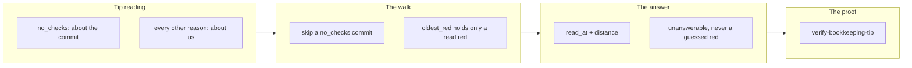

## 1. Overview

The base-health reading was unreachable exactly where the loop is busiest. `attribute-base-red.sh`
returned on any unanswerable tip before its walk began, and the loop's own bookkeeping commits
carry no checks, so the answer was `base_unreadable:tip_no_checks` every tick for a day while the
base was green throughout.

**Highlights:**

1. `no_checks` continues into the existing walk; every other unanswerable reason stays terminal.
2. `read_at` / `read_at_distance` ride the answer, `null` when the colour was read at the tip.
3. `verify-bookkeeping-tip` proves both offline, sharing `verify-base-health`'s seeder.

## 2. Motivation

A reading that cannot be made is not a reading, and this one failed in the quietest way there is:
the step reported `degraded` and asked nobody, which from the channel is indistinguishable from a
healthy step that found nothing wrong. One word was doing two jobs — `no_checks` is a fact about
the *commit*, with a defined answer one step back, while `reader_failed` and its siblings are facts
about *us*. Splitting them raised a second question: once the colour comes from an ancestor, "the
base is green" is a stronger sentence than the one the walk actually made.

## 3. Changes

The walk learned which unanswerable reasons it may pass, then learned to say where it stopped
looking, and the drill was written against the behaviour rather than a return shape — the failure
it guards produces no output to notice.

### 3-1. Walk the base past a commit nothing ran on ([b3586324](https://github.com/qmu/workaholic/commit/b3586324))

The tip's `no_checks` reading falls through into the existing walk under its existing bound, and a
`no_checks` commit inside the walk is skipped rather than stopping it. `oldest_red` starts empty
and takes the tip only when the tip read red, so a skipped commit is never an attribution — and a
walk ending with no red observed answers `unanswerable`, never `unattributable`.

### 3-2. Say how far back the base's colour was read ([62b3d688](https://github.com/qmu/workaholic/commit/62b3d688))

The walk emits `read_at` and `read_at_distance`, both `null` at the tip. `step-base-health.sh`
renders the fact twice for the two audiences it already writes for: the log-facing `summary` names
the ancestor and the distance, the post-facing `event` states the distance alone, and both ride the
`needs_agent` row so the question puts the distance on its heading.

### 3-3. Drill the base reading past a bookkeeping tip ([9fa97f90](https://github.com/qmu/workaholic/commit/9fa97f90))

`verify-bookkeeping-tip` seeds a bookkeeping tip over a checked ancestor plus both controls — a
checked tip, and a tip that failed for our own reasons — and its breaker removes the continuation
from a copy of the walk. `verify-base-health`'s inline seeder became `base_checks_seed`, shared by
both drills rather than copied.

## 4. Outcome

The base gets a colour every tick again, and the answer says where it came from. The distance is
stated and never thresholded. Nothing gained a gate: the reading still moves no token, and no
route, refusal, claim or merge reads it.

## 5. Concerns

### `scripts/e2e/loop-drill.sh` is past the per-file size ceiling

- **Severity:** low
- **Description:** the file is 569,766 bytes against a 524,288 ceiling, so every branch touching it carries an `override`-tier `large-file` finding that says nothing about that branch (see [9fa97f90](https://github.com/qmu/workaholic/commit/9fa97f90) in `scripts/e2e/loop-drill.sh`). It was over before this branch and stays over after.
- **How to Fix:** split the dispatcher from the drill bodies — one file per drill under `scripts/e2e/drills/`, sourced by the dispatcher — so the register and the derivation keep working while the size finding means something again.

## 6. Successful Development Patterns

- Reproducing in the *existing* suite made the reproduction permanent: the two assertions encoding
  the old collapse failed first, and were rewritten onto honest fixtures rather than deleted.
- Extracting the shared seeder before writing the second drill kept one fixture; two would drift.
- The breaker was measured in both directions rather than asserted — reverting the continuation
  turned the drill red with four named failures, restoring it turned it green.

## 7. Release Preparation

**Verdict**: Ready for release

- **Concern:** the branch-safety scan blocks on one `override`-tier `large-file` finding for
  `scripts/e2e/loop-drill.sh`; there is no `secret` and no `leak` finding.
- **Before release:** none — an `override`-only branch stays releasable, and the finding is
  recorded above rather than overridden silently.
