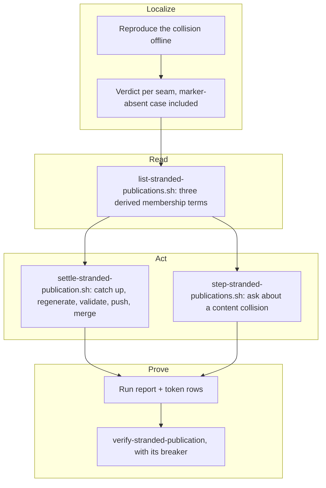

## 1. Overview

A publish-tree publication carries no claim commit, so the oracle gave it no row and no reader in
the loop could see a proposal whose auto-merge had been refused. It now has its own reader, act
and question: a collision a generator settles is repaired without a person, and only a genuine
content collision reaches one.

**Highlights:**

1. `list-stranded-publications.sh` derives membership from the tree and the seam's refusal word.
2. `settle-stranded-publication.sh` catches up, regenerates, validates, pushes and delivers.
3. A `/moderate` step, three `/implement` token rows, and an offline drill with a breaker.

## 2. Motivation

Every open proposal on a consuming repository collided on the same generated index, and the repair
was three commands the plugin already ships. The loop filed tickets instead while the hourly tick
reported the blockage to nobody for a day. The ask blamed the classifier; the first ticket
measured all three seams and found the classifier and the mergeability reader both already
correct — neither could ever be *asked* about a publication.

That gap protects a property the protocol depends on: `publish-tree-pr.sh` carries no `Claim …`
commit precisely so a publication is never claimed or driven. The 2026-08-29 catch-up gave claims
a reader and an act for this failure; this is that work applied to the one artifact the claim
vocabulary must not be widened to cover.

## 3. Changes

The branch runs diagnosis-first: the reproduction measured which of three seams actually stopped
the repair, and every later ticket was built on that measurement rather than on the proposal's
guess. The reader came before the act because the act must re-derive its verdict from it; the
question came after both, so it could be scoped to exactly what the act refuses; the report and
the drill closed the loop by making the repair visible when it works and loud when it stops.

### 3-1. Localize where a stranded publication stops ([966bff48](https://github.com/qmu/workaholic/commit/966bff48))

Built the measured collision offline as a hermetic test row and recorded a verdict for each of
the three seams, including the marker-absent case. Seams 1 and 2 are sound; the act's candidate
set is what stops the repair, and the finding is pinned as a closed set of mergeability
consumers rather than as "nothing catches it up".

### 3-2. Read the publications the loop cannot merge ([5bc94d3a](https://github.com/qmu/workaholic/commit/5bc94d3a))

Added the reader. Membership is three derived terms — the branch shape, the claim oracle naming
no claim on it, and the publish seam's refusal word being empty — so an operator-facing
publication stays `list-operator-facing-pulls.sh`'s and a title decides nothing. A degraded read
answers its own reason with a null count and no `publications` key at all.

### 3-3. Settle a publication a generator can repair ([34b77995](https://github.com/qmu/workaholic/commit/34b77995))

Added the act, on `mechanical` alone: `catchup-main.sh --resolve-mechanical`, regenerate with the
repository's own tooling, run its fast checks, push, one REST merge. It invents no merge engine
and no second classification rule, and holds the four terms of a bounded act — re-derived,
idempotent, reversible, refusing every bound by its own word.

### 3-4. Ask about what only a person can settle ([ecfa502e](https://github.com/qmu/workaholic/commit/ecfa502e))

Added `/moderate`'s `stranded-publications` step, keyed once per pull request and addressed to
the publication's author. Only a `content` collision draws a question; `mechanical` is the
loop's own work and `unanswerable` is counted rather than asked about.

### 3-5. Report each stranded publication in the run ([7542ad56](https://github.com/qmu/workaholic/commit/7542ad56))

`workaholic:drive` reads the publications once per run, acts on each `mechanical` one once, and
reports every entry's mergeability plus, where it acted, the act's word and the delivery's word.
Three token rows state the rule; `CLAUDE.md` carries the same contract in the same change.

### 3-6. Drill the stranded publication repair ([abb2f433](https://github.com/qmu/workaholic/commit/abb2f433))

Added `verify-stranded-publication` — hermetic, no credential, asserting the behaviour rather
than the return shape — with its register row, its blame table and a breaker that strips the
generated-region proof and watches the settleable collision become a report.

## 4. Outcome

The loop repairs what it was reporting: a publication colliding only on a generated region is
caught up, regenerated so both sides' records survive, pushed and merged with no person; one
colliding on content is refused with its branch byte-identical and reaches its author once. A
drill proves both offline and fails when the repair is reverted.

## 5. Concerns

### The run report's stranded-publication reading is prose, not a gate

- **Severity:** low
- **Description:** nothing mechanical checks that a run reported an outcome for a publication it
  acted on (see [7542ad56](https://github.com/qmu/workaholic/commit/7542ad56) in `plugins/workaholic/skills/drive/SKILL.md`)
- **How to Fix:** none yet — the enforcement the connector retry and the catch-up already rest
  on; a gate needs the run report to be machine-readable first

### `list-operator-facing-pulls.sh` still reads the transport's exit status

- **Severity:** low
- **Description:** `available` exits 0 even when it answers `ok: false`, so the sibling reader
  would report an unreachable transport as `list_failed` (see [5bc94d3a](https://github.com/qmu/workaholic/commit/5bc94d3a) in `plugins/workaholic/skills/branching/scripts/list-operator-facing-pulls.sh`)
- **How to Fix:** read the field there too, in a change of its own — it moves an existing
  script's degradation vocabulary, which is not this branch's to widen

## 6. Successful Development Patterns

- Run the breaker **before** the act: the act removes the collision the breaker misclassifies, so
  one appended by convention stops breaking the first time the repair works.
- Decline a filter whose counter can only be zero, and record why — the two candidate sets are
  disjoint from both sides.

## 7. Release Preparation

**Verdict**: Ready for release

- **After release:** the reader and the act are reachable only through `/implement` and
  `/moderate`, so the first live exercise is the next tick against this repository's own open
  proposals; watch that run's stranded-publication lines.
