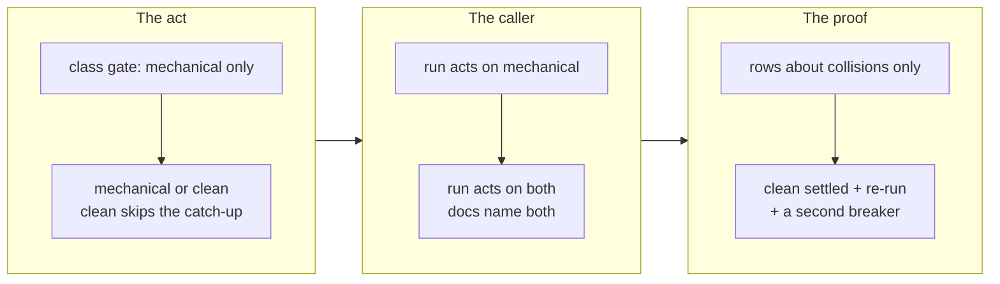

## 1. Overview

A publication that collides with nothing reads `clean` and, until this branch, was delivered by
nothing: the act refused it `not_mechanical:clean` and the caller was documented in five places to
take `mechanical` alone. The class now has an act, a caller and a drill.

**Highlights:**

1. The act accepts `clean`, taking no catch-up at all while the gate still runs ahead of the merge.
2. `workaholic:drive`, `CLAUDE.md` and `moderate/reference/workflow.md` name both classes;
   `/moderate` still asks about `content` alone.
3. `verify-stranded-publication` gains two rows and a second breaker.

## 2. Motivation

Measured that morning: six open publications, five of them `clean` (#813, #799, #688, #635, #625),
the oldest opened 2026-08-26. They are stranded by a race with their own CI —
`publish-tree-pr.sh` opens the pull request and attempts the merge in the same breath, GitHub
answers 405 before a check has started, and `merge_not_allowed` is not a word the caller retries.

The act's header said `clean` "needs no catch-up at all" and refused it on that ground, which is
the reason it needs none rather than a reason to leave it alone. The class was ownerless in the
sense this repository has repaired before, one level in: the reader saw it, the report named it,
and no act could take it.

## 3. Changes

The act was widened first, because directing the caller at a class the act still refused would
have produced a `not_mechanical:clean` refusal on every tick — noise in place of a gap. The
documentation moved with the caller in the same commit, and the drill went last, since it asserts
the behaviour the first two build.

### 3-1. Settle a clean stranded publication ([9eef6d72](https://github.com/qmu/workaholic/commit/9eef6d72))

The class gate now sets one variable and nothing else: `clean` skips the merge, the regeneration,
the fast checks and the push — each of which has nothing to do on a branch that collides with
nothing and is pushed nowhere — while the worktree is still attached because the gate scan needs a
checkout. `content`, `unanswerable` and an unreadable class keep `not_mechanical:<class>` verbatim.

### 3-2. Act on every clean publication the run reads ([9212f194](https://github.com/qmu/workaholic/commit/9212f194))

`workaholic:drive` §5 triggers on `mechanical` or `clean`, §7 reports both in one line shape, and
`CLAUDE.md` and `moderate/reference/workflow.md` name the same classes. `/moderate`'s candidate set
is untouched — only a person can judge a collision — while its `settleable` count, a reader-facing
number rather than a candidate set, now includes `clean`.

### 3-3. Drill the clean publication settlement ([779e89cb](https://github.com/qmu/workaholic/commit/779e89cb))

A third fixture branch collides with nothing, and two rows assert that it is settled with no
catch-up and that a re-run over the delivered one refuses by name. A second breaker narrows the
class gate back to `mechanical` and makes the drill fail — run by hand, it does.

## 4. Outcome

The `clean` class is owned end to end: read, acted on, reported and drilled. The mission's
acceptance closed on the third archive, and the run minted one ticket for what the widening
uncovered.

## 5. Concerns

### A clean publication the remote still refuses reaches nobody

- **Severity:** moderate
- **Description:** #813 read `clean` locally while the API said `mergeable_state: "dirty"`, so the
  delivery came back `merge_refused: merge_not_allowed` (see
  [9eef6d72](https://github.com/qmu/workaholic/commit/9eef6d72) in
  `branching/scripts/settle-stranded-publication.sh`); `/moderate` asks about `content` alone.
- **How to Fix:** Drive `20260901041500-deliver-a-publication-github-still-calls-dirty.md`.

### The drill's idempotency row rested on a class refusal

- **Severity:** low
- **Description:** Both re-run rows asserted only that nothing was pushed, surviving a change to
  what a re-run does (see [779e89cb](https://github.com/qmu/workaholic/commit/779e89cb) in
  `scripts/e2e/loop-drill.sh`); both `gh` stubs kept a merged pull request open.
- **How to Fix:** Done here. Worth checking any future fixture that stubs a merge.

## 6. Successful Development Patterns

- Reproducing the refusal verbatim before the change and re-running the same publication after
  made the fix separable from a coincidence — two JSON lines needing no interpretation.
- Two breakers on one drill needed two broken copies of the tree; layered on one, neither could
  say which edit produced what it observed.

## 7. Release Preparation

**Verdict**: Ready for release

- **Concern:** `scripts/e2e/loop-drill.sh` is now 580 KB, over the 512 KB per-file scan ceiling —
  an `override`-tier size finding and the branch's only one.
- **Before release:** Nothing; the finding is a granularity nudge, not a gate.
- **After release:** Consider whether the drill dispatcher wants splitting per drill; every arm
  added since it was written has grown one file.
