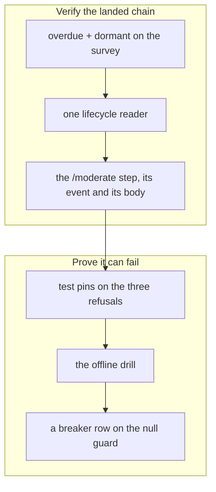

## 1. Overview

The `say-when-the-loop-has-run-out-of-direction` mission had already landed in substance
while its eight tickets sat queued. This branch verified each against its own Quality Gate,
then closed the one gap that found: its drill had never been shown able to fail.

**Highlights:**

1. All eight tickets verified against their stated gates and archived; the mission closed `achieved` on the arithmetic.
2. `verify-direction-health` gained a breaker row, moving it from `unproved` to proved.
3. Two records sharing one mission slug were found on `main` and queued as a ticket.

## 2. Motivation

A queued ticket whose work has already landed is not a no-op: it is a claim nobody has
checked. Driving these eight meant running each gate against the tree, which is what turned
up the one thing genuinely missing.

That gap was structural rather than functional. The repository's drill standard says every
drill carries a `bearing: "breaker"` row written against the behaviour, and that a drill
without one is `unproved` — it has never been shown able to fail.
`verify-direction-health` reported `breakers: 0`: eleven rows, all green, none demonstrated
to go red.

## 3. Changes

Each ticket was read, its Quality Gate run against the tree, and its Final Report written to
say what was verified rather than what was built. The last ticket was the one with work in
it: the drill it owns had no breaker, so a seam was found that no existing fixture could
notice and a row was written against it.

### 3-1. Add the overdue reading to the strategy survey ([7bb54bb](https://github.com/qmu/workaholic/commit/7bb54bba))

Verified that `survey-strategies.sh` emits `overdue` on every surveyed row, eligible and
refused alike, and that a row with no resolvable date reads neither value — the boundary
that later became this branch's breaker.

### 3-2. Add the dormant reading to the strategy survey ([8ae6a4e](https://github.com/qmu/workaholic/commit/8ae6a4ec))

Verified the `dormant` conjunction and that any unreadable term makes the answer `false`
rather than `dormant`. Found that the overdue/dormant boundary is guarded twice, which is
why a fixture aimed at it cannot fail.

### 3-3. Write the one reader of a direction's lifecycle state ([e6747be](https://github.com/qmu/workaholic/commit/e6747be8))

Verified that `direction-state.sh` composes the survey without re-deriving a reading, and
that a refused survey answers `unreadable` rather than `none`.

### 3-4. Add the moderate step direction-health ([1ebc140](https://github.com/qmu/workaholic/commit/1ebc1403))

Verified the step asks each non-`live` reading's assignee once, reports `unreadable` without
asking anyone, and writes nothing.

### 3-5. Render the direction reading on the tick root ([ec15a8d](https://github.com/qmu/workaholic/commit/ec15a8d8))

Verified the step supplies an `event` and supplies none when every direction reads `live` —
and that `render-tick-post.sh` needed no change, which the ticket asked to be checked rather
than assumed.

### 3-6. Make the direction question actionable ([11791aa](https://github.com/qmu/workaholic/commit/11791aab))

Verified each question names its reading, its slug and one concrete next act in the
operator's vocabulary, inside the 25-word ceiling.

### 3-7. Pin the three refusals with a hermetic test ([bf59219](https://github.com/qmu/workaholic/commit/bf592199))

Verified the three refusals hold as independently-failing assertions, and that the writer
count is pinned — the pin that made adding `amend.sh` a recorded decision.

### 3-8. Drill the direction-health chain offline ([af760f9](https://github.com/qmu/workaholic/commit/af760f9f))

Added the drill's breaker row. `overdue` is `days_to_target < 0` **and the date resolves**,
and jq answers `null < 0` with `true`, so that guard alone keeps an undated direction out of
the overdue set. A third fixture carrying no `target_date` asserts it reads `dormant`;
removing the guard was measured to fail that row while both dated fixtures still passed.

## 4. Outcome

The mission's acceptance reads 3/3 with an empty queue, so the archive gate closed it
`achieved`. `verify-direction-health` now reports 12 load-bearing rows and 1 breaker,
counting inside the proved total. The full local verification set passes.

## 5. Concerns

### Two missions share one slug on main

- **Severity:** moderate
- **Description:** `main` carries two tracked `mission.md` files whose slug is `say-when-the-loop-has-run-out-of-direction` — one in `missions/active/` (created 07:19, the record this branch drove) and one in `missions/archive/` (created 08:19, `achieved`, different `feedback:` refs). Every slug-keyed reader searches `active/` then `archive/`, so the answer depends on area order, and this mission's close could stamp `achieved` but not move the record into the occupied path.
- **How to Fix:** Ticket `20260901072600-rule-on-two-missions-sharing-one-slug.md` was minted on this branch. Its Open Decision asks which record is authoritative; the repair is a ruling, since both records are real work and neither can be deleted without losing a driven mission's history.

### The drill's gone fixture does not carry the landed work its comment claims

- **Severity:** moderate
- **Description:** `verify-direction-health`'s `gone` fixture is documented as "past its date WHILE PRODUCING WORK", which is the case `pace` cannot carry. It is not: `landed[]` is a `git log --since` read and the fixture tree is a bare directory, so `landed` is `0` and `gone` reads `overdue` for the wrong reason (see [af760f9](https://github.com/qmu/workaholic/commit/af760f9f) in `scripts/e2e/loop-drill.sh`).
- **How to Fix:** Seed the fixture as a git repository with a per-strategy feedback ref, as `verify-arrival` does. Measured on this branch: adding the commit alone makes both directions read `arrived`, because they share one ref — so this is a fixture redesign rather than a line, and it was left named rather than half-done.

### check-version-bump.sh is referenced by the story skill but not shipped

- **Severity:** low
- **Description:** `workaholic:story` Phase 0 instructs the caller to run `${CLAUDE_PLUGIN_ROOT}/skills/story/scripts/check-version-bump.sh`; that script is absent from plugin 1.0.268's `story/scripts/`. Phase 0's degraded-read rule then says "bump", so a caller following the skill literally bumps the version on every branch.
- **How to Fix:** Either ship the script or restate Phase 0 against a check that exists. This branch skipped the bump on the direct evidence that `plugins/`, `outputs/` and `.claude-plugin/` are byte-identical to the base, which is the fact the rule exists to protect.

## 6. Successful Development Patterns

- Proving a breaker row by breaking the mechanism and observing which rows go red is what separated a real seam from two plausible ones — both rejected candidates passed while broken.
- Verifying an already-landed ticket against its own Quality Gate, rather than against the tree looking right, is what surfaced the drill's unproved state and the slug collision.

## 7. Notes

The version was deliberately not bumped: nothing under `plugins/`, `outputs/` or
`.claude-plugin/` differs from `origin/main`.
