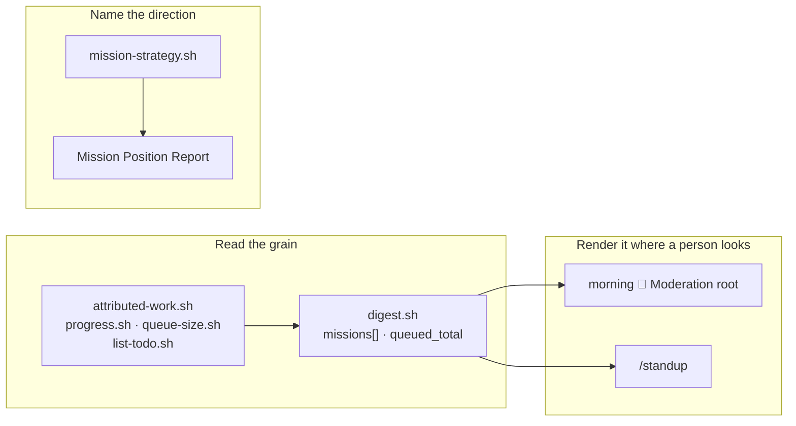

## 1. Overview

The loop had thirty-two readings of what has gone wrong and none of what is simply there, so
*how many todos are left?* had to be put to a person. This branch adds that reading, renders it
where the operator looks, and makes a mission's direction legible without the field the ask asked for.

**Highlights:**

1. `digest.sh` reports each strategy's missions with acceptance done/total and queued count, plus a repository-level `queued_total` — composed from four readers that already existed.
2. The morning `🔎 Moderation` root and `/standup` render that shape; the ask's request for an *hourly* post is answered with the two status roots this repository already retired.
3. The Mission Position Report names which direction a mission serves, read through `mission-strategy.sh` — no artifact gained a `strategy:` field.

## 2. Motivation

An operator asked mid-session where the work stood and no post the loop makes carried the
answer. Every step of the maintenance tick is driven by something being wrong, so the hourly
report is an anomaly list against a plan its reader cannot see. The parts of the answer all
existed and none was composed at the grain the question asks.

The ask also proposed a mechanism for its second half — a readable `strategy:` field on the
mission — the one relation this repository has retired three times, most recently when the
strategy artifact itself returned on 2026-08-13 without it. The need is real and the mechanism
is ruled out, so the branch meets the need in the render and records the refusal with its
sources.

## 3. Changes

The branch runs read → render → name. The reading adds no walker: `digest.sh` composes four
existing readers into a sibling block, leaving every field it already emitted unchanged. The
render is mostly specification — the step hands the digest through whole, so what had to change
was the bound telling the agent what to draw. The third ticket closes the ask's other half where
a person actually meets a mission.

### 3-1. Read the plan's shape at the mission grain ([a842d581](https://github.com/qmu/workaholic/commit/a842d581))

`digest.sh` gained a per-strategy `missions[]` block — each mission's title, acceptance
`checked`/`total` and queued count — and a repository-level `queued_total`, with `list-todo.sh`
taking an optional root so the count honours the digest's own. It is a composition, not a second
walker: the titles and paths ride `artifacts[]`, which the attribution reader already populated.

### 3-2. Render the plan's shape in the morning digest ([24ba533e](https://github.com/qmu/workaholic/commit/24ba533e))

The morning root's render line, `step-strategy-digest.sh`'s bound, `workflow.md` §14 and
`standup/SKILL.md` now name the mission grain and the total queued. The ask's request to post it
every tick is declined with its sources — `📦 Release Preparation` was retired for restating an
unchanged answer ten hours running — and that refusal is recorded in three places a reader meets
it.

### 3-3. Read a mission's direction without a new field ([beb42789](https://github.com/qmu/workaholic/commit/beb42789))

The Mission Position Report — the one definition of *where does the mission stand*, stated by
`/mission-close` and by `/drive` — gained the direction as its first element, derived through
`mission-strategy.sh` and rendered in the roadmap's own three-way vocabulary. Why the
`strategy:` key is not the answer is recorded beside the mission's frontmatter block.

## 4. Outcome

The operator's ordinary question is answered by a reading, on the surfaces they already read,
and a mission's direction is legible from the report a person meets when deciding about one. No
artifact gained a field, and the two parts of the ask that could not be granted named their sources.

## 6. Successful Development Patterns

- Reproducing the reading by hand *before* writing it turned the hand numbers into the fixture — the composition was checked against 42 queued and 6/3/3 per mission on this repository, not against its own output.
- Declining a proposed mechanism by quoting the ruling and its reasons, in the file where the question will be asked again, costs one paragraph and stops the same ask returning as a silent reversal.
- Where a reading is handed through whole (`step-strategy-digest.sh` passes `digest.sh`'s payload verbatim), the render *bound* is the real coupling — a new field arrives invisibly until the bound names it.

## 8. Notes

The mission grain is the largest block the digest emits; `STANDUP_MAX_ITEMS` bounds it with
`missions_omitted` counted, and a raised cap is a deliberate edit rather than a convenience.
