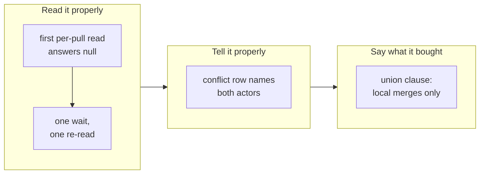

## 1. Overview

An operator measured the tick reporting four pull requests as `unknown` forever and announcing
a conflict on the loop's own generated index as somebody's work. Both acting halves were
already shipped and both *telling* halves were wrong, so this branch settles the reading rather
than adding a mechanism.

**Highlights:**

1. A `mergeable: null` row gets one bounded second look inside the single reader.
2. A conflicted pull request names both actors — the loop's catch-up and the claim holder.
3. The shipped `merge=union` record says GitHub applies no `.gitattributes` merge driver.

## 2. Motivation

Three readings looked finished and were not. GitHub computes mergeability lazily and
*requesting* the pull request is what schedules the job, so the tick's own first read is
systematically the one that answers `null` — and with nothing looking again, a *not yet* became
an hourly finding and eventually a question against a budget of ten a day. Meanwhile
`catch-up-claim.sh` and `settle-stranded-publication.sh` were already clearing the mechanical
class of conflict, while the tick told a person that every conflict was theirs. And the
`merge=union` repair that landed the day before read as if it had removed the occasion, which
is true locally and false on the surface that decides whether a pull request merges.

## 3. Changes

The branch moves along one axis: what the loop already *does* was correct, and what it *says*
about it was not. The first ticket makes the reading true before anything consumes it; the
second makes the report name the actor who clears each class of conflict; the third makes the
shipped artifacts a consuming repository reads agree with what GitHub actually does. No
mechanism was added, no step gained a network call, and the union attribute stays exactly where
it was.

### 3-1. Re-read an uncomputed mergeability once ([6875ecd5](https://github.com/qmu/workaholic/commit/6875ecd5))

`pulls-state.sh` now waits once and re-reads the `null` rows exactly once — never a retry loop
— bounded by named caps on rows and total time, classifying a settled row from the second
answer and reporting the spend as `reread_attempted` / `reread_settled` / `reread_capped`. It
lives in the one reader, so both consuming steps inherit it and neither gains a call.

### 3-2. Name who clears a conflicted pull request ([28427e2c](https://github.com/qmu/workaholic/commit/28427e2c))

The `stuck-prs` conflict row read *the claim holder must resolve the conflict* for every
conflict; it now names that a generated-index collision is cleared by the catch-up on the next
`[Implement]` tick and a real content collision belongs to the holder. Wording only — the
digest, the `blocked_by` set and the `needs_agent` shape are byte-identical.

### 3-3. State that GitHub applies no merge driver ([a71f1126](https://github.com/qmu/workaholic/commit/a71f1126))

The four forward-facing surfaces a consuming repository reads — `.gitattributes`, the text
`apply-bootstrap.sh` appends, `check-bootstrap.sh`'s problem string and `workaholify/SKILL.md`
— each gained one clause: the driver resolves the conflict for every local merge and for none
of the remote's.

## 4. Outcome

The mission closed itself `achieved` on the third archive — 3/3 acceptance, queue empty. Every
change was reproduced first: eight pull requests read across both endpoints, five conflicted
branches classified beside the sentence describing them, and a three-way `merge-tree`/API
comparison on one generated-index collision.

## 5. Concerns

### The re-read's wait can be too short to settle a row

- **Severity:** low
- **Description:** In ticket 3's reproduction the API answered `null` for #832 and `false`
  seconds later, past the 2-second default (see
  [a71f1126](https://github.com/qmu/workaholic/commit/a71f1126) in
  `plugins/workaholic/skills/moderate/scripts/pulls-state.sh`)
- **How to Fix:** Raise `WORKAHOLIC_PULLS_STATE_REREAD_WAIT` only if `reread_attempted` stays
  high while `reread_settled` stays near zero; a longer-settling row is honestly `unknown`.

### A repository bootstrapped earlier keeps the older union comment

- **Severity:** low
- **Description:** `apply-bootstrap.sh` rewrites no line a repository already has, so one
  bootstrapped before this change keeps the pre-clause block (see
  [a71f1126](https://github.com/qmu/workaholic/commit/a71f1126) in
  `plugins/workaholic/skills/workaholify/scripts/apply-bootstrap.sh`)
- **How to Fix:** The clause reaches them through `CLAUDE.md` and `workaholify/SKILL.md`;
  rewriting an existing `.gitattributes` line is out of scope for the bootstrap.

## 6. Successful Development Patterns

- Reproducing before repairing overturned the reporter's premise: the mechanism was already
  shipped and the real gap sat one layer below it.
- Asking whether an existing test still tests what it names — the one-resolution fixture rests
  on a first `null` the new second look settles, so it was pinned with the cap at 0.

## 7. Release Preparation

**Verdict**: Ready for release

- **Concern:** The branch-safety scan reports one `override`-tier `size` finding
  (`scripts/e2e/loop-drill.sh` over the per-file ceiling). This branch does not modify that
  file; it appears because the base advanced under the branch while it was driven.
- **Before release:** None.

## 8. Notes

`verify-log-branch` reports `skipped: log_branch_seam_unreadable`, pre-existing and untouched
here; `verify-all` still exits 0 over 41 drills with 0 failures.
