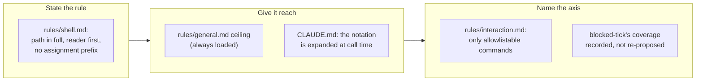

## 1. Overview

A `/moderate` tick stalled on a documentation read composed as `export CLAUDE_PLUGIN_ROOT=…; sed …`,
which no allowlist can name: the first token is `export`, so only `Bash(export:*)` matches and it
permits anything after the semicolon. This branch states the rule that removes the shape, gives it
reach, and names the axis the two existing shell rules turn out to be instances of.

**Highlights:**

1. `rules/shell.md` gains the full-path, first-token, no-assignment-prefix rule with its evidence.
2. `rules/general.md` — always loaded — carries the ceiling, so context no longer decides reach.
3. `rules/interaction.md` names the axis: an unallowlistable command is a prompt the run raised.

## 2. Motivation

The rule that would have stopped the stall already existed, and could not reach its reader:
`rules/shell.md` carries `paths: ['**/*.sh']` and the stalled tick was reading a `SKILL.md`. It
would not have been enough anyway — it names the *pipeline* half of the failure and says nothing
about the assignment prefix.

Upstream of both is a notation gap created for good reasons. Skills document their commands as
`bash ${CLAUDE_PLUGIN_ROOT}/skills/…`, correct for markdown, and that variable is unset in the Bash
tool's environment — so a session has two ways to name the path and reaches for the export. The
observer of the resulting stall is the person the routine exists to spare.

## 3. Changes

The three tickets run in strict dependency order — wording, then reach, then the policy that
subsumes it — so each step is written against text that already exists.

### 3-1. Write a plugin path out in full in a Bash call ([2bebc56a](https://github.com/qmu/workaholic/commit/2bebc56a))

Adds *Composing the call: the path in full, the reader first, no assignment prefix* to
`rules/shell.md`, beside the read-tool section it extends: the measured stall, the allowlist
reasoning, `${CLAUDE_PLUGIN_ROOT}` still correct in markdown, `env VAR=… <cmd>` refused on the same
first-token grounds, and a named exception for the seams that have no other form.

### 3-2. Put the shell rule where every session loads it ([e8741621](https://github.com/qmu/workaholic/commit/e8741621))

Lifts a one-bullet ceiling into `rules/general.md` (`paths: ['**/*']`) pointing at the full
statement, and notes in `CLAUDE.md`'s design principle that the notation is what a session
*expands* when composing a call. Widening `shell.md`'s own `paths:` was rejected: it would load the
POSIX and jq rules into every markdown session.

### 3-3. Forbid unallowlistable shell in a no-prompt run ([4118c068](https://github.com/qmu/workaholic/commit/4118c068))

Writes the general clause into *An unattended run never waits for a person*: a run with no human
present composes only commands an allowlist can name, with the read-tool rule (*what* it reaches
for) and the plugin-path rule (*how* it spells the reach) as two instances of one axis. Records
what `blocked-tick` already covers, so nothing re-proposes it.

## 4. Outcome

The mission's three acceptance criteria are met and it closed `achieved` on the last archive. A
session reads the rule whatever file is in context, the two shell rules read as one axis rather
than a growing list, and each surface says plainly that enforcement is a human reading it.

## 5. Concerns

### The named exception can only widen by hand

- **Severity:** low
- **Description:** The one-command `VAR=value <reader>` prefix is admitted for seams whose scripts take inputs only from the environment — today just `publish-tree-pr.sh` (see [2bebc56a](https://github.com/qmu/workaholic/commit/2bebc56a) in `plugins/workaholic/rules/shell.md`). Nothing bounds the set mechanically.
- **How to Fix:** Give such a script flags for those values, removing the exception rather than bounding it.

### blocked-tick covers one of the four unattended commands

- **Severity:** low
- **Description:** `/implement`, `/specificate` and `/propose` write no tick log, so a stall in one is still visible only as a quiet hour (see [4118c068](https://github.com/qmu/workaholic/commit/4118c068) in `plugins/workaholic/rules/interaction.md`).
- **How to Fix:** Nothing here — the cheaper repair is upstream (not stalling); the gap is now a recorded limit.

## 6. Successful Development Patterns

- Ordering the tickets as wording → reach → generalisation let each be written against text that already existed, so the ceiling could quote the section it points at.
- The sweep for `export CLAUDE_PLUGIN_ROOT` returning nothing *confirmed* the diagnosis: the composition happens at run time, so its absence from the markdown is what the ticket predicted.
