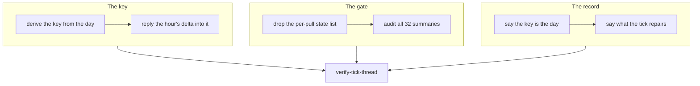

## 1. Overview

The `🔎 Moderation` root is now keyed on the operator's **day** rather than on the tick, so a day's first speaking tick opens one thread and every later hour replies its delta into it. The post gate stops opening roots on values a transport merely re-answered, and an audit of all thirty-two step summaries found and repaired two further instances of the same class.

**Highlights:**

1. One standing root a day instead of fourteen in a window, twelve of them carrying no question.
2. A transport re-shuffle at an unchanged count and class set now opens no root; a real change still does.
3. `verify-tick-thread` drills both behaviours offline, with a breaker written against each.

## 2. Motivation

The tick's root was keyed `tick:<tick-id>`, and the id is that tick's own timestamp — so the exact string an hour searched for was one no earlier message could contain, and the stateless lookup took its not-found branch every hour by construction. Nothing was broken; the key simply named the hour rather than the conversation. Meanwhile the gate that decides whether an hour has anything to say compared step summaries verbatim, and `stuck-prs` put GitHub's lazily computed mergeability into its summary — so the mechanism built to stop hourly noise was the one producing it.

Both defects are the same shape as the two status roots this repository has already retired: a post addressed to nobody, restating an unchanged answer. The difference here is that the questions beneath the root are addressed to someone, so the root could not simply be removed — it had to become a thread.

## 3. Changes

The branch moves in three passes and closes with one proof. The key is made findable, then the posting rule is taught to use it; the compared string is coarsened where a transport reaches it, then every other step is audited against the same rule; the two documents that would otherwise contradict the new behaviour are corrected. The drill runs last, against a design that has settled, and its breaker reverts both behaviours at once so neither can regress alone.

### 3-1. Derive the tick's thread key from the day, not the tick ([911b7630](https://github.com/qmu/workaholic/commit/911b7630))

`lib/tick-thread-key.sh` became the one derivation of the root's key, answering `tick-day:<YYYYMMDD>` in the operator's own zone rather than UTC. It reads no clock of its own, so a re-entered tick derives the same key twice.

### 3-2. Reply an hour's changes into the day's standing root ([0332d1d0](https://github.com/qmu/workaholic/commit/0332d1d0))

`render-tick-post.sh` now renders two forms off one body — `root_text` for the day's first speaking tick and `reply_text`, the same body with no head, for every later one. Which goes out is the command's decision and is written in one place.

### 3-3. Keep a transport-derived state list out of the post gate ([df0d5deb](https://github.com/qmu/workaholic/commit/df0d5deb))

`step-stuck-prs.sh` no longer puts its `<number>:<blocked_by>` pair list into the summary the gate compares; the count and class set stay, and the per-pull detail stays on the headline and in `needs_agent`, so nothing a person is asked loses detail.

### 3-4. Name every step summary carrying transport-derived volatility ([bca5c244](https://github.com/qmu/workaholic/commit/bca5c244))

All thirty-two summary compositions were read and classified in `moderate/reference/workflow.md`. Two more carried a transport's answer: `merge-conflicts`' uncomputed-mergeability count and `release-status`' `refs` word, both moved off the compared string.

### 3-5. Say the tick's root is day-keyed beside the exact-string rule ([3282c4e0](https://github.com/qmu/workaholic/commit/3282c4e0))

`workaholic:notify`, its reference, `workaholic:moderate` and `CLAUDE.md` now state the day key and say in one sentence why it is not a recency match — the search is the same exact-string search it always was.

### 3-6. Say what the tick repairs, on what proof, and who does the rest ([bac659fa](https://github.com/qmu/workaholic/commit/bac659fa))

`workaholic:moderate` gained one section naming the four steps that act, the proof each acts on, and the repairer of every class it does not — citing `drive/reference/claims.md` rather than restating it.

### 3-7. Drill the day-keyed root and the stabilized post gate offline ([ca9b307a](https://github.com/qmu/workaholic/commit/ca9b307a))

`verify-tick-thread` joins the drill set and the register: twelve rows, every silence paired with its opposite, and one breaker that reverts both behaviours at once.

## 4. Outcome

A reader now follows one `🔎 Moderation` thread per day with each hour's delta and every question inside it, and an hour whose only movement was GitHub answering differently is silent. Two summaries beyond the measured one were found and repaired, and the whole classification is written where the next step is added.

## 5. Concerns

### The audit is prose, and nothing mechanically holds a new step to it

- **Severity:** moderate
- **Description:** The rule that a summary carries repository facts and not transport answers is written in `moderate/reference/workflow.md` (see [bca5c244](https://github.com/qmu/workaholic/commit/bca5c244)), but whether a value is transport-derived is a judgement about where the number comes from, and no check enforces it on a step added later.
- **How to Fix:** Leave it as prose deliberately — a regex over summaries would produce confident nonsense — and rely on `verify-tick-thread` catching the two known instances if either regresses.

### Two summaries were cleared with a caveat rather than repaired

- **Severity:** low
- **Description:** `note-cadence`'s *due* and `workload-logs`' `readable` are environment-shaped rather than transport-shaped today; a target whose log endpoint flaked would make `readable` a fourth finding (see [bca5c244](https://github.com/qmu/workaholic/commit/bca5c244) in `plugins/workaholic/skills/moderate/reference/workflow.md`).
- **How to Fix:** Re-read those two if a deployment record ever declares a remote `log_locator` this environment can reach.

## 6. Successful Development Patterns

- Reproducing the defect before changing anything paid off twice: the stabilizer was shown leaving two pair lists different before a line moved, so the fix was aimed at the summary rather than at `stabilize()`.
- Pairing every silence assertion with its opposite is what makes a drill about *not posting* worth running — without it, a change that silenced everything would pass.

## 7. Notes

The version was bumped to v1.0.275 and `outputs/` regenerated. The branch-safety scan reports one `override`-tier `large-file` finding on `scripts/e2e/loop-drill.sh`, which grows by one drill per mission by design.

The branch was caught up with `main` before merging: its base carried one suite failure (`a subject no step raised reads settled`, an assertion that abstains during JST quiet hours) which `#853` had already fixed. The suite is green on this tip — 5868 passed, 0 failed.
