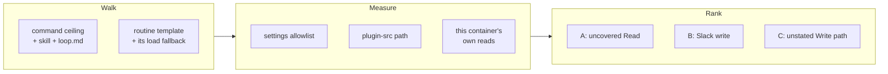

## 1. Overview

`[Propose]` parks at `requires_action` every hour, on records recreated fresh on 2026-09-01, and it is the one routine that originates the loop's work. The equivalent failure on `[Moderate]` was measured and its cause recorded — a prompt raised by two Bash text-pipeline reads of a plugin script — but nothing had established that the `/propose` path parks for the same reason rather than a different one.

This branch carries the mission's diagnosis ticket. It changes no behaviour: it walks the `/propose` path in this tree, records eight measured readings, and ranks the candidates the removal ticket takes.

**Highlights:**

1. **The `[Moderate]` case's own cause is absent from the `/propose` path.** Issue #865's repair landed on all four command ceilings, and a search of `commands/propose.md` and `skills/propose/**` for a `sed`/`grep`/`cat`/`head` read over a plugin-cache path returns nothing. The inheritance the diagnosis-first rule exists to prevent was available and is refused on evidence.
2. **The repository's own allowlist covers `Read(//home/**)` and nothing under `/root/`** — while the routine prompt and every command ceiling direct the run to Read `<src>`, which `plugin-src.sh` resolved this run to `/root/.claude/plugins/cache/workaholic/workaholic/1.0.278`. Issue #865 moved the reach off shell readers the allowlist covers by prefix and onto a tool it covers by path.
3. **Two readings cut against the candidates they were expected to confirm**, so the finding names two rather than one — which is what the ticket's own step 4 asks for when the evidence cannot separate them.

## 2. Motivation

The mission's own framing warned against the shortcut: "Adopting the previous case's cause without evidence is exactly the inheritance the diagnosis-first rule exists to prevent." The temptation was real — `[Moderate]`'s cause is recorded in `rules/shell.md` with raw output, and `[Propose]` fails the same way from the outside — so the cheap answer was to declare the same cause and move to the removal ticket.

The path walk does not support it. What it supports instead is a narrower and more uncomfortable reading: the repair that was supposed to remove the prompt class may have moved the reach onto a shape the repository's own allowlist covers *less* than the one it replaced.

## 3. Changes

One ticket, one findings block, one mission changelog line. No script, rule, command or skill changed.

### The eight readings

Five come from the tree — the allowlist entry, the resolved plugin-cache path, the routine prompt's load fallback, the identical Read-tool sentence on all four command ceilings, and the absence of the `[Moderate]` shape from this path. Three come from this container measuring itself: `mcp: [Slack]` on all three live templates including the routine that is *not* parking, a `bash /root/.claude/...` call that did not prompt, and a Read of that same path that did not prompt either.

## 4. Outcome

The removal ticket has a ranked candidate list with a file and a line for each, and the two facts that would otherwise have been assumed are now measured against. What it does not have is the parked run's own prompt text, which lives in the routine's session record outside this repository — stated in the finding rather than worked around, exactly as the ticket's Considerations require.

One scope correction rides with it: `[Propose]` absorbed `[Specificate]` on 2026-09-02, so the routine that parks now runs **two** commands in one session and a park attributed to `[Propose]` may be raised by the `/specificate` half. The diagnosis ticket was written against the single-command path.

## 5. Concerns

**The ranking is inference over a path walk, not a measurement of the failure.** Both readings that could have settled it came back negative — the connector is carried by the routine that does not park, and the plugin-cache Read did not prompt here. That is honest evidence and it is also weak evidence: it narrows the field without naming the cause. If the removal ticket takes both candidates and the tick still parks, the next reading has to come from the session record.

**One documentation drift was found and deliberately not repaired.** `skills/propose/reference/loop.md:122-143` still describes the four-routine loop with `[Specificate]` at `:15` and `[Propose]` at `:40`. It is stale against `routines/propose.md` and `CLAUDE.md`. The ticket's gate is no behaviour change and its diff is bounded to findings and the changelog, so repairing it here would have breached the gate; it is `/moderate`'s work.

## Handoff

**This unit stops here and the pull request stays open by design.** Its remaining queued work
declares a verification this environment cannot run, read off the artifact by
`verification-handoff.sh`:

> editing `.claude/` needs a person: Claude Code classifies it as sensitive and an unattended run
> has no one to answer the prompt

`20260902043117-remove-the-prompt-raising-read-at-its-source-in-the-propose-path.md` names
`.claude/settings.json` in its `## Key Files`, because one of the two repairs the operator
sanctioned **is** an allow entry there. This run's own diagnosis makes that the live option:
candidate A's repair is `permissions.allow` gaining the plugin-cache Read the routine prompt and
every command ceiling already direct the run to make. A run that tried it would raise exactly the
prompt the mission exists to remove.

**What a person must do**, in order:

1. Rule between the two sanctioned repairs for candidate A. If it is the allow entry, add exactly
   the shape that covers a Read under the resolved plugin-cache root and nothing wider — the
   finding names the path this container resolved. If it is the restructure, the reach itself has
   to move, and the finding says where it is directed from.
2. Decide whether candidate B (a Slack connector write — the reaction stamp `[Propose]` and
   `[Moderate]` make and `[Implement]` does not) is taken in the same change. The removal ticket's
   step 4 sanctions taking both.
3. `20260902043117-make-a-parked-routine-tick-visible-as-parked.md` is the mission's third ticket
   and is **not** blocked by the above — it is the backstop, and its own central decision (whether
   `/propose` gains a tick log, widening its pure-reader contract) is a ruling rather than an
   implementation detail.

Both tickets are stamped and waiting in `todo/`; the claim stands and this unit is not re-offered
to an unattended run until that ruling lands.

To take it sooner: `git fetch && git checkout work-20260902-043932`.

## 6. Successful Development Patterns

**A reading that cuts against your own hypothesis is the valuable one.** Two of the eight readings were taken expecting to confirm a candidate and returned the opposite. Recording them where they fall — rather than dropping them and keeping the tidier single-cause story — is what turned a guess into a ranked list the next ticket can act on.

**Separating evidence from inference structurally, not rhetorically.** The finding puts them under two headings with the readings numbered, so a later session can check any one of them without re-deriving the whole walk. The prompt text's unavailability is a line in the finding rather than a silence.
