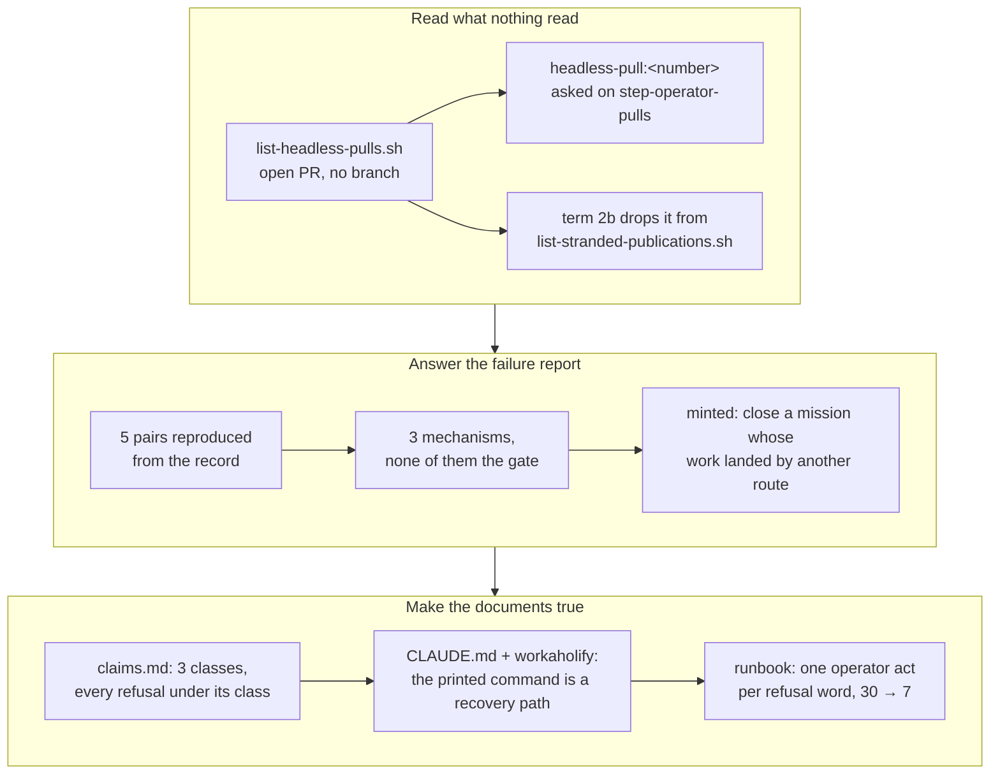

## 1. Overview

The unmerged-branch list is down from 30 to 7, and the last shapes that kept dead work in it are
read, asked about and written down: a pull request whose branch was deleted, the five reported
duplicate implementations, and the retirement's three candidate classes with every refusal.

**Highlights:**

1. `list-headless-pulls.sh` names an open pull request with no branch left, asked under `headless-pull:<number>`.
2. The duplicate-pair report is answered from the record: `work_waiting` and `open_proposal` were not at fault.
3. Re-measured after CI's turns: 30 unmerged remote branches → 7, 22 dead → 1.

## 2. Motivation

Measured 2026-09-01, `--no-merged` returned 30 branches and 22 were dead. The preceding tickets
taught CI to retire a branch whose pull request merged or was closed unmerged; this branch closes
what was left. A pull request GitHub keeps open after its branch is deleted is unmergeable by
construction and nothing in the loop read it. A failure report blaming the in-flight gate for five
duplicate implementations had never been reproduced. And three documents described the retirement
in terms this mission had made partly false.

The ask opened with a measurement, so its close answers with one — and answers the older question
underneath it with a finding rather than a guess.

## 3. Changes

The branch moves outward from one unread state, to the reason the loop kept re-doing work, to the
documents that describe both — the last of which measures whether any of it worked.

### 3-1. Name an open pull request with no branch ([eb6a37cb](https://github.com/qmu/workaholic/commit/eb6a37cb))

Adds `branching/scripts/list-headless-pulls.sh` — the open pull requests whose head branch is gone,
from one repository-scoped REST listing rather than the local remote-tracking refs — read in
`/moderate`'s `operator-pulls` step under its own key, because the act asked for is a close rather
than a ruling. `list-stranded-publications.sh` drops and counts such a pull request instead of
offering it to an act that cannot succeed.

### 3-2. Localize why one defect was implemented twice ([72fc3924](https://github.com/qmu/workaholic/commit/72fc3924))

Reproduces all five reported pairs from the record and attributes each: three are a person
implementing a filed finding by hand while the loop's claim was live, one is not a duplicate pair
at all, one predates the dedup that now reads unmerged branches. Nothing was changed, and the
repair the evidence actually named was minted as its own ticket.

### 3-3. State where the retirement candidates are read ([43655fbc](https://github.com/qmu/workaholic/commit/43655fbc))

Lists every refusal `delete-retired-claim-branch.sh` raises under the class that raises it, amends
the three surfaces still calling the printed deletion command the only cleanup, and adds one
operator act per refusal word to `docs/drive-loop-runbook.md` with the before and after counts.

## 4. Outcome

All three acceptance items are checked and `--no-merged` is 7, down from 30: one fresh
`closed_unmerged` candidate, two open pull requests, two live claims, two log refs. One ticket was
minted, so the mission stays active.

## 5. Concerns

### Three missions are queued to re-implement work already on main

- **Severity:** urgent
- **Description:** `take-the-moderation-tick-s-log-off-main`, `read-the-base-s-colour-past-a-bookkeeping-tip` and `prove-a-claim-branch-is-empty-before-deleting-it` read `active` with `0/3` acceptance and 17 queued tickets, while the behaviour each asked for is on `main` — landed by hand through #789 and #800 after the loop's own pull requests were closed unmerged (see [72fc3924](https://github.com/qmu/workaholic/commit/72fc3924) in `.workaholic/tickets/archive/work-20260902-063614/20260901112558-localize-why-the-in-flight-gate-let-a-duplicate-through.md`)
- **How to Fix:** rule on the three now — `/mission-close <slug> achieved` where the work is genuinely in, or drive what is genuinely left. The mechanism that would notice this class automatically is minted as `20260902065500-close-a-mission-whose-work-landed-by-another-route.md`

### A headless pull request is dropped from the stranded reader on a local ref read

- **Severity:** low
- **Description:** `list-stranded-publications.sh`'s new term reads `refs/remotes/origin/<head>`, which is exact only because `list-claims.sh` has just fetched with `--prune`; the authoritative REST reading lives in `list-headless-pulls.sh` (see [eb6a37cb](https://github.com/qmu/workaholic/commit/eb6a37cb) in `plugins/workaholic/skills/branching/scripts/list-stranded-publications.sh`)
- **How to Fix:** nothing, unless it is measured wrong. A stale read can only drop a publication for one tick and never invent one, which is the direction that costs nothing; the reading that sends a person to close something is the REST one by design

## 6. Successful Development Patterns

- Driving a failure report diagnosis-first paid for itself: generalizing from one pair would have produced a change to `/propose`'s gate that could not have prevented a single one of the five.
- A reading that sends somebody to perform a destructive or irreversible act gets the exact source, even when a cheaper one is at hand — the cheap read is kept only where being wrong costs one tick.
- Amending a behaviour statement means amending the script header too: two of the three false sentences here lived in code comments, where a documentation-only pass would not have looked.

## 7. Notes

Phase 1's deferred-concern judging found 109 open concerns and returned no verdicts: this branch
touches none of their subjects, and the seam prefers `still_active` when in doubt.
