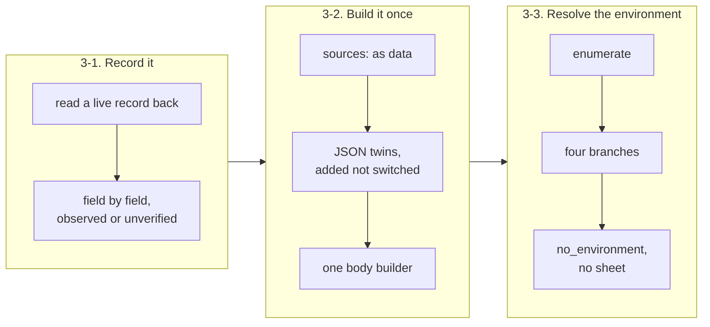

## 1. Overview

`/workaholify` §5 could reach an account carrying a transport, find templates to create, and create none: the create body's shape was undocumented, every caller rebuilt it by parsing display strings, and nothing said where `environment_id` comes from. This branch writes the record down field by field, moves the body's assembly into one script, and gives the environment resolution a four-branch rule and its own named refusal.

**Highlights:**

1. A live routine record was read back from an unattended, routine-fired session and recorded per field as **observed** or **unverified** — the create body's own nesting stays unproven by name.
2. `build-routine-body.sh` composes `render-routine.sh` rather than re-reading the frontmatter, so the body lives in one place without a second reader to drift.
3. `no_environment` joins `no_transport`, with one standing they do not share: it renders no setup sheet.

## 2. Motivation

An account with **no** routines is §5's only real work, and it was the case that failed. `reference/routines.md` documented exactly one leaf of the record — `autofix_on_pr_create` — so everything else had been recovered by walking 400s and lived in nobody's document. `render-routine.sh` emitted display strings (`"[Bash, Read]"`) and no `sources` at all, so each caller re-parsed them and rebuilt the request body itself. And the environment id, which a create cannot do without, was called "a question for the developer" by a header comment while nothing told the session to enumerate first: the account measured has exactly one, so the question had one answer, was asked of nobody, and the run stopped — reporting `no_transport`, which was the wrong word, because the transport was present and was used.

The three tickets were written on 2026-08-21 against a five-template set. Two of those templates have since been retired with the whole `user` scope, and the branch implements the intent rather than the letter where they diverge — recorded in each Final Report rather than silently.

## 3. Changes

The order was forced rather than chosen: nothing could build a body before the body was written down, and the environment rule had a place to live only once the record existed to hold it. Each step's measurement changed the step after it — the read-back supplied the body builder's nesting, and the same session's environment enumeration supplied the rule's evidence and refuted the surface the ask had proposed for it.

### 3-1. Record the verified routine create and update body ([fdf3835](https://github.com/qmu/workaholic/commit/fdf38351))

A live record was read back — all eight on the account — and written into `reference/routines.md` per field, each marked observed or unverified. The read-back's key paths (`session_request.…`) differ from the recovered-by-400s account (`job_config.ccr.…`), so both are recorded and neither is collapsed into the other; `mcp_connections`' create-vs-update asymmetry gets its own subsection with live evidence beside it.

### 3-2. Build the routine API body in one place ([5cf7273](https://github.com/qmu/workaholic/commit/5cf7273f))

Templates gained `sources:`, `render-routine.sh` gained `*_json` twins beside its display spellings, and `build-routine-body.sh` composes both into the whole request body with the environment id as an argument. The Open Decision — sibling script or JSON mode — was resolved by taking a sibling that reads no frontmatter, which pays neither shape's stated cost.

### 3-3. State the environment rule and its named refusal ([09b0bec](https://github.com/qmu/workaholic/commit/09b0bec0))

§5 now states four environment branches, and an unattended caller never picks between two. `no_environment` is named beside `no_transport` in the skill and in all three surviving command bodies, and the suite pins both the word and its no-sheet standing.

## 4. Outcome

A caller converging an empty account now has a document to build a body from, one script that builds it, and a rule for the one field it cannot derive. Nothing a caller already read changed: `render-setup-sheet.sh --all` is byte-identical to before the branch, verified rather than assumed.

## 5. Concerns

### The create body's nesting is emitted but unproven

- **Severity:** moderate
- **Description:** `build-routine-body.sh` emits the nesting a live record *reads back* in (`session_request.…`), while the older recovery-by-400s account names `job_config.ccr.…`; the script says which it used and that it is unproven (see [5cf7273](https://github.com/qmu/workaholic/commit/5cf7273f) in `plugins/workaholic/skills/workaholify/scripts/build-routine-body.sh`). The API silently drops unknown fields, so a create that returns 200 against the wrong nesting would produce a routine missing its model, tools and prompt.
- **How to Fix:** Perform one create through the transport and **read the record back**, then delete whichever nesting the read-back disproves and set `body_shape_verified` accordingly.

### The `notifications` mapping is written down without evidence

- **Severity:** low
- **Description:** `propose.md` declares `notifications: push` and no record in the read-back carries any notifications key, so the template-to-record row is the shape a caller should try rather than one that was observed (see [fdf3835](https://github.com/qmu/workaholic/commit/fdf38351) in `plugins/workaholic/skills/workaholify/reference/routines.md`).
- **How to Fix:** Settle it the same way `autofix_on_pr_create` was settled — set the option in the UI, re-read the record, and record what appeared.

## 6. Successful Development Patterns

- **Reproduce first, even for a documentation ticket** — the read-back changed what the document says twice (the key paths, and the absent `notifications` key), where writing up the ask's own account would have shipped an inference as a measurement.
- **When a fork's two shapes each cost something, look for the shape that pays neither** — the body builder composes the existing reader instead of duplicating it, so "second reader drifts" and "changing a depended-on script" both stopped applying.
- **Add fields rather than a mode when a surface has other callers** — a byte-identical setup sheet was the proof, and it took one diff to get.

## 8. Notes

The three tickets' Final Reports carry what was decided against the ask where the ask had gone stale: two retired templates, one retired command body, and one refuted hypothesis about which surface enumerates environments.
