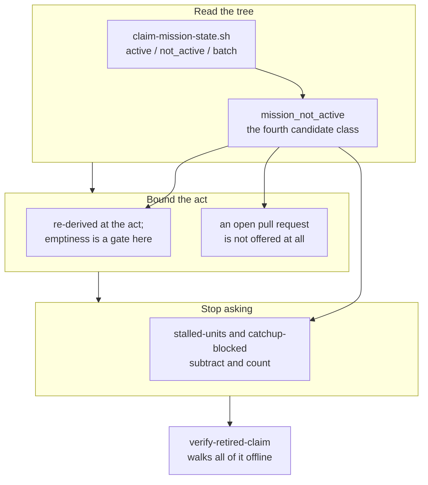

## 1. Overview

A claim whose mission the operator ended is now the retirement path's business and nobody
else's: the tree is read for whether the work is still wanted, that reading becomes a fourth
retirement candidate class, and the two stuck-work questions subtract what the path already owns.

**Highlights:**

1. `claim-mission-state.sh` answers whether a claim's mission has ended, from the tree alone.
2. `mission_not_active` joins the retirement classes; an open pull request is not offered to it.
3. `stalled-units` and `catchup-blocked` stop asking about what the tick is about to delete.

## 2. Motivation

Measured: the operator closed a pull request and closed its mission `abandoned`, and the tick
reported that branch as stuck work every hour until a person deleted it by hand — a question
asking somebody to do the tick's own job. Retirement is keyed on a branch's own pull request, so
nothing in the protocol could answer *is the work behind this claim still wanted*, and the two
stuck-work steps subtracted exactly two verdicts, neither of them this.

The mission's Experience is one behaviour in two halves — such a claim is retired, and it never
appears in a question about stuck work — and either half alone leaves the measured defect
standing: a candidate nobody filters on, or a filter with nothing to filter.

## 3. Changes

The branch moves from a reading, to the candidate it feeds, to the act's bounds, to the questions
that must stop — and closes with one drill that walks the whole path, because the halves are only
correct together.

### 3-1. Read a claim's mission status from the tree ([e6cffa46](https://github.com/qmu/workaholic/commit/e6cffa46))

`claim-mission-state.sh` answers `active` / `not_active` (with the mission's `status` beside it) /
`kind: batch`, composing the one mission resolver so the **area** falls out of the path. Every
degradation is named with no `state` key at all: a wrong `not_active` deletes a live branch.

### 3-2. Name a claim whose mission ended as a candidate ([ada6d4d2](https://github.com/qmu/workaholic/commit/ada6d4d2))

`list-retirable-claims.sh` gains `mission_not_active`, enumerated from the oracle's rows because
the per-ref arm skips every unit the oracle holds a row for — which a claim branch always is. The
act re-derives it, fails closed on the branch's emptiness, and an open pull request is offered to
nothing.

### 3-3. Filter a retiring claim out of the stuck questions ([5825a850](https://github.com/qmu/workaholic/commit/5825a850))

`stalled-units` and `catchup-blocked` subtract every unit the retirement reader names and count
it; an unreadable read filters nothing and says so, and the read is made only when there is
something to subtract from.

### 3-4. Drill the two retirement readings offline ([a8af2d23](https://github.com/qmu/workaholic/commit/a8af2d23))

`verify-retired-claim` walks the reading, the candidate, the act and the silenced question over
one hermetic fixture, with a breaker that moves the mission back to `active/` and requires the
candidate to disappear.

## 4. Outcome

All three acceptance items are checked, the queue is empty and the archive gate closed the mission
`achieved`. `verify-all` reports 44 drills, 34 proved, 0 failed; the suite is 6027 rows green.

## 5. Concerns

### The two steps each pay a retirement scan on a tick that has candidates

- **Severity:** moderate
- **Description:** `stalled-units` and `catchup-blocked` each run `list-retirable-claims.sh`, which makes its own claim scan and one pull-request read per `work-*` ref; unbounded it made the hermetic suite roughly ten times slower, which is the cost the live tick would pay (see [5825a850](https://github.com/qmu/workaholic/commit/5825a850) in `plugins/workaholic/skills/moderate/scripts/step-stalled-units.sh`)
- **How to Fix:** the read is now made only when the step has candidates, which leaves the common tick paying nothing. If a tick with candidates proves too slow, the next step is one reading shared across the run — which needs a store this repository refuses, so it is a ruling rather than a refactor

### A hand-closed branch usually holds its work, so the class reaches the leftovers

- **Severity:** low
- **Description:** an abandoned mission's claim branch normally still carries what was driven on it, so the act refuses `branch_holds_work` and CI's record names it rather than deleting anything (see [ada6d4d2](https://github.com/qmu/workaholic/commit/ada6d4d2) in `plugins/workaholic/skills/drive/scripts/delete-retired-claim-branch.sh`)
- **How to Fix:** nothing here. The gate is the point — issue #788 measured what assuming otherwise costs — and the mission's other half is what stops the hourly question about the rest

## 6. Successful Development Patterns

- A composition that is correct can still be the wrong one, and what says so is a measurement: `claim-mission-state.sh` moved from `list.sh` to the one resolver only after the suite's own runtime named the O(units × missions) cost.
- The bound that made a class reachable was a **narrowing** of the act's blanket refusal, not a loosening of it — the two pull-request classes exist for branches with no claim row, this one is enumerated from the rows they skip.
- A hermetic fixture proves nothing unless its two subjects differ in exactly one respect; here both claims are seeded by one function whose only argument is the mission slug.

## 7. Notes

Phase 1's deferred-concern judging found 109 open concerns and returned no verdicts: this branch
touches none of their subjects, and the seam prefers `still_active` when in doubt.
