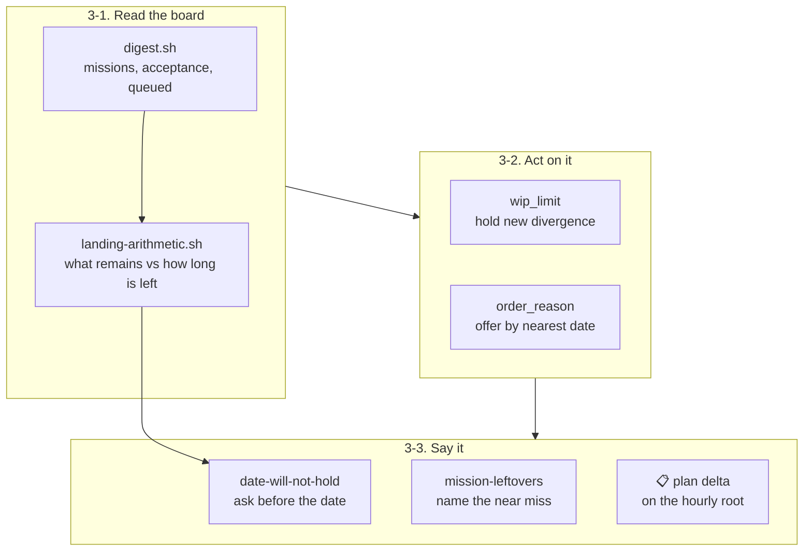

## 1. Overview

The loop had three clerks and no planner: intake adds, execution drives, bookkeeping reports, and `/propose` only ever ADDS. Nothing read the whole board and decided what was next, in what order, or what should stop. Measured in one day: six missions in parallel with no sequencing, five pull requests conflicting on the loop's own generated index, 30 queued tickets against three directions dated the same day, and a person — not the loop — converging all of it. This branch adds the five acts that were missing, each to a tick that already runs, and writes down that they are one job.

**Highlights:**

1. **Nothing new runs.** No command, no routine, no artifact and no field on any artifact — five acts added to `/propose`, `plan-units.sh`, the strategy readers and `/moderate`.
2. **Every brake defaults to off.** With `WORKAHOLIC_WIP_LIMIT` undeclared the repository is byte-identical to one before the branch, and the drill weights that case as heavily as the hold itself: a brake nobody asked for stops the loop *silently*, which is the more dangerous failure.
3. **The re-dating half of the ask is refused by name**, with the standing rule cited. A loop that moves its own deadlines when it misses them is a loop whose dates mean nothing.

## 2. Motivation

The ask's framing was accurate about the documents as well as the behaviour: nothing named planning as a job, so no reader could tell whether *nothing re-plans* was a defect or the design.

Each piece was individually explicable and collectively a gap. `work_waiting` and `open_proposal` already gave *one mission per strategy in flight*, so each direction was inside its own gate — and nothing bounded the **repository**, so N directions put N missions in flight together. `plan-units.sh` returned missions in whatever order the directory walk produced, and no document stated it. `/standup`'s digest named each direction's missions, acceptance and queued counts, and nobody did the arithmetic over them. Two date questions existed and **both** fired at or after the date. And `closable-missions` needed acceptance complete *and* the queue empty, so a mission that met the first and failed the second was closed by nobody and named by nobody.

## 3. Changes

- **`strategy/scripts/landing-arithmetic.sh`** — per direction, what remains against how long is left, in four verdicts. It composes `digest.sh` and divides; the rate is the direction's own **measured** throughput, never a constant, and the window's default is read from `default-target-date.sh` so seven is not re-declared.
- **`/propose`'s `wip_limit` rung** — last in the refusal ladder, so a direction refused earlier is not also counted. Declared as `WORKAHOLIC_WIP_LIMIT` in `.claude/settings.json`'s `env` block; **absent means no limit**.
- **`plan-units.sh`'s offer order** — mission before loose backlog, then the nearest `target_date` of the direction each mission serves, then the mission's own ticket order. Each row carries `order_reason`; a failed derivation names **every** row `direction_unreadable` rather than falling back to an unannotated walk order.
- **`/moderate`'s `date-will-not-hold`** (33rd step) — asks the assignee before the date, keyed once per direction, writing nothing. Its boundary is `direction-state.sh`'s own `live` verdict rather than a second copy of `expiring`.
- **`closable-missions`' near miss** — a second `needs_agent` entry, `mission-leftovers:<slug>`, off the same scan.
- **The `📋` plan clause** — one line on the hourly root, gated on `strategy-pace`'s own summary diff, earning no post.
- **`verify-plan-adjust`** — a hermetic drill over the hold and the order, with a breaker that wires the rung out.
- **`CLAUDE.md`'s *The planning job*** — the five acts, the authority, and the four refusals.

## 4. Outcome

The loop now sequences its own work within bounds a person declared: new divergence is held while too much is in flight, the executor is offered work in a stated order, a date that will not hold reaches its owner before it passes, converged work is named for closing, and the hourly post says what moved. Everything the loop may **not** decide — every date, every end state, every judgement about whether queued work still matters — is named beside what it may, so the next ask argues with a stated rule rather than an inference.

## 5. Concerns

### The work-in-progress limit is inert until a person declares it

- **Severity:** moderate
- **Description:** The gate ships as a named no-op: with `WORKAHOLIC_WIP_LIMIT` absent the count is not even taken and `/propose` behaves exactly as it did. Writing the declaration means editing `.claude/settings.json`, a path Claude Code classifies as sensitive and an unattended run has nobody to approve — which is why the ticket carried a verification handoff and why this branch stops short of it.
- **How to Fix:** Add `WORKAHOLIC_WIP_LIMIT` to the `env` block in `.claude/settings.json` with the number this repository can carry (the measured day had six missions in parallel; two or three is the shape the ask argues for), then confirm one `/propose` tick at, above and below it.

### `plan-units.sh` gained about 21 seconds on the executor's hot path

- **Severity:** low
- **Description:** Resolving which direction each mission serves runs `mission-strategy.sh` once per survey, measured at 21s on this repository. It is a **local** read, so the survey stays offline by construction — that property was worth more than the seconds — but every `/implement` and `/drive` run now pays it.
- **How to Fix:** Nothing yet. If it becomes a cost, the attribution walk's own prefilter is where to look, not this caller.

### `scripts/e2e/loop-drill.sh` is now past the per-file size ceiling

- **Severity:** low
- **Description:** The scan reports `large-file` (636178 bytes > 524288) and one `too-large-commit`; both are `override`-tier and neither is a secret or a leak. The drill file has been growing one arm per mission and this branch added another.
- **How to Fix:** Split the dispatcher from the arms, or the arms by area, whenever somebody is in that file for another reason.

## 6. Successful Development Patterns

- **State the unit of both sides before writing an arithmetic.** The obvious rate numerator (`active_count`, artifacts *touched*) read 502 against 50 queued tickets, so every direction cleared by construction and the reading said nothing. The remainder is queued tickets, so the rate had to be tickets that reached `done`.
- **Pin a fixture's commit date whenever a verdict depends on a window.** Both the drill and the gate test were time-racy on their first run: a fixture committed *now* falls inside *any* `git log --since` window, so the direction read `quiescent` and was refused by the rung *above* the one under test. `GIT_COMMITTER_DATE`, not `touch -t`.
- **A derivation that failed must say so on every row.** Falling back to a bare walk order is indistinguishable from a derived order that happened to agree — so the same jq program runs again with the reason forced, which is also what keeps the fallback the *same* ordering rather than a second copy.
- **`2>/dev/null` on an embedded jq program hides our own defects.** A runtime error (exit 5, not a compile error, so `jq-guard.sh` would not have caught it either) silently kept the walk order for a whole cycle. What surfaced it was reading the output, not the exit status.
- **When a brake is added, weight its absent case as heavily as its firing case.** A regression that ignores a declared limit is loud; one that holds every repository by default is silent, and silence is what this repository has twice measured as an outage.

## 8. Notes

Eight tickets, all archived under this branch, each with a Final Report carrying what was decided against its own ask. Two asks were **refused by name** rather than trimmed to fit: re-dating a direction (`amend.sh` carries only an operator's announced revision) and naming *what is next in the executor's order* on the hourly root (that order is `plan-units.sh`'s, which no `/moderate` step may reach, and a slug on a line addressed to nobody is the shape the root refuses). Both refusals are recorded where a future reader will meet them.

The mission's own `## Acceptance` is fully checked with its queue drained, and it is still in `missions/active/` — the archive gate's close did not appear in the last archive's output. `/moderate`'s `closable-missions` step is the sanctioned route for exactly that state and will re-prove and land it; this run wrote no end state, because `close.sh` is the only writer of one.

## Handoff

**This pull request is open on purpose and must not be merged by a machine.** A member ticket
declared a verification this environment cannot perform, quoted verbatim:

> editing `.claude/` needs a person: Claude Code classifies it as sensitive and an unattended run
> has no one to answer the prompt

**What a person must do.** The work-in-progress gate ships as a named no-op: with
`WORKAHOLIC_WIP_LIMIT` absent the count is not even taken and `/propose` behaves exactly as it did
before this branch. To turn it on, add the limit to the `env` block in `.claude/settings.json` —
the same home `WORKAHOLIC_CADENCES` uses, and for the same reason — and confirm one `/propose`
tick at, above and below it. The measured day had six missions in flight at once; two or three is
the shape the ask argues for, but the number is the operator's and this branch deliberately picks
none.

Everything else on the branch is finished: all eight tickets are archived, the hermetic suite is
green (6112 passed, 0 failed) and the classified drill set passes (44 drills, 0 failed), including
the new `verify-plan-adjust` with its breaker present.
