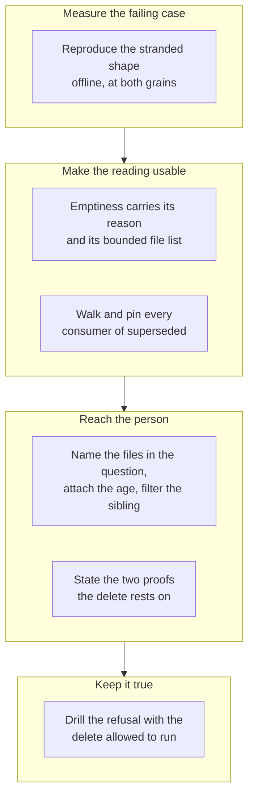

## 1. Overview

`superseded` licenses the loop to delete a remote branch. The emptiness term making that safe had
landed while everything built on it had not: the reading now carries **its reason and the files it
found**, the holder is told **what is on the branch** and asked once, the documents state the
**two separate proofs**, and a drill deletes for real.

**Highlights:**

1. `claims_branch_emptiness` is one derivation printing verdict, reason, count and a bounded file list; the verdict-only wrapper every caller reads is unchanged.
2. `/moderate`'s stranded question names the branch, the files and the condition's age, and `stalled-units` now counts that verdict instead of asking a second question about the same branch.
3. `verify-stranded-claim-branch` runs the delete for real: with the diff term reverted both work-holding branches came back `remote_branch_deleted: deleted`.

## 2. Motivation

Two branches whose tickets landed through *different* branches still held ~300 lines of code and a
documentation section on no other ref, and the tick was asking for both to be deleted; only a 403
on `push --delete` had prevented the loss, for five days. The 2026-09-01 repair (issue #788) put
the emptiness term into `claims_superseded` and stopped there — leaving a reading that answered a
word and discarded the two facts a person needs, a question that could name a unit id and nothing
else, a sibling asking a second question about the same branch, a header promising a recovery on
the wrong proof, and no drill over the one mechanism whose regression destroys work.

## 3. Changes

The mission moved from measurement to repair to telling somebody to keeping it true. The
reproduction fixed what every layer answers before anything was changed; the reading gained the
facts a consumer needs and the consumer walk was recorded rather than re-derived; the question
gained the files and the age while its sibling stopped duplicating it; the documents were made to
say what is now actually guaranteed; and a drill was written so the next change cannot quietly
take it away.

### 3-1. Reproduce a stranded claim branch offline ([b14a25c1](https://github.com/qmu/workaholic/commit/b14a25c1))

Built the measured shape as a throwaway repository at both grains and recorded what every layer
answers today, confirmed the CI act re-derives the same term rather than testing the diff
independently, and measured the term's cost at about 7.5 ms per branch.

### 3-2. Give the emptiness reading its files and reason ([5ff3d603](https://github.com/qmu/workaholic/commit/5ff3d603))

`claims_branch_emptiness` became the one derivation, printing the verdict, a named reason for
every unanswerable case, the true count and a bounded file list; the listing is opt-in because it
costs a second diff, and the verdict-only wrapper stayed byte-compatible for every caller.

### 3-3. Walk and pin every consumer of `superseded` ([64ca3777](https://github.com/qmu/workaholic/commit/64ca3777))

Recorded what the narrowing does to each consumer as a table in `claims.md`, and added hermetic
rows proving the derivation at both grains and the behaviour of `plan-units.sh`,
`list-retirable-claims.sh` and `claim.sh` under it.

### 3-4. Name the files a stranded branch holds ([46ab75f6](https://github.com/qmu/workaholic/commit/46ab75f6))

The claim row carries the bounded names and the true count for a `stranded` verdict alone, the
question leads with what happened and names them with the condition's age, and `stalled-units`
filters and counts the verdict rather than asking a second question about the same branch.

### 3-5. State the two proofs the delete rests on ([6f22b718](https://github.com/qmu/workaholic/commit/6f22b718))

The retirement's recovery claim now names *the tickets are archived* and *the branch holds no
work* separately, says neither implies the other, records the 403 as a near miss rather than a
history, and explains why `not_on_base` keeps a name that under-describes what it tests.

### 3-6. Drill the stranded-branch refusal offline ([7a67384e](https://github.com/qmu/workaholic/commit/7a67384e))

`verify-stranded-claim-branch` seeds all three emptiness cases at both grains with the delete
allowed to actually run, asserts the refs and file contents on origin afterwards, and is
registered as a hermetic breaker so the CI matrix picks it up by name.

## 4. Outcome

All three acceptance items are met and the mission closed `achieved` on the arithmetic. A holder is
told which files are on their branch and how long it has been asked about, exactly once; the
documents promise only what the code proves; and reverting the diff term turns a check run red.

## 5. Concerns

### A defect shipped and was fixed inside this branch

- **Severity:** low
- **Description:** The first form of `claims_branch_emptiness` captured `git diff --quiet`'s status after a bare call, which aborts under `set -e` — so `delete-retired-claim-branch.sh` answered `emptiness_unanswerable` for every non-empty branch. It refused the delete either way, so no safety property moved, but a person would have been sent after a reading that failed rather than a branch that holds work. Caught by two existing rows and fixed in [64ca3777](https://github.com/qmu/workaholic/commit/64ca3777), after the introducing commit [5ff3d603](https://github.com/qmu/workaholic/commit/5ff3d603) in `plugins/workaholic/skills/drive/scripts/lib/claims.sh`
- **How to Fix:** Nothing outstanding; recorded because the library is sourced into `set -e` callers and the next helper wanting an exit status will meet the same trap.

### `catch-up-claim.sh` has no `stranded` bound of its own

- **Severity:** low
- **Description:** It relies on `list-catchable-claims.sh` never offering a stranded unit rather than refusing one by name (see [64ca3777](https://github.com/qmu/workaholic/commit/64ca3777) in `plugins/workaholic/skills/drive/scripts/catch-up-claim.sh`)
- **How to Fix:** Safe as it stands — its act merges the base into the branch and deletes nothing — so this is stated in `claims.md` rather than repaired; add the bound if the caller set is ever widened.

## 6. Successful Development Patterns

- Reverting the load-bearing term and watching the drill go red proved the breaker rather than asserting it — the run recorded `remote_branch_deleted: deleted`, which is the loss itself, not a proxy for it.
- Measuring the reading's cost (373 ms → 1484 ms per 50 readings) before choosing made the file listing opt-in on evidence instead of taste.

## 7. Notes

A ticket was minted mid-run: `validate-ticket.sh` finds `.workaholic/` anywhere in a path, so every
edit inside a loop clone trips the layout guard. Queued, not fixed here.
