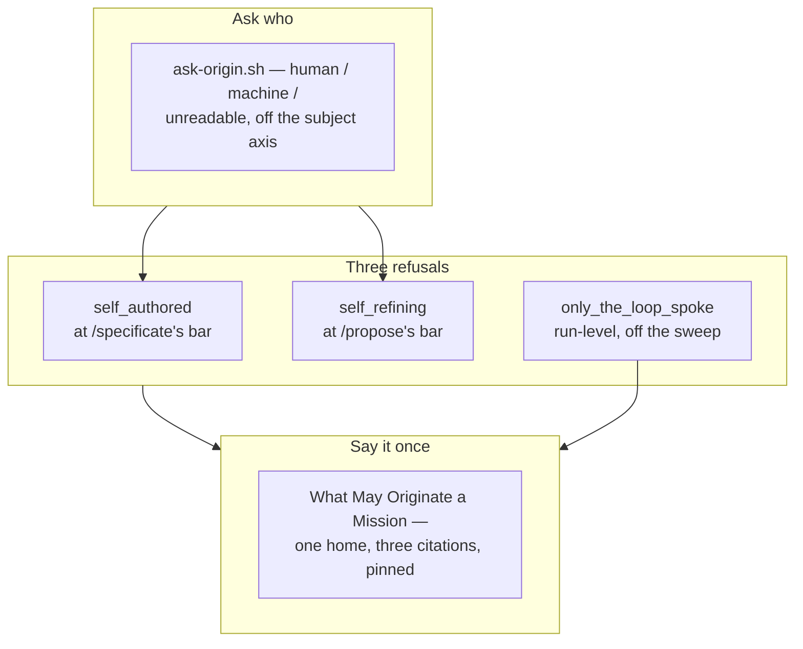

## 1. Overview

Every gate in the loop asked whether an ask was decomposable, actionable, on-direction — and
none asked **who wanted it**. This branch adds that question once as a reader and three times
as a refusal, and states the rule they are all consequences of in one place.

**Highlights:**

1. `ask-origin.sh` answers `human` / `machine` / `unreadable:<reason>` off the `subject:` axis, adding no field.
2. Three refusals by name: `self_authored` at `/specificate`'s bar, `self_refining` at `/propose`'s, and the run-level `only_the_loop_spoke`.
3. *What May Originate a Mission* now lives once, in `rules/workaholic.md`, cited by three skills and pinned against drift.

## 2. Motivation

Five consecutive `[FB]` roots in one day that no human wrote: each a record a routine session
authored about the loop's own self-proposed apparatus, each proposed, ticketed and merged by the
next ticks, each link refining the one before it, until the operator abandoned the direction
mid-drive and reported the day as waste with their own development stopped throughout. Every
gate held. The rule that would have stopped it existed only as three consequences in three
skills, none of which said **whose** input may originate anything — so the next session
re-derived it, wrong.

## 3. Changes

The reader was built first because two of the three refusals consume it; the refusals were
built next, each under its own word and each left as a judgement rather than folded into a
mechanical gate; and the statement was written last, deliberately, so it describes the
refusals that exist rather than the ones the ticket set imagined.

### 3-1. Read whether a person wanted an ask ([973b88e5](https://github.com/qmu/workaholic/commit/973b88e5))

One pure reader over the three axes that already exist, answering `human`, `machine` or
`unreadable:<reason>` with its evidence, for a record on disk or an ask's body on stdin. It
answers *who* and deliberately not *about what*.

### 3-2. Refuse an ask no person asked for ([b7ced6a1](https://github.com/qmu/workaholic/commit/b7ced6a1))

`/specificate`'s judgment bar now reads the origin and, on `machine`, applies the second half
as the run's own judgement in the pull-request body. Both holding is record-only under
`self_authored`; `unreadable` never refuses and the inbound sweep is never caught.

### 3-3. Refuse a move that deepens our own invention ([406d30bb](https://github.com/qmu/workaholic/commit/406d30bb))

`self_refining` joins `describing_move` and `invented_obligation` with its measurement, its
test in words, and the two cases it must not catch — a second mission answering a human's ask,
and the scale's own follow-up repair mission.

### 3-4. Stop proposing into a channel nobody speaks in ([660fc8fd](https://github.com/qmu/workaholic/commit/660fc8fd))

Step 0b answers, off the sweep the run already makes, whether any human spoke in the window.
`only_the_loop_spoke` stops origination for the tick; `unreadable` never does, and the
reactive path — issues, sweeps, `/specificate` — is untouched.

### 3-5. State once what may originate a mission ([f587d123](https://github.com/qmu/workaholic/commit/f587d123))

`rules/workaholic.md` gains *What May Originate a Mission* with its measurement and its three
refusal words; `/specificate`, `/propose` and `/fb` cite it rather than restating it, and
`CLAUDE.md`'s *Sources* now names whose input each source carries.

## 4. Outcome

All three acceptance items are met and the mission closed `achieved` on the arithmetic. A
machine-authored ask about the loop's own apparatus is refused by name before anything is
emitted, a proposal refining a prior self-proposal is refused at the bar, a window in which only
the loop spoke stops origination — and the sentence all three follow from is written down once.

## 5. Concerns

### Three refusals nothing mechanical can fire

- **Severity:** moderate
- **Description:** `self_authored`'s second half, `self_refining` and `only_the_loop_spoke` are all judgements the running model applies; nothing checks that a run actually asked them (see [b7ced6a1](https://github.com/qmu/workaholic/commit/b7ced6a1) in `plugins/workaholic/skills/specificate/SKILL.md`)
- **How to Fix:** Accepted deliberately — the same standing `describing_move` and `invented_obligation` already carry. What the pins buy is that the rule is stated where the run reads it and that no second parser or mechanical gate grew beside it; a run refusing nothing is visibly non-conformant against one sentence.

### `only_the_loop_spoke` brakes a quiet weekend

- **Severity:** low
- **Description:** A legitimately quiet stretch reads as abandonment and costs one tick of proposals (see [660fc8fd](https://github.com/qmu/workaholic/commit/660fc8fd) in `plugins/workaholic/skills/propose/SKILL.md`)
- **How to Fix:** The operator's own framing, accepted rather than tuned against: a stopped origination costs an hour, the measured alternative cost a day of work they tore out. Written where the gate is stated so a future reader argues with the trade rather than discovering it.

## 6. Successful Development Patterns

- Building the reader before either consumer kept the mechanical half (*who*) and the judgement half (*about what*) apart, which is what stops the script refusing real asks about the loop that people write.
- Pinning *no second parser grew* rather than *the rule exists* gave a prose refusal a mechanically checkable property — the failure that actually costs something.
- Proving the drift pin by rewriting one citation to say the opposite, and watching two rows go red, made the gate's own claim true rather than asserted.
