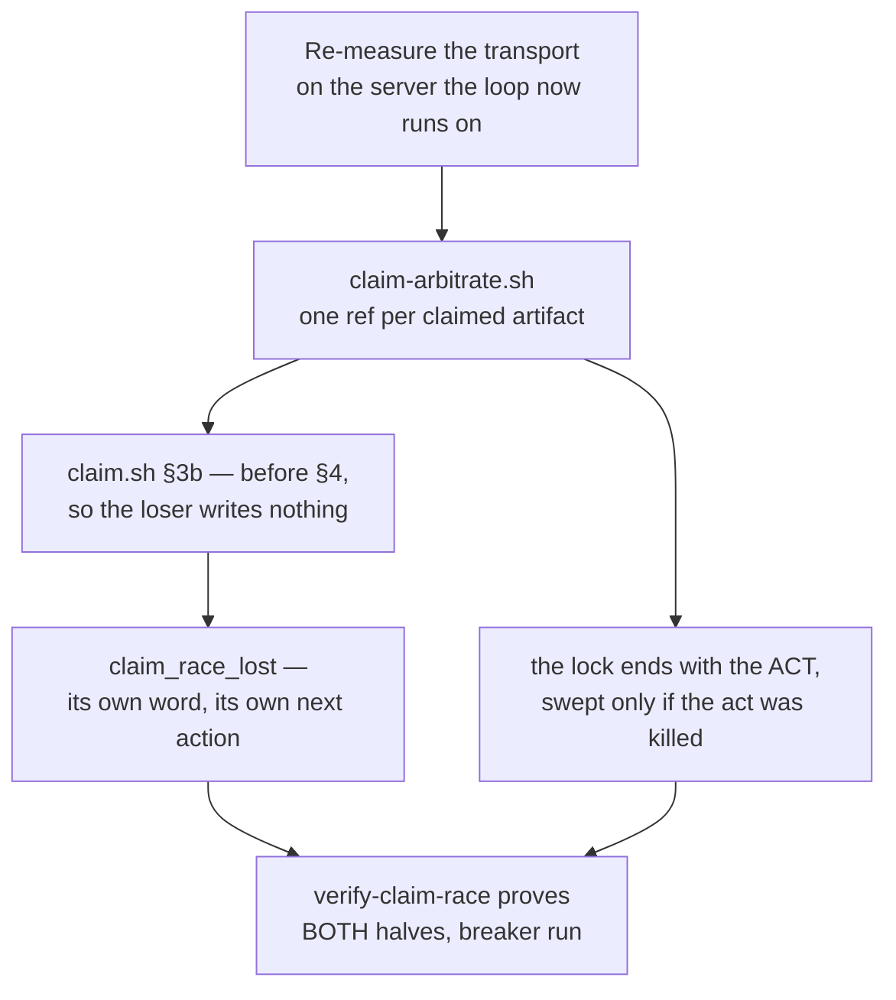

## 1. Overview

A fresh claim minted its branch name from the clock, so two runners that surveyed before either
pushed contended for nothing and both won. The claim now wins **one ref per claimed artifact** at
the remote before it writes anything, so the loser stops inside its own survey.

**Highlights:**

1. The standing block was disproved by one cheap probe: the 403s were the **cloud routine's proxy**, and the loop now runs on the developer's server, where the ref write succeeds.
2. `claim.sh` §3b arbitrates **before** the worktree exists, so `claim_race_lost` leaves no branch, no worktree, no commit — anywhere.
3. The drill proves **both halves** and its breaker was run: removing the arbitration turns five rows red with the loser leaving `worktrees=1 branches=1 remote=1`.

## 2. Motivation

Measured 2026-08-30: `work-20260830-055314` and `work-20260830-055318` were both claimed for one
unit four seconds apart, and each drove the same four tickets for over an hour. The acceptance
item that would have stopped it had been **blocked since 2026-08-31** across four independent
readings, all of which measured the same 403 and all of which were taken **inside a routine-fired
container**. The loop moved onto the developer's own server on 2026-09-02, and that is the premise
none of those readings could have carried forward.

## 3. Changes

The block was tested rather than designed around; the mechanism went in where the loser has
nothing to lose yet; the refusal got the word its next action deserves; and the drill was turned
over to prove the repair without dropping the coverage of the repair that was already there.

### 3-1. Settle a claim race at the remote ([00e4df36](https://github.com/qmu/workaholic/commit/00e4df36))

`claim-arbitrate.sh` (`take`/`release`/`reap`/`refname`) contends on
`refs/claims/artifact/<path>` with a create-only lease, all-or-nothing, wired into `claim.sh`
§3b before the worktree exists — and answering `unavailable` wherever the transport refuses.

### 3-2. Refuse a lost claim race by its own word ([f454d50d](https://github.com/qmu/workaholic/commit/f454d50d))

`claim_race_lost`, distinct from `branch_collision` (retry) and `push_failed` (the remote did
not take it), because the next action is **survey again**. The loser's empty teardown is asserted,
and the winner's branch is deliberately not guessed.

### 3-3. Drill the claim race repair, both halves ([546c6e94](https://github.com/qmu/workaholic/commit/546c6e94))

`verify-claim-race` now proves the refusal **and** keeps proving the bounded-later repair for the
environments where the arbitration cannot run; releasing the contended lock is both the breaker
and the stage for the second half.

### 3-4. Close out the probe branches, already gone ([5fefc847](https://github.com/qmu/workaholic/commit/5fefc847))

The ticket's own first step answered it: all three residue refs are absent from origin. Nothing
was widened, nothing was pushed, and the mechanism ticket stops asking for a spent act while
keeping its measurements.

## 4. Outcome

The mission's last acceptance item is met and it closed `achieved`. A second runner in the race's
own window is refused at the server with nothing written, and an environment that cannot arbitrate
still gets `archive.sh`'s re-check and `/moderate`'s `raced-units` question.

## 5. Concerns

### A lock leaked by a killed act waits for the next lost take

- **Severity:** low
- **Description:** The lock now ends with the claim act, so the only leak left is a process killed in the seconds between winning it and pushing; nothing releases that until the next lost take runs the reap (see [eece3a62](https://github.com/qmu/workaholic/commit/eece3a62) in `plugins/workaholic/skills/drive/scripts/claim-arbitrate.sh`)
- **How to Fix:** Accepted and stated rather than designed away — seconds of exposure against an hour of duplicated driving. If it is ever observed, the reap can move to `/moderate`'s tick, where it would run hourly regardless of whether anybody claims.

### The arbitration is exercised only against a local origin

- **Severity:** low
- **Description:** Every hermetic row and the drill use a bare local origin, where the ref write is permitted; whether a given remote permits it is what `unavailable` exists for (see [546c6e94](https://github.com/qmu/workaholic/commit/546c6e94) in `scripts/e2e/loop-drill.sh`)
- **How to Fix:** Nothing outstanding — the production transport was measured directly this run, and the degraded path is the one every cloud routine already takes.

## 6. Successful Development Patterns

- Re-measuring a recorded impossibility cost one probe and inverted a block four readings deep; the finding had named its own environment, and the environment is what had moved.
- Placing the arbitration before the worktree turned a teardown requirement into nothing to tear down — the cheapest way to satisfy "the loser writes nothing".
- An existing row caught the design's real defect: a lock held for the life of the claim outlives a **merge**, which runs nothing in the container. Ending the lock with the *act* removed the whole class rather than adding a release per verdict.
- The drill's breaker is the same act that stages its second half, so one step both proves the refusal rows and covers the environment where the refusal cannot happen.

## 7. Notes

A ref used as a lock needs a **value unique per claimant**: git answers `Everything up-to-date` to
a push of the value a ref already holds, so a shared base sha made two takes both report `won`.
