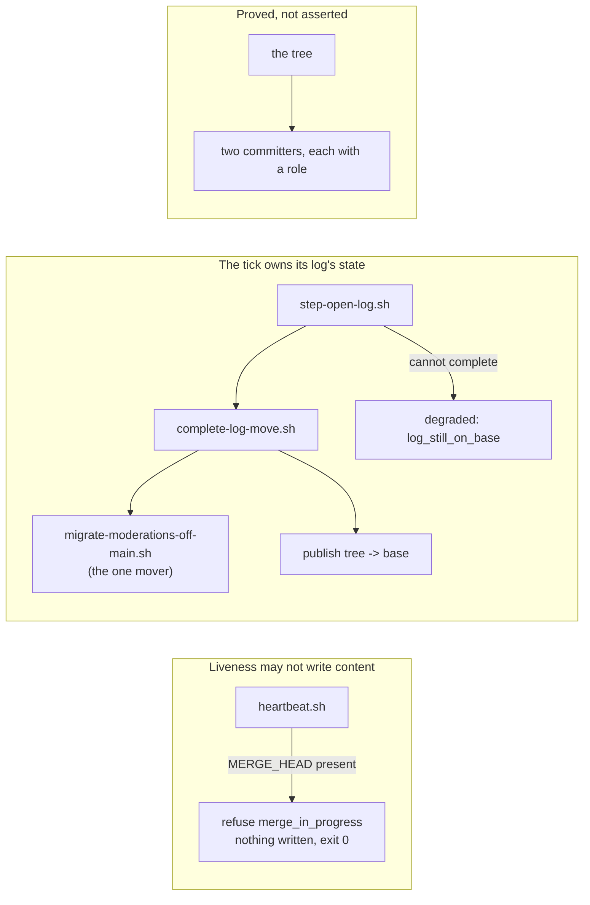

## 1. Overview

Two mechanisms that were individually correct could each silently undo work, and neither had anything watching it. The tick log's move off the base reached a repository only when a **person** ran `/workaholify`; until then every tick added day files to the base and the opening step reported `ok`. And the claim heartbeat — an empty commit, deliberately cheap and unconditional — writes a **merge commit** instead when a merge is unresolved, recording the base as a parent while carrying none of its content.

**Highlights:**

1. The tick finishes its own log's move: it reads whether day files are still tracked on the base and completes the move through the one migration, or names the refusal every tick until repaired.
2. The heartbeat refuses `merge_in_progress` — a liveness signal that could revert a merge was given no cleverness, only a bound.
3. The guard's writer set is derived from the tree and pinned, so a third committer fails the build instead of escaping the one refusal.

## 2. Motivation

**Measured, twelve days.** On a consuming repository the off-main design shipped and then waited: `converge-layout.sh` runs from `/workaholify`, a command a person invokes, so hourly ticks kept writing day files to the base from 2026-08-20 to 2026-08-31 — hundreds of commits, 12 day files, roughly 7,000 lines. It ended only when the operator ran the command by hand on 2026-09-02, and even then they had to commit and merge the staged removals themselves. Reproduced offline here: with a day file tracked on the base, `step-open-log.sh` answered `status: ok`.

**Measured, one commit.** On `work-20260902-083726` a run resolving a four-file content conflict beat its heartbeat between the resolution and the commit. `4c7749ef` is titled `Refresh heartbeat`, has `origin/main`'s tip as its second parent, and has an **empty diff against its first parent** — the branch claimed to have merged a base whose 97 changed files it had silently reverted, and `git merge origin/main` would have been a no-op ever after. It was repaired forward; a run that had not looked would have pushed a branch that reverts the base.

## 3. Changes

- **`heartbeat.sh` refuses a beat while `MERGE_HEAD` exists** in the unit's own worktree, writing nothing at exit 0 exactly as every other failed beat does. Refusing rather than repairing is the whole fix: a heartbeat clever enough to write the *right* merge commit would be a second liveness authority beside the branch tip, which `reference/claims.md` reserves to one. `ticket-workflow.md` §0 names the one moment the beat does not apply, and names the survey of the other callers either way — `claim.sh`'s marker takes the same `--allow-empty` path but creates the worktree it commits in, so no `MERGE_HEAD` can exist; `archive.sh` commits real content and a run does not archive mid-merge.
- **`step-open-log.sh` finishes the log's move.** After the hydrate it reads whether any `.workaholic/moderations/` path is still tracked on the base and completes the move through the new `complete-log-move.sh`, which composes `migrate-moderations-off-main.sh` — never a second mover, never re-deciding its seed-then-untrack order — inside the publish tree the tick already uses. `already_off_base` is silent, `moved` names the count, and a refusal is `degraded` / `log_still_on_base` naming the count and the migration's own reason, which carries the condition to a person through the tick's existing finding seam. No new store, no cursor, no field. The day files stay **on disk**: they are the tick's working log.
- **`persist-log.sh`'s base refusal is now legible.** The behaviour existed; the word `log_ref_is_the_base` was in neither the script's own documented stable-reason set, nor `workaholic:moderate`, nor `CLAUDE.md`, and no hermetic row covered it. All four are closed, and a row asserts the reason the code emits appears in the header's own set — two surfaces that otherwise drift in silence.
- **The writer set is derived from the tree.** A row walks `plugins/workaholic` for scripts that mention the log's directory and commit, and requires exactly two, each named with its role: `persist-log.sh` writes the log, `complete-log-move.sh` commits its removal from the base. `log-append.sh` and `hydrate-log.sh` are asserted to stay non-committing, and the refusal is asserted to key on the **destination** rather than on which tick wrote it — the two commit vocabularies on the base (`Log the propose tick`, `Log the moderation tick`) were one writer with two callers, and a guard phrased against one tick reads as though the other were free.

## 4. Outcome

`node scripts/test-workflow-scripts.mjs` — **6393 passed, 0 failed**. `verify.mjs`, `validate-metadata.mjs` and `layout-doctor.sh` clean. `sh scripts/e2e/loop-drill.sh verify-log-branch` — 10 load-bearing rows, **2 breakers**, exit 0. End to end in a throwaway repository: 1 day file tracked before, 0 on `origin/main` after, the file still on disk, the log branch created.

## 5. Concerns

**[moderate] The `size` finding on `scripts/e2e/loop-drill.sh` is now 671 KB against a 512 KB ceiling.**
This branch added ~30 lines to it. The file was already over the ceiling and the finding is `override`-tier, so it does not hold the merge — but the drill file has grown past the point where the ceiling means anything, and every future drill widens it further. Splitting it per drill stage is the obvious repair and is not this branch's to take.
- Severity: moderate
- Deferred because: the ceiling is advisory here and the split is a restructure of the loop's own safety net, which deserves its own unit.

## 6. Successful Development Patterns

- **A test that cannot fail is worse than no test.** Two of the new assertions failed on their first run and both were the test's own bugs — the writer walk caught the drill's fixture commits, and the guard slice anchored on the first occurrence of a word this same change had just added higher in the file, making the slice empty and the assertion vacuous. Running the row and reading *which* assertion failed is what surfaced both.
- **Reproduce before repairing.** Both defects were reproduced offline first — the heartbeat's merge commit (two parents, `1 deletion(-)` against the first, the other side an ancestor from then on) and the step's silent `ok` — so the repair had something to be measured against rather than reasoned about.

## 7. Notes

One ticket in this unit arrived already implemented: `persist-log.sh` carried its base refusal before the ticket was driven. What was missing was the test, the vocabulary entry and the prose, and that is what landed — reported rather than re-implemented.

The fourth ticket's new mover made the third ticket's own assertion go red inside the same unit, which is the assertion working. It now names both committers and their distinct roles rather than being loosened until nothing is caught.
