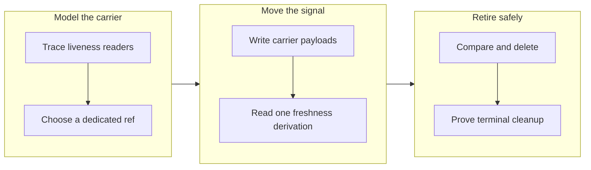

## 1. Overview

The branch moved claim heartbeats out of pull-request ancestry and into a dedicated remote ref. It preserved legacy freshness semantics, conservative takeover behavior, and complete cleanup across claim termination paths.

**Highlights:**

1. Added a compare-and-push liveness carrier that records the observed work-branch tip.
2. Kept heartbeat updates out of review history without weakening ownership or resumption decisions.
3. Retired carrier refs safely when claims are released, landed, or cleaned up.

## 2. Motivation

Heartbeat commits made operational lease renewal part of the code-review diff and coupled freshness to the work branch's tip. A separate remotely shared carrier was needed to survive ephemeral runners while avoiding force-pushes, ambiguous local state, and unsafe expiry when the carrier cannot be read.

## 3. Changes

The work first established the carrier contract, then moved writes and reads together, and finally bound the new ref to the claim's lifecycle. This order kept legacy claims readable throughout the cutover and made cleanup part of the same operational proof.

### 3-1. Measure the claim liveness readers and choose the off-branch carrier ([4a9d205d6](https://github.com/qmu/workaholic/commit/4a9d205d6))

The developer traced every freshness consumer and selected `refs/workaholic/claim-liveness/<work-branch>` as the smallest remotely shared carrier. Its payload includes the observed branch tip so ordinary work commits remain valid progress evidence.

### 3-2. Move heartbeat writes and claim freshness reads onto the liveness carrier ([5417a6d44](https://github.com/qmu/workaholic/commit/5417a6d44))

Heartbeat, claim, resume, and scan paths now share one compare-and-push carrier implementation. Unreadable declared carriers remain active rather than becoming false expiry, while carrier-free legacy claims retain branch-tip freshness.

### 3-3. Retire claim liveness state without polluting review history ([4ec0df0f3](https://github.com/qmu/workaholic/commit/4ec0df0f3))

Release, landing, and mission cleanup now compare-and-delete the claim-owned carrier. The lifecycle tests verify both remote cleanup and the absence of new heartbeat commits from review history.

## 4. Outcome

- Repeated heartbeats leave review history unchanged while new and legacy timelines preserve claim verdicts.
- Failed reads cannot authorize takeover, and termination removes only the observed carrier object.

## 5. Successful Development Patterns

- Recording the observed branch tip inside the carrier preserved ordinary commits as progress without creating two competing freshness rules.
- Pairing compare-and-push updates with compare-and-delete cleanup made the ref behave as a lease and prevented late cleanup from erasing a newer beat.
