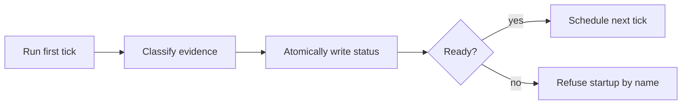

## 1. Overview

The Codex CLI loop now proves that its first tick ran, produced a report, and retained a usable
report transport before it calls itself ready. Each tick atomically records its current outcome,
evidence, transcript, and next due time for a read-only status command.

**Highlights:**

1. Classifies execution, report, transport, and work-blocked outcomes at the supervisor boundary.
2. Refuses false-ready startup while preserving later retries.
3. Exposes durable status without starting Codex or creating a second cadence source.

## 2. Motivation

A live supervisor process and a held lock established only that the shell was running. They did not
show whether the agent completed useful work, whether its report existed, or whether its result
could reach the operator. The first completed tick is now the readiness proof.

## 3. Changes

The supervisor uses one evidence path for startup, steady-state completion, and explicit status
reads while leaving workflow cadence in the existing tick log.

### 3-1. Reproduce and classify Codex loop readiness failures ([0c5dd46](https://github.com/qmu/workaholic/commit/0c5dd467c))

Hermetic fixtures reproduce successful, non-zero, missing-report, absent-transport, and blocked
ticks. A closed classifier derives its verdict only from evidence the supervisor owns.

### 3-2. Gate Codex loop startup on the first tick ([ffb4e72](https://github.com/qmu/workaholic/commit/ffb4e7235))

The first tick must classify as ready before the supervisor announces readiness. Later failures
remain recorded and retryable rather than tearing down an established loop.

### 3-3. Record each Codex tick outcome and next due time ([8cea6d5](https://github.com/qmu/workaholic/commit/8cea6d5bd))

Each completion atomically replaces one current JSON status with timestamps, outcome, reason,
transport verdict, report and transcript paths, and the informational next due time.

### 3-4. Expose Codex loop status to the invoking session ([72f0d22](https://github.com/qmu/workaholic/commit/72f0d2238))

`--status` reads the current result without requiring the Codex executable or starting a process.
Completion summaries name progress or the exact blocked reason on the invoking surface.

## 4. Outcome

CLI operators can distinguish a sleeping healthy loop from execution, report, transport, and work
failures without inspecting processes. The full workflow suite passes 6,573 checks.

## 5. Successful Development Patterns

- Stub the executable at the process boundary to prove both false-ready failures and the final contract without network access.
- Keep current operational state atomic and point into immutable evidence instead of duplicating the cadence oracle.

## Merge Outcome

merge_refused: checks_pending
