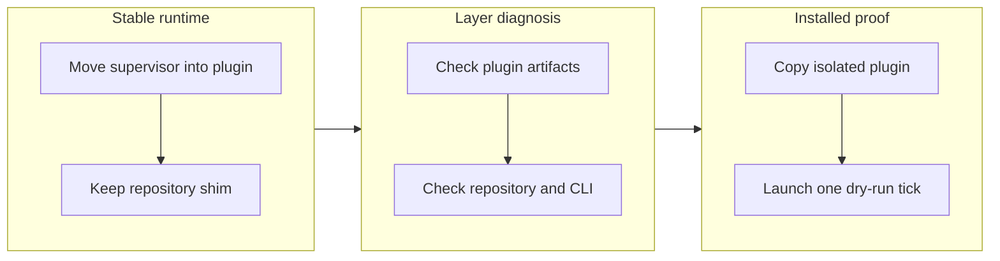

## 1. Overview

The Codex development clock now starts from a launcher shipped inside the full Workaholic plugin, while the repository script remains a thin compatibility path. Layer-specific diagnostics and an isolated integration drill make the installed path both recoverable and continuously provable.

**Highlights:**

1. The maintained supervisor now ships beside the `work` skill and resolves its runtime from its own installed location.
2. Startup failures name the missing plugin skill, tick command, repository, CLI, or compatibility wrapper precisely.
3. `verify-codex-clock` launches one dry-run tick from an isolated plugin installation and proves the packaged launcher is load-bearing.

## 2. Motivation

The Codex instructions advertised a repository-local clock wrapper even though installed users only possess the plugin tree, turning a missing external script into a misleading plugin-reinstallation diagnosis. The branch gives the loop one plugin-owned executable, preserves source-checkout compatibility without duplicating the supervisor, and tests the exact installed topology so packaging drift cannot hide behind a source-tree fallback.

## 3. Changes

The work first established the installed plugin as the runtime owner, then made every boundary report its own absence, and finally recreated the consumer's topology in a hermetic drill. The repository shim remains only as a compatibility delegate, so both launch surfaces exercise the same supervisor while the breaker proves that the published launcher cannot disappear unnoticed.

### 3-1. Package a stable Codex clock launcher ([153f97dc2](https://github.com/qmu/workaholic/commit/153f97dc2))

The maintained supervisor moved beside the published `work` skill, where it resolves the plugin root from itself. The repository entrypoint now delegates to that implementation, preserving existing commands without creating a second editable clock.

### 3-2. Diagnose Codex clock and plugin layers ([cb42e0e79](https://github.com/qmu/workaholic/commit/cb42e0e79))

Launcher preflight now distinguishes absent plugin artifacts, the consuming repository, the Codex CLI, and a missing compatibility target. The documented recovery follows the failed layer instead of blaming an installed plugin for an external wrapper.

### 3-3. Drill the installed Codex start path ([e5c6c9dfb](https://github.com/qmu/workaholic/commit/e5c6c9dfb))

The loop drill installs the full plugin into an isolated location, enters a separate empty Git repository, and launches exactly one dry-run tick through the documented executable. Its breaker removes the packaged launcher and confirms the compatibility shim reports `clock_wrapper_missing`.

## 4. Outcome

An installed Codex user can now run the documented development clock without a Workaholic source checkout. The isolated drill, 6,554 workflow-script assertions, shell syntax checks, and self-contained build verification all pass.

## 6. Successful Development Patterns

- Building the fixture from a copied plugin and a separate consumer repository made source-tree fallback impossible, so the integration result describes the published topology.
- Keeping the old repository command as a delegate preserved compatibility while leaving one implementation to maintain and test.

## 8. Notes

The version was bumped to v1.0.308 and generated workflow output rebuilt. The release scan's sole finding is the existing `override`-tier size of `scripts/e2e/loop-drill.sh`, the repository's cumulative drill register.
