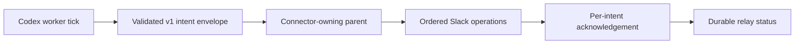

# Relay Codex Slack through its owning chat

## 1. Overview

Codex worker ticks can now return closed, versioned Slack intents to the conversation that owns the connector. The parent validates and acknowledges every operation, while durable loop status distinguishes delivery from pending, malformed, partial, and unavailable relay outcomes.

**Highlights:**

1. Keeps connector credentials in the owning chat instead of copying authority into workers.
2. Makes ordered retries idempotent through stable intent keys and complete acknowledgements.
3. Releases the self-contained implementation as v1.0.310 with full workflow coverage.

## 2. Motivation

Separately launched Codex workers cannot inherit a main conversation's Slack connector. Treating them as connected caused missing feedback replies and a loop that could appear healthy without proving either delivery or progress, so the implementation needed a credential-free boundary whose evidence could not confuse requested work with completed transport.

The preceding readiness work made each tick and next due time durable. This branch extends that evidence boundary to Slack: repository work remains independently truthful, and only the connector-owning parent can establish delivery.

## 3. Changes

The worker describes exact notification work without receiving OAuth material. The parent validates the closed operation set, executes it in order, and returns an acknowledgement covering every stable key; interrupted runs reconcile as pending or incomplete instead of replaying blindly or inventing delivery.

### 3-1. Define the Codex parent relay contract ([a061594ea](https://github.com/qmu/workaholic/commit/a061594ea))

Introduced the `workaholic.codex-slack-relay/v1` envelope, acknowledgement, and reconciliation contract. It permits only the existing exact-search, thread-read, post, reply, and reaction operations and rejects delivery claims inside worker intents.

### 3-2. Execute relayed Slack operations in the owning chat ([46e2fdae9](https://github.com/qmu/workaholic/commit/46e2fdae9))

Specified the parent-side execution order, exact thread resolution, acknowledgement vocabulary, and read-before-replay behavior. Connector access stays with the conversation that already owns it.

### 3-3. Report an unavailable Codex relay without pretending delivery ([dee8a6449](https://github.com/qmu/workaholic/commit/dee8a6449))

Extended durable readiness with envelope and acknowledgement evidence. Pending, malformed, partial, delivered, and parent-absent outcomes now remain visibly distinct from successful Slack delivery.

### 3-4. Return Slack intents from Codex worker ticks ([ae889d9ef](https://github.com/qmu/workaholic/commit/ae889d9ef))

Added explicit relay and acknowledgement modes to the Codex launcher. Relayed ticks return validated structured work, while ordinary detached CLI use continues to report that no Slack transport exists.

## 4. Outcome

The `prove-codex-loop-progress` mission is achieved with all four relay tickets complete. Plugin build, self-contained verification, metadata validation, and the full workflow suite pass with 6592 tests and zero failures.

## 5. Successful Development Patterns

- Separating intent from acknowledgement made delivery claims mechanically auditable across the process boundary.
- Resolving the helper from the launcher's own directory let the build verifier catch and eliminate repository-layout coupling before release.

## 6. Release Preparation

**Verdict**: Ready for release

- **After release:** Run `/work` from a connector-owning scheduled chat; a detached CLI intentionally reports `no_slack_transport` because it cannot own or retain the chat connector.
