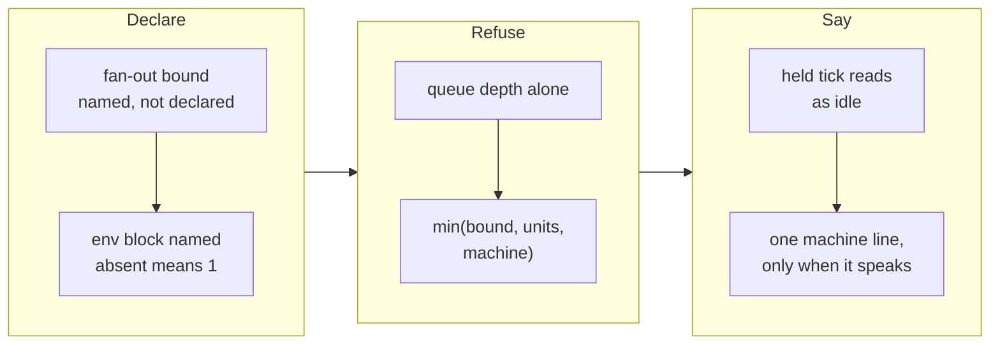

## Handoff

**This branch is complete but unverified here. Someone must verify it before it merges.**

- **Done:** All three tickets are implemented, archived and pushed. `WORKAHOLIC_IMPLEMENT_FANOUT`
  and `WORKAHOLIC_MAX_LOAD_PER_CORE` are documented with their declaration site, their
  absent-means and invalid-means answers, and the machine line's silence rule — in the command
  body, `workaholic:loops` and `CLAUDE.md`, in one change. The mission closed `achieved` on the
  archive gate's own arithmetic.
- **Not done:** `editing .claude/ needs a person: Claude Code classifies it as sensitive and an
  unattended run has no one to answer the prompt`.
- **Next step:** decide whether this machine declares the two bounds, and if so add them to
  `.claude/settings.json`'s `env` block beside `WORKAHOLIC_WIP_LIMIT` — the number is the
  operator's by both tickets' own instruction, and absent means the loop behaves exactly as it
  does today. Then merge.
- **Attempted:** Not attempted — declared unrunnable in an unattended environment at ticket
  creation (`verification_handoff:` derived from the `## Key Files` entry naming `.claude/` on
  `20260903072108-declare-the-fan-out-bound-for-implement-runners.md` and
  `20260903082013-refuse-a-fan-out-the-machine-cannot-carry.md`;
  `run-verification-probe.sh` → `unmeasured`, so the prose declaration stands).

## 1. Overview

The tick could name a fan-out variable and read the machine's load, but nothing said where an
operator declares either number, nothing let the machine refuse a spawn, and a tick held back by
load read as a tick with nothing to do. This branch closes all three across the command ceiling,
`workaholic:loops` and `CLAUDE.md`.

**Highlights:**

1. Both fan-out bounds now name `.claude/settings.json`'s `env` block as their declaration site, with absent-means and invalid-means answers stated in every copy.
2. `WORKAHOLIC_MAX_LOAD_PER_CORE` makes the fan-out `min(declared bound, claimable units, what the machine can carry)`, refusing by name as `load_saturated: <load1>/<cores>`.
3. The tick's §3 report carries one machine line beside the allocation — and only when the machine held the fan-out or could not be read.

## 2. Motivation

A fan-out needs a number, and this repository's rule for a number nobody can defend is to make the
operator declare it. `min(WORKAHOLIC_IMPLEMENT_FANOUT, …)` was written down while nothing said where
the number goes — a name rather than a declaration. Beneath it sat a sharper problem: the allocation
read queue depth alone, and on the evidence that added a third `implement` runner to a four-core
machine at loadavg `7.99` it would have added a fourth and a fifth, each one making every other
runner slower while the loop observed only that units were still landing.

The third piece makes the other two honest: a bound that fires silently is byte-identical to a
healthy idle tick, and a quieter loop must not be indistinguishable from a stopped one.

## 3. Changes

The reader (`read-machine-load.sh`) had landed earlier with no consumer on purpose; these three
tickets give it a bound, a refusal and a voice.

### 3-1. Declare the fan-out bound for implement runners ([5c18d0d](https://github.com/qmu/workaholic/commit/5c18d0dac))

Names `.claude/settings.json`'s `env` block as `WORKAHOLIC_IMPLEMENT_FANOUT`'s declaration site in
all three documents, with **absent means 1** and a non-numeric or non-positive value reported as
`bad_fanout` while holding nothing and falling back to 1. No number is picked for any machine.

### 3-2. Refuse a fan-out the machine cannot carry ([985e6b0](https://github.com/qmu/workaholic/commit/985e6b000))

Adds `WORKAHOLIC_MAX_LOAD_PER_CORE` as the second bound on the same fan-out. Before each spawn
beyond the first, a `load_per_core` over the ratio refuses by name. The reading gates adding and
never stopping, the first runner is never refused, and an unreadable reading or a bad ratio holds
nothing and says so.

### 3-3. Report the machine reading beside the allocation ([0d99b42](https://github.com/qmu/workaholic/commit/0d99b424d))

Adds one §3 report line beside the allocation, written as four refusals: it speaks only when the
machine held the fan-out or could not be read, names a degraded reading by its reason rather than as
headroom, carries no identifier and no mention token, and reaches Slack through nothing.

## 4. Outcome

The mission's last three tickets are archived and it closed `achieved` on the archive gate's
arithmetic. The allocation now has a declared ceiling, a machine floor and a report line that speaks
when either fires — while a repository declaring neither bound behaves exactly as before.

## 5. Concerns

### Both fan-out bounds are documented but declared nowhere

- **Severity:** moderate
- **Description:** until an operator writes `WORKAHOLIC_IMPLEMENT_FANOUT` into `.claude/settings.json` the fan-out stays at one runner and `WORKAHOLIC_MAX_LOAD_PER_CORE`'s refusal can never fire, so the mission's Experience is unrealised here (see [5c18d0d](https://github.com/qmu/workaholic/commit/5c18d0dac) in `plugins/workaholic/commands/infinite-development.md`)
- **How to Fix:** the operator declares both numbers in `.claude/settings.json`'s `env` block beside `WORKAHOLIC_WIP_LIMIT`; the run picked none, because both tickets state the number is theirs.

## 6. Successful Development Patterns

- Splitting a reading from the bound that consumes it across two tickets let `read-machine-load.sh` land with no consumer and be wrong about nothing — its own header records why, so the gap reads as design rather than an oversight.
- Writing each bound as *absent means the behaviour that existed before* keeps every one of these declarations a no-op for a repository that ignores it, which is what makes shipping them cheap.

## 7. Notes

The three tickets are one change across three files, so the first archive commit carries the whole
edit and the later two only their Final Reports; the per-ticket record is in
`.workaholic/tickets/archive/work-20260906-002101/`.

## Unposted Line

shape: 🟡 Handoff
reason: post_refused: channel_not_found — dev-workaholic is invisible to the connector account and SLACK_BOT_TOKEN is unset
text: 🟡 Handoff [#988 Declare the tick's fan-out bounds and refuse a fan-out the machine cannot carry](https://github.com/qmu/workaholic/pull/988) — The next run resumes it automatically; `git fetch && git checkout work-20260906-002101` to take it sooner. 残るのは `.claude/settings.json` の env に2つの上限値を宣言するかどうかの判断だけです。 (メンション先未解決: 誰にも通知していません) https://claude.ai/code/session_01Q4ozi1vyhx3yR9KsrjP9oa
