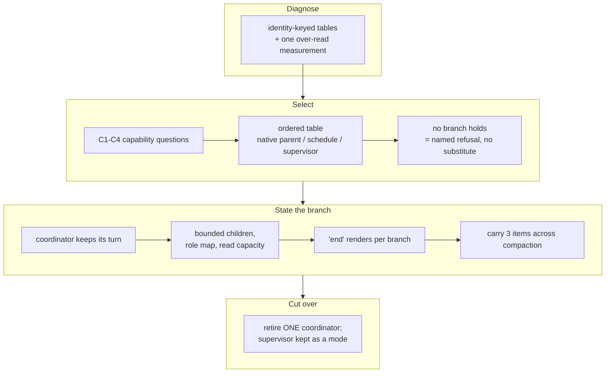

## Handoff

**This branch is complete but unverified here. Someone must verify it before it merges.**

- **Done:** All six implementable tickets of `report-each-tick-in-the-originating-codex-chat` are
  archived and pushed. The mode selection is capability-keyed, the native-parent branch and its
  worker contract are stated, *end* renders per branch, the compaction carry and the cutover
  procedure are written, and `CLAUDE.md`, `work/SKILL.md`, `work/reference/other-agents.md` and
  `commands/infinite-development.md` agree. Build, verify, metadata validation and the 6621-row
  hermetic suite are green.
- **Not done:** "The ask requires a live run in the operator's own originating Codex chat: start
  work there, keep a delegated task running past ten minutes, and record at least two successive
  five-minute status reports arriving unprompted, then the completion report. An unattended run
  has no access to that chat, that account or that app, and the ask names shell stubs, passing
  tests, status.json, worker transcripts and Slack delivery as insufficient."
- **Next step:** Run the loop in that Codex chat and record the evidence
  `20260906022907-prove-the-behaviour-in-the-operator-s-own-codex-chat.md` asks for — the startup
  report, two timestamped status reports with no operator input between them, the completion
  report, a mid-wait question answered without cancelling the loop, and a still-running role
  refused a second dispatch — then write it into `other-agents.md` as a dated measurement and
  merge.
- **Attempted:** Not attempted — declared unrunnable in an unattended environment at ticket
  creation (`verification_handoff:` on
  `.workaholic/tickets/todo/20260906022907-prove-the-behaviour-in-the-operator-s-own-codex-chat.md`).

## 1. Overview

The loop chose how it runs from the agent's name and version rather than from what the running
session could do, so a session holding every mechanism the interactive branch needs still selected
the external CLI supervisor and told the operator that the chat it had been started in would
receive nothing. This branch makes the selection capability-keyed and writes down the branch that
was unreachable because nothing described it.

**Highlights:**

1. Four capability questions and an ordered table replace two identity-keyed tables; no branch is
   selected by a product name or a version string.
2. The native-parent branch is stated against the three existing clock terms, composing them —
   anchor derived once, reports as commentary, interruptible waits capped at 60 seconds.
3. Each branch names what it does **not** promise, and the supervisor's row says on its face that
   its output does not reach the invoking conversation.

## 2. Motivation

The operator asked three times for one behaviour: the loop's coordination lives in the chat it was
started in. PR #987 answered issues #984 and #985 by repairing the timer and detaching the
workers, verified against a stub, and left the **return path** untouched — `codex exec` has no
parent to call back into. Asked to start work, the next session launched the CLI supervisor, ended
its turn, and said this chat would get nothing. The mode had been chosen by agent name, not by
capability.

The premise underneath was a single reading: `other-agents.md` said Codex's parent collects its
subagents, measured once against `codex-cli 0.149.1`, and the tree then read it as a fact about
every non-Claude agent. That reading was correct about that surface and wrong as a rule, and it is
the reason a session with an interruptible wait, spawnable children and four concurrent slots fell
through to the last row of the table.

## 3. Changes

The branch moves from a diagnosis to a rule to a written mode: what decided the mode, what should
decide it, what the winning branch actually does, and how to switch to it without leaving two
coordinators running. Each ticket's gate was verified before the next began, and the external
supervisor's own script was deliberately left byte-identical throughout — the mission changes what
selects a mode and what the modes promise, not how any of them is implemented.

### 3-1. Select the loop mode from capabilities ([e723bd2c7](https://github.com/qmu/workaholic/commit/e723bd2c7))

Named every place the mode was decided before touching any of them, then replaced the two
identity-keyed tables with four capability questions and an ordered table whose branches each
state a non-promise. A session whose terms no branch matches now names the missing mechanism at
startup and selects no substitute.

### 3-2. Run the tick as a native parent ([74407c084](https://github.com/qmu/workaholic/commit/74407c084))

Stated the coordinator that holds its own turn, composing the three existing clock terms rather
than restating them: the anchor is derived once, the first tick is short, every report is
commentary, waits are interruptible and capped at 60 seconds, an early wake is not a boundary, and
a boundary runs whether or not a worker finished.

### 3-3. Delegate each due role as a bounded child ([0386ae17d](https://github.com/qmu/workaholic/commit/0386ae17d))

Gave the branch its worker contract: a role-to-child map that refuses a second dispatch by name, a
child that runs once and never loops, a concurrency bound read rather than assumed, and the
unchanged `loop-finish-<role>` cadence. Both worker branches answer the same two questions and
neither is a second clock.

### 3-4. Reserve the final response for a stop ([26b1d3113](https://github.com/qmu/workaholic/commit/26b1d3113))

Made *end* render per branch instead of once for every non-Claude session. Under the native-parent
branch it returns control to the coordinator; a final response is reserved for an explicit stop
that names what remains running, and for a named inability to continue.

### 3-5. Carry the loop state across compaction ([8427488a5](https://github.com/qmu/workaholic/commit/8427488a5))

Closed the carried state at three items — the anchor, the running child identifiers, the reported
outcomes — with no new file, field or store. Rediscovery through the harness's own listing precedes
any dispatch, and a child it cannot find is reported unresolved rather than assumed finished.

### 3-6. Retire only the supervisor being replaced ([a23fcf290](https://github.com/qmu/workaholic/commit/a23fcf290))

Wrote the cutover: identify one coordinator through the supervisor's own `--status` reading,
account for its workers, retire that one. The supervisor is kept as an explicitly different mode
for an environment with no conversation at all, and no continuation is promised without a tested
mechanism.

## 4. Outcome

The loop now reads its mode off the session rather than off a product name, and the branch that
puts a tick's report where the operator started it exists in writing for the first time. What it
does **not** yet have is a run: the mission's seventh ticket declares `verification_handoff:` and
this pull request stays open until somebody executes it in their own chat.

## 5. Concerns

### work/SKILL.md is now twice the documented skill size

- **Severity:** moderate
- **Description:** `plugins/workaholic/skills/work/SKILL.md` grew from 148 to 312 lines against
  `CLAUDE.md`'s stated ~50-150-line skill budget with overflow to `reference/` (see
  [a23fcf290](https://github.com/qmu/workaholic/commit/a23fcf290) in
  `plugins/workaholic/skills/work/SKILL.md`). Four of the six tickets name that file as the home
  for their branch statement and their acceptance criteria read it there, so the detail could not
  be moved out without failing them.
- **How to Fix:** Once the acceptance run lands, move the per-branch operational detail (the
  worker contract, the compaction carry, the cutover steps) into `reference/other-agents.md` and
  leave the SKILL holding the selection table and one paragraph per branch.

### A hermetic suite run failed once and did not reproduce

- **Severity:** moderate
- **Description:** One run of `node scripts/test-workflow-scripts.mjs` reported
  `6620 passed, 1 failed`; an immediate re-run over the identical tree reported
  `6621 passed, 0 failed`, as did every run after it. The failing row's name was lost to the pipe
  that captured only the tail, so it is not known which assertion flaked.
- **How to Fix:** Capture the suite's full output to a file in CI rather than tailing it, so the
  next occurrence names the row; then decide whether the row has a timing dependency or a shared
  temp path that a concurrent run can collide with.

## 6. Successful Development Patterns

- Recording the diagnosis into the ticket's Final Report *before* editing the rule it was about
  kept the walk honest — the fifth decider was found only because nothing had been changed yet.
- Extending an existing never-both sentence in place, rather than writing a second one for the new
  pair, kept one rule where a reader already looks for it.

## 7. Release Preparation

**Verdict**: Ready for release

- **Concern:** The branch-safety scan reports one `override`-tier `size` finding —
  `scripts/e2e/loop-drill.sh` at 685,390 bytes against a 524,288-byte ceiling. The file is
  pre-existing and untouched by this branch.
- **Before release:** Nothing. `secret` and `leak` are both zero and the gate reads
  `override_only`.
- **After release:** The pull request is held open by the declared verification, not by the scan.

## 8. Notes

`codex-loop.sh` is byte-identical on this branch, by its ticket's own gate. Doc-drift reports no
candidates and area-freshness no retired terms; the 109 open deferred concerns were listed with
`should_triage: false` and none was judged, which leaves every one `still_active`.
