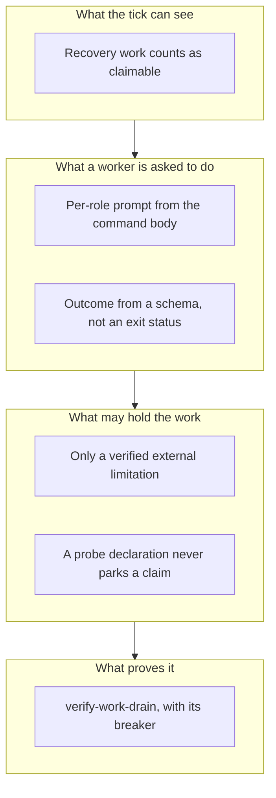

## 1. Overview

The loop could finish a backlog and still hand it back: recovery-only work read as idle, a worker
that never executed recorded a healthy finish, and a declaration nobody could falsify parked the work
behind it. Every handover is now classified as *a verified external limitation* or *an engineering
judgement the loop declined to make*, and only the second class moved.

**Highlights:**

1. Recovery work — an undelivered unit, a catchable claim, a stranded publication — is claimable work, so a pass is dispatched instead of the tick reading idle.
2. A worker's outcome comes from a schema-constrained final message, never from its exit status or from prose grepped out of a report.
3. A `probe:` handoff declaration no longer parks a claim `awaiting_verification`; prose is unchanged, being the one form nothing can falsify.

## 2. Motivation

The operator's instruction was blunt — *routine engineering work must never be handed back to a
person* — and the measurements behind it were worse than the instruction implied. On a consuming
repository four pull requests sat parked, and three of the declarations holding them were **false**
when somebody finally probed them. On this repository a finished, green unit was routed to
`handoff` on a derived declaration naming `.claude/`, while its own changed-file list contained
zero files under that path. The common shape is an unfalsifiable premise: a sentence written once cannot go stale visibly, an
exit status cannot say whether the role ran, and a counter that ignores recovery work cannot tell a
drained repository from a stuck one.

## 3. Changes

The branch moves outward from what the tick can see to what may stop it. First the dispatcher
learns that recovery states are work; then each dispatched worker is given its own role and a
result shape that cannot lie about having run; then the states that hand over are classified and
only the judgement class moves; and finally a hermetic drill pins the behaviour, with a breaker
written against it so the drill can actually fail.

### 3-1. Count recovery and delivery work as claimable ([10c3175f1](https://github.com/qmu/workaholic/commit/10c3175f1))

Teaches `claimable-units.sh` that an undelivered unit, a catchable claim or a stranded
publication is work a pass would act on. Without the recovery term a repository with five parked
pull requests and nothing queued reported itself idle.

### 3-2. Give a dispatched Codex worker the whole role it is named for ([2c030a264](https://github.com/qmu/workaholic/commit/2c030a264))

Replaces one prompt for every role with `role_clause()`, derived from the command body each role
names. `propose` had been told to run `commands/propose.md` alone — never the propose-then-specificate
sequence — so a dispatched proposal was ingested by nothing.

### 3-3. Record a worker's finish from its own reported outcome ([119587a84](https://github.com/qmu/workaholic/commit/119587a84))

Splits *the process terminated* from *the role executed*. A schema-constrained final message
(`worker-result.schema.json`) now supplies the outcome, `loop-attempt-<role>` records every run
and `loop-finish-<role>` only an executed one, so a worker that did nothing leaves its role due.

### 3-4. Work a recoverable state instead of handing it over ([8ac323b2f](https://github.com/qmu/workaholic/commit/8ac323b2f))

Enumerates every state the loop hands to a person with `file:line` and classifies each. A
`content_conflict` becomes the run's own work at the agent level on four stated bounds; a
`secret`, a `leak`, an operator-facing publication and a colleague's claim are unchanged.

### 3-5. Deliver the progress and completion report, and prove it ([cb5c4283e](https://github.com/qmu/workaholic/commit/cb5c4283e))

Names the report destination per entrypoint rather than assuming one. `--status` now prints
`chat_return=none` where no path exists and `last_outcome=<word>` per role — an absent delivery
path named, never substituted for one that delivers somewhere else.

### 3-6. Drain a seeded backlog in one work run end to end ([3b112cb5b](https://github.com/qmu/workaholic/commit/3b112cb5b))

Adds the `verify-work-drain` drill and stops a `probe:` declaration parking a claim. The
reproduction is the branch's own: `declared-handoff-detail.sh` answered `handoff: true` on
`probe: command -v codex` while the probe answered `clean` against an installed CLI.

## 4. Outcome

Six tickets archived, the mission at 3/3 acceptance. `verify-work-drain` passes with 10 load-bearing
rows and a breaker; the suite reports 6663 passed, 0 failed, and the drill set 49 drills, 0 failed.

## 6. Successful Development Patterns

- The branch's own interruption was its best evidence: a dead run's claim was resumed by the next tick with no duplicate worker and no lost work, which is exactly what ticket 3-6 had to demonstrate.
- Each ticket reproduced its defect before changing anything, so every Final Report cites a measurement rather than an intention.

## 8. Notes

`archive.sh`'s close gate still reads `verification_handoff:` presence, so it held this mission open
for a probe already answered `clean` — the same conflation, one layer up. Queued as
`20260906105853-read-the-probe-before-holding-a-mission-open-for-a-person.md`, not fixed here.
