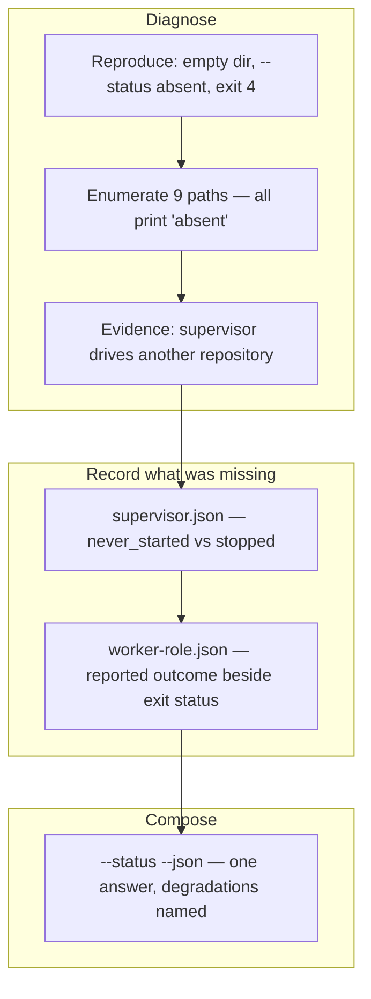

## 1. Overview

`.codex-loop/` was empty while a supervisor was believed to be turning, and `--status` printed
`absent` for nine different situations. This branch diagnosed which one had happened, then made
the supervisor, every worker and the last tick readable from the directory alone.

**Highlights:**

1. Localized to a `--dispatch` path creating the directory before knowing it could run; the live supervisor was driving another repository.
2. `supervisor.json` and `worker-<role>.json` give six distinct readings each, over a shared liveness rule that never claims what a pid cannot prove.
3. `--status --json` answers all three in one invocation — no CLI, no lock, no side effects — naming each unreadable part.

## 2. Motivation

The operator, unreachable on a flight, reported that Codex support should be carried to
completion as an external process and proved from state a person can look at rather than from a
chat. The measurement behind the ask was stark: `.codex-loop/` existed, was created at 09:31:48
and was empty, with `mtime == Birth` — nothing had ever been written into it — while the loop was
believed to be running. That directory has one writer, so *never started*, *started and died* and
*another agent is driving this* were one reading.

The ask was a failure report, so the first ticket diagnosed before anything was designed
(*Diagnosis-First Rule*), and the repairs followed what it found.

## 3. Changes

Nine code paths produced one word, and here the empty directory was *correct* — the Codex loop
was never driving this repository. The defect was that it could not say so.

### 3-1. Localize the empty Codex state directory ([b89d62f4c](https://github.com/qmu/workaholic/commit/b89d62f4c))

Reproduced the reported state verbatim and enumerated, from the script, every path leaving
`status.json` absent — nine of them, all printing `codex loop status: absent` and exiting 4. Ruled
out all but two by `mtime == Birth`, and established from `/proc` that the running supervisor
(pid 559347, started 06:40:08) has its cwd in a different repository and holds that repository's
lock. Implemented no repair.

### 3-2. Record the Codex supervisor's own liveness ([4d1929f4e](https://github.com/qmu/workaholic/commit/4d1929f4e))

Added `.codex-loop/supervisor.json`, written after the lock is taken and before the first tick,
and closed at every exit the script controls. The interrupt write is placed *before* the tick
guard, which is what makes an interrupt taken outside a tick visible at all. Staleness is answered
without a live probe: a gone pid reads `stopped_unclean`, a live pid under a changed boot id reads
`stopped_unclean:reboot`, and a live pid with no boot id readable reads
`unreadable:boot_unverifiable` rather than `running`.

### 3-3. Record each Codex worker's state as data ([0c051a030](https://github.com/qmu/workaholic/commit/0c051a030))

Added `.codex-loop/worker-<role>.json` carrying the reported outcome **beside** the process exit
status, so a run that exited zero without executing is not a clean finish, over one
`liveness_reading` shared with the supervisor record. Also closed the diagnosis's last two rows:
the `mkdir` above the `codex` presence check is gone, so a dry-run or CLI-less dispatch leaves
nothing behind.

### 3-4. Answer the whole Codex status from the directory ([b74759a79](https://github.com/qmu/workaholic/commit/b74759a79))

Added `--status --json`, composing the supervisor record, the per-role records and `status.json`
into one reading, with `tick_reading` factored out of `show_status` so the human and machine
surfaces cannot disagree. Every unreadable part carries its reason and null details, no part is
omitted, and the surface still needs no `codex` CLI and takes no lock.

## 4. Outcome

The mission's three acceptance items are met and it closed `achieved` on the archive gate's
arithmetic. One question of `.codex-loop/` now answers whether a supervisor ever started, whether
it is alive, what each worker last reported and when the next tick is due.

## 5. Concerns

### The running supervisor executes a deleted script

- **Severity:** moderate
- **Description:** The live supervisor's fd 10 resolves to `~/.codex/plugins/cache/workaholic/plugin-backup-UYC3Gd/workaholic/1.0.316/.../codex-loop.sh (deleted)` while the cache now holds only `1.0.319` — a plugin update replaced the tree under a process running since 06:40:08, which therefore keeps its original version indefinitely and invisibly (see [b89d62f4c](https://github.com/qmu/workaholic/commit/b89d62f4c) in `plugins/workaholic/skills/work/scripts/codex-loop.sh`)
- **How to Fix:** Record the launcher's resolved path and version in the supervisor record, and have `--status` name a supervisor whose script no longer exists at that path.

### A dry-run supervisor still takes and leaves the lock

- **Severity:** low
- **Description:** `--dry-run --once` acquires the supervisor lock and leaves `.supervisor.lock` behind despite `--dry-run` being documented as printing the command without executing it; the supervisor record now disambiguates the residue but does not remove it (see [4d1929f4e](https://github.com/qmu/workaholic/commit/4d1929f4e) in `plugins/workaholic/skills/work/scripts/codex-loop.sh`)
- **How to Fix:** Take the lock after the dry-run branch returns, or release and remove it on that path.

### The state records accumulate unpruned

- **Severity:** low
- **Description:** `worker-<role>.json` is rewritten in place, but the tick reports and transcripts beside it already accumulate in the git-ignored directory and nothing prunes any of it (see [0c051a030](https://github.com/qmu/workaholic/commit/0c051a030) in `plugins/workaholic/skills/work/scripts/codex-loop.sh`)
- **How to Fix:** Decide an explicit retention rule for `.codex-loop/` — named for the mission's reviewer rather than chosen here.

## 6. Successful Development Patterns

- Pid-first, boot-id-only-for-a-live-pid keeps the liveness reading sound where no boot id exists, degrading only the ambiguous case rather than every case.
- `show_status` already held a three-valued reading spelled as control flow; naming it made the machine surface a composition, not a second parse.
- The diagnosis paid for itself: only the measurement showed *which* paths produce the empty directory, and two were repairs nobody had proposed.

## 7. Notes

The diagnosis probe created a `.supervisor.lock` in the operator's own `.codex-loop/`; it was
verified unheld and removed, restoring the measured state.
