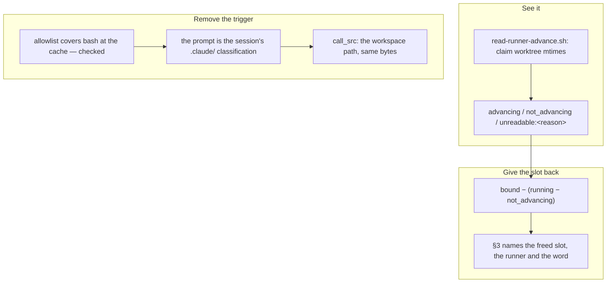

## 1. Overview

`ListAgents` reports `running` both for a subagent executing a tool and for one blocked forever on
a permission dialog nobody will answer. Measured 2026-09-06: `implement-10` frozen 38m29s, nine
consecutive calls reporting it healthy, holding a fan-out slot the whole time. This branch makes
the loop see the difference, gives the slot back, and removes the trigger that raised the dialog.

**Highlights:**

1. A reader answers per running runner whether it is still advancing, off the claim worktree's own mtimes — offline, local, and refusing by name (`ambiguous_binding`, `no_claim_evidence`) rather than guessing.
2. A `not_advancing` runner is subtracted from `running` in the fan-out expression and nowhere else, so the slot comes back and the claim protocol's own `resume` picks the unit up.
3. `plugin-src.sh` answers `call_src` beside `src`: composed calls spell the workspace path, while `src` keeps answering which code runs on its untouched two axes.

## 2. Motivation

The operator reported (#1036) that a frozen subagent reports `running` forever and holds a fan-out
slot. With `WORKAHOLIC_IMPLEMENT_FANOUT` at 3 and one frozen runner, the loop was a 2-runner loop
for 38 minutes and no tick report said so — the reaping stops only `idle`, so a frozen runner is
never stopped, never records `loop-finish-<name>`, and is counted as healthy capacity forever.

**This branch was itself resumed after its own runner froze**, which is as direct a reproduction as
the mission could have asked for. The runner driving the second ticket stopped mid-edit with 163
uncommitted insertions in its worktree; the coordinator committed them as `852037933` rather than
lose them, recording in that commit's own `Concerns` that the work was unjudged and the ticket not
archived. The resuming run re-read the ticket against that diff rather than trusting a green suite,
and found step 6's second half missing — a drill nobody had written, so nothing was red about it.

## 3. Changes

- **`read-runner-advance.sh`** (previous ticket) reads the one signal that is not flat during a
  legitimately long ticket. Localization was measured, not assumed: a mid-ticket claim worktree
  read **101 seconds** old against **15-18 hours** for stopped runs, while the claim tip, the
  heartbeat and `loop-finish-<name>` are flat in both states and were ruled out on that evidence.
- **The fan-out subtracts `not_advancing`**, in that expression and nowhere else. The concurrency
  rule's other half is byte-identical — an advancing `running` loop is still not spawned again —
  nothing is stopped or killed on the reading, and `unreadable:<reason>` frees nothing.
- **`runner_advance_frees_the_slot`** drills what the allocation *does* with the answer rather
  than what the reader says: a wholly frozen fixture gives back both slots where `bound − running`
  gave back none, and every unreadable form gives back none.
- **`call_src`** is `plugin-src.sh`'s new answer to *which path a composed call spells* — the
  checkout whenever a checkout holds the same version as the resolved `src`, and `src` otherwise.
  One wording carries it across the four routine-fired ceilings, `rules/general.md`, `rules/shell.md`
  and the three routine prompts.

## 4. Outcome

The mission's three acceptance items are met. A frozen runner is now visible, costs no fan-out
slot, and is named in the tick's own report; and the loop no longer composes the plugin-cache path
that froze this branch's own runner.

**The mission did not close on the archive gate**, and correctly so: `acceptance-handoffs.sh` reads
a **derived** `verification_handoff` on the third ticket, whose `## Key Files` cite
`.claude/settings.json`. The unit's own route reading verified the limitation is absent here — the
diff contains **zero** files under `.claude/`, the citation is read-only, and that ticket's own Gate
forbids adding an allow entry — so the unit took its ordinary route. Closing the mission is left to
`/moderate`'s `closable-missions` step, which re-proves the arithmetic; nothing here forced it.

## 5. Concerns

### The Codex dispatch-lock drill races its own worker

- **Severity:** moderate
- **Description:** `test-workflow-scripts.mjs` asserts a second `codex-loop.sh --dispatch implement` is refused `already_running`; under load the second call started a worker instead. Observed twice on 2026-09-06 — once at loadavg 8.04 before any edit in this branch's session, once with other runners live — and the same suite passed cleanly twice on the same tree between them. `--dispatch` returns at once by design, so the first call can return before its detached worker reaches the `flock`. It fires on a merge gate, which is what makes it worth more than a flaky row.
- **How to Fix:** Minted as ticket `20260906210556-stop-the-dispatch-lock-drill-from-racing-its-own-worker.md`, which requires establishing whether the window is in the parent or the test before changing either, and forbids a sleep or retry standing in for the exclusion.

### `loop-drill.sh` is past the per-file size ceiling

- **Severity:** low
- **Description:** The branch scan reports one `size`/`override` finding: `scripts/e2e/loop-drill.sh` at 716,570 bytes against a 524,288 ceiling. Pre-existing and not caused here — this branch added ~37 lines to it — and `override_only` by the tier policy, so the branch stays releasable.
- **How to Fix:** A split of the drill file is the operator's call; the ceiling is a granularity nudge, not a defect in this work.

### One commit on this branch was written by a runner and committed by another agent

- **Severity:** low
- **Description:** `852037933` carries the second ticket's implementation but was committed by the coordinator after its author froze, so it was never self-verified and its `Co-Authored-By` names a different session than the work. It has since been read against the ticket, verified and completed, but the authorship record stays as it is.
- **How to Fix:** Nothing to repair in the tree; noted so the commit's provenance is not mistaken for an ordinary one.

## 6. Successful Development Patterns

- **Re-read the ticket against the diff, not the suite.** The inherited change was coherent and green, and was still missing half a step — a drill that did not exist could not be red. A resumption that trusts the test result inherits exactly the gaps the tests do not cover.
- **A permission rule is a lower bound on what is permitted, never an upper bound on what will be asked.** The previous repair reasoned from `Bash(bash:*)` covering the cache path to the call being safe; the entry is real and the inference was wrong, because the classification that raised the prompt sits above the allowlist.
- **Split the two questions rather than collapsing them.** *Which code runs* must stay on the newest-tree axis or this repository cannot develop its own plugin; *which path a call spells* is free to prefer the workspace when the bytes are identical. `call_src` beside `src` keeps both, and cannot point at an older tree.
- **The diagnosis was taken from evidence rather than re-staged**, twice — driving a session into the permission dialog is the failure the mission exists to end, and what the ticket asked could be established by reading the allowlist instead.

## 7. Notes

The resumption did not go through `claim.sh resume`: the adoption gate compares the existing
worktree's HEAD against the tip the resumability decision observed, and the coordinator's unpushed
commit put the worktree one commit ahead, so it refused `worktree_creation_failed` — correctly,
failing loudly rather than driving a tree it had not judged. The claim was this identity's own, on
its own machine, and was secured by beating its heartbeat before any work began.
