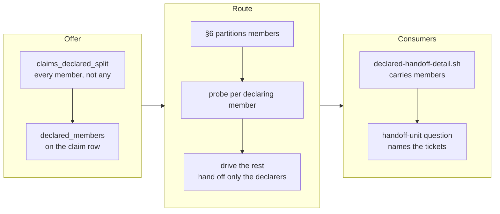

## 1. Overview

A `verification_handoff:` declaration used to carry the whole unit, so one honest declaration
parked every ticket behind it. It now holds only the members that carry it: a partly-declared
claim is offered, the route drives the members that declare nothing, and every consumer names
them.

**Highlights:**

1. `awaiting_verification` reads *every* remaining member rather than *any* one of them.
2. The route partitions from the one reader's own `members[]` and probes per declaring member.
3. The claim row carries `declared_members`, so no consumer re-derives the partition.

## 2. Motivation

Measured 2026-09-06 on `report-each-tick-in-the-originating-codex-chat`: seven queued tickets,
**one** declaring a prose handoff only the operator's own Codex chat can discharge, six declaring
nothing. The claim read `awaiting_verification`, `plan-units.sh` excluded the unit whole, and the
repository drove nothing for hours — the route step that would have driven the six was never
entered, because the unit reached no offer at all.

*Any member declaring it carries the whole unit* is right about the **merge** — a unit is one pull
request — and wrong about the **work**. The axis exists to stop an unattended run merging what it
cannot verify, never to stop it writing code; this branch separates the two.

## 3. Changes

The change runs in the order the offer reaches the work: the claim scan had to stop parking a
mixed unit before any route could see one, the route then had to split driving from handing off,
and only then did the consumers that spoke about *the unit* have a partial form to read. Each step
is useless before the one above it lands, which is why the tickets were ordered rather than
grouped.

### 3-1. Offer a claim whose members only partly declare ([02c432a8e](https://github.com/qmu/workaholic/commit/02c432a8e))

`claims_declared_split` derives the partition from the one reader's per-member `unmeasured`, and
`awaiting_verification` is now reached only when every remaining queued member holds — or when the
mission's own `mission.md` does, which is unchanged. The row carries `declared_members` beside the
boolean.

### 3-2. Drive the non-declaring members and hand off the rest ([e9a9d329b](https://github.com/qmu/workaholic/commit/e9a9d329b))

§6 partitions the unit from `members[]`, runs the probe per declaring member because the unit-level
call answers for the first one only, drives the non-declaring members and leaves each declaring one
stamped and queued. The empty and all-declaring cases are byte-identical to what they were.

### 3-3. Read the partial handoff at every consumer ([a0acbf30c](https://github.com/qmu/workaholic/commit/a0acbf30c))

`declared-handoff-detail.sh` carries the declaring members, the `handoff-unit:` question names the
tickets a person must act on rather than the claim, and the consumer enumeration in `claims.md` is
checked against the tree in both directions.

## 4. Outcome

A partly-declared unit is offered, its drivable members driven, and only the members that need a
person handed off — claim standing, pull request open, token `pending`, all unchanged. An
all-declaring unit and a `probe:` declaration behave exactly as before.

## 5. Concerns

### A partly-declared unit is re-offered every tick

- **Severity:** low
- **Description:** Where a unit was parked once, it is now offered on every tick until its
  non-declaring members are driven (see [02c432a8e](https://github.com/qmu/workaholic/commit/02c432a8e) in `plugins/workaholic/skills/drive/scripts/plan-units.sh`)
- **How to Fix:** Nothing — intended, and bounded by the claim protocol, which refuses what is
  already taken. Recorded so a later reader does not read it as a defect.

### The claim row's positional TSV shifts four readers at once

- **Severity:** moderate
- **Description:** Adding one column broke four fixed-index readers in three shapes, one of which
  (`claim-arbitrate.sh`) no test covered at all (see [a0acbf30c](https://github.com/qmu/workaholic/commit/a0acbf30c) in `plugins/workaholic/skills/drive/scripts/claim-arbitrate.sh`)
- **How to Fix:** Guarded — the suite derives the row's width from the writer's own `printf` and
  checks every fixed-index reader against it. A named-field row format would remove the hazard.

## 6. Successful Development Patterns

- Reading the consumer enumeration out of `claims.md` rather than grepping showed two of the three
  named consumers already read the partial form — pinning that beat manufacturing a change.
- Proving each guard able to fail caught a row-width assertion that matched nothing and passed
  vacuously.

## 7. Notes

The mission closed `achieved` on the archive gate's arithmetic (3/3, queue empty).
`commands/drive.md` deliberately carries no inlined rule — that contract is for the four
routine-fired ceilings, and `/drive` is attended.
