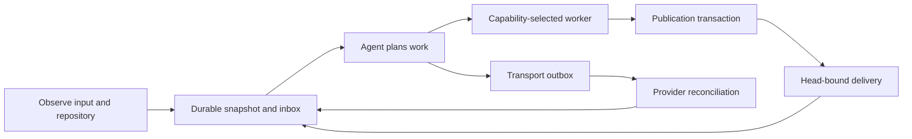

## 1. Overview

This branch completes P3 through P9 of the agentic loop redesign as one integrated v1.0.334 change. It gives transport, worker dispatch, publication, polling, delivery, and reports durable typed boundaries while leaving semantic planning and prioritization with the agent.

**Highlights:**

1. External effects persist intent and reconcile provider evidence before retrying.
2. QFS deltas now reach the production loop through durable inbox capture and cursors.
3. Source, generated workflows, legacy projections, docs, and 77 focused tests move together.

## 2. Motivation

The former loop repeatedly rediscovered the same state and relied on process-local assumptions around sending, dispatch, publication, and merge recovery. The redesign establishes a small mechanical substrate for atomic ownership, idempotency, and evidence matching, so an interrupted agent can resume without duplicating effects or losing input while retaining freedom over decomposition and judgment.

## 3. Changes

The loop now moves observed facts through one typed path, records each external intent before execution, and resumes from durable evidence after interruption. Scripts own finite transitions and exclusion; the agent still chooses hypotheses, ticket structure, and the next meaningful action.

### 3-1. Unify loop transports and durable outbox ([39336ca77](https://github.com/qmu/workaholic/commit/39336ca77))

Introduced capability-resolved QFS, connector, and token routes with stable request IDs and durable outbox states. Ambiguous sends remain unknown until provider evidence confirms or refuses the same effect.

### 3-2. Make publication and claim recovery safe ([39336ca77](https://github.com/qmu/workaholic/commit/39336ca77))

Made publication and claim arbitration resume the same branch, SHA, and ownership receipt across push and lookup failures. Cleanup now preserves worktrees that still belong to an open publication.

### 3-3. Connect runtime capabilities and adapters ([39336ca77](https://github.com/qmu/workaholic/commit/39336ca77))

Added typed capability selection and native, Codex, and Claude adapters without changing the requested model or permission settings. Dispatch reserves a receipt under portable exclusion before starting a worker.

### 3-4. Normalize inputs and continue strategy learning ([39336ca77](https://github.com/qmu/workaholic/commit/39336ca77))

Separated the original author and authorization from the transport actor, paged inbound work, and retained strategy lineage and learning evidence. Single-ticket hypotheses are allowed while mission creation keeps its multi-ticket floor.

### 3-5. Share discovery across manual entrypoints ([39336ca77](https://github.com/qmu/workaholic/commit/39336ca77))

Passed one normalized discovery packet and answered decisions through ticket, mission, and drive entrypoints. Manual planning no longer assumes a fixed worker count or repeats resolved merge-policy questions.

### 3-6. Resume delivery and preserve report sections ([39336ca77](https://github.com/qmu/workaholic/commit/39336ca77))

Bound checks and merge requests to the reviewed head SHA, persisted uncertain delivery, and reconciled it before cleanup. Story and notification writers replace only their owned sections and preserve neighbouring content.

### 3-7. Reuse observations and bound polling cost ([39336ca77](https://github.com/qmu/workaholic/commit/39336ca77))

Reused proved local and remote observations across idle boundaries while keeping independent exploration and maintenance deadlines. Production QFS polling now captures every message before advancing its provider cursor.

### 3-8. Finish loop contracts and portable migration ([39336ca77](https://github.com/qmu/workaholic/commit/39336ca77))

Aligned current instructions, hooks, generated workflow closures, legacy projections, migration guidance, and distribution metadata with the new runtime. Behavioral tests replace obsolete prose and implementation-shape assertions.

## 4. Outcome

P3 through P9 are implemented and archived in one review unit for v1.0.334. The focused agentic-loop suite passes 77/77, including restart recovery, no-flock exclusion, provider delta capture, uncertain-effect reconciliation, and isolated generated consumers.

## 5. Concerns

### Live transport and incremental-read evidence

- **Severity:** moderate
- **Description:** Real QFS workspace and sender resolution, Slack send/readback, and provider-side incremental pushdown remain unverified (see [39336ca77](https://github.com/qmu/workaholic/commit/39336ca77) in `docs/agentic-loop-migration.md`)
- **How to Fix:** Run the target-specific QFS and Slack drill, compare provider request volume, and retain returned workspace, channel, timestamp, thread, and sender evidence.

### Native lifecycle and downgrade evidence

- **Severity:** moderate
- **Description:** Native UI interruption, two foreground automatic reports, and downgrade recovery from interrupted external effects have hermetic contract evidence only (see [39336ca77](https://github.com/qmu/workaholic/commit/39336ca77) in `docs/agentic-loop-migration.md`)
- **How to Fix:** Exercise both native hosts through interruption, restart, and downgrade, retaining receipts that prove no duplicate dispatch, send, merge, or lost input.

### Integrated release exceeds scan size guidance

- **Severity:** moderate
- **Description:** The branch changes 404 files, includes the existing 736536-byte loop drill, and contains two implementation commits above the 500-line guidance (see [aa0e228dc](https://github.com/qmu/workaholic/commit/aa0e228dc) and [4cdef2c18](https://github.com/qmu/workaholic/commit/4cdef2c18))
- **How to Fix:** Review and accept the override for this intentionally integrated P3-P9 release; future independent changes should return to smaller commit units.

## 6. Successful Development Patterns

- Persisting an effect intent before the call made ambiguous retries reconcilable instead of duplicative.
- Binding scan, checks, merge request, and cleanup to one pushed SHA made delivery safely resumable.
- Feeding tests from registries and provider receipts preserved flexibility while enforcing boundary behavior.

## 7. Release Preparation

**Verdict**: Ready for release

- **Concern:** Real Slack/QFS and native lifecycle behavior still need target-specific live evidence.
- **Concern:** The integrated branch carries four override-tier size findings and no hard or confirm findings.
- **Before release:** Accept the size override and require all GitHub checks on the reviewed head.
- **After release:** Run the authorized live transport and native restart drills and attach their receipts to the migration record.
