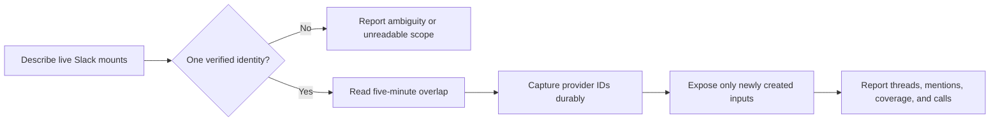

## 1. Overview

This branch replaces label-based Slack selection and one-shot polling with verified sender bindings and an overlap-safe durable intake. One bounded QFS delta now reports newly actionable messages, thread changes, mentions, unreadable coverage, and measured call cost without replaying work.

**Highlights:**

1. Rejects ambiguous account and sender identities before reading or writing Slack.
2. Rewinds each read safely while durable inbox creation remains the novelty oracle.
3. Carries thread, mention, coverage, and call-count evidence in one observation result.

## 2. Motivation

The loop could repeatedly scan Slack yet still miss an unmentioned follow-up reply, select a connection by an insufficient label, or treat every overlapped result as new. The mission gives the shared transport one explicit identity and one durable high-water model, allowing all cadences to consume the same bounded evidence without inventing a second cursor or ledger.

## 3. Changes

The flow keeps destination and sender proof ahead of every read, then makes durable capture—not the provider window—the definition of new work.

### 3-1. Bind Slack connections to verified bot identities and destinations ([17e77f7e6](https://github.com/qmu/workaholic/commit/17e77f7e6))

Made the resolver include sender identity in target matching and refuse distinct account/sender tuples behind the same workspace and channel label. The production observer now carries described account, channel, and sender coordinates into the binding.

### 3-2. Collect incremental top-level, thread, and mention activity ([b93af0d8c](https://github.com/qmu/workaholic/commit/b93af0d8c))

Derived fresh thread changes and bot-addressed mentions from the same bounded channel delta while preserving message and thread timestamps. Own bot posts remain captured for cursor continuity but are not exposed as human input.

### 3-3. Share intake cursors and deduplicate every loop consumer ([ea7e53250](https://github.com/qmu/workaholic/commit/ea7e53250))

Added a five-minute provider overlap while retaining the maximum observed timestamp as the high-water cursor. Durable inbox creation now returns new and duplicate provider IDs separately, so crash replay and overlapping consumers converge on once-only action.

### 3-4. Verify thread replies and report unreadable Slack coverage ([7c60af3e0](https://github.com/qmu/workaholic/commit/7c60af3e0))

Added source-specific coverage and exact describe/read/capture call counts to every successful observation. Missing sender identity is now visible as unreadable mention coverage rather than silently implying complete observation.

## 4. Outcome

Slack intake now has one deterministic binding, one overlap-safe cursor, and one durable novelty decision shared by the loop. Twenty-two focused transport and cadence tests pass alongside generated-plugin and metadata verification.

## 5. Concerns

### Live provider behavior remains to be measured

- **Severity:** moderate
- **Description:** The QFS request volume, real workspace/sender description, and provider-side inclusion of thread replies still have hermetic evidence only (see [17e77f7e6](https://github.com/qmu/workaholic/commit/17e77f7e6) in `plugins/workaholic/skills/transport/scripts/observe-channel.sh`).
- **How to Fix:** Run the target-specific QFS and Slack drill and retain returned workspace, channel, sender, thread, cursor, and request-count evidence.

## 6. Successful Development Patterns

- Keeping the high-water mark separate from durable novelty made overlap and crash recovery composable without a second state store.
