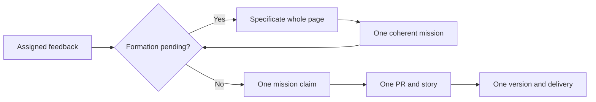

## 1. Overview

フィードバック Issue の capture と planning を分離し、関連する ask を一つのミッションとして形成してから実装する流れを復元しました。形成したミッションは一つの claim、branch、worktree、PR、story として完遂し、バージョン番号と delivery は全チケットの受入が終わったミッション境界で一度だけ発行します。

**Highlights:**

1. 記録済みだが未計画の Issue を再利用し、重複記録せず仕様化へ戻せます。
2. 関連 Issue の形成中は新規実装だけを保留し、一つのミッションへまとめます。
3. 達成・受入完了・queue 空のミッションだけに version、release、delivery を許可します。

## 2. Motivation

フィードバックを受け取るたびに独立した実装とバージョン発行へ進むと、小変更をまとめて一つの価値あるストーリーとして届ける Workaholic の役割が失われます。一方、feedback record の存在だけで Issue を処理済みと扱うと、planning に届かない ask が生まれます。このミッションでは、一つの観測可能な ownership model を capture から completed mission まで通し、ミッションを計画・実装・リリースの境界へ戻しました。

## 3. Changes

capture の事実と artifact relation による planning の事実を分け、形成が閉じた後だけミッション単位の実装を開始します。リリース側は version availability より先に completed mission を判定します。

### 3-1. Batch related asks into one standing mission plan ([69b1e319c](https://github.com/qmu/workaholic/commit/69b1e319c))

Issue reader が形成中の ask を報告した tick では、oldest-first の全ページを仕様化し、新規 implement allocation をゼロにしました。既存 runner は止めず、時間や件数ではなく観測可能な形成状態で次工程を閉じます。

### 3-2. Define one ownership model from feedback capture to mission formation ([05c6e834a](https://github.com/qmu/workaholic/commit/05c6e834a))

feedback record は ask の capture だけを証明し、ticket や mission からの `feedback:` relation だけが planning を証明するようにしました。記録済み・未計画の Issue は既存 record を指して再提示され、重複 capture なしで再開できます。

### 3-3. Drive a mission as one claim, pull request, and story ([c43541511](https://github.com/qmu/workaholic/commit/c43541511))

drive、story、canonical rule に、一つのミッションを一つの claim、branch、worktree、PR、story として保持する契約を揃えました。チケットごとの実装・検証証跡は残しつつ、個別の merge や release 境界には分割しません。

### 3-4. Version and deliver only at the completed mission boundary ([24bd4f9e7](https://github.com/qmu/workaholic/commit/24bd4f9e7))

純粋な read-only oracle を追加し、archive 済みチケットが同じ achieved mission に属し、受入が完了して queue が空の場合だけ release eligible としました。非適格 branch は通常 PR として扱われ、version、release note、ship、delivery を機械的に拒否します。

## 4. Outcome

- フィードバック Issue 群を一つの形成ターンとして扱い、未確定の間は新規実装割り当てだけを停止するようにしました。
- 記録済みと計画済みを分離し、未計画の既存フィードバックを再利用して仕様化へ戻せるようにしました。
- 一つのミッションを一つの claim・branch・worktree・PR・story として維持し、チケット単位の証跡も残しました。
- バージョン、リリースノート、ship、delivery を、達成・受入完了・queue 空のミッション境界だけに制限しました。
- 4チケットの境界 fixture と全6,830件のワークフローテストで、単一リリース境界と拒否経路を確認しました。

## 5. Concerns

### 状態リーダーが読めない場合の保守的な停滞

- **Severity:** moderate
- **Description:** 計画関係が読めないと ask が再提示され、ミッション状態が読めないとリリースが拒否されます（[24bd4f9e7](https://github.com/qmu/workaholic/commit/24bd4f9e7) の `plugins/workaholic/skills/story/scripts/release-boundary.sh`）。
- **How to Fix:** 報告された reader/oracle の失敗原因を修復して再実行し、関係や受入状態を推測して上書きしないでください。

## 6. Successful Development Patterns

- Capture と planning を既存の Issue・record・artifact relation・branch facts から導出すると、可変状態や待機タイマーを増やさず中断復帰できます。
- Release eligibility を version availability より先に判定すると、番号衝突の修復と「そもそもリリースか」という責務を混同せずに済みます。
- 正しい allocator を書き換えず、intake と release の境界を機械化すると、一つの unit model を全工程で保てます。

## 7. Release Preparation

Ready for release. 追加のリリース前後作業はありません。

## 8. Notes

- Release version: `v1.0.338`
- Closes #1091

## Merge Outcome

merge_refused: checks_pending

