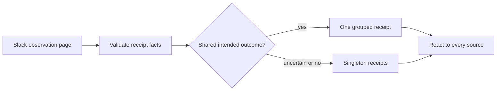

# Make Slack acknowledgements useful without adding noise

## 1. Overview

Slack の受領通知を、人が内容と実際の進行状態をその場で判断できる会話へ変えました。3枚のチケットを一つのミッション、PR、story、version 境界にまとめています。

**Highlights:**

1. subject、Issue、workflow state、source message を prose から分離
2. 関連する burst だけを一返信へ集約し、各 source の reaction は保持
3. 自然な文面を固定せず、semantic facts と delivery を検証

## 2. Motivation

Issue #1090 では、連続する feedback に同じ受領文が一件ずつ返り、Issue 番号以外から依頼内容を識別できませんでした。これは単なる文面の問題ではなく、Slack を人と汎用エージェントの共同作業空間として扱うための情報設計の問題です。一方で、自由な言い回しだけを許すと、まだ記録しただけの依頼を「実装準備済み」と誤って約束したり、個々の message の処理状態を失ったりします。

このミッションは、人向けの自然な表現と、workflow が保証すべき事実を分離することで、その両方を守ります。

## 3. Changes

観測ページを既存の burst 境界として使い、facts の検証後に明確な関連だけをまとめます。どちらの経路でも全 source の durable reaction を残します。

### 3-1. Define the acknowledgement contract ([62e8d114c](https://github.com/qmu/workaholic/commit/62e8d114c))

batch、source、subject、Issue、実際の closed state を検証し、返信先、reaction、次の段階を正規化しました。可視文面は人の言語に合わせ、固定テンプレートや完了の約束を要求しません。

### 3-2. Group burst receipts without losing state ([86591a711](https://github.com/qmu/workaholic/commit/86591a711))

明確に同じ目的を持つ依頼だけを observation order でまとめ、最初の thread に一度返信します。timer や件数 threshold を増やさず、全 subject-to-Issue mapping と source reaction を保ちます。

### 3-3. Test facts separately from prose ([850bb1e16](https://github.com/qmu/workaholic/commit/850bb1e16))

日本語・英語、3つの truthful state、関連・非関連の分離、thread ordering、全 reaction、不正 facts の拒否を検証します。prose snapshot は比較せず、loop の contract を同じ facts-first 境界に固定しました。

## 4. Outcome

- 内容、Issue、次の段階が receipt だけで識別でき、関連 burst の一返信でも各 message の handled state を保持
- contract 3件と workflow 6834件、build 一式が成功し、mission 3/3 の後に v1.0.340 を一度だけ準備

## 5. Concerns

### Relatedness remains a semantic judgement

- **Severity:** low
- **Description:** 同じ intended outcome かは conversation context に依存し、validator 単独では決められません（[86591a711](https://github.com/qmu/workaholic/commit/86591a711) の `plugins/workaholic/commands/infinite-development.md`）。
- **How to Fix:** 明確な関係だけを group 化し、不確かなものは singleton に保ちます。

## 6. Successful Development Patterns

- prose ではなく workflow facts を小さな JSON 境界にすると、会話品質と検証を独立して改善できます。
- observation page の再利用により、mutable timer state なしで overlap replay と合成できます。
- 3枚の archive が acceptance を roll し、3/3 後だけ version を進めました。

## 7. Notes

Closes #1090。PR と v1.0.340 は3枚のチケット全体に対する一つの release boundary です。
