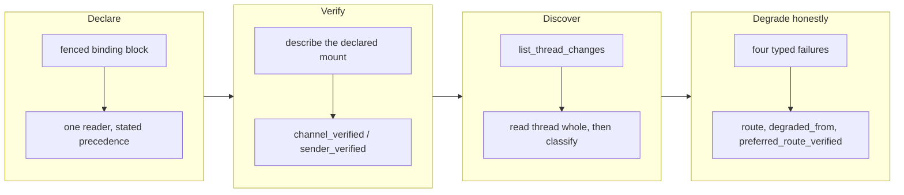

## 1. Overview

The repository declares where it speaks on Slack — workspace, channel, QFS profile, sender — in one
fenced block its instruction file already carries, and the loop verifies that binding before
selecting anything. It also sees a reply buried under an older thread root, and leaves the declared
route only on one of four named QFS failures.

**Highlights:**

1. One portable `workaholic-slack-binding` block, one reader with a stated precedence, and a `/workaholify` audit that can scaffold it.
2. A bounded `list_thread_changes` discovery, so *covered* means a discovery actually ran.
3. Every fallback names the typed failure that caused it and keeps the bound channel and thread.

## 2. Motivation

The Slack destination lived only in environment variables and CLAUDE.md prose, so a portable agent
could not learn where this repository speaks — and two describers asked for the literal path
`/slack`, so a named mount answered nothing while a working route sat one segment away. Two
silences compounded it: channel history does not carry a reply written under an older root, so a
new human reply inside an existing thread was invisible while coverage still read *covered*; and
`choose_route` fell to the connector whenever the QFS map was undescribed, so a misconfigured
repository ran on the fallback forever with every report reading like a clean success.

## 3. Changes

A repository first states its binding, the loop then proves the route that binding names, only
then claims thread coverage it actually discovered, and finally reports any departure from that
route as a named degradation rather than a success.

### 3-1. Declare and audit the repository Slack binding ([0126575](https://github.com/qmu/workaholic/commit/012657529))

A repository declares one fenced `workaholic-slack-binding` block in its own instruction file; a
single reader resolves it with a stated precedence, `/workaholify` audits and can scaffold it, and
`/infinite-development` reads it before any Slack selection. Absence stays an ordinary answer, so
every existing repository keeps working on the environment variables.

### 3-2. Describe and verify the declared QFS Slack route ([4cf92c6](https://github.com/qmu/workaholic/commit/4cf92c6f5))

One describer resolves the declared mount directly and only an undeclared binding enumerates; the
resolver verifies the operations it requires and refuses a profile label as a sender. The binding
carries `channel_verified`, `sender_verified` and `declared_digest`.

### 3-3. Discover thread replies before claiming coverage ([679a637](https://github.com/qmu/workaholic/commit/679a63736))

A bounded `list_thread_changes` discovery finds changed threads by their own coordinates, each
changed thread is read whole before any reply is classified, and coverage reads *covered* only
when that discovery ran. A truncated page is reported rather than passed over.

### 3-4. Preserve typed fallback and revalidate Slack effects ([3bcfcce](https://github.com/qmu/workaholic/commit/3bcfccef3))

`perform.sh` leaves the preferred route only on availability, capability, authorization or
reachability, and a write never falls back after `--commit`. Workspace, channel ID, thread
timestamp and expected sender ride the handoff verbatim, and `expected_declared_digest` refuses a
stale binding before any effect.

## 4. Outcome

The declared binding is the startup authority end to end: stated once, verified before use, proved
able to see a reply inside an existing thread, and never silently abandoned. A connector effect
reports itself degraded and cannot certify the preferred QFS sender.

## 5. Concerns

### A well-formed binding that points nowhere passes the audit

- **Severity:** moderate
- **Description:** `/workaholify`'s audit checks the declaration's shape, not its reachability, so a binding naming a channel that does not exist passes there and fails later at the describe/verify step (see [0126575](https://github.com/qmu/workaholic/commit/012657529) in `plugins/workaholic/skills/workaholify/`).
- **How to Fix:** Have the audit report the reachability probe's own answer beside the shape verdict, named as a separate reading so a shape-only pass is never read as a working route.

### The `// default` idiom guards boolean fields elsewhere in these scripts

- **Severity:** moderate
- **Description:** `(.ok // true) != false` never fires for `{"ok": false}` — jq treats `false` as empty — which made the `qfs_preview_refused` guard read a refusal as an acceptance and commit anyway. It was fixed here, but the same idiom guards other boolean fields in the transport scripts (see [3bcfcce](https://github.com/qmu/workaholic/commit/3bcfccef3) in `plugins/workaholic/skills/transport/scripts/`).
- **How to Fix:** Sweep the transport scripts for `// ` defaults over fields whose meaningful value is `false`, and replace each with an explicit `!= false` test.

### `test-workflow-scripts.mjs` has one live-load row that fails intermittently

- **Severity:** low
- **Description:** The `load_per_core is load1 over cores` row recomputes the producer's arithmetic in JavaScript and compares it against awk's `%.2f`; the two disagree on a half-way value. Measured on this branch at `load1 = 2.51` on 4 cores (expected `0.63`, got `0.62`); the same row passed at `3.50`. Untouched by this branch.
- **How to Fix:** Queued as `20260908201510-make-the-machine-load-rounding-assertion-deterministic.md` — assert against a fixture and a named rounding contract rather than a recomputation of the live reading.

## 6. Successful Development Patterns

- A status value that names its own precondition still gets read as the thing it names — `covered` had to become unreachable without the discovery, not merely documented as conditional.
- The safe fallback boundary turned out to be `--commit`, not the transport: classifying by failure *kind* alone would have let a post-commit timeout be resent, which is the double-post the outbox exists to prevent.

## 7. Release Preparation

**Verdict**: Ready for release

- **Concern:** One `too-large-commit` finding (598 added lines of implementation against the 500 ceiling) on [4cf92c6](https://github.com/qmu/workaholic/commit/4cf92c6f5) — a granularity nudge, the only scan finding, no secret and no leak.
- **Before release:** Nothing blocking; the finding is `override`-tier and the branch stays releasable.
- **After release:** Drive the queued rounding-assertion ticket so the suite stops going red for a reason nobody can act on.

## 8. Notes

`doc-drift.sh` names `docs/` because a new test script landed with no site page. Judged not drift:
the file is a test fixture, and `CLAUDE.md` — where this behaviour belongs — was updated here.
