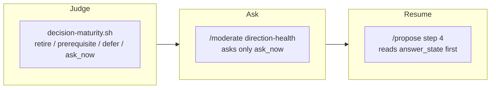

## 1. Overview

A direction blocked on a human decision used to end in a worker report nobody opens, or become a question the moment a reading fired — with no way to say *this cannot be answered yet*. This branch makes the decision an explicit, reviewable state: one derived maturity verdict decides whether a reading may become a question, `/moderate` asks only a mature one, and `/propose` reads the recorded answer back before it may report `no_evolutionary_move`.

**Highlights:**

1. `moderate/scripts/decision-maturity.sh` is the one derivation — a `retire` → `prerequisite` → `defer` → `ask_now` ladder over fields `survey-strategies.sh` already emits, with `premises[]` carrying the evidence.
2. `direction-health` asks only an `ask_now` verdict; a withheld question spends no ledger line and is re-derived every tick, so the deferral needs no store, cursor or flag.
3. `/propose` step 4 reads the answer before it may refuse, and a `no_evolutionary_move` report that does not name the `answer_state` is non-conformant on its face.

## 2. Motivation

The loop could read that a direction was `quiescent` or that no evolutionary move could be named, and both readings had exactly two ends: ask a person immediately, or end silently. Neither is right for the common case — many accumulated questions concern implementations considered too early, before their business, design, data or operational premises were established, and such a question must not become a gate merely because it exists. Worse, once somebody did answer, the next tick derived the same silence from the same rows and reported the same word, so an answered question went on producing the same refusal every hour.

The repair keeps the loop's own discipline: the verdict gates nothing and lifts nothing, every mechanical brake refuses exactly as before, and the reopening is derived at the moment it is read rather than stored anywhere.

## 3. Changes

A reading became a verdict, the verdict decided whether the loop may ask, and the answer became evidence the next planning turn must read. Each step reuses machinery that already existed — the survey rows, the asked-once ledger, `workaholic:notify`'s thread lookup, `record-answer.sh` — so no parallel inbox, no post shape and no artifact schema moved. What is new is one reader, one rule stated once in `rules/workaholic.md`, and three prose instructions on the surfaces a `/propose` run actually reads.

### 3-1. Judge whether a human decision is mature enough to block ([db0b9db5](https://github.com/qmu/workaholic/commit/db0b9db57))

Adds `moderate/scripts/decision-maturity.sh`, a ladder over fields `survey-strategies.sh` already emits, and states the rule once in `rules/workaholic.md` (*When a Human Decision May Block the Loop*). It gates nothing by itself and writes nothing; `readable: false` is never a verdict.

### 3-2. Ask mature blockers in Slack and record the answer ([0f00b1cf](https://github.com/qmu/workaholic/commit/0f00b1cfe))

`/moderate`'s `direction-health` step reads the verdict for its four attribution readings and asks only an `ask_now` one. A withheld question is named with its missing premise, spends no ledger line, and is re-derived every tick.

### 3-3. Re-evaluate quiescent strategies after answers arrive ([baad0c6d](https://github.com/qmu/workaholic/commit/baad0c6da))

`/propose` step 4 reads `decision-maturity.sh --strategy <slug>` **before** it may report `no_evolutionary_move`, and must name the `answer_state` — with the answer itself when one stands. `resumable` is two existing readings conjoined, so nothing has to be cleared and nothing can go stale.

### 3-4. Reconcile the observing refusal with its ladder ([4043e273](https://github.com/qmu/workaholic/commit/4043e2738))

Settles the contradiction ticket 3-1 tripped over: `survey-strategies.sh`'s header described an `observing` refusal its ladder no longer emits, while `commands/propose.md` stated the opposite. The refusal is retired and the prose was the defect — the gate table becomes the complete documented word set between two sentinels, two SKILL.md surfaces stop asserting the gate, and one test row pins the ladder's emitted words against that block and against the words its one consumer keys on. Both shell changes are comment-only, so no behaviour moved.

## 4. Outcome

A human decision dependency is now a state the loop can name, defer with a reason, route to one person, and resume from. The three surfaces a `/propose` run reads each carry the instruction, `workaholic:work` states that an answer needs no dispatch of its own, and the suite holds that no artifact anywhere grew a reopen flag. The mission's own follow-up is closed with it: the survey's refusal ladder and every sentence describing it now agree, and a drift between them fails the suite rather than misleading the next reader.

## 5. Concerns

### The reopening is prose on three surfaces, held only by a text test

- **Severity:** moderate
- **Description:** Which move a recorded answer makes nameable is a model's judgement, so step 4's re-read cannot be a script; what holds it is a test asserting `decision-maturity.sh` and `answer_state` appear in the command ceiling, the skill and `reference/loop.md` (see [baad0c6d](https://github.com/qmu/workaholic/commit/baad0c6da) in `scripts/test-workflow-scripts.mjs`). A run that reads all three and still refuses silently is caught by nothing.
- **How to Fix:** Accept the prose ceiling as the repository does elsewhere, or have `/propose`'s report emit a machine-readable `answer_state` line a later check can assert against.

### The answer ledger is local to the checkout that wrote it

- **Severity:** moderate
- **Description:** `decision-maturity.sh` reads the answer through `log-read.sh` over `.workaholic/moderations/`, which is git-ignored, so a container that carries no tick log reads `answer_state: never_asked` and the resumption never fires (see [baad0c6d](https://github.com/qmu/workaholic/commit/baad0c6da) in `plugins/workaholic/skills/propose/SKILL.md`). This is honest — the absence is named, not guessed — but it means the feature only works where the moderate tick and the propose turn share a checkout.
- **How to Fix:** Nothing here; the local loop has been that shape since 2026-09-02. Revisit only if the routines move back into per-tick containers.

### The suite was verified by subset, not by one whole-suite run

- **Severity:** low
- **Description:** `node scripts/test-workflow-scripts.mjs` is ticket 3-4's declared verification, and one unfiltered run was projecting to hours on a host carrying four concurrent loop agents at load 9 (stopped after ~5% of its rows, 0 failures). It was verified instead through the runner's own `argv[2]` label filter over every subset this change can reach — `propose` 304, `strategy` 333, `specificate` 170, `moderate` 1036, plus `jq` 10, `version` 85 and `rules` 12 — **1950 assertions, 0 failures** (see [4043e273](https://github.com/qmu/workaholic/commit/4043e2738) in `scripts/test-workflow-scripts.mjs`). Alongside it: both shell changes are provably comment-only (`git diff` of non-comment lines is empty), and `build.mjs` / `verify.mjs` / `validate-metadata.mjs` / `layout-doctor.sh` are clean.
- **How to Fix:** Nothing branch-side; the subsets are the same rows the whole run would execute. Worth knowing that the filter exists and that the unfiltered run is impractical while several loop runners share this host.

## 6. Successful Development Patterns

- Naming a cross-skill script by its bare `skill/scripts/name.sh` path instead of the `${CLAUDE_PLUGIN_ROOT}` invocation form — measured here as six broken bundles and thirty unresolved references when the invocation form was used, caught by `verify.mjs`.
- Handing one survey back (`direction-state.sh --emit-survey <file>`) rather than making a second call — two readings of one survey cannot disagree, and the network cost does not multiply by the number of directions.

## 7. Release Preparation

**Verdict**: Ready for release

- **Concern:** None. The branch-safety scan reports `pass` with no findings at all.
- **Before release:** None. `release-boundary.sh` reports `eligible: true` (`committed_change_set`) and the branch carries the bump to `1.0.359` — `check-version-bump.sh` read the branch and the base both at `1.0.358`, so the merge would otherwise have landed on a spent number.

## 8. Notes

The branch was parked for 223 hours with its pull request (#1124) closed unmerged while its own three tickets had already reached `main` through PR #1131. Catching it up was therefore not a real disagreement: the three paths `claim-mergeability.sh` classed `content` were the base's own evolved descendants of the branch's copies, taking the base's side reverted nothing, and the caught-up tree differed from `origin/main` by one appended line in `.workaholic/stories/index.md`. With ticket 3-4 archived the mission's queue is empty at 4/4 acceptance, so `archive.sh` closed it `achieved` and moved it into the archive area.
