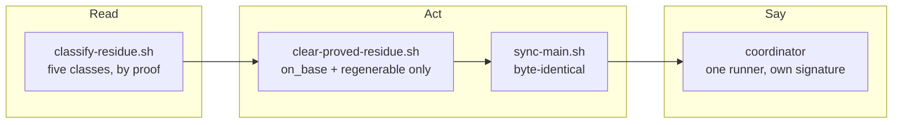

## 1. Overview

An unattended tick could stall forever on residue the tree can prove the base already holds, and
the stall reached nobody. This branch adds a reader that classifies every dirty path by proof, an
act that clears only what a proof covers before the existing freshen runs unchanged, and a
coordinator that neither turns an unreadable reading into zero capacity nor ends a degraded tick
in silence.

**Highlights:**

1. `classify-residue.sh` classifies each dirty path `on_base` / `regenerable` / `untracked` / `divergent` / `unanswerable`, and writes nothing — not even a fetch.
2. `clear-proved-residue.sh` clears only the first two, re-deriving each class through that one reader in the moment before it touches the path; `sync-main.sh` is byte-identical.
3. A `readable: false` claimable reading now falls back to one runner and names the reason, and a tick that spawned nothing because something was degraded posts under its own signature.

## 2. Motivation

Measured 2026-09-08: 21 ticks over roughly 100 minutes never reached a survey, through
`sync-main.sh` answering `dirty_workspace` → `plan-units.sh` answering `current: false` →
`claimable-units.sh` answering `readable: false`, over six staged paths of which four were
blob-identical to `origin/main`. Clearing exactly those by hand made `claimable-units.sh` answer
`{"claimable":2,"missions":2}` in the same second.

`sync-main.sh`'s refusal is correct by its own rationale — *a reset would discard a developer's
local commits* — and the ask refused widening it by name, so the judgement had to live above it.
The Slack silence had a separate cause, and the third ticket's discovery corrected the report
that raised it.

## 3. Changes

The tick reads before it acts, acts only on what the reading proves, and hands the still-unchanged
freshen a tree it can fast-forward. Where any of that is degraded, the coordinator spawns a runner
anyway and says what it could not read — the three steps are deliberately separate scripts so a
reader can be run just to look.

### 3-1. Classify checkout residue by proof ([71d39cded](https://github.com/qmu/workaholic/commit/71d39cded))

Adds `branching/scripts/classify-residue.sh`, a pure read that classifies each dirty path into
exactly one of five classes with a reason. `on_base` is content equality against the base's own
blob — `superseded`'s proof form, cited rather than re-invented — and requires the index entry
*and* the worktree file to match, because a path whose two sides disagree has one side that is
somebody's work.

### 3-2. Clear only the proved residue before freshening ([8f0e65544](https://github.com/qmu/workaholic/commit/8f0e65544))

Adds `clear-proved-residue.sh` and wires it into `/drive` §1: on `dirty_workspace` it runs once,
and on a `cleared` outcome the freshen re-runs once. It re-derives each path's class through the
same reader (`--path`) before touching it, never removes an untracked file, and refuses
`divergent_residue`, `unanswerable_residue` and `untracked_present` with the tree byte-identical.

### 3-3. Never let an unreadable reading spawn no runner ([65b280114](https://github.com/qmu/workaholic/commit/65b280114))

The coordinator's fanout was `min(fanout, claimable units, capacity)` with no rule for a null, so
a reading that could not be made became an allocation of zero — while the load term one paragraph
below already carried the identical rule. It now falls back to one runner and names the reason,
and a tick that spawned nothing because something it needed was degraded posts the
precondition-stop shape under its own signature.

## 4. Outcome

A tick that finds the checkout dirty with content the base already holds clears exactly that,
freshens and reaches its survey in the same tick; anything it cannot prove is left untouched and
named. A coordinator-level stop now reaches the channel instead of only the tick's own report.
Proved end to end by `scripts/e2e/loop-drill.sh verify-checkout-residue` — five load-bearing rows
and a real breaker — and by 6885 hermetic assertions.

## 5. Concerns

### The residue reader misparses a path containing a literal newline

- **Severity:** low
- **Description:** `git status --porcelain -z` is translated to newline-separated records to iterate in POSIX `sh`, so a path holding a literal newline is split (see [71d39cded](https://github.com/qmu/workaholic/commit/71d39cded) in `plugins/workaholic/skills/branching/scripts/classify-residue.sh`). It fails safe — the mangled name resolves no base blob, so it lands in `unanswerable` and is never cleared — and the header states the residue.
- **How to Fix:** Read the NUL stream with a `while read -d ''` loop in a shell that has one, or accept the bound as stated; no such path has ever appeared in this repository.

### `generator_failed` is the one refusal that cannot precede its writes

- **Severity:** low
- **Description:** Running a generator *is* what a `regenerable` restore is, so a generator that fails is reported after the proved restores were already made (see [8f0e65544](https://github.com/qmu/workaholic/commit/8f0e65544) in `plugins/workaholic/skills/branching/scripts/clear-proved-residue.sh`). Every restore was individually re-derived and each discarded content the base holds, so nothing is lost — but the tree is not byte-identical to before the call, unlike every other refusal.
- **How to Fix:** Nothing to fix unless a generator starts failing routinely; the freshen that follows refuses honestly on a still-dirty tree.

## 6. Successful Development Patterns

- Re-deriving a proof through a `--path` flag on the one reader, rather than inlining the comparison in the act, satisfies *re-derive at the moment of the act* and *one home for one rule* at once — the cost is one process per cleared path.
- Building the reproduction before the reader proved the whole chain (`dirty_workspace` → `current: false` → `not_current`) rather than the symptom, which is what showed the third ticket's reported cause was wrong.
- Reading a base blob's own generator marker is self-verifying in the shape `conflict_class_append_only` already uses: it covers a generated file added tomorrow and can never be wrong about a file it accepts.

## 7. Release Preparation

**Verdict**: Ready for release

- **Concern:** The branch-safety scan reports two `override`-tier `size` findings — `scripts/e2e/loop-drill.sh` is over the per-file ceiling and `8f0e65544` adds 578 implementation lines against a 500 ceiling. No `secret` and no `leak`; `gate-decision.sh` reads `override_only: true`.
- **Before release:** Nothing. The drill file's size is the shape of a file that holds every drill, and the commit's size is one script plus its documentation and tests.
