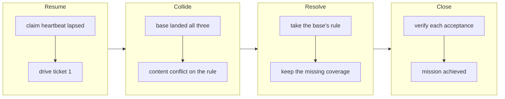

## 1. Overview

This branch closes `let-the-loop-grow-a-mission-without-handing-it-back-to-a-person` by
verification rather than implementation: the base landed all three tickets' behaviour while this
claim's heartbeat was lapsed. The collision is resolved toward the base, and what survives is the
coverage the base landed without.

**Highlights:**

1. The mission's three acceptance items are proved against the merged tree and the mission closes `achieved`.
2. The colliding narrowing of `publication_refusal_word` is dropped for the base's stricter, four-term rule.
3. Five rows now feed that rule directly, so a rule that ignored the field can no longer pass.

## 2. Motivation

The mission asked for three things: tell an attribution ruling from a routine feedback append,
name the held publications the base has moved under, and catch such a publication up without
merging it. This runner resumed the lapsed claim, drove the first, and found the base already carried all
three. Nothing in the claim protocol could see it: `superseded` is derived from **archived
tickets**, and these were never archived, so every survey offered the unit as ordinary work.

## 3. Changes

The branch starts as an ordinary resume and turns into a reconciliation: one ticket driven, a
collision met at the catch-up, and the remaining two closed by re-deriving their acceptance
criteria against the base's own implementation rather than writing a second one beside it.

### 3-1. Tell a ruling from a routine feedback append ([7568854c7](https://github.com/qmu/workaholic/commit/7568854c7))

Narrowed the mission arm of `publication_refusal_word` so a publication that added an artifact
beside the mission modification was not the operator's. Superseded at the merge by the base's
rule, which reads a fourth stream field instead; what survives is the coverage.

### 3-2. Name a held publication's mergeability ([ddfeca974](https://github.com/qmu/workaholic/commit/ddfeca974))

Verified on the base: `list-operator-facing-pulls.sh` folds `claim-mergeability.sh`'s class, its
reason, `already_current` and the age onto every operator-facing row, and `/moderate`'s
`operator-pull:<number>` question names the class beside the age.

### 3-3. Catch a held publication up, never merge it ([8112752bd](https://github.com/qmu/workaholic/commit/8112752bd))

Verified on the base: `prepare-publication.sh` holds everything up to the push and contains no
merge call site at all, while `settle-stranded-publication.sh` is the wrapper that delivers — so
a held publication cannot be merged by a degraded read flipping a word.

## 4. Outcome

The mission is `achieved`, its three acceptance items proved against the merged tree, and the
`extension` term the ruling arm turns on is pinned by five direct-stream rows.

## 5. Concerns

### A claim can hold work the base has already done

- **Severity:** moderate
- **Description:** This unit was offered as `heartbeat_lapsed` for hours while its work sat merged on the base, because `superseded` is derived from archived tickets rather than from content (see [6f2994e88](https://github.com/qmu/workaholic/commit/6f2994e88))
- **How to Fix:** Not by an *already implemented* test, which is a reading about behaviour; the honest candidates are narrower — a mission whose every acceptance link resolves to a ticket the base still queues is at least worth naming

### A stash is left on the claim worktree

- **Severity:** low
- **Description:** This run's own parallel implementation of the two superseded tickets is stashed rather than dropped, since the failure contract forbids `git stash drop` without a person's word
- **How to Fix:** The operator drops it, or keeps it as the record of what the second solution looked like; it is on `refs/stash`, so tearing down the worktree does not remove it

## 6. Successful Development Patterns

- Resolving a collision toward the branch that is already landed and pinned, then asking what it left uncovered, turned duplicated work into the one row the base was missing.
- Feeding a rule its normalised stream directly, beside the end-to-end row, is what catches a term whose value a different script computes — the integration row exercises both halves at once and cannot see one half go missing.

## 7. Notes

Ticket 3-2's Gate forbade any act from reading the mergeability field and ticket 3-3 requires
exactly that; the later ticket wins, and the surviving half — no second derivation — is what the
Final Reports record as checked.

## Merge Outcome

merge_refused: checks_pending

## Unposted Line

shape: 🟢 Implemented
reason: post_refused: operations_unsatisfied
text: 🟢 Implemented [#1138 Close the held-publication mission against the base's own implementation](https://github.com/qmu/workaholic/pull/1138) — ミッションの3チケットはすでにベースに入っていたため、実装を検証して締め、リファサル判定の extension にテストを足した。 by [web routine](https://claude.ai/code/session_01LLDoe9M5PmEzzT1V9FJoZe)

