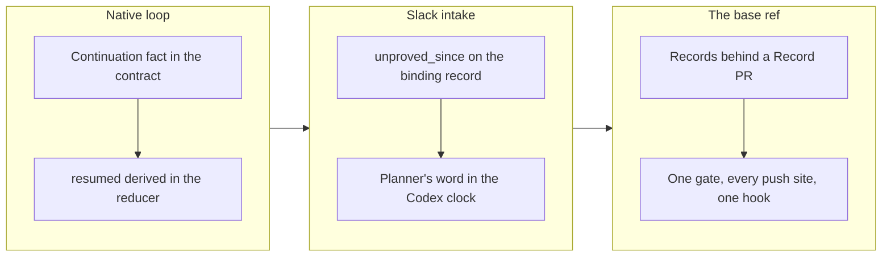

## 1. Overview

The branch closed issue #1151's three repairs: a native `/work` turn now proves the continuation it returns to before it ends, an unproved Slack observation is reported as unread rather than quiet, and the tick's durable records reach `main` only behind a `[Record]` pull request, with one base-ref gate refusing every unattended commit or push to the base. All four tickets landed and the mission closed `achieved`.

**Highlights:**

1. `final-response-contract.sh` refuses `continuation_unproved`, and the coordinator derives `resumed` — `running` alone is never a resumed loop.
2. `observe-channel.sh` records `unproved_since` and overlaps the whole unread interval; the Codex clock takes the planner's word, never `observed_quiet` for an unproved read.
3. `branching/scripts/lib/base-ref-gate.sh` is read by every commit and push site, `hooks/guard-git-push.sh` denies a composed base push, and both record writers publish through `publish-tree-pr.sh`.

## 2. Motivation

A native session said it had returned to the loop and ended its turn with the record still `running`; after a manual resumption the adapter answered `observation_proved: false` while a human root sat unread and the session called the channel quiet; and the operator measured the tick's bookkeeping landing on `main` as direct commits. Each was a fact nothing read: the turn classifier proved nothing about what carried the loop, the wait word was written whatever `proved` said, and no reader existed for the writers that carry no claim. The branch turned each into a fact a script reads and a test pins, measuring the pre-change shape first.

## 3. Changes

The work ran in the mission's own order: first the two readings that had no fact behind them (the continuation, the unread interval), then the road the records take, then the gate that keeps every other writer on that road.

### 3-1. Prove a continuation before a mid-loop turn ends ([ff9a86269](https://github.com/qmu/workaholic/commit/ff9a86269))

The contract takes a `continuation` fact (`interruptible_parent` or `same_chat_schedule`, its id and next due time), refuses `continuation_unproved` on the `resume` path and echoes it back; the reducer records it at `start`, `resume` and a new `continued` event and derives `resumed` with `resumed_reason`; one wording rides the three surfaces and `commands/work.md` names which continuation the native session uses.

### 3-2. Treat an unproved Slack observation as unread, not quiet ([5335a0bb7](https://github.com/qmu/workaholic/commit/5335a0bb7))

Measured first: the cursor already stayed put on an unproved read, so the live defect was the word. The observer writes `unproved_since` and derives `overlap_seconds` as the greater of 300 and the unread span, the capture clears the mark only in the cursor-advancing write, and `codex-loop.sh` records `observation_unreadable` in its status; one wording on the tick ceiling and the work skill.

### 3-3. Route the tick's durable records through a pull request ([d25783689](https://github.com/qmu/workaholic/commit/d25783689))

Measured on `origin/main`: 219 `Log the * tick` commits were 2026-08-27..31 history, and the live direct writers were 17 `Record the tick's feedback findings` and 2 `Add deferred concerns` commits. Both writers now publish through `publish-tree-pr.sh` with a `[Record]` title, report a `publication` block, and dedup against unmerged `work-*` branches so no record is published twice.

### 3-4. Gate every unattended write to the base ref and pin it ([c4384870e](https://github.com/qmu/workaholic/commit/c4384870e))

One reader answers `allowed:<why>` or `refused:base_ref_write` from the act, the destination, the base and the role; every commit and push site reads it, the roles are set at each unattended path's own entry, `guard-git-push.sh` is the agent-level half, and the four named paths are proved against a fake origin in the suite and in `verify-base-ref-gate`.

## 4. Outcome

The mission's three acceptance items are checked and it closed `achieved` at the archive gate. The suite grew from 7154 to 7323 rows, all green; both drills pass with their breakers; `verify.mjs` reports every bundle self-contained.

## 5. Concerns

### The push guard is a token match, not a parser

- **Severity:** moderate
- **Description:** `guard-git-push.sh` denies a base-naming refspec wherever the words appear after `git … push`, so a base push spelled inside a quoted string is denied too (see [c4384870e](https://github.com/qmu/workaholic/commit/c4384870e) in `plugins/workaholic/hooks/guard-git-push.sh`)
- **How to Fix:** if it ever bites an ordinary command, tokenize with quote awareness rather than widening what passes

### The direct seam is kept with no unattended caller

- **Severity:** low
- **Description:** `publish-tree-commit.sh` stays for an attended developer and three suite contracts written against it; the gate refuses its push under any role, but the road still exists (see [d25783689](https://github.com/qmu/workaholic/commit/d25783689) in `plugins/workaholic/skills/branching/scripts/publish-tree-commit.sh`)
- **How to Fix:** retire it together with the J1, J2 and close-reachability contracts once a pull-request fixture replaces them

### A sourced library resolves the gate beside itself, or falls back

- **Severity:** low
- **Description:** `lib/claims.sh` and `lib/push-outcome.sh` cannot source the gate in the build-detectable form; a layout where `branching/scripts/lib` is not beside them refuses `gate_unresolved` under any role (see [c4384870e](https://github.com/qmu/workaholic/commit/c4384870e) in `plugins/workaholic/skills/drive/scripts/lib/claims.sh`)
- **How to Fix:** have every sourcer of those libraries source the gate first, in the detectable form, and drop the fallback

## 6. Successful Development Patterns

- A detached scratch worktree at the branch tip let the next ticket's patch and its full suite run beside the current ticket's suite, so two 10-minute suites overlapped instead of serialising.

## 7. Release Preparation

**Verdict**: Ready for release

- **Concern:** the branch-safety scan reports two `size` findings (`too-many-files` over the diff, `too-large-commit` on c4384870e) — override-only, no secret and no leak
- **Before release:** `/ship` asks for the conscious size override; the findings are the shape of the work, not a mixed concern

## 8. Notes

The `🟢 Implemented` finish line could not be sent: the declared binding reaches the channel through two mounts (`cc01-qmu`, `cdx01-qmu`) and names no account, so `resolve-target.sh` answers `ambiguous_identity` (feedback `20260911021557`); the line is carried in this story's own record.
