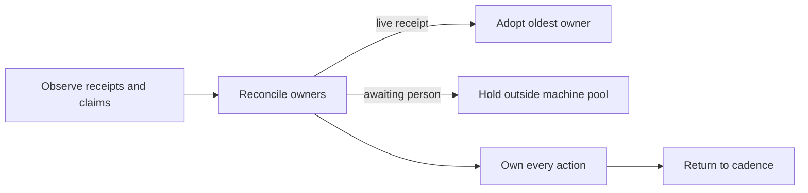

## 1. Overview

The native loop now reconciles work against live receipts before cadence. It adopts the oldest active owner, collapses duplicate claims, keeps person-dependent work outside machine dispatch, and gives every agent action a durable owner.

**Highlights:**

1. Existing live work is adopted without creating another branch.
2. Durable person waits remain held until an answered handoff exists.
3. Cadence resumes only after every reconciliation action has an owner.

## 2. Motivation

Repeated machine claims could duplicate work already in flight, while person-dependent units and unowned reconciliation actions could leak back into the automatic cadence. A single pure reconciliation reader makes those decisions explicit and testable before the loop advances.

## 3. Changes

The reconciliation path converts observed state into one deterministic plan, retaining existing branches and worktrees while naming duplicate claim losers.

### 3-1. Adopt live work and collapse duplicate claims ([e90e3b1e6](https://github.com/qmu/workaholic/commit/e90e3b1e6))

The reconciler selects the oldest overlapping live receipt as the owner and reports later receipts as duplicate losers. Units with no live owner remain dispatchable.

### 3-2. Hold person-dependent units outside the machine claim pool ([7325940be](https://github.com/qmu/workaholic/commit/7325940be))

Claims in a durable `awaiting_person` state are held until their handoff is answered. They cannot be mistaken for ordinary machine-claimable backlog.

### 3-3. Own every reconciliation action before returning to cadence ([2c4de46c5](https://github.com/qmu/workaholic/commit/2c4de46c5))

Every `needs_agent` action is assigned either to a compatible live role receipt or to a deterministic follow-up receipt. The cadence-ready verdict stays false while any action is unowned.

## 4. Outcome

Reconciliation is now a deterministic, hermetically tested gate: existing work is preserved, human waits remain explicit, and unattended cadence cannot continue with ownerless actions.

## 5. Successful Development Patterns

- A pure JSON reader made concurrency ownership rules repeatable without needing live GitHub or Slack state in the test harness.
