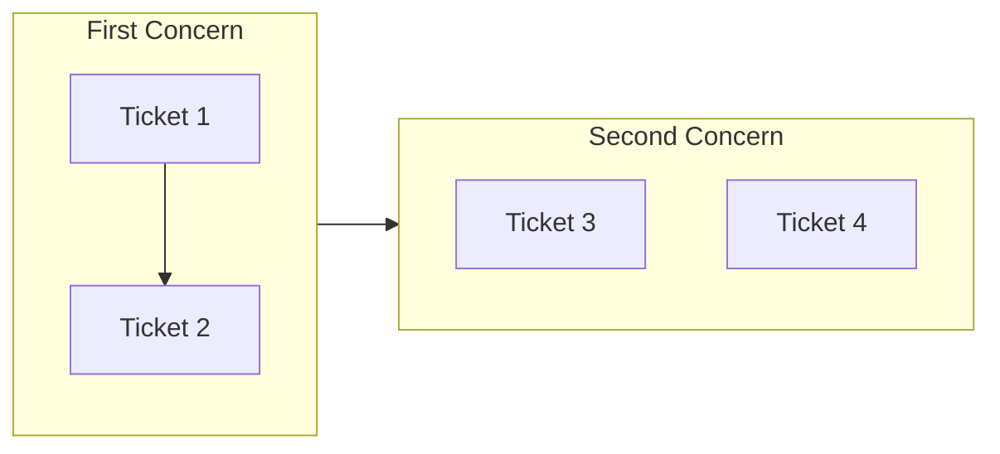

[English](artifacts.md) | [日本語](artifacts_ja.md)

# Artifacts

Documentation artifacts generated during development workflows.

## ticket

An implementation work request that captures what should change and records what happened.

### Definition

A ticket defines a discrete unit of work to be implemented. It captures intent, context, and implementation steps before coding begins. Tickets are change-focused, describing what should be different after implementation. They live in `.workaholic/tickets/todo/` when active, `.workaholic/tickets/icebox/` when deferred, and `.workaholic/tickets/archive/<branch>/` when completed.

Tickets include YAML frontmatter with structured metadata:

- `created_at`: Creation timestamp (ISO 8601 datetime)
- `author`: Git email of the creator
- `type`: enhancement, bugfix, refactoring, or housekeeping
- `layer`: Architectural layers affected (UX, Domain, Infrastructure, DB, Config)
- `effort`: Time spent on implementation (filled after completion)
- `commit_hash`: Short git hash (set by archive script after commit)
- `category`: Added, Changed, or Removed (set by archive script based on commit message)

Ticket files created by `/ticket` are automatically included in `/drive` commits via `git add -A`. When archived, the ticket becomes the single source of truth for change metadata, eliminating the need for separate changelog files.

### Usage Patterns

- **Directory names**: `.workaholic/tickets/todo/`, `.workaholic/tickets/icebox/`, `.workaholic/tickets/archive/`
- **File names**: `20260123-123456-feature-name.md` (timestamp-prefixed)
- **Code references**: "Create a ticket with `/ticket`", "Archive the ticket"

### Related Terms

- spec, story

## spec

Current state documentation that provides an authoritative reference snapshot.

### Definition

Specs document the present reality of the codebase. Unlike tickets (which describe changes), specs describe what exists now. They are updated via the spec-writer subagent (invoked by `/story`) to reflect the current state after changes are made. Specs reduce cognitive load by providing a single source of truth.

### Usage Patterns

- **Directory names**: `.workaholic/specs/`
- **File names**: `architecture.md`, `api-reference.md`
- **Code references**: "Check the spec for...", "Update specs to reflect..."

### Related Terms

- ticket, story

### Inconsistencies

- The `/ticket` command description mentions "implementation spec" which conflates ticket and spec terminology (should be "write a ticket" or "plan a change")

## story

A comprehensive document that serves as the single source of truth for PR descriptions.

### Definition

A story synthesizes the motivation, progression, and outcome of development work across multiple tickets on a single branch. Stories are generated during the PR workflow and contain the complete PR description content across 11 sections: Summary (with overview paragraph), Motivation, Journey (with embedded Topic Tree flowchart), Changes (with categorized subsections), Outcome, Performance (with embedded metrics), Decisions (key architectural choices), Risks (trade-offs and mitigations), Release Preparation (releasability verdict and instructions), and Notes. The story content (minus YAML frontmatter) is copied directly to GitHub as the PR body.

Stories gather data directly from archived tickets, extracting frontmatter fields (`commit_hash`, `category`) and content sections (Overview, Final Report) to build the narrative.

### Usage Patterns

- **Directory names**: `.workaholic/stories/`
- **File names**: `<branch-name>.md`
- **Code references**: "The branch story captures...", "Story is copied to PR..."

### Related Terms

- ticket

## changelog

The root CHANGELOG.md file that aggregates all historical changes.

### Definition

The root `CHANGELOG.md` maintains a historical record of all changes across all branches. Entries are generated from archived tickets during PR creation. Each entry includes a commit hash, brief description, and link to the originating ticket. Branch changelogs (`.workaholic/changelogs/`) no longer exist; tickets serve as the single source of truth for change metadata.

### Usage Patterns

- **File names**: Root `CHANGELOG.md` only
- **Code references**: "CHANGELOG entries", "Update root CHANGELOG"

### Related Terms

- ticket, story

## journey

A narrative section in a story that summarizes the development progression and decision-making.

### Definition

The journey is section 3 of a story document that provides a high-level narrative of how development progressed. It focuses on phases and pivots rather than individual ticket details, typically 100-200 words. The journey answers "how did we get here?" while the Changes section (section 4) provides the detailed "what changed?". The Topic Tree flowchart is embedded at the beginning of the Journey section, providing a visual overview that complements the narrative.

Note: Stories now have 11 sections total (Summary, Motivation, Journey, Changes, Outcome, Performance, Decisions, Risks, Release Preparation, Notes) but the Journey section remains at position 3.

### Usage Patterns

- **Directory names**: N/A (section within story files)
- **File names**: Appears in `.workaholic/stories/<branch-name>.md`
- **Code references**: "The Journey section describes...", "Keep Journey summarized"

### Related Terms

- story, topic-tree, changes

## topic-tree

A visual flowchart diagram showing the structure and progression of changes in a story.

### Definition

The topic tree is a Mermaid flowchart embedded within the Journey section (section 3) of a story that provides a visual overview of how tickets relate to each other. It groups tickets by concern/purpose using subgraphs, shows decision-making progression with arrows, and helps PR reviewers quickly understand the scope and structure of changes before reading the narrative text.

Format:


The flowchart uses left-to-right layout (`flowchart LR`) with subgraphs representing concerns or themes. Arrows indicate decision progression (A led to B), while `&` syntax shows parallel/independent work.

### Usage Patterns

- **Directory names**: N/A (content within story files)
- **File names**: Appears in `.workaholic/stories/<branch-name>.md`
- **Code references**: "Generate topic tree for the story", "The topic tree shows..."

### Related Terms

- story, ticket, Mermaid

## changes

A detailed section in a story that lists every ticket/commit with its description.

### Definition

The changes section is section 4 of a story document that provides a comprehensive list of all changes made during the branch's development. Unlike the Journey section (which provides a summarized narrative), Changes lists one subsection per ticket/commit in the format: `### 4.N. <Ticket title> ([hash](commit-url))`. Each subsection contains a brief 1-2 sentence description from the ticket's Overview, serving as the detailed "what changed?" companion to Journey's "how did we get here?"

### Usage Patterns

- **Directory names**: N/A (section within story files)
- **File names**: Appears in `.workaholic/stories/<branch-name>.md`
- **Code references**: "The Changes section lists...", "One subsection per ticket in Changes"

### Related Terms

- story, journey, ticket, commit

## related-history

A ticket section that links to past tickets touching similar areas for context.

### Definition

The Related History section in a ticket provides links to previously archived tickets that touched similar files, layers, or concerns. This helps developers understand past decisions and patterns when implementing new work. Each entry uses markdown links with full repository-relative paths to make them navigable in GitHub's markdown preview.

Format:
```markdown
## Related History

<summary sentence>

Past tickets that touched similar areas:

- [filename.md](full/path/to/archived/ticket.md) - Description (match reason)
```

The `create-ticket` skill instructs how to find related history by searching for:
- Tickets that touched the same files
- Tickets in the same architectural layer
- Tickets with similar concerns or terminology

### Usage Patterns

- **Directory names**: N/A (section within ticket files)
- **File names**: Appears in `.workaholic/tickets/todo/<ticket>.md`
- **Code references**: "Add Related History section", "Link archived tickets in Related History"

### Related Terms

- ticket, archive

## failure-analysis

A ticket section documenting what was attempted and why an implementation failed.

### Definition

The Failure Analysis section is appended to a ticket when the developer chooses to abandon the ticket during `/drive` workflow approval. This section captures valuable learning from the failed attempt, answering: what was attempted, why it failed, and what insights this provides for future attempts. The analysis is committed with the ticket move to `.workaholic/tickets/fail/` to preserve the learning in git history. This transforms a failed ticket into a historical record that can inform future development decisions.

Format:
```markdown
## Failure Analysis

- **What was attempted**: <description of implementation approach>
- **Why it failed**: <technical or architectural reason for failure>
- **Insights for future**: <what this teaches us about the codebase>
```

### Usage Patterns

- **Directory names**: N/A (section within ticket files)
- **File names**: Appears in `.workaholic/tickets/fail/<ticket>.md`
- **Code references**: "Add Failure Analysis section", "Check failure-analysis in abandoned tickets"

### Related Terms

- ticket, abandon, final-report

## final-report

A ticket section documenting deviations from planned implementation and discovered learnings.

### Definition

The Final Report is an optional section at the end of a ticket file that documents what differed between planned and actual implementation. When development proceeds exactly as described in the Overview and Implementation Steps, the Final Report can simply state "Development completed as planned." When deviations occur, this section explains what changed and why (e.g., "Implementation deviated from original plan: Changed X because Y"). The Final Report may also include an optional Discovered Insights subsection capturing architectural learnings discovered during work. The Final Report is a record of the development journey that helps future readers understand decision-making and unexpected discoveries.

Format:
```markdown
## Final Report

Development completed as planned.

[Optional: Implementation deviated from original plan: Changed X because Y]

[Optional: ### Discovered Insights section with learnings]
```

### Usage Patterns

- **Directory names**: N/A (section within ticket files)
- **File names**: Appears in `.workaholic/tickets/archive/<branch>/<ticket>.md`
- **Code references**: "Add Final Report section", "Check the Final Report for deviations"

### Related Terms

- ticket, discovered-insights, archive

## discovered-insights

An optional ticket section capturing meaningful learnings discovered during implementation.

### Definition

Discovered Insights is an optional subsection within a ticket's Final Report that documents architectural patterns, code relationships, historical context, or edge cases discovered during implementation work. Unlike the Overview (which describes planned changes) or Implementation Steps (which describe procedures), Discovered Insights captures unexpected learnings that benefit future developers reading the ticket months later. Insights should be actionable and specific, avoiding vague observations.

Format:
```markdown
### Discovered Insights

- **Insight**: <what was discovered>
  **Context**: <why this matters for understanding the codebase>
```

Categories of meaningful insights:
- **Architectural patterns**: Hidden design decisions or conventions not documented elsewhere
- **Code relationships**: Non-obvious dependencies or coupling between components
- **Historical context**: Why something exists in its current form (discovered via git blame or comments)
- **Edge cases**: Gotchas or surprising behaviors that future developers should know

### Usage Patterns

- **Directory names**: N/A (subsection within Final Report)
- **File names**: Appears in `.workaholic/tickets/archive/<branch>/<ticket>.md`
- **Code references**: "Add Discovered Insights to the Final Report", "Check insights from related tickets"

### Related Terms

- ticket, final-report, archive
