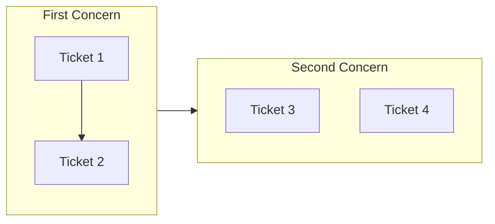

[English](artifacts.md) | [日本語](artifacts_ja.md)

# Artifacts

Documentation artifacts generated during development workflows.

## ticket

An implementation work request that captures what should change and records what happened.

### Definition

A ticket defines a discrete unit of work to be implemented. It captures intent, context, and implementation steps before coding begins. Tickets are change-focused, describing what should be different after implementation. They live in `.workaholic/tickets/todo/` when active, `.workaholic/tickets/icebox/` when deferred, and `.workaholic/tickets/archive/<branch>/` when completed.

Tickets include YAML frontmatter with structured metadata:

- `created_at`: Creation timestamp (ISO 8601 datetime)
- `author`: Git email of the creator
- `type`: enhancement, bugfix, refactoring, or housekeeping
- `layer`: Architectural layers affected (UX, Domain, Infrastructure, DB, Config)
- `effort`: Time spent on implementation (filled after completion)
- `commit_hash`: Short git hash (set by archive script after commit)
- `category`: Added, Changed, or Removed (set by archive script based on commit message)

Ticket files created by `/ticket` are automatically included in `/drive` commits via `git add -A`. When archived, the ticket becomes the single source of truth for change metadata, eliminating the need for separate changelog files.

### Usage Patterns

- **Directory names**: `.workaholic/tickets/todo/`, `.workaholic/tickets/icebox/`, `.workaholic/tickets/archive/`
- **File names**: `20260123-123456-feature-name.md` (timestamp-prefixed)
- **Code references**: "Create a ticket with `/ticket`", "Archive the ticket"

### Related Terms

- spec, story

## spec

Current state documentation that provides an authoritative reference snapshot.

### Definition

Specs document the present reality of the codebase. Unlike tickets (which describe changes), specs describe what exists now. They are updated via the spec-writer subagent (invoked by `/report`) to reflect the current state after changes are made. Specs reduce cognitive load by providing a single source of truth.

### Usage Patterns

- **Directory names**: `.workaholic/specs/`
- **File names**: `architecture.md`, `api-reference.md`
- **Code references**: "Check the spec for...", "Update specs to reflect..."

### Related Terms

- ticket, story

### Inconsistencies

- The `/ticket` command description mentions "implementation spec" which conflates ticket and spec terminology

## story

A comprehensive document that serves as the single source of truth for PR descriptions.

### Definition

A story synthesizes the motivation, progression, and outcome of development work across multiple tickets on a single branch. Stories are generated during the PR workflow and contain the complete PR description content: Topic Tree (visual flowchart), Summary (from ticket titles), Motivation, Journey, Changes (detailed explanations), Outcome, Performance (metrics and decision review), and Notes. The story content (minus YAML frontmatter) is copied directly to GitHub as the PR body.

Stories gather data directly from archived tickets, extracting frontmatter fields (`commit_hash`, `category`) and content sections (Overview, Final Report) to build the narrative.

### Usage Patterns

- **Directory names**: `.workaholic/stories/`
- **File names**: `<branch-name>.md`
- **Code references**: "The branch story captures...", "Story is copied to PR..."

### Related Terms

- ticket

## changelog

The root CHANGELOG.md file that aggregates all historical changes.

### Definition

The root `CHANGELOG.md` maintains a historical record of all changes across all branches. Entries are generated from archived tickets during PR creation. Each entry includes a commit hash, brief description, and link to the originating ticket. Branch changelogs (`.workaholic/changelogs/`) no longer exist; tickets serve as the single source of truth for change metadata.

### Usage Patterns

- **File names**: Root `CHANGELOG.md` only
- **Code references**: "CHANGELOG entries", "Update root CHANGELOG"

### Related Terms

- ticket, story

## topic-tree

A visual flowchart diagram showing the structure and progression of changes in a story.

### Definition

The topic tree is a Mermaid flowchart placed at the beginning of a story (section 0) that provides a visual overview of how tickets relate to each other. It groups tickets by concern/purpose using subgraphs, shows decision-making progression with arrows, and helps PR reviewers quickly understand the scope and structure of changes before reading the detailed narrative.

Format:

### Usage Patterns

- **Directory names**: N/A (content within story files)
- **File names**: Appears in `.workaholic/stories/<branch-name>.md`
- **Code references**: "Generate topic tree for the story", "The topic tree shows..."

### Related Terms

- story, ticket, Mermaid
