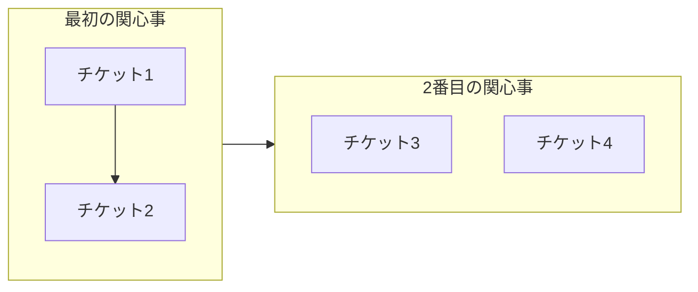

[English](artifacts.md) | [日本語](artifacts_ja.md)

# 成果物

開発ワークフロー中に生成されるドキュメント成果物。

## ticket

何を変更すべきかを記録し、何が起こったかを記録する実装作業リクエスト。

### 定義

チケットは実装される作業の離散的な単位を定義します。コーディング開始前に意図、コンテキスト、実装ステップを記録します。チケットは変更に焦点を当て、実装後に何が異なるべきかを記述します。アクティブな場合は`.workaholic/tickets/todo/`、延期された場合は`.workaholic/tickets/icebox/`、完了した場合は`.workaholic/tickets/archive/<branch>/`に存在します。

チケットには構造化メタデータを持つYAMLフロントマターが含まれます：

- `created_at`: 作成タイムスタンプ（ISO 8601日時）
- `author`: 作成者のGitメール
- `type`: enhancement、bugfix、refactoring、housekeepingのいずれか
- `layer`: 影響を受けるアーキテクチャレイヤー（UX、Domain、Infrastructure、DB、Config）
- `effort`: 実装にかかった時間（完了後に記入）
- `commit_hash`: 短いgitハッシュ（コミット後にアーカイブスクリプトが設定）
- `category`: Added、Changed、Removed（コミットメッセージに基づいてアーカイブスクリプトが設定）

`/ticket`で作成されたチケットファイルは`/drive`コミット時に`git add -A`で自動的に含まれます。アーカイブされると、チケットは変更メタデータの単一の真実の情報源となり、個別のchangelogファイルが不要になります。

### 使用パターン

- **ディレクトリ名**: `.workaholic/tickets/todo/`、`.workaholic/tickets/icebox/`、`.workaholic/tickets/archive/`
- **ファイル名**: `20260123-123456-feature-name.md`（タイムスタンプ接頭辞付き）
- **コード参照**: 「`/ticket`でチケットを作成」、「チケットをアーカイブ」

### 関連用語

- spec、story

## spec

権威あるリファレンススナップショットを提供する現状ドキュメント。

### 定義

スペックはコードベースの現在の現実をドキュメント化します。（変更を記述する）チケットとは異なり、スペックは現在存在するものを記述します。変更が行われた後にspec-writerサブエージェント（`/story`で呼び出される）で更新され、現在の状態を反映します。スペックは単一の真実の情報源を提供することで認知負荷を軽減します。

### 使用パターン

- **ディレクトリ名**: `.workaholic/specs/`
- **ファイル名**: `architecture.md`、`api-reference.md`
- **コード参照**: 「スペックを確認して...」、「スペックを更新して反映...」

### 関連用語

- ticket、story

### 不整合

- `/ticket`コマンドの説明で「implementation spec」と言及しており、ticketとspecの用語が混同されている（「write a ticket」または「plan a change」であるべき）

## story

PR説明文の単一の真実の情報源として機能する包括的なドキュメント。

### 定義

ストーリーは、単一のブランチで複数のチケットにわたる開発作業の動機、進行、結果を統合します。ストーリーはPRワークフロー中に生成され、11のセクションにわたる完全なPR説明文の内容を含みます：Summary（概要段落付き）、Motivation、Journey（埋め込みTopic Treeフローチャート付き）、Changes（カテゴリ別サブセクション付き）、Outcome、Performance（埋め込みメトリクス付き）、Decisions（主要なアーキテクチャの選択）、Risks（トレードオフと軽減策）、Release Preparation（リリース可能性判定と指示）、Notes。ストーリーの内容（YAMLフロントマターを除く）はPRボディとしてそのままGitHubにコピーされます。

ストーリーはアーカイブされたチケットから直接データを収集し、フロントマターフィールド（`commit_hash`、`category`）とコンテンツセクション（Overview、Final Report）を抽出してナラティブを構築します。

### 使用パターン

- **ディレクトリ名**: `.workaholic/stories/`
- **ファイル名**: `<branch-name>.md`
- **コード参照**: 「ブランチストーリーは...を記録する」、「ストーリーはPRに...コピーされる」

### 関連用語

- ticket

## changelog

すべてのブランチの変更履歴を集約するルートCHANGELOG.mdファイル。

### 定義

ルート`CHANGELOG.md`はすべてのブランチにわたるすべての変更の履歴記録を維持します。エントリはPR作成時にアーカイブされたチケットから生成されます。各エントリにはコミットハッシュ、簡単な説明、元のチケットへのリンクが含まれます。ブランチchangelog（`.workaholic/changelogs/`）はもう存在せず、チケットが変更メタデータの単一の真実の情報源として機能します。

### 使用パターン

- **ファイル名**: ルート`CHANGELOG.md`のみ
- **コード参照**: 「CHANGELOGエントリ」、「ルートCHANGELOGを更新」

### 関連用語

- ticket、story

## journey

開発の進行と意思決定を要約するストーリー内のナラティブセクション。

### 定義

journeyはストーリードキュメントのセクション3で、開発がどのように進行したかのハイレベルなナラティブを提供します。個々のチケットの詳細ではなく、フェーズと転換点に焦点を当て、通常100〜200語程度です。journeyは「どのようにしてここに至ったか？」に答え、Changesセクション（セクション4）は詳細な「何が変わったか？」を提供します。Topic Treeフローチャートはジャーニーセクションの冒頭に埋め込まれ、ナラティブを補完するビジュアルな概要を提供します。

注：ストーリーは現在11のセクション（Summary、Motivation、Journey、Changes、Outcome、Performance、Decisions、Risks、Release Preparation、Notes）を持ちますが、Journeyセクションは位置3のままです。

### 使用パターン

- **ディレクトリ名**: N/A（ストーリーファイル内のセクション）
- **ファイル名**: `.workaholic/stories/<branch-name>.md`内に表示
- **コード参照**: 「Journeyセクションは...を記述する」、「Journeyは簡潔に」

### 関連用語

- story、topic-tree、changes

## topic-tree

ストーリー内の変更の構造と進行を示すビジュアルフローチャート図。

### 定義

topic treeはストーリーのジャーニーセクション（セクション3）内に埋め込まれるMermaidフローチャートで、チケット同士がどのように関連しているかの視覚的な概要を提供します。サブグラフを使用して関心事/目的別にチケットをグループ化し、矢印で意思決定の進行を示し、PRレビュアーがナラティブテキストを読む前に変更の範囲と構造をすばやく理解できるようにします。

形式:


フローチャートは左から右へのレイアウト（`flowchart LR`）を使用し、サブグラフで関心事やテーマを表現します。矢印は意思決定の進行（AがBに繋がった）を示し、`&`構文は並行/独立した作業を示します。

### 使用パターン

- **ディレクトリ名**: N/A（ストーリーファイル内のコンテンツ）
- **ファイル名**: `.workaholic/stories/<branch-name>.md`内に表示
- **コード参照**: 「ストーリーのtopic treeを生成」、「topic treeは...を示す」

### 関連用語

- story、ticket、Mermaid

## changes

各チケット/コミットとその説明を列挙するストーリー内の詳細セクション。

### 定義

changesセクションはストーリードキュメントのセクション4で、ブランチの開発中に行われたすべての変更の包括的なリストを提供します。Journeyセクション（要約されたナラティブを提供）とは異なり、Changesはチケット/コミットごとに1つのサブセクションを`### 4.N. <チケットタイトル> ([hash](commit-url))`の形式で列挙します。各サブセクションにはチケットのOverviewからの簡単な1〜2文の説明が含まれ、Journeyの「どのようにしてここに至ったか？」に対する詳細な「何が変わったか？」の補完として機能します。

### 使用パターン

- **ディレクトリ名**: N/A（ストーリーファイル内のセクション）
- **ファイル名**: `.workaholic/stories/<branch-name>.md`内に表示
- **コード参照**: 「Changesセクションは...を列挙する」、「Changesではチケットごとに1つのサブセクション」

### 関連用語

- story、journey、ticket、commit

## related-history

コンテキストのために類似領域に触れた過去のチケットへリンクするチケットセクション。

### 定義

チケットのRelated Historyセクションは、同様のファイル、レイヤー、または関心事に触れた過去にアーカイブされたチケットへのリンクを提供します。これにより、開発者は新しい作業を実装する際に過去の決定とパターンを理解できます。各エントリはGitHubのマークダウンプレビューでナビゲート可能にするため、リポジトリ相対パスを持つマークダウンリンクを使用します。

形式:
```markdown
## Related History

<要約文>

Past tickets that touched similar areas:

- [filename.md](full/path/to/archived/ticket.md) - 説明（一致理由）
```

`create-ticket`スキルは以下を検索して関連履歴を見つける方法を指示します：
- 同じファイルに触れたチケット
- 同じアーキテクチャレイヤーのチケット
- 類似の関心事や用語を持つチケット

### 使用パターン

- **ディレクトリ名**: N/A（チケットファイル内のセクション）
- **ファイル名**: `.workaholic/tickets/todo/<ticket>.md`内に表示
- **コード参照**: 「Related Historyセクションを追加」、「Related Historyでアーカイブされたチケットをリンク」

### 関連用語

- ticket、archive

## final-report

計画された実装からの逸脱と発見された学習を記録するチケットセクション。

### 定義

Final Reportは、チケットファイルの末尾にあるセクション（オプション）で、計画された実装と実際の実装の違いを記録します。開発が概要と実装ステップで説明したとおりに進行した場合、Final Reportは「Development completed as planned」と簡潔に述べることができます。逸脱が発生した場合、このセクションは何が変更されたか、そしてなぜかを説明します（例：「Implementation deviated from original plan: Changed X because Y」）。Final Reportはまた、作業中に発見されたアーキテクチャの学習をキャプチャする、オプションの「Discovered Insights」サブセクションを含むことができます。Final Reportは、将来の読み手が意思決定と予期しない発見を理解するのに役立つ開発の旅の記録です。

形式:
```markdown
## Final Report

Development completed as planned.

[オプション: Implementation deviated from original plan: Changed X because Y]

[オプション: ### Discovered Insightsセクション、学習を含む]
```

### 使用パターン

- **ディレクトリ名**: N/A（チケットファイル内のセクション）
- **ファイル名**: `.workaholic/tickets/archive/<branch>/<ticket>.md`内に表示
- **コード参照**: 「Final Reportセクションを追加」、「逸脱についてFinal Reportを確認」

### 関連用語

- ticket、discovered-insights、archive

## failure-analysis

実装が失敗した理由と何が試みられたかを記録するチケットセクション。

### 定義

Failure Analysisセクションは、開発者が`/drive`ワークフロー承認中にチケットを放棄することを選択した場合、チケットに追加されます。このセクションは失敗した試みから貴重な学習をキャプチャし、以下に答えます：何が試みられたのか、なぜそれが失敗したのか、そしてこれが将来の試みにどのような見方を提供するのか。分析はチケットを`.workaholic/tickets/fail/`に移動させるときにコミットされ、学習をgit履歴に保存します。これにより、失敗したチケットが将来の開発決定に情報を提供できる履歴レコードに変わります。

形式:
```markdown
## Failure Analysis

- **What was attempted**: <実装アプローチの説明>
- **Why it failed**: <失敗の技術的またはアーキテクチャ上の理由>
- **Insights for future**: <コードベースについて何を教えてくれるか>
```

### 使用パターン

- **ディレクトリ名**: N/A（チケットファイル内のセクション）
- **ファイル名**: `.workaholic/tickets/fail/<ticket>.md`内に表示
- **コード参照**: 「Failure Analysisセクションを追加」、「放棄されたチケットでfailure-analysisを確認」

### 関連用語

- ticket、abandon、final-report

## discovered-insights

実装中に発見された意味のある学習をキャプチャするオプションのチケットセクション。

### 定義

Discovered Insightsはチケットの「Final Report」内のオプションのサブセクションで、実装作業中に発見されたアーキテクチャパターン、コード関係、歴史的コンテキスト、またはエッジケースを記録します。概要（計画された変更を説明する）や実装ステップ（手順を説明する）と異なり、Discovered Insightsは数ヶ月後にチケットを読む開発者に役立つ予期しない学習をキャプチャします。洞察は実行可能で具体的であり、曖昧な観察は避けるべきです。

形式:
```markdown
### Discovered Insights

- **Insight**: <発見されたもの>
  **Context**: <コードベース理解にとって重要である理由>
```

意味のある洞察のカテゴリ：
- **Architectural patterns**: ドキュメント化されていない隠された設計上の決定またはコンベンション
- **Code relationships**: コンポーネント間の非明白な依存関係またはカップリング
- **Historical context**: 現在の形式で何かが存在する理由（git blameまたはコメント経由で発見）
- **Edge cases**: 将来の開発者が知るべきゴッチャまたは驚くべき動作

### 使用パターン

- **ディレクトリ名**: N/A（Final Report内のサブセクション）
- **ファイル名**: `.workaholic/tickets/archive/<branch>/<ticket>.md`内に表示
- **コード参照**: 「Final Reportに「Discovered Insights」を追加」、「関連するチケットから洞察をチェック」

### 関連用語

- ticket、final-report、archive
