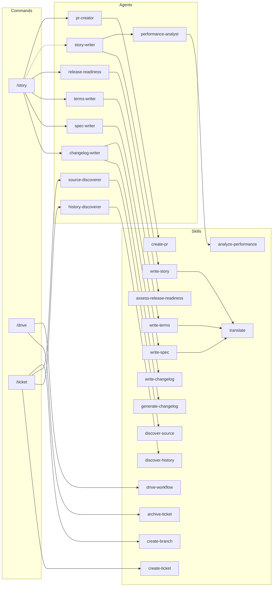

# Allow Skill-to-Skill Nesting

## Overview

Relax the architecture policy to allow skills to preload other skills via `skills:` frontmatter. This enables reusable cross-cutting concerns (like translation) to be composed at the skill level rather than requiring agents to explicitly preload each dependency. Move translate skill preloading from agents (spec-writer, story-writer) to skills (write-spec, write-story).

## Related History

| Ticket | Relevance |
|--------|-----------|
| [document-nesting-policy](../archive/feat-20260128-001720/20260128004700-document-nesting-policy.md) | Established current architecture policy prohibiting skill → skill |
| [extract-agent-content-to-skills](../archive/feat-20260126-214833/20260127204529-extract-agent-content-to-skills.md) | Refactored agents to preload comprehensive skills |
| [merge-enforce-i18n-into-translate](../archive/feat-20260128-001720/20260128002918-merge-enforce-i18n-into-translate.md) | Consolidated translation skills |

## Key Files

| File | Purpose |
|------|---------|
| `CLAUDE.md` | Architecture policy with nesting rules table |
| `.workaholic/specs/architecture.md` | Dependency diagram and architecture documentation |
| `.workaholic/specs/architecture_ja.md` | Japanese translation |
| `plugins/core/skills/write-spec/SKILL.md` | Spec writing skill (will preload translate) |
| `plugins/core/skills/write-story/SKILL.md` | Story writing skill (will preload translate) |
| `plugins/core/agents/spec-writer.md` | Agent currently preloading translate (to remove) |
| `plugins/core/agents/story-writer.md` | Agent currently preloading translate (to remove) |

## Implementation

### 1. Update Architecture Policy in CLAUDE.md

Modify the nesting rules table to allow skill → skill:

**Before:**
```
| Skill    | —                  | Subagent, Command   |
```

**After:**
```
| Skill    | Skill              | Subagent, Command   |
```

Update the Allowed/Prohibited lists:

**Add to Allowed:**
```
- Skill → Skill (preload via `skills:` frontmatter for composable knowledge)
```

**Update Prohibited (remove skill → skill):**
```
- Skill → Subagent (skills are passive knowledge, not orchestrators)
- Skill → Command (skills cannot invoke user-facing commands)
```

### 2. Add skills: Frontmatter to write-spec Skill

Update `plugins/core/skills/write-spec/SKILL.md` frontmatter:

```yaml
---
name: write-spec
description: Spec document structure, formatting rules, and guidelines for updating .workaholic/specs/.
allowed-tools: Bash
skills:
  - translate
user-invocable: false
---
```

### 3. Add skills: Frontmatter to write-story Skill

Update `plugins/core/skills/write-story/SKILL.md` frontmatter:

```yaml
---
name: write-story
description: Story content structure, templates, and writing guidelines for branch narratives.
allowed-tools: Bash
skills:
  - translate
user-invocable: false
---
```

### 4. Remove translate from Agent Preloads

Update `plugins/core/agents/spec-writer.md`:

**Before:**
```yaml
skills:
  - write-spec
  - translate
```

**After:**
```yaml
skills:
  - write-spec
```

Update `plugins/core/agents/story-writer.md`:

**Before:**
```yaml
skills:
  - write-story
  - translate
```

**After:**
```yaml
skills:
  - write-story
```

### 5. Update Dependency Diagram in architecture.md

Update the dependency graph in `.workaholic/specs/architecture.md` to show:
- Skills can now depend on other skills
- write-spec → translate
- write-story → translate
- Remove spw → tr and sw → tr connections
- Add wsp → tr and ws → tr connections

Update the diagram:



### 6. Update architecture_ja.md

Apply the same diagram changes to the Japanese translation.

### 7. Update Architecture Policy Section in architecture.md

Update the "Architecture Policy" section text to reflect the new rule:

```markdown
| Caller   | Can invoke         | Cannot invoke       |
| -------- | ------------------ | ------------------- |
| Command  | Skill, Subagent    | -                   |
| Subagent | Skill              | Subagent, Command   |
| Skill    | Skill              | Subagent, Command   |
```

Add explanation: "Skills can preload other skills for composable knowledge (e.g., write-spec preloads translate for i18n enforcement)."

## Verification

1. Verify CLAUDE.md nesting rules table is updated
2. Verify write-spec and write-story skills have `skills: [translate]` in frontmatter
3. Verify spec-writer and story-writer agents no longer list translate in skills
4. Verify dependency diagram shows skill → skill connections
5. Verify architecture_ja.md has matching updates
