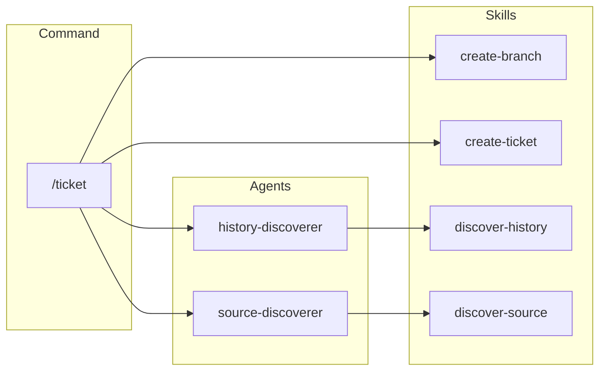
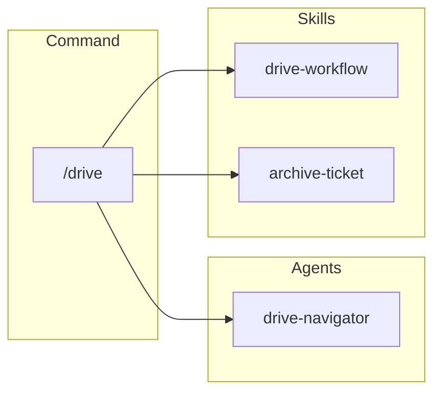
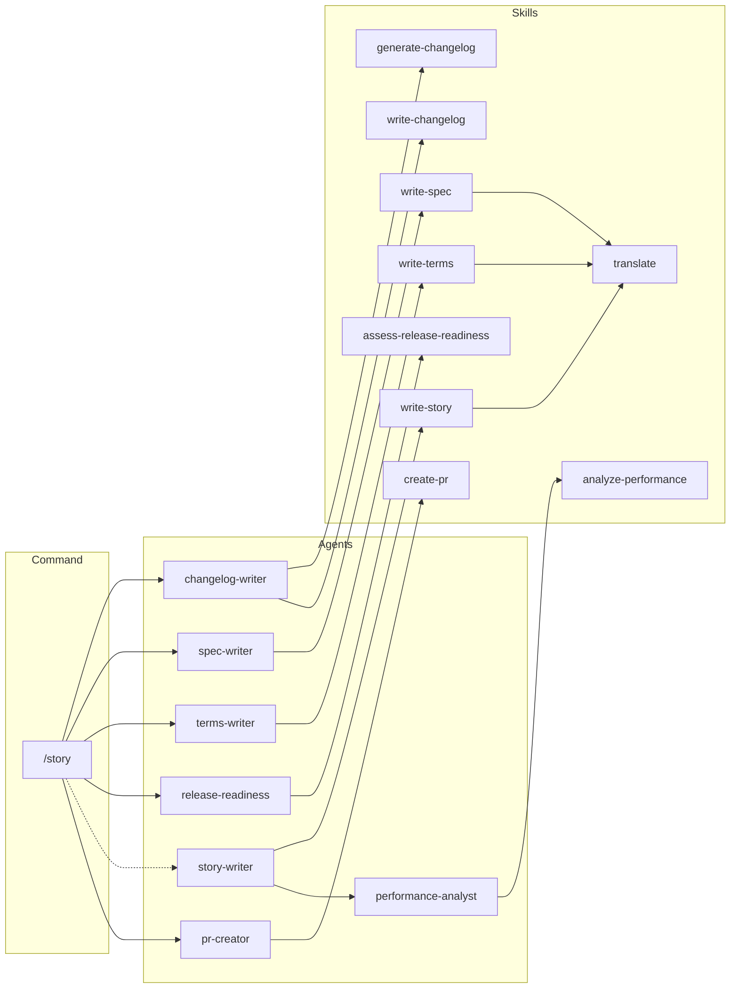

# Split Dependency Graph by Command

## Overview

Replace the single monolithic dependency graph in `architecture.md` with three focused diagrams, one per command (`/ticket`, `/drive`, `/story`). This improves readability by showing only the relevant agents and skills for each command, making the architecture easier to understand at a glance.

## Related History

| Ticket | Relevance |
|--------|-----------|
| [add-command-flow-spec](../archive/feat-20260128-220712/20260129020653-add-command-flow-spec.md) | Created command-flows.md with separate diagrams per command |
| [fix-mermaid-slash-in-labels](todo/20260131150915-fix-mermaid-slash-in-labels.md) | Fixes slash character escaping in node labels |
| [allow-skill-to-skill-nesting](todo/20260131153043-allow-skill-to-skill-nesting.md) | Updates dependency diagram with skill-to-skill connections |

## Key Files

| File | Purpose |
|------|---------|
| `.workaholic/specs/architecture.md` | Current monolithic dependency graph |
| `.workaholic/specs/architecture_ja.md` | Japanese translation |
| `.workaholic/specs/command-flows.md` | Reference for per-command diagram style |

## Implementation

### 1. Replace Single Diagram with Three Command-Scoped Diagrams

In `architecture.md`, replace the current "Dependency Graph" section with:

#### /ticket Dependencies



#### /drive Dependencies



#### /story Dependencies



### 2. Update Section Header and Description

Change section title from "Dependency Graph" to "Command Dependencies" with updated description:

```markdown
## Command Dependencies

These diagrams show how each command invokes agents and skills at runtime. Commands are thin orchestrators that delegate work to specialized components.
```

### 3. Remove Consolidated Note

Remove the current note explaining parallel execution (this is now clear from the individual diagrams).

### 4. Apply Same Changes to architecture_ja.md

Update the Japanese translation with the same three diagrams and translated descriptions.

## Verification

1. Verify three separate diagrams render correctly on GitHub
2. Verify each diagram only shows components relevant to that command
3. Verify skill-to-skill dependencies are shown where applicable
4. Verify node labels with "/" are properly quoted
5. Verify architecture_ja.md matches the English version
