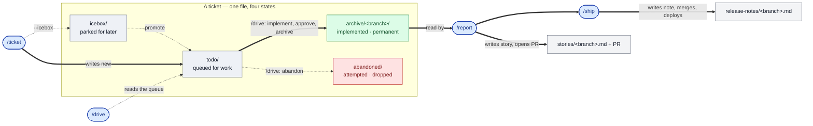
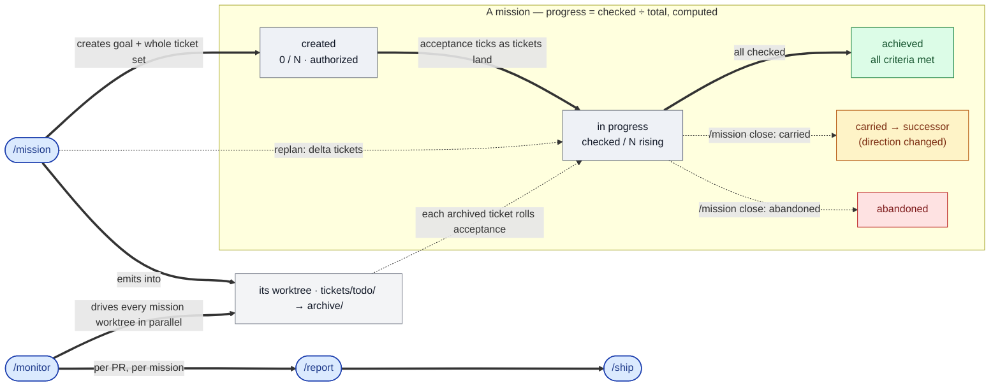
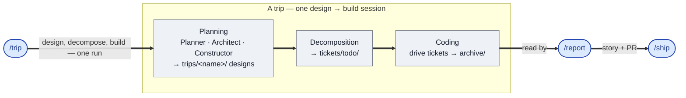
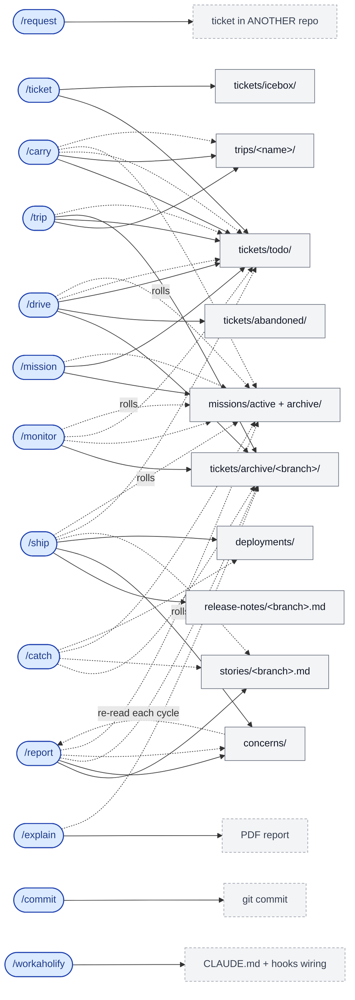
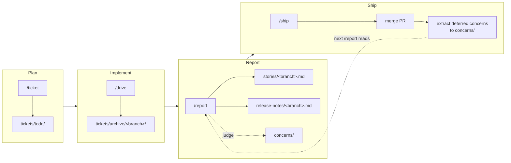

# Workaholic

The development workflows we use at [qmu](https://github.com/qmu), written down so our coding agents can run them the way we do. They're tuned to how we work, so they may not fit everyone, and they'll keep changing as we do. We keep it public so the people we work with can share the same base.

**Concretely**, it's a cross-agent distribution of structured development workflows and engineering-standard skills: ticket-driven development, AI-collaborative exploration, and the engineering-policy index (the `planning` / `design` / `implementation` / `operation` skills, mirrored from qmu.co.jp). It's richest on **Claude Code** (a plugin marketplace: slash commands, hooks, `/trip` Agent Teams); the same skills install on **Codex**, **OpenCode**, and 40+ other agents via the [Agent Skills standard](https://skills.sh). Authored once under `plugins/`, generated into portable artifacts under `outputs/`.

> [!WARNING]
> **This drives git on your behalf.** Workaholic lets your coding agent autonomously create branches, commit, amend, push, and open pull requests. Review the plugin/skill descriptions below before installing so you know what to expect.

## Quick Start (Claude Code)

```bash
claude
/plugin marketplace add qmu/workaholic
```

Enable the plugins you want after installation. Auto update is recommended. For Codex, OpenCode, and other agents, see [Use with other coding agents](#use-with-other-coding-agents) below.

## Use with other coding agents

Workaholic follows the cross-agent [Agent Skills standard](https://skills.sh). What's portable:

- **Policy skills** (`planning` / `design` / `implementation` / `operation`) — the engineering-policy index (pure prose, self-contained): title, one-line summary, and canonical qmu.co.jp link per policy, organized into the 企画 / 設計 / 実装 / 運用 pillars. Available on every Agent-Skills agent.
- **`write-release-note`** — release-note structure guidance (pure prose).
- **Workflows** — `create-ticket`, `drive`, `report`, `ship`, `catch`, `mission` as agent-neutral skills (`trip` stays Claude-only; it needs Agent Teams). On non-Claude agents the workflow runs the same steps without Claude's parallel subagents/`AskUserQuestion` — see each skill's **Agent Compatibility** note.
- **[Open Knowledge Format](https://github.com/GoogleCloudPlatform/knowledge-catalog/tree/main/okf) (OKF v0.1)** — two surfaces, no install needed. The committed `outputs/okf/` bundle exposes the four pillars' policy hard copies to any OKF reader straight from the repo path; and every project using the plugin gets an OKF-compatible `.workaholic/` tree — generated documents carry `type` frontmatter and the workflows regenerate the `index.md` hierarchy (entry point: `.workaholic/index.md`) before each knowledge commit.

### Install matrix

| Agent | How |
| ----- | --- |
| **Claude Code** | `/plugin marketplace add qmu/workaholic` (slash commands `/ticket`, `/drive`, `/report`, `/ship`, `/trip`) |
| **OpenAI Codex** | `codex plugin marketplace add qmu/workaholic --ref main`<br>`codex plugin add workaholic@workaholic`<br>`codex plugin add workflows@workaholic` |
| **Cursor / OpenCode / Pi / 50+** | `npx skills add qmu/workaholic` (exposes `workaholic` + `workflows`) |

### How the workflows reach other agents

The workflow skills share helper scripts across `plugins/workaholic` via the Claude-only `${CLAUDE_PLUGIN_ROOT}` token, so they are not self-contained in source. `scripts/build-plugins` generates **self-contained** copies (each skill bundling its own scripts, references rewritten to relative paths) and assembles one neutral, committed plugin under `outputs/workflows/`. That single dir serves every non-Claude agent: Codex via `.agents/plugins/marketplace.json` (and the co-located `.codex-plugin/plugin.json`), and OpenCode/Cursor/40+ via the `skills` CLI reading the `workflows` entry in `.claude-plugin/marketplace.json`. Regenerate after changing a workaholic workflow skill:

```bash
node scripts/build-plugins/build.mjs   # regenerate outputs/workflows artifacts (no args = full build)
node scripts/build-plugins/verify.mjs  # assert every script reference resolves
```

The `plugins/workaholic` source stays Claude-Code-only (`metadata.internal: true`, `${CLAUDE_PLUGIN_ROOT}`); the committed `outputs/workflows/` artifacts are the public, portable versions, kept in sync by the `Outputs Freshness` CI check. The `workaholic` plugin's commands/hooks/Agent Teams remain Claude-Code-only.

## The plugin

`workaholic` is a single plugin combining ticket-driven development (TiDD), AI-collaborative exploration, and context-aware reporting/shipping, plus the engineering-policy index. It auto-detects your development context from the current branch pattern.

| Command    | What it does                                          |
| ---------- | ----------------------------------------------------- |
| `/ticket`  | Plan a change with context and steps (bare `/ticket` or `/ticket summary` reports your assigned todo tickets instead) |
| `/drive`   | Implement queued tickets one by one (add "night" for an autonomous overnight run with a morning report) |
| `/report`  | Context-aware: generate story or journey report and create PR (warns on the branch-safety scan — credentials/oversize/leakage) |
| `/ship`    | Context-aware: merge PR, deploy, verify, and publish the GitHub Release (blocks pre-merge on the branch-safety scan; secrets are non-overridable) |
| `/mission` | Track a long-lived goal spanning many tickets: create one (interrogates you to a drive-ready state, then spins up a dedicated `.worktrees/<slug>/` worktree holding the mission statement and the **whole** ordered ticket set it emitted), list missions with computed progress, show just **your** assigned active missions (`/mission summary`), or close one (achieved / abandoned / **carried** — done as framed, with the unmet criteria carried into a successor mission) into the archive area (tearing down its worktree). When a mission's **direction changes** mid-flight, **reorganize-and-carry** is the encouraged move — replan to drop the now-moot criteria, then `carried` into a fresh or existing successor — over grinding to `achieved` or `abandoned` |
| `/monitor` | Run your missions in parallel, front-loaded then unattended: a confirmed pre-flight over **all** your assigned missions by default (no "which to drive" prompt) — a whole-roadmap progress headline, position, eligibility, interference, and a reevaluation that auto-applies mechanical replans silently and asks only genuine design rulings — with every foreseeable escalation resolved in **one up-front batch** (the run's only interaction point). Then it runs long and unattended: one leaf per mission worktree owning the whole of that worktree's work — a mission needing a replan has it *applied* by its own leaf, not the main agent, then drives — while the main agent stays a thin dispatcher (only the up-front prompts a leaf cannot issue, tuning wave size down for interference/resource load), looping until every mission completes or only escalation-blocked items remain; after dispatch nothing is asked — mid-run items are deferred and recorded for the morning, and a mission whose **direction changed** is flagged for **reorganize-and-carry** (replan, then `carried`) rather than presented to grind. Terminal line is honest and derived from `status.sh`: `ok` only on genuine completion, else `pending` with an N/M-complete/K-blocked reconciliation (for caller-side loops like `/goal /monitor ok`) |
| `/trip`    | Agent Teams session: collaborative design, decomposed into tickets and driven (`/trip summary` reports trips + the todo queue, read-only) |

> [!NOTE]
> `/trip` requires `CLAUDE_CODE_EXPERIMENTAL_AGENT_TEAMS=1` to be set in your environment.

**Engineering-policy skills** (`planning` / `design` / `implementation` / `operation`): a catalog mirrored from qmu.co.jp giving each policy's title, one-line summary, and canonical link, organized into the 企画 (planning — grounding a project in business, market, and legal context before design begins), 設計 (design), 実装 (implementation, sub-grouped by 妥当性 / 可用性 / アクセシビリティ), and 運用 (operations) pillars. Pure prose, exposed on every Agent-Skills agent. Security (安全) and working-practice (執務) policies live elsewhere on qmu.co.jp and are out of scope.

> [!NOTE]
> **How policies stay in sync.** The canonical articles live on [qmu.co.jp](https://qmu.co.jp) — that is the source of truth. This repo carries an English hard copy of each one under the matching policy skill's `policies/` directory, and every file's frontmatter `source:` links back to its canonical article, so the platform and the website share the same knowledge. When the canonical articles change, the refresh arrives as a `standards-sync/*` pull request that updates the hard copies; merging it (with a version bump) republishes the index so every agent installing by repo path picks up the new wording. The sync is produced upstream and lands as a PR — there is no policy-fetching step this repo runs on its own.

**Typical drive session:**

```bash
/ticket add dark mode toggle to settings page
/ticket support system preference detection
/drive                            # implement both, confirm each
/ticket fix flash of light theme on page load
/drive                            # fix discovered issue
/report                           # generate story + create PR
/ship                             # merge, deploy, verify
```

**Typical trip session:**

```bash
/trip design a real-time notification system for our web app
# Three agents collaborate:
#   Planner  — defines direction from user/stakeholder perspective
#   Architect — models system structure and boundaries
#   Constructor — designs implementation with engineering trade-offs
# All work happens in an isolated worktree branch
/report                           # generate journey report + create PR
/ship                             # merge, clean up worktree, verify
```

## How It Works

### Ticket-Driven Development

A ticket is a markdown file describing a change you want to make — the context, plan, and rationale. Run `/ticket your change request` and a coding agent explores both codebase and history, then writes the ticket for you. Committed alongside the code, tickets become searchable history for future coding agents.

Once tickets are queued, `/drive` implements them one by one with confirmation at each step. While one agent drives, others can keep creating tickets — no worktree overhead, just serial execution with clear commits.

When ready to deliver, `/report` generates changelogs and PR descriptions from the accumulated ticket history. Then `/ship` deploys and confirms in production *before* merging — it follows the `## Deploy` instructions in your project's `CLAUDE.md` (or a `.workaholic/deployments/` entry), verifies via the project's `## Verify` steps, and merges the PR as the final, evidence-gated step.

> [!NOTE]
> **A flavor of Spec-Driven Development**
>
> This follows [Spec-Driven Development](https://martinfowler.com/articles/exploring-gen-ai/sdd-3-tools.html) principles with distinct terminology:
>
> - **Ticket**: A change request describing what should be different (flowing, temporal)
> - **Spec**: Current state documentation describing what exists now (snapshot, persistent)
>
> Tickets drive implementation; specs document the result. Both are markdown, both are versioned, but they serve complementary purposes.

### AI-Collaborative Exploration

The `/trip` command launches an Agent Teams session where three agents with different perspectives collaborate to explore and develop a concept:

- **Planner** (Progressive) — Non-tech perspective: user value, stakeholder clarity, explanatory accountability
- **Architect** (Neutral) — Structural perspective: system coherence, abstraction quality, boundary integrity
- **Constructor** (Conservative) — Tech perspective: implementation feasibility, performance, maintainability

The session runs in two phases inside an isolated git worktree:
1. **Specification** — Agents produce direction, model, and design artifacts through mutual review, then **decompose the agreed design into tickets** (the same tickets `/drive` consumes). The design artifacts under `.workaholic/trips/` are the *rationale*; the tickets under `.workaholic/tickets/` are the *contract*, each linking back to the design via a **Trip Origin** reference.
2. **Implementation** — Agents **drive the ticket queue** one ticket at a time, keeping their distinct QA roles (Constructor implements, Architect reviews, Planner E2E-tests) as the per-ticket approval gate, archiving each ticket so `/report` and `/ship` work identically to a drive.

So `/trip` and `/drive` converge on the same unit of work — a ticket. The shorthand: **sources fill the queue, executors drain it.**

- **Sources** write tickets into `todo/`: `/ticket` (you, with discovery) and a trip's design **decomposition**.
- **Executors** drain `todo/ → archive/`: `/drive` (solo, with your approval per ticket) and `/trip` (a three-agent team, with review + E2E as the per-ticket gate).

`/trip` is **context-aware**: `/trip <concept>` over an empty queue designs *and* builds; `/trip` over a queue you already wrote just builds it with three-perspective QA (the `ticket → trip` direction); `/trip summary` launches nothing and just reports the trips and todo queue. Either executor reads the same `todo/`, so you can start a trip and finish with `/drive`, or vice versa.

## Artifacts under `.workaholic/`

Working artifacts live in [.workaholic/](.workaholic/README.md). Each artifact captures a snapshot of the code change at a specific point in the workflow — they are not generic documentation. The table below summarizes what gets stored, when it is written, and how it survives (or is eliminated) through the ship process.

The tree is also an [Open Knowledge Format](https://github.com/GoogleCloudPlatform/knowledge-catalog/tree/main/okf) bundle: `.workaholic/index.md` is the entry point (declaring `okf_version`), each knowledge area keeps an `index.md` the workflows regenerate before committing (via the internal `okf` skill's `refresh-index.sh`), and every generated document carries YAML frontmatter with a non-empty `type` — so any OKF reader can walk the project's development knowledge.

### Lifecycle Reference

| Artifact | Written by | Snapshot of | Diffed on ship? | Carried over? | Eliminated when |
| -------- | ---------- | ----------- | --------------- | ------------- | --------------- |
| `tickets/todo/<ts>-*.md` | `/ticket` | Intended change (not yet implemented) | committed as a normal file | no | `/drive` archives it after approval |
| `tickets/archive/<branch>/*.md` | `/drive` (archive) | Implemented change with final report and commit hash | committed, permanent | no — permanent record | never (institutional history) |
| `tickets/icebox/*.md` | `/ticket --icebox` (or manual move) | Deferred change | committed | yes (survives across PRs until promoted) | `/drive` (after user promotes from icebox) |
| `tickets/abandoned/*.md` | `/drive` (abandon flow) | Attempted-then-abandoned change with failure analysis | committed, permanent | no | never |
| `stories/<branch>.md` | `/report` | PR description: overview, journey, outcome, concerns, ideas, release readiness | committed before PR creation | concerns/ideas sections only (extracted by `/ship`) | never (per-branch permanent record) |
| `release-notes/<branch>.md` | `/ship` (before merging) | Concise release narrative for GitHub Releases | committed before merge | no | never |
| `concerns/<pr>-<slug>-<kind>.md` | `/ship` (extract from story) | Unresolved concern or idea surfaced in a past PR | committed during ship | **yes — this is the deferred-concerns corpus**; remains `status: active` until `/report` judges it resolved | judge marks `status: resolved` (file preserved, audit trail intact) |
| `trips/<branch>/*` | `/trip` | Multi-agent collaborative design output (planner/architect/constructor) | committed inside trip worktree | no | never |
| `missions/active/<slug>/mission.md` | `/mission` | Long-lived goal spanning many tickets: goal, scope, acceptance checklist (progress = checked/total), append-only changelog | committed, updated as related work lands | n/a — outlives any branch | `/mission close` flips `status` to `achieved` or `abandoned` and moves the dir to `missions/archive/<slug>/` (file and changelog preserved) |
| `specs/*.md` | manual (hand-edited reference) | Current-state documentation of how things work today | committed | n/a — not branch-scoped | superseded when manually rewritten |
| `guides/*.md` `policies/*.md` `terms/*.md` | manual | Persistent reference material (user docs, policies, glossary) | committed | n/a | superseded when manually rewritten |

### Command ⇄ artifact maps, by development style

The plugin has one spine — the **ticket** — but the work reaches it through different front doors depending on how it starts. Each map below is one **development style**, and all of them converge on the same tail: `/report` writes the branch story and opens the PR, then `/ship` writes the release note, merges, and deploys. Node style is constant across every map — rounded **blue** = a command, rectangular **grey** = an artifact it writes, **green** = a completed/permanent state, **amber** = carried forward, **red** = dropped. Solid arrow = writes / drives; dashed arrow = reads.

#### Use case 1 — Everyday development: `/ticket` → `/drive`

The unit of work is a single ticket, and it is really *one file that changes state* as commands act on it. `/ticket` writes it into the queue; `/drive` reads the queue, implements it, and moves it to the permanent archive (or, if the attempt is dropped, to `abandoned/`). Then the shared tail turns the archived work into a merged, deployed PR.



The ticket's resting places **are** its states: `todo/` (queued), `icebox/` (parked until promoted), `archive/<branch>/` (implemented, permanent history), and `abandoned/` (attempted then dropped). `/ticket` only ever writes into `todo/` or `icebox/`; `/drive` is the only command that moves a ticket *out* of `todo/`, into exactly one terminal state — then hands the archived work to `/report` → `/ship`.

#### Use case 2 — Mission-centric: `/mission` → `/monitor`

When the work is a long-lived goal spanning many tickets, `/mission` is the front door: it interrogates the goal to a drive-ready state and emits the **whole** ticket set into a dedicated worktree. `/monitor` then drives every mission worktree in parallel. The mission itself is the state object — its progress is **computed** as checked ÷ total over the acceptance checklist, ticking up as each ticket archives, until it is achieved, carried into a successor (direction changed), or abandoned.



`/monitor` is the parallel-missions counterpart to `/drive`: one autonomous drive per mission worktree, rolling each mission's acceptance as its tickets archive, then `/report` → `/ship` per mission's PR. A mission whose direction changed mid-flight is closed **carried** — reorganized, its remainder inherited by a successor — rather than force-completed.

#### Use case 3 — Trip-centric: `/trip`

When the work needs design before build, `/trip` runs an Agent-Teams session (Planner · Architect · Constructor) as one continuous run: it produces the design rationale under `trips/<name>/`, decomposes it into tickets, and drives them — Planning → Decomposition → Coding — before the same shared tail.



A trip's phases live in `trips/<name>/plan.md`; a populated `todo/` queue lets `/trip` skip design and act as an executor instead (it drains the queue like `/drive`). Either way it converges on `/report` → `/ship`.

<details>
<summary><strong>The full map</strong> — every command and every artifact in one graph</summary>

Every command communicates with the others **only through the documents it writes to `.workaholic/`** — no command calls another directly. The single flowchart below covers all thirteen commands at once (rounded **blue** = command, rectangular **grey** = artifact, dashed grey border = an artifact that lands *outside* `.workaholic/`). It is dense on purpose — the per-use-case maps above are the readable slices.



Reading the map:

- **Solid arrow** = the command *generates* that artifact. **Dashed arrow** = the command *reads / refers to* it. `rolls` = the command updates a named mission's `## Changelog` and `## Acceptance` checklist (via the `mission:` relation any ticket/story/concern carries).
- **Node style tells the kind apart.** Rounded **blue** = the thirteen commands; rectangular **grey** = the artifacts they generate. A **dashed grey border** marks the artifacts that land *outside* `.workaholic/` — a cross-repo ticket via `/request`, a printed PDF via `/explain`, a plain working-tree commit via `/commit`, and repo wiring via `/workaholify`.
- **`/mission` and `/monitor` are first-class here.** `/mission` writes `missions/…` and the kickoff/delta tickets into `tickets/todo/`; `/monitor` reads the mission set and each worktree's `todo/`, drains them to `tickets/archive/`, and rolls each mission it advances — the parallel-missions counterpart to `/drive`.
- **The ticket is the spine.** `/ticket`, `/mission`, `/trip`, and `/carry` all *fill* `tickets/todo/`; `/drive`, `/monitor`, and `/trip` all *drain* it to `tickets/archive/` (`/monitor` and `/trip` reuse `/drive`'s archive path). Everything downstream reads the archive.
- **`concerns/` is the only loop.** `/ship` extracts a shipped story's open concerns into `concerns/`; the *next* `/report` re-reads them, judges each, and either carries it into the new story or archives it resolved. Every other artifact is written once and becomes permanent history.
- **Not shown** (to keep the graph legible): `specs/`, `guides/`, `policies/`, `terms/` are hand-maintained reference material, not command-generated; and the OKF `index.md` hierarchy is regenerated automatically by the same commit seams (`/drive`, `/report`, `/ship`) whenever they write knowledge, not by a command of its own.

</details>

### When, Where, and How Changes Occur

The branch lifecycle traverses these artifacts in a fixed order:



**Plan** — `/ticket` writes a new file under `tickets/todo/` describing the intended change. This is the only artifact created before code exists.

**Implement** — `/drive` reads `tickets/todo/`, implements one ticket at a time, and on approval moves the file to `tickets/archive/<branch>/`. The archive subdirectory is named after the current branch so all of a branch's tickets cluster under one folder. Final reports and the resolving `commit_hash` are written into the ticket frontmatter at archive time.

**Report** — `/report` runs after all tickets on a branch are archived. It does four writes in order:
1. Judges every active file in `concerns/` (deferred concerns from past PRs) via a `general-purpose` deferred-concern-judge subagent. Resolved items are moved to `concerns/archive/`; still-active items are passed to the section-reviewer.
2. Writes `stories/<branch>.md` — the full PR description including section 6 (Concerns), each item prefixed with `(carried from PR #N)` if surfaced from the corpus.
3. Commits the story together with any `concerns/` status changes (including moves to `archive/`), so the audit history is coherent.
4. Opens the GitHub PR (`release-notes/<branch>.md` is written later, by `/ship`, just before merging).

**Ship** — `/ship` merges the PR, then immediately extracts section 6 (Concerns) from the just-shipped story into `concerns/`, one file per item. Filenames use `<pr-number>-<slug>.md` (sidestepping the ticket validation hook); each file carries a `severity` label (`urgent`/`moderate`/`low`) in frontmatter and a Title / Description / How to Fix body. From that point on, those concerns are read on every subsequent `/report` until they are judged resolved and moved to `concerns/archive/`.

### What "Carried Over" Means

Most artifacts are written once and never revisited — they form the permanent history of the codebase. The exception is `concerns/`: it is the **only** living corpus, deliberately persistent across PR cycles so that risks and improvement ideas raised in one PR cannot silently vanish when the PR merges. Three forces keep the corpus from growing unbounded:

1. **Judge** — each `/report` re-evaluates active items and marks resolved ones.
2. **Promote** — items that survive judgement become housekeeping tickets after one cycle.
3. **Mark, don't delete** — resolved items remain on disk with `status: resolved` so the audit trail survives misclassification.

See [`.workaholic/concerns/README.md`](.workaholic/concerns/README.md) for the file format, frontmatter schema, and lifecycle script references.

## Author

tamurayoshiya <a@qmu.jp>
