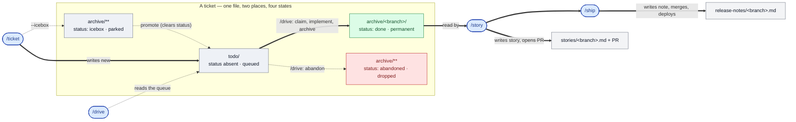
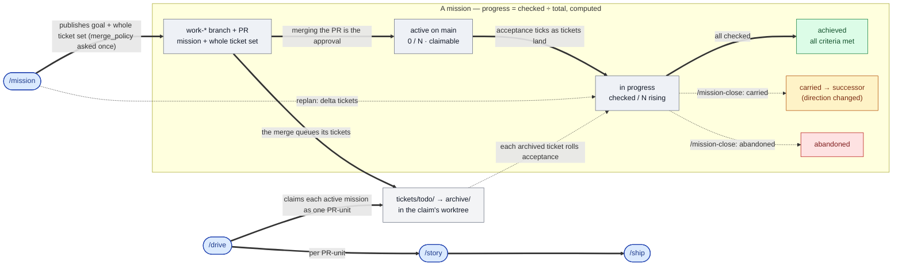
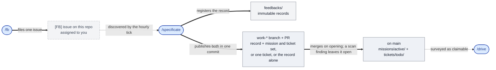
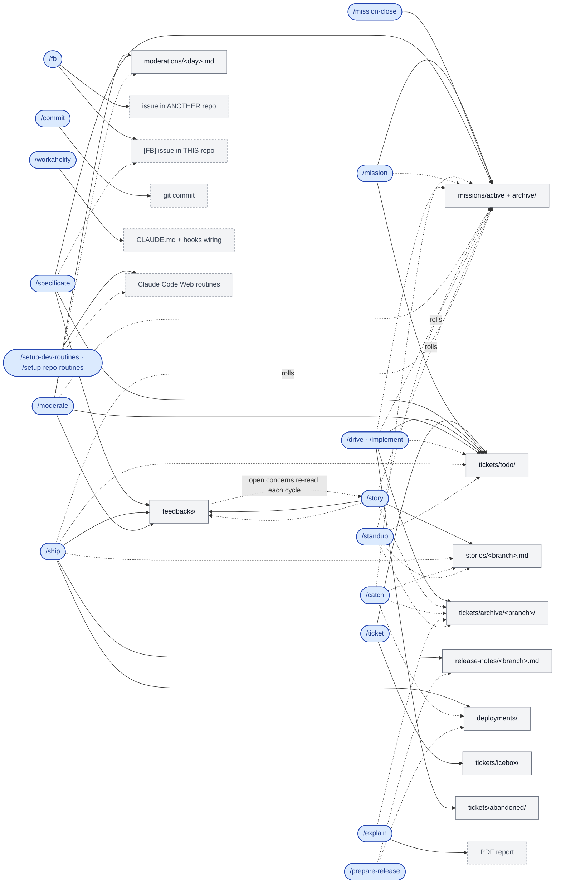
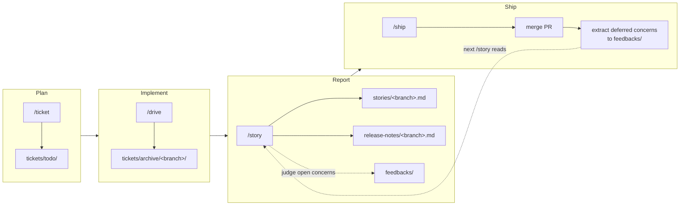

# Workaholic

The development workflows we use at [qmu](https://github.com/qmu), written down so our coding agents can run them the way we do. **AI agents are the primary users**: the plugin is installed for the agents that consume it — the local loop (`/loop 5m /infinite-development` in Claude Code, or a chat-bound Scheduled task in the ChatGPT desktop app), the Claude Code Web routines that are its fallback, and sessions, attended or unattended, running the workflow skills. The **developer is the operator**: approving the pull requests those agents open, configuring routines and schedules, and stepping in when a run defers a decision — and every command also runs by hand, the supported secondary path. The workflows are tuned to how we work, so they may not fit everyone, and they'll keep changing as we do. We keep this public so the people we work with can share the same base.

**Concretely**, it's a cross-agent distribution of structured development workflows and engineering-standard skills: ticket-driven development, AI-collaborative exploration, and the engineering-policy index (the `planning` / `design` / `implementation` / `operation` skills, mirrored from qmu.co.jp). It's richest on **Claude Code** (a plugin marketplace: slash commands, hooks, an always-on policy lens); the same skills install on **Codex**, **OpenCode**, and 40+ other agents via the [Agent Skills standard](https://skills.sh). Authored once under `plugins/`, generated into portable artifacts under `outputs/`.

**The planning hierarchy is three layers, each at its own granularity — and no layer restates a lower one's detail:** a **mission** is an *optional, epic-equivalent grouping* — a bounded batch of **two or more** tickets an agent fleet drives together (typically overnight), never a required parent; a **ticket** is one drive-able change (fully first-class on its own, and a single unit of work stays one rather than becoming a mission); a **commit** is one normalized change kept to a reviewable size. Long-lived *inbound* direction accretes in the `.workaholic/feedbacks/` stream; what the operator has **decided** to pursue — an aim, a date, an owner — is a `.workaholic/strategies/` record, which sits above the hierarchy and plans nothing (a strategy carries no tickets and no acceptance list). This is the day/night model we work in: the developer spends the **day planning** (interrogating each mission to question-free, drive-ready readiness) and **merging the pull request that publishes it** — that merge is the approval — and **coding agents execute at night** in parallel, so the morning starts with reviewable results — open PRs, honest reconciliation lines, and whatever the run learned written back into the feedback stream.

> [!WARNING]
> **This drives git on your behalf.** Workaholic lets your coding agent autonomously create branches, commit, amend, push, and open pull requests. Review the plugin/skill descriptions below before installing so you know what to expect.

## Quick Start (Claude Code)

```bash
claude
/plugin marketplace add qmu/workaholic
```

Enable the plugins you want after installation. Auto update is recommended. For Codex, OpenCode, and other agents, see [Use with other coding agents](#use-with-other-coding-agents) below.

## Use with other coding agents

Workaholic follows the cross-agent [Agent Skills standard](https://skills.sh). What's portable:

- **Policy skills** (`planning` / `design` / `implementation` / `operation`) — the engineering-policy index (pure prose, self-contained): title, one-line summary, and canonical qmu.co.jp link per policy, organized into the 企画 / 設計 / 実装 / 運用 pillars. Available on every Agent-Skills agent.
- **`write-release-note`** and **`review-sections`** — release-note structure and branch-story review-content guidance (pure prose).
- **Workflows** — `create-ticket`, `drive`, `story`, `ship`, `catch`, `mission` as agent-neutral skills; the `outputs/workflows/` bundle ships these six together with the two prose skills above, eight in all. On non-Claude agents the workflow runs the same steps without Claude's parallel subagents/`AskUserQuestion` — see the **Agent Compatibility** notes the skills carry.
- **[Open Knowledge Format](https://github.com/GoogleCloudPlatform/knowledge-catalog/tree/main/okf) (OKF v0.1)** — two surfaces, no install needed. The committed `outputs/okf/` bundle exposes the four pillars' policy hard copies to any OKF reader straight from the repo path; and every project using the plugin gets an OKF-compatible `.workaholic/` tree — generated knowledge documents carry `type` frontmatter (tickets excepted — the queue is not index-managed and tickets carry no `type`) and the workflows regenerate the `index.md` hierarchy (entry point: `.workaholic/index.md`) before each knowledge commit.

### Install matrix

| Agent | How |
| ----- | --- |
| **Claude Code** | `/plugin marketplace add qmu/workaholic` (slash commands `/ticket`, `/mission`, `/drive`, `/implement`, `/story`, `/ship`) |
| **OpenAI Codex** | `codex plugin marketplace add qmu/workaholic --ref main`<br>`codex plugin add workaholic@workaholic`<br>`codex plugin add workflows@workaholic` |
| **Cursor / OpenCode / Pi / 50+** | `npx skills add qmu/workaholic` (exposes `workaholic` + `workflows`) |

### How the workflows reach other agents

The workflow skills share helper scripts across `plugins/workaholic` via the Claude-only `${CLAUDE_PLUGIN_ROOT}` token, so they are not self-contained in source. `scripts/build-plugins` generates **self-contained** copies (each skill bundling its own scripts, references rewritten to relative paths) and assembles one neutral, committed plugin under `outputs/workflows/`. That single dir serves every non-Claude agent: Codex via `.agents/plugins/marketplace.json` (and the co-located `.codex-plugin/plugin.json`), and OpenCode/Cursor/40+ via the `skills` CLI reading the `workflows` entry in `.claude-plugin/marketplace.json`. Regenerate after changing a workaholic workflow skill:

```bash
node scripts/build-plugins/build.mjs   # regenerate outputs/workflows artifacts (no args = full build)
node scripts/build-plugins/verify.mjs  # assert every script reference resolves
```

The `plugins/workaholic` source stays Claude-Code-only (`metadata.internal: true`, `${CLAUDE_PLUGIN_ROOT}`); the committed `outputs/workflows/` artifacts are the public, portable versions, kept in sync by the `Outputs Freshness` CI check. The `workaholic` plugin's commands, hooks, and rules remain Claude-Code-only.

## The plugin

`workaholic` is a single plugin combining ticket-driven development (TiDD), AI-collaborative exploration, and context-aware reporting/shipping, plus the engineering-policy index. It auto-detects your development context from the current branch pattern.

| Command    | What it does                                          |
| ---------- | ----------------------------------------------------- |
| `/ticket`  | Plan a change with context and steps, then **publish it onto a `work-*` branch behind a pull request**; merging that PR is what queues it for the next `/drive` tick — run it from any branch, mid-edit; your own checkout and its uncommitted work are left untouched, and nothing is branched from it (bare `/ticket` reports the queue instead — the tickets you own plus the unowned, claimable ones) |
| `/drive`   | **The executor, attended.** Fast-forwards its checkout to the base first — artifacts live on `main`, so a runner that skipped this would survey a stale queue and report it confidently — then surveys what is claimable (the active missions you may take + your unclaimed backlog), partitions it into **PR-units** — "what deserves one merge" — claims each on a pushed branch, implements it in the claim's own worktree, opens its PR via `/story`'s seam, and routes it by the unit's recorded **merge policy**: `auto` ships through `/ship` — which drafts the unit's deployment plan and merges, deploying nothing — and cleans the claim up, `review` merges its PR as soon as `/story` opens it and the branch-safety scan passes (a policy nobody recorded counts as review; a scan finding is the one thing that leaves the PR open) — quality is gated downstream at the `release/*` QA window, not at merge time. One declaration outranks both routes: a mission or ticket that recorded `verification_handoff:` at creation — the real-world verification needs a credential this runner does not have — is **handed off** instead, its PR left open with a `## Handoff` section naming what could not be run, so nothing is announced as implemented that nobody could verify. Under `/implement` each unit posts one finish line carrying the PR URL into its feedback item's Slack thread; an attended run reports it in the session and posts nothing. Then it accounts for the run: a reconciliation line plus an **honest derived terminal token** — `ok` only when every claimed unit reached its routed end *and* a fresh survey offers nothing claimable, else `pending`. **It asks exactly one thing**: when more than one unit is claimable or resumable it shows you the partition and asks once which units to take, drives them in the order you picked, and reports the rest as deferred (still claimable, so the run ends `pending`). Nothing else is ever asked: not the partition, not each ticket, and no gate is overridable just because you are present. `/drive <unit>` narrows the run to one mission or ticket — a scope, not a mode. Approval is not a per-ticket prompt: it was given where the work was decided — a human merged the pull request that published the mission or ticket, and the `merge_policy` recorded on it at creation says whether its completed units may merge unattended. Work is coordinated by the **claim protocol** — every runner reads the claims in flight from the unmerged remote branches, so two runners (or two machines) never pick the same work. There is no lock file and no server; the repository itself is the coordination medium |
| `/implement` | **The executor, unattended** — the same run as `/drive` with **no prompt at any step**, and what the routine and any `/goal /implement ok` loop invoke by name (`docs/drive-loop-runbook.md`). A decision it cannot make is deferred and recorded in its final report, never asked; a half-driven unit ends in `handoff` with its state written into the PR body. It never overrides a gate: a credential in the diff hard-stops the unit, and a size/leak block or a target with no declared confirmation method demotes it to the PR path. Every run also names **the base's own health** at the top of its report — `green`, `red` (with the merge that broke it and the checks that failed), or a read it could not make, said as such and never as green. It **changes nothing about the run**: no gate, no stop, and the terminal token is what it would have been on a green base — the person who must act on a red one is asked by `/moderate`. `/implement <unit>` narrows it to one mission or ticket. It is a separate command rather than a first word on `/drive` because a behaviour selected by an argument is one a caller can forget to pass — and forgetting it parks an unattended tick on a prompt nobody will answer |
| `/commit`  | Commit the working changes with a policy-conformant message (for small non-ticketed changes; ticketed work belongs to `/drive` or `/implement`) |
| `/specificate` | Judge the ask in hand and emit, in **one** pull request, the feedback record together with what it warrants — a **mission with its ticket set** when the direction decomposes, **one loose backlog ticket** when it is atomic, or **the record alone** when it is neither. The repository's own state constrains the judgment. That pull request **merges as soon as it opens** — quality is gated downstream at the `release/*` QA window, and a release-scan finding is the one thing that leaves it open. Runs unattended as the second half of the `propose` loop's turn (every five minutes, locally — or the `[Propose]` Web routine's `:15` tick as the fallback); a tick that starts with nothing in hand **discovers its own asks** — the open GitHub issues assigned to it, oldest first, minus those a feedback record already names (`list-inbound-issues.sh`) |
| `/fb` | File one ask — a design conclusion, an instruction, a development-born concern, or customer material — as an `[FB] `-marked GitHub **issue**. **One artifact, two addresses**: with no destination it opens on **this** repository, assigned to you, carrying the `kind`/`source`/`subject` judgment in its body, and writes **no** file — the hourly `[Specificate]` tick discovers the issue and registers the record itself, so a `/fb` that also wrote one would suppress its own ingestion. Given a target repository (`/fb <the ask> to <owner/name>`) it instead **crosses the boundary**: it composes the ask in the target's vocabulary and opens the issue there — the only sanctioned way to raise work against another repository, writing into no checkout of it. **Neither address asks you to confirm anything**: `/fb` composes the ask responsibly, masks what grounds it in this project, clears a secret/leak scan and a mechanical self-name backstop, files, and reports the URL — you read the issue, not a prompt. Named `/fb` because Claude Code ships a built-in `/feedback` (which sends feedback to Anthropic); **only the trigger is abbreviated** — the artifact, the skill, and the stream keep the full word |
| `/story`  | Context-aware: generate the branch story and create the PR (warns on the branch-safety scan — credentials/oversize/leakage). `/report` is a deprecated alias that runs the identical workflow |
| `/ship`    | Context-aware: **draft the deployment plan, merge the PR, publish the GitHub Release** — it starts no deployment. The Release Note gains a `## Deployment Plan` saying, per deployment target, what is waiting to deploy and the verification that would be required; you read it and *then* instruct the deploy, which runs the procedure, confirms it, and records the method and observed result back into that same note. Blocks pre-merge on the branch-safety scan (secrets non-overridable) and still halts when a target declares no confirmation method — a plan that names no verification is the failure the gate exists to prevent. Production evidence for what has landed on `main` is the `release/*` window's confirmation |
| `/mission` | Plan an **optional, epic-equivalent grouping** — a bounded batch of **two or more** tickets an agent fleet drives together, typically overnight (never a required parent; single tickets drive fine without one, and one unit of work is a ticket rather than a mission — under two tickets a mission is not published at all): create one (asks the one human ruling — whether the mission's completed units may merge automatically — interrogates you to a drive-ready state, then **publishes onto a `work-*` branch behind a pull request, in one commit**, the mission statement and the **whole** ordered ticket set it emitted; **merging that pull request is the approval**, so there is no `approve` subcommand, and it creates no worktree — a worktree is claim-born, made when `/drive` takes the mission as a PR-unit), **replan** an in-flight one (a free-form instruction referencing it, no subcommand: re-enters the interrogation scoped to what changed and emits delta tickets the same way), show the **developer-centric roadmap** (bare `/mission`: full treatment — progress, next step, recent movement — for your and unclaimed active missions, one-liners for colleagues' and archived ones; the former `summary` mode is folded into this view). **No word of the argument is a subcommand**: it names the mission you mean, and nothing else. Ending one is `/mission-close` |
| `/mission-close` | End a mission — **achieved**, **abandoned**, or **carried** (done as framed, with the unmet criteria appended to an existing successor mission) — and move it into the archive area. The archive move only: a mission's worktree belongs to the claim that made it and is torn down at ship or by an explicit claim release. It is its own command rather than `/mission close` because a behaviour selected by the first word of an argument is a second command wearing one name; `close.sh` stays the only sanctioned writer of an end state. When a mission's **direction changes** mid-flight, **reorganize-and-carry** is the encouraged move — replan to drop the now-moot criteria, then close it `carried --successor <slug>` onto an existing successor — over grinding to `achieved` or `abandoned` |
| `/catch`   | Read-only catch-up report over a recent window (commits, tickets, stories, each active mission's derived progress and unmerged in-flight work) plus an orchestration-throughput block, then follow-up Q&A |
| `/explain` | Answer a question about the repository and export a printer-ready PDF report, rendered from HTML by a real browser |
| `/work` | Start the shared development loop contract. Claude Code uses `/loop 5m /infinite-development`; Codex in the ChatGPT desktop app uses a Scheduled task inside the current chat, running one tick in the local project and returning its report to that chat; Codex CLI/IDE use `scripts/codex-loop.sh` as the external fallback, which proves its first tick before reporting ready and exposes the durable reading through `--status`. Never run two clocks against one repository. |
| `/infinite-development` | **One tick of the loop.** Read the inbound Slack channel and answer on it — a person's question replied to in its own thread, every ask filed as an `[FB]` issue with its receipt, everything else reacted to — then spawn `propose` and `implement` (and `moderate` on a 30-minute gate) as background subagents and end. **It never waits for them on Claude Code**: steering a running loop must take seconds, not the length of a build. Off Claude Code the same tick runs sequentially; a desktop Scheduled task returns the report to its current chat, while the CLI fallback writes a transcript. It reads **its own checkout** first and names a dirty one — a subagent reads the plugin out of that tree, so uncommitted lines there are behaviour the loop is already running on no base — while blocking nothing and committing nothing. The `ListAgents` listing is the whole record on Claude Code: a subagent still **running** is not spawned again, and an **idle** one — a run that finished — is reaped immediately before the spawn. `implement` runs every tick; `propose` runs on a cadence (default 15 minutes) because its answer is a function of a queue that does not move in five. The same turn also **announces what finished**: an ask whose work landed through a session working it directly reaches no `/implement` route step, so its thread would otherwise end at the receipt and a finished ask would look exactly like an unstarted one — the tick names those items from the repository and the issues alone, never a channel scan, and replies one finish line into each item's own thread, once ever, with the dedup read from the thread rather than stored anywhere. Where it cannot see it says nothing: a blind read is reported by its own reason and never as *nothing to announce* |
| `/workaholify` | Prepare the current repo for the standards: **apply** the `CLAUDE.md` gateway reference, the web-bootstrap hook and the remote's `delete_branch_on_merge` setting (one confirmation each), converge the `.workaholic/` layout and the account's routines, and confirm the working-directory hook is active. The branch setting is not cosmetic: the claim protocol's only oracle is *unmerged remote branches*, so a repository that never deletes a merged one hands every later scan a growing population it cannot tell from live claims. Turning it on is forward-only — the branches already standing are reported with a ready-to-run deletion command and never deleted for you |
| `/propose` | **The loop's own ask.** Read your own active strategies, judge the single **evolutionary move** that brings the nearest one closer to its aim before its `target_date`, and open that judgment as a GitHub issue assigned to you — the surface `/specificate`'s hourly tick already reads, so the next tick ingests it and `/implement` drives it. It runs as the `propose` subagent of an `/infinite-development` tick, followed by `/specificate` in the same subagent. **A pure read of the repository**: no file, no commit, no branch, no pull request, no merge, no deployment, and nothing posted to Slack; the only write is the issue. **It is not housekeeping** — a drifted document or a missing test is `/moderate`'s work. **The unit is a mission, not a change**: the issue names a mission title, the experience it demands and an ordered ticket set sized by what the container must be able to hold (`plugins/workaholic/rules/workaholic.md`, *What a Mission Must Be Able to Hold* — a count is an observation about typical size, never the criterion), and a proposal naming fewer than two tickets is refused. `/propose` plans; `/specificate` writes. Every proposal declares one move (`depth`, `breadth` or `contraction`) and must name what it is chosen against — now the rival *mission* — and a tick that cannot name a move opens nothing and says so. It is the first unattended routine here to drop the standing *when unsure, record only* bar, and what replaces the bar is mechanical: one **mission** per strategy in flight at a time, nothing for a strategy that is closed, not yours, past its date, or that cites no feedback record for its work to be traced back through — every refusal reported by name, and a tick that cannot read its own open proposals proposing nothing at all |
| `/prepare-release` | Report what is **waiting to deploy** on the base right now, per deployment target, and what about it needs a human — commits waiting since the last release boundary, a target that declares no confirmation method, a target no release note has ever joined. **A pure read**: it writes no file, commits nothing, opens no pull request, merges nothing and deploys nothing. It posts one Slack line only when something is waiting *and* that exact answer has not been posted before; both gates fail and it says nothing at all. This is what the repository-scoped `[Prepare Release]` routine runs hourly |
| `/standup` | Report the day's development activity **per strategy** — what moved since yesterday, what is waiting, and how close each dated direction is to its `target_date`. **A pure read**: it writes no file, commits nothing, opens no pull request, merges nothing and deploys nothing. A quiet strategy says "no activity" rather than vanishing from the digest, work belonging to no strategy is reported as a count so the summary never reads as exhaustive, and a morning that is not news — no active strategy, or nothing moved with no date approaching — posts nothing at all. This is what the repository-scoped `[Standup]` routine runs each morning |
| `/moderate` | **The maintenance tick.** `/specificate` turns asks into work and `/implement` drives it; nothing keeps the space *around* them tidy, or says how the repository's development is actually going. One hourly, unattended run walks **twenty** steps — open the tick log, sweep the inbound surfaces, read the workload logs it has credentials for, report merge-conflict state, triage stale issues and GitHub↔`.workaholic/` drift, name what failed to auto-merge, report documentation drift, report what is **waiting to deploy** per target, report each target's draft-note cadence, report which directions will not arrive at their pace, report a direction that has run **out of date** or that nothing is answering, report **what is claimed and how long it has not moved**, ask about **queued work nothing can drive** because its owner is an address the identity mapping does not name, report the missions that are finished and still open, render the per-strategy digest on the morning tick, ask about a **message on the channel nobody has answered** (mention or no mention), re-attempt the merge of a unit an earlier run finished and could not deliver, retire a claim proved to hold nothing, say whether **the base survived what the loop merged** — asking the author of the merge that broke it, once per broken commit — and ask the humans up to five questions. Findings go through the seams that already exist: a finding is a feedback record, work is a ticket or a mission. **It speaks only to ask somebody something** — its one Slack shape is `🙋 Question <@U…>`, a reply in the thread of the item it concerns, with a mention token and the two options where there are two. A finding it cannot turn into a question with a name on it stays in the tick log. It never prompts, never merges a pull request, and never pushes into a branch the claim protocol owns. What it reads about the base is a **reading, not a verdict**: a re-run can turn a red check green, so nothing here re-runs a check, reverts a commit, blocks a merge or gates anything — quality stays gated at the `release/*` QA window. |
| `/setup-dev-routines` | **Configure** the routines every developer needs their own copy of (`[Specificate]`, `[Implement]`, `[Propose]`): every run lists the account's routines through a `RemoteTrigger`-family tool, diffs each against its template (name, prompt, model, `cron_expression`, `autofix_on_pr_create`, connectors), applies the create/update needed to converge, and reports the per-routine changes. No questions. When no such transport is reachable it says so — `no_transport` — and falls back to rendering the **copy-paste setup sheets** (name, scope, model, repository, the prompt verbatim, the web-UI steps) as that refusal's recovery path, together with the preconditions (the `dev-<repo>` Slack channel, the web bootstrap) and a plain statement of what could not be verified from the session Every report line also names that routine's **enabled state** — read and reported, never converged (2026-08-19, issue #526): a routine converged in every other field while switched off is dead, and its line would otherwise read exactly like a healthy one's. |
| `/setup-repo-routines` | **Configure** the routines the repository needs exactly **one** of (`[Standup]`, `[Moderate]`) — same flow, same one refusal, scoped to `repository` templates. **Run it from one account**, a designated person or a project/service account: a routine is an account-level record no other account can list, so N members each converging the repository's single routine would leave N copies firing every hour and nothing in the product could detect it. That makes the single-owner rule a **stated convention rather than an enforced one**, which the command says plainly instead of inventing an authorization the API cannot carry — it reports exactly which routines it converged, by name, so a second person sees their own duplicate. There are **two** routines in this scope, and the setup sheet says so in its header — creating the first and stopping would leave the repository half-configured with nothing to say so |

**Engineering-policy skills** (`planning` / `design` / `implementation` / `operation`): a catalog mirrored from qmu.co.jp giving each policy's title, one-line summary, and canonical link, organized into the 企画 (planning — grounding a project in business, market, and legal context before design begins), 設計 (design), 実装 (implementation, sub-grouped by 妥当性 / 可用性 / アクセシビリティ), and 運用 (operations) pillars. Pure prose, exposed on every Agent-Skills agent. Security (安全) and working-practice (執務) policies live elsewhere on qmu.co.jp and are out of scope.

> [!NOTE]
> **How policies stay in sync.** The canonical articles live on [qmu.co.jp](https://qmu.co.jp) — that is the source of truth. This repo carries an English hard copy of each one under the matching policy skill's `policies/` directory, and every file's frontmatter `source:` links back to its canonical article, so the platform and the website share the same knowledge. When the canonical articles change, the refresh arrives as a `standards-sync/*` pull request that updates the hard copies; merging it (with a version bump) republishes the index so every agent installing by repo path picks up the new wording. The sync is produced upstream and lands as a PR — there is no policy-fetching step this repo runs on its own.

**Typical everyday session:**

```bash
/ticket add dark mode toggle to settings page
/ticket support system preference detection
/drive                            # claim both as a PR-unit, implement, open the PR, route it
/ticket fix flash of light theme on page load
/drive                            # next claim, next PR
```

`/story` and `/ship` are still yours to run directly on a branch you drove by hand — `/drive` reaches them through the same seams, so the tail is identical whether you typed it or a cron tick did.

**Typical overnight session:**

```bash
/mission "make the settings page fully theme-aware"
# asks the one human ruling (may its units merge automatically?),
# interrogates the goal to a drive-ready state, then opens ONE pull request
# carrying the mission statement and its whole ordered ticket set
# → you merge that pull request: the merge is the approval
/implement                        # claims each active mission as a PR-unit, drives, reports, routes — unattended
```

## How It Works

### Ticket-Driven Development

A ticket is a markdown file describing a change you want to make — the context, plan, and rationale. Run `/ticket your change request` and a coding agent explores both codebase and history, then writes the ticket for you. It is published onto a `work-*` branch behind a pull request — from whatever branch you happen to be on, without disturbing your working tree — and merging that pull request is what puts it on `main`, visible to every runner, machine, and fresh clone. Committed alongside the code, tickets become searchable history for future coding agents.

Once tickets are queued, `/drive` (or `/implement`, when nobody is present) groups them into PR-units, claims each on its own pushed branch, and implements them in that claim's worktree — no per-ticket confirmation, because the approval already happened when the work was decided. While one runner drives a claim, others can keep creating tickets or claim a different unit; the unmerged remote branches are what keeps them from colliding.

`/story` generates changelogs and PR descriptions from the accumulated ticket history. Then `/ship` drafts the deployment plan and merges — it reads the `## Procedure` / `## Confirmation` of each `.workaholic/deployments/` entry (or your `CLAUDE.md`'s `## Deploy` / `## Verify`) and writes, into the Release Note, what is waiting to deploy per target and how it would be verified. It does not deploy: you read the plan and instruct the deployment, and that instructed run records its method and observed result back into the note.

> [!NOTE]
> **A flavor of Spec-Driven Development**
>
> This follows [Spec-Driven Development](https://martinfowler.com/articles/exploring-gen-ai/sdd-3-tools.html) principles with distinct terminology:
>
> - **Ticket**: A change request describing what should be different (flowing, temporal)
> - **Spec**: Current state documentation describing what exists now (snapshot, persistent)
>
> Tickets drive implementation; the repository's own `docs/` tree documents the result. Both are markdown, both are versioned, but they serve complementary purposes — and documentation lives outside `.workaholic/`, because `.workaholic/` holds what the loop writes and reads (the `specs/` area was retired 2026-08-13 for exactly that reason).

### Sources and the one executor

Everything converges on the same unit of work — a ticket. The shorthand: **sources fill the queue, one executor drains it.**

- **Sources** write tickets into `todo/`: `/ticket` (you, with discovery) and `/mission` (a whole ordered ticket set emitted at once, plus delta tickets on replan). Both publish onto a `work-*` branch behind a pull request from whatever branch you are on, leaving your checkout untouched and creating no worktree; the artifact reaches `main` — and therefore the queue `/drive` surveys — when that pull request merges. `/specificate` sits upstream of both, turning an ask — one reported into the session, or one its hourly routine tick discovered for itself among the issues assigned to it — into a mission with its whole ticket set, or a single loose ticket when the work is atomic, behind the same pull request that carries the feedback record; that pull request merges on opening.
- **The executor** drains `todo/ → archive/`, and there is exactly one of it — reached through **`/drive`** when you are present and **`/implement`** when nobody is. It takes work in PR-units, drives each in its own claim worktree, opens the PR, and routes it by merge policy — the same run whether you typed it or a routine tick did, with only the one selection prompt differing. Approval is not asked per ticket; it was already given where the work was decided — a human merged the pull request that published the mission or ticket, and the `merge_policy` recorded on it at creation decides whether its units may merge unattended — and the qualitative review relocates to the PR.

**Where the design conversation went.** Until 2026-07-28 this section described `/trip`, an Agent Teams session in which a Planner, an Architect, and a Constructor designed a concept together, decomposed it into tickets, and drove them. That command, along with `/monitor` (parallel mission execution) and `/carry` (handing in-progress work to a fresh session), has been retired and its ideas absorbed:

- **Design discussion** is now the **feedback stream** — `/fb` files each conclusion, instruction, concern, or piece of customer material as an issue, and `/specificate` turns it into the immutable entry later planning reads.
- **Decomposition** is `/mission` (interrogate a goal into its whole ticket set) and `/specificate` (judge the ask in hand, and specificate a mission with its ticket set — or one loose ticket — in the same pull request as its feedback record).
- **Execution — including parallel, unattended, many-mission execution — is `/drive` and its unattended twin `/implement`.** What `/monitor` did across mission worktrees, that one run now does as its normal survey-and-claim behavior, coordinated through the claim branches instead of a dispatcher.
- **Handing off in-flight work** needs no command: the work lives on a pushed claim branch by construction, so the next run re-claims the unit (`claim.sh resume <unit-id>`, once the claim's heartbeat lapses and only for its own identity) and continues from the branch tip. A run that knowingly leaves a unit unfinished says so in the PR body's `## Handoff` section. What a hand-off used to capture in prose — the learnings, the deferred concerns — is written at the ship seam as `kind: concern` / `kind: insight` feedback records.

`.workaholic/trips/` remains on disk as **legacy, read-only history**: no command has written to it since 2026-07-28, and nothing deletes it. Knowledge is never deleted.

## Artifacts under `.workaholic/`

Working artifacts live in [.workaholic/](.workaholic/README.md). Each artifact captures a snapshot of the code change at a specific point in the workflow — they are not generic documentation. The table below summarizes what gets stored, when it is written, and how it survives (or is eliminated) through the ship process.

The tree is also an [Open Knowledge Format](https://github.com/GoogleCloudPlatform/knowledge-catalog/tree/main/okf) bundle: `.workaholic/index.md` is the entry point (declaring `okf_version`), each knowledge area keeps an `index.md` the workflows regenerate before committing (via the internal `okf` skill's `refresh-index.sh`), and every generated knowledge document carries YAML frontmatter with a non-empty `type` (tickets are the exception: the queue is not index-managed and a ticket carries no `type`) — so any OKF reader can walk the project's development knowledge.

### Lifecycle Reference

| Artifact | Written by | Snapshot of | Diffed on ship? | Carried over? | Eliminated when |
| -------- | ---------- | ----------- | --------------- | ------------- | --------------- |
| `tickets/todo/<ts>-*.md` | `/ticket`, `/mission` (its whole ordered ticket set), `/specificate` (a mission's set, or one loose ticket) | Intended change (not yet implemented) | committed onto a **`work-*` branch behind a pull request** at creation; reaches `main` when that PR merges | no | `/drive` claims it into a PR-unit and archives it once implemented |
| `tickets/archive/<branch>/*.md` | `/drive` (archive) | Implemented change with final report; `status: done` stamped at the gate | committed, permanent | no — permanent record | never (institutional history) |
| `tickets/archive/**` with `status: icebox` | `/ticket --icebox` (or manual move) | **Deferred** change — parked, promotable, developer-curated in both directions | committed | yes (survives across PRs until promoted) | `promote-icebox.sh` clears the field and returns it to `todo/` |
| `tickets/archive/**` with `status: abandoned` | `/drive` (abandon flow) | Attempted-then-**decided-against** change with failure analysis | committed, permanent | no | never |
| `stories/<branch>.md` | `/story` | PR description: overview, journey, outcome, concerns, ideas, release readiness | committed before PR creation | concerns/ideas sections only (extracted by `/ship`) | never (per-branch permanent record) |
| `release-notes/<branch>.md` | `/ship` (before merging) | Concise release narrative for GitHub Releases, **plus the prospective `## Deployment Plan`** (per target: what is waiting, the procedure, the verification required) and the append-only `## Deployment Verification` an instructed deployment writes back | committed before merge | no | never |
| `releases/<release-branch>.md` | the release promotion (`/ship` §6): `record-release-cut.sh` at the cut — a batch-level act invoked explicitly, never a step of the per-unit ship — and `confirm-release.sh` at each confirmation | Durable ship record for one `release/*` branch: which `main` commits it carried, when it was cut, when it was confirmed or failed. Derived from git, never hand-authored | committed to `main` at cut and at each confirmation | n/a — not branch-scoped | never (a failed confirmation is recorded, not erased) |
| `trips/<name>/*` | nothing — **no writer since 2026-07-28** | Legacy multi-agent design output from the retired `/trip` command | already committed; read-only history | no | never (kept as history; knowledge is not deleted) |
| `missions/active/<slug>/mission.md` | `/mission` | Optional epic-equivalent grouping bundling **two or more** tickets: goal, demanded experience, acceptance checklist (progress = checked/total), one `status` lifecycle axis with a single in-flight state (`active`, then one of three end states) plus the orthogonal `merge_policy` recorded at creation, `predicted_hours`/`actual_hours` (predicted at creation from the archived trend, actual accumulated by `/drive`), append-only changelog | committed behind its publication PR, updated as related work lands | n/a — outlives any branch | `/mission-close` flips `status` to `achieved`, `abandoned` or `carried` and moves the dir to `missions/archive/<slug>/` (file and changelog preserved) — the only status flip there is |
| `feedbacks/<ts>-<slug>.md` | `/specificate` (**one record on every run**, whatever it judges — the highest-volume writer, and the one that registers what `/fb` filed as an issue), `/ship` (`kind: concern` records extracted from a shipped story's section 6), `/story` (superseding resolution records), and `/fb`'s **fallback** when its issue cannot be opened — all through the feedback skill's writers. **Not `/fb`'s primary path**, which files an issue instead; a fallback record is captured but not discovered by `[Specificate]` | One **immutable** inbound record of project context: a conclusion (`kind: insight`), an instruction, a development-born concern, or customer material — the raw material later planning reads. Each record names **whose opinion it is** (`subject`), which is a different question from the channel it arrived through (`source`) and from who ran the capture (`author`) | committed when registered | **yes — the stream accumulates forever**; consumers track "new" by commit cursor, and the open concern set is computed as "not superseded" | never (resolution/mootness is a *new* record naming the old one via `supersedes`, not an edit) |
| `strategies/<slug>.md` | manual, through `workaholic:strategy`'s `create.sh` (operator-authored; the loop's only reach is `/specificate`'s strategy form, whose pull request does not auto-merge — the operator's merge authors it) | One piece of **outbound, resolved direction**: an **Aim**, a **Schedule** (`target_date`) and an **Assignee**. The complement of `feedbacks/` — the stream holds what someone *said*, a strategy holds what the operator *decided* — with a one-way citation link (strategy → feedback) | committed when created | n/a — not branch-scoped | ended by `close.sh` (`achieved`/`abandoned`); the file never moves |
| `terms/*.md` | manual | Persistent reference material (the project's glossary) | committed | n/a | superseded when manually rewritten |

### Command ⇄ artifact maps, by development style

The plugin has one spine — the **ticket** — but the work reaches it through different front doors depending on how it starts. Each map below is one **development style**, and all of them converge on the same tail: `/story` writes the branch story and opens the PR, then `/ship` writes the release note with its deployment plan and merges. Node style is constant across every map — rounded **blue** = a command, rectangular **grey** = an artifact it writes, **green** = a completed/permanent state, **amber** = carried forward, **red** = dropped. Solid arrow = writes / drives; dashed arrow = reads.

#### Use case 1 — Everyday development: `/ticket` → `/drive`

The unit of work is a single ticket, and it is really *one file that changes state* as commands act on it. `/ticket` writes it into the queue; `/drive` reads the queue, implements it, and moves it to the permanent archive, stamping the outcome. Then the shared tail turns the archived work into a merged, deployed PR.

Since 2026-08-13 the tree has **two places and four states**: the file is in `todo/` or in `archive/`, and its `status:` frontmatter field says which state it is in — absent (queued), `done`, `abandoned`, or `icebox`. This is the same move `assignees` made — *a property is a field, not a directory* — so a reader never has to parse a path to learn what a ticket is.


```mermaid
flowchart LR
  ticket(["/ticket"])
  drive(["/drive"])
  report(["/story"])
  ship(["/ship"])

  subgraph TICKET["A ticket — one file, two places, four states"]
    direction TB
    todo["todo/<br/>status absent · queued"]
    icebox["archive/**<br/>status: icebox · parked"]
    archived["archive/&lt;branch&gt;/<br/>status: done · permanent"]
    abandoned["archive/**<br/>status: abandoned · dropped"]
    icebox -.->|"promote (clears status)"| todo
    todo ==>|"/drive: claim, implement, archive"| archived
    todo -.->|"/drive: abandon"| abandoned
  end

  story["stories/&lt;branch&gt;.md + PR"]
  relnote["release-notes/&lt;branch&gt;.md"]

  ticket ==>|writes new| todo
  ticket -.->|"--icebox"| icebox
  drive -.->|reads the queue| todo
  archived ==>|read by| report
  report ==>|writes story, opens PR| story
  report ==> ship
  ship ==>|writes note, merges, deploys| relnote

  classDef cmd fill:#dbeafe,stroke:#1e40af,stroke-width:1.5px,color:#1e3a8a;
  classDef state fill:#eef1f6,stroke:#6b7280,color:#111827;
  classDef done fill:#dcfce7,stroke:#15803d,color:#14532d;
  classDef drop fill:#fee2e2,stroke:#b91c1c,color:#7f1d1d;
  classDef art fill:#f3f4f6,stroke:#6b7280,color:#111827;
  class ticket,drive,report,ship cmd;
  class todo,icebox state;
  class archived done;
  class abandoned drop;
  class story,relnote art;
```

The ticket's resting places **are** its states: `todo/` (queued), `icebox/` (parked until promoted), `archive/<branch>/` (implemented, permanent history), and `abandoned/` (attempted then dropped). `/ticket` only ever writes into `todo/` or `icebox/`; `/drive` is the only command that moves a ticket *out* of `todo/`, into exactly one terminal state — then hands the archived work to `/story` → `/ship`.

#### Use case 2 — Mission-centric: `/mission` → `/drive`

When the work is a long-lived goal spanning many tickets, `/mission` is the front door: it asks the one human ruling — whether its completed units may merge on their own — interrogates the goal to a drive-ready state, and publishes the mission statement together with the **whole** ticket set behind a single pull request. Merging that pull request is the approval; nothing else gates the work. `/drive` then claims each active mission as one PR-unit and drives them in parallel, one claim worktree each. The mission itself is the state object — its progress is **computed** as checked ÷ total over the acceptance checklist, ticking up as each ticket archives, until it is achieved, carried into a successor (direction changed), or abandoned.


```mermaid
flowchart LR
  mission(["/mission"])
  drive(["/drive"])
  report(["/story"])
  ship(["/ship"])

  subgraph MISSION["A mission — progress = checked ÷ total, computed"]
    direction TB
    pr["work-* branch + PR<br/>mission + whole ticket set"]
    active["active on main<br/>0 / N · claimable"]
    inprogress["in progress<br/>checked / N rising"]
    achieved["achieved<br/>all criteria met"]
    carried["carried → successor<br/>(direction changed)"]
    abandoned["abandoned"]
    pr ==>|"merging the PR is the approval"| active
    active ==>|acceptance ticks as tickets land| inprogress
    inprogress ==>|all checked| achieved
    inprogress -.->|"/mission-close: carried"| carried
    inprogress -.->|"/mission-close: abandoned"| abandoned
  end

  queue["tickets/todo/ → archive/<br/>in the claim's worktree"]

  mission ==>|"publishes goal + whole ticket set (merge_policy asked once)"| pr
  pr ==>|the merge queues its tickets| queue
  mission -.->|replan: delta tickets| inprogress
  drive ==>|claims each active mission as one PR-unit| queue
  queue -.->|each archived ticket rolls acceptance| inprogress
  drive ==>|per PR-unit| report
  report ==> ship

  classDef cmd fill:#dbeafe,stroke:#1e40af,stroke-width:1.5px,color:#1e3a8a;
  classDef state fill:#eef1f6,stroke:#6b7280,color:#111827;
  classDef done fill:#dcfce7,stroke:#15803d,color:#14532d;
  classDef carry fill:#fef3c7,stroke:#b45309,color:#7c2d12;
  classDef drop fill:#fee2e2,stroke:#b91c1c,color:#7f1d1d;
  classDef art fill:#f3f4f6,stroke:#6b7280,color:#111827;
  class mission,drive,report,ship cmd;
  class pr,active,inprogress state;
  class achieved done;
  class carried carry;
  class abandoned drop;
  class queue art;
```

Parallelism is not a separate command: `/drive`'s survey picks up every claimable mission at once, and the claim branches keep the runners off each other's work. A mission whose direction changed mid-flight is closed **carried** — reorganized, its unmet criteria appended to an existing successor — rather than force-completed.

#### Use case 3 — Feedback-driven: `/fb` → `/specificate` → `/mission` → `/drive`

When the work starts as something someone said rather than something you already scoped, the front door is `/fb`, which files the conclusion, instruction, concern, or customer material as an `[FB] `-marked issue assigned to you — the same artifact the channel sweep produces (since 2026-08-23 `/propose` reads the repository's designated channel (`WORKAHOLIC_INBOUND_SLACK_CHANNEL`, default the repository's own name) through the Slack connector and files FB-worthy messages as issues itself — no `@Claude` mention, no tagged session), so the deliverable no longer depends on the destination; `/specificate` judges an ask — one handed to the session, or one its hourly tick discovered among the issues assigned to it — and opens one pull request carrying the record together with what it warrants — a mission with its whole ticket set when the direction decomposes, one loose ticket when it is atomic, or the record alone when it is neither — all `feedback:`-linked; that pull request merges on opening, so what it publishes is claimable immediately and the quality judgment happens downstream at the `release/*` window; `/drive` executes them. This is the loop that replaced the retired `/trip` design session — the conversation lives in records rather than in an agent team.


```mermaid
flowchart LR
  feedback(["/fb"])
  specificate(["/specificate"])
  drive(["/drive"])

  ISSUE["[FB] issue on this repo<br/>assigned to you"]
  FBK["feedbacks/<br/>immutable records"]
  PROP["work-* branch + PR<br/>record + mission and ticket set,<br/>or one ticket, or the record alone"]
  ACTIVE["on main<br/>missions/active/ + tickets/todo/"]

  feedback ==>|files one issue| ISSUE
  ISSUE -.->|discovered by the hourly tick| specificate
  specificate ==>|registers the record| FBK
  specificate ==>|publishes both in one commit| PROP
  PROP ==>|merges on opening; a scan finding leaves it open| ACTIVE
  ACTIVE -.->|surveyed as claimable| drive

  classDef cmd fill:#dbeafe,stroke:#1e40af,stroke-width:1.5px,color:#1e3a8a;
  classDef state fill:#eef1f6,stroke:#6b7280,color:#111827;
  classDef art fill:#f3f4f6,stroke:#6b7280,color:#111827;
  class feedback,specificate,drive cmd;
  class PROP,ACTIVE state;
  class FBK art;
  class ISSUE ext;
  classDef ext fill:#f3f4f6,stroke:#9aa0aa,stroke-dasharray:4 3,color:#374151;
```

`/specificate` runs unattended inside the `[Specificate]` routine's session, which fires on a fixed hourly schedule (`15 * * * *`) rather than on a report reaching it — a routine cannot subscribe to a repository event, so a tick that starts with nothing in hand discovers its own asks: the open issues assigned to it, oldest first, minus those a feedback record already names. It is allowed to specificate nothing — record-only is a valid outcome, and one it has to justify rather than fall into. Its pull request merges on opening, so the human judgment is not the merge: it is the `merge_policy` recorded on what the PR publishes (absent reads as `review`), and the `release/*` QA window downstream.

<details>
<summary><strong>The full map</strong> — every command and every artifact in one graph</summary>

Every command communicates with the others **only through the documents it writes to `.workaholic/`** — no command calls another directly. The single flowchart below covers all fourteen commands at once (`/drive` and `/implement` share one node — one executor, two entry points; rounded **blue** = command, rectangular **grey** = artifact, dashed grey border = an artifact that lands *outside* `.workaholic/`). It is dense on purpose — the per-use-case maps above are the readable slices.


```mermaid
flowchart LR
  %% ---------- commands (blue) ----------
  ticket(["/ticket"])
  mission(["/mission"])
  missionclose(["/mission-close"])
  specificate(["/specificate"])
  feedback(["/fb"])
  drive(["/drive · /implement"])
  report(["/story"])
  ship(["/ship"])
  catch(["/catch"])
  commit(["/commit"])
  explain(["/explain"])
  workaholify(["/workaholify"])
  setuproutines(["/setup-dev-routines · /setup-repo-routines"])
  releasestatus(["/prepare-release"])
  standup(["/standup"])
  moderate(["/moderate"])

  %% ---------- artifacts under .workaholic/ (grey) ----------
  TODO["tickets/todo/"]
  ICE["tickets/icebox/"]
  ARCH["tickets/archive/&lt;branch&gt;/"]
  ABD["tickets/abandoned/"]
  MIS["missions/active + archive/"]
  STORY["stories/&lt;branch&gt;.md"]
  FBK["feedbacks/"]
  REL["release-notes/&lt;branch&gt;.md"]
  DEP["deployments/"]
  HK["moderations/&lt;day&gt;.md"]

  %% ---------- artifacts that land outside .workaholic/ (grey, dashed border) ----------
  EXT["issue in ANOTHER repo"]
  OWN["[FB] issue in THIS repo"]
  PDF["PDF report"]
  WT["git commit"]
  CFG["CLAUDE.md + hooks wiring"]
  ROUT["Claude Code Web routines"]

  %% ========== generation: solid arrow = writes ==========
  ticket --> TODO
  ticket --> ICE
  feedback --> EXT
  feedback --> OWN
  mission --> MIS
  mission --> TODO
  missionclose --> MIS
  specificate --> MIS
  specificate --> TODO
  specificate --> FBK
  drive --> ARCH
  drive --> ABD
  drive --> TODO
  report --> STORY
  report --> FBK
  ship --> REL
  ship --> FBK
  ship --> DEP
  moderate --> HK
  moderate --> FBK
  moderate --> TODO
  commit --> WT
  explain --> PDF
  workaholify --> CFG
  setuproutines --> ROUT

  %% ========== reference: dashed arrow = reads / refers ==========
  drive -.-> TODO
  drive -.-> MIS
  specificate -.-> OWN
  report -.-> ARCH
  report -.-> FBK
  ship -.-> STORY
  ship -.-> TODO
  mission -.-> MIS
  catch -.-> ARCH
  catch -.-> STORY
  catch -.-> MIS
  catch -.-> DEP
  explain -.-> ARCH
  setuproutines -.-> ROUT
  moderate -.-> MIS
  moderate -.-> HK
  releasestatus -.-> DEP
  releasestatus -.-> REL
  standup -.-> TODO
  standup -.-> ARCH
  standup -.-> MIS
  standup -.-> STORY

  %% ========== mission rolls: dashed, labelled ==========
  drive -. rolls .-> MIS
  report -. rolls .-> MIS
  ship -. rolls .-> MIS

  %% ========== the one living loop: concerns cross PRs ==========
  FBK -. open concerns re-read each cycle .-> report

  %% ========== node styles: command vs artifact ==========
  classDef cmd fill:#dbeafe,stroke:#1e40af,stroke-width:1.5px,color:#1e3a8a;
  classDef art fill:#f3f4f6,stroke:#6b7280,color:#111827;
  classDef ext fill:#f3f4f6,stroke:#9aa0aa,stroke-dasharray:4 3,color:#374151;
  class ticket,mission,missionclose,specificate,feedback,drive,report,ship,releasestatus,standup,moderate,catch,commit,explain,workaholify,setuproutines cmd;
  class TODO,ICE,ARCH,ABD,MIS,STORY,FBK,REL,DEP,HK art;
  class EXT,OWN,PDF,WT,CFG,ROUT ext;
```

Reading the map:

- **Solid arrow** = the command *generates* that artifact. **Dashed arrow** = the command *reads / refers to* it. `rolls` = the command updates a named mission's `## Changelog` and `## Acceptance` checklist (via the `mission:` relation any ticket/story/concern carries).
- **Node style tells the kind apart.** Rounded **blue** = the commands (`/drive` and `/implement` share the executor node); rectangular **grey** = the artifacts they generate. A **dashed grey border** marks the artifacts that land *outside* `.workaholic/` — the `[FB] ` issue every `/fb` files, here or across the boundary, a printed PDF via `/explain`, a plain working-tree commit via `/commit`, repo wiring via `/workaholify`, and the scheduled routines `/setup-dev-routines` and `/setup-repo-routines` read and converge in the Claude Code Web account.
- **`/mission` and `/drive` are the two poles.** `/mission` writes `missions/…` and the kickoff/delta tickets into `tickets/todo/` (with `/specificate` proposing missions and loose tickets upstream of it); `/drive` reads the mission set and each worktree's `todo/`, drains them to `tickets/archive/`, and rolls each mission it advances — in parallel across every claim it holds.
- **The ticket is the spine.** `/ticket`, `/mission`, and `/specificate` (a mission's ticket set, or one loose ticket) all *fill* `tickets/todo/`; **`/drive` alone** drains it to `tickets/archive/`. Everything downstream reads the archive.
- **The feedback stream is the only loop.** `/ship` extracts a shipped story's section-6 concerns into `feedbacks/` as `kind: concern` records; the *next* `/story` re-reads the open set (records nobody superseded) and, for each one this branch resolved, appends a superseding record. Every record is written once and becomes permanent history — the "loop" is reading, never rewriting.
- **Not shown** (to keep the graph legible): `terms/` is hand-maintained reference material, not command-generated, and `strategies/` is operator-authored — `/specificate`'s strategy form may draft one behind a pull request that never auto-merges, but nothing reaches `main` there without the operator's merge, so the area `/standup` groups its digest *by* is the one input of that command the graph does not draw; `trips/` is legacy read-only history with no writer since 2026-07-28, so no arrow touches it; and the OKF `index.md` hierarchy is regenerated automatically by the same commit seams (`/drive`, `/story`, `/ship`) whenever they write knowledge, not by a command of its own.

</details>

### When, Where, and How Changes Occur

The branch lifecycle traverses these artifacts in a fixed order:


```mermaid
flowchart LR
  subgraph plan[Plan]
    direction TB
    a1["/ticket"] --> a2["tickets/todo/"]
  end
  subgraph implement[Implement]
    direction TB
    b1["/drive"] --> b2["tickets/archive/&lt;branch&gt;/"]
  end
  subgraph report[Report]
    direction TB
    c1["/story"] --> c2["stories/&lt;branch&gt;.md"]
    c1 --> c3["release-notes/&lt;branch&gt;.md"]
    c1 -.judge open concerns.-> c4["feedbacks/"]
  end
  subgraph ship[Ship]
    direction TB
    d1["/ship"] --> d2["merge PR"]
    d2 --> d3["extract deferred concerns<br/>to feedbacks/"]
  end
  plan --> implement --> report --> ship
  d3 -."next /story reads".-> c1
```

**Plan** — `/ticket` writes a new file under `tickets/todo/` describing the intended change, and publishes it in one commit onto a `work-*` branch behind a pull request; merging that PR is what puts it on `main`, where `/drive` surveys the queue. This is the only artifact created before code exists. It never branches your checkout and creates no worktree: the executor's claim is the only thing that does either.

**Implement** — `/drive` reads `tickets/todo/`, claims a PR-unit's tickets onto its own branch, implements them there, and moves each file to `tickets/archive/<branch>/` as it lands. The archive subdirectory is named after the claim branch so all of a unit's tickets cluster under one folder. The Final Report is appended to each ticket before it moves; the implementing commit is derived from git at report time (`ticket-commits.sh`), never stamped into the ticket.

**Report** — `/story` runs after all tickets on a branch are archived. It does four writes in order:
1. Judges every **open** `kind: concern` record in the feedback stream (`feedback/scripts/list-open-concerns.sh`) via a `general-purpose` deferred-concern-judge subagent. Each resolved one gets a **superseding record** appended (`supersedes: <filename>`, naming the resolving PR/commit); still-open ones simply stay open.
2. Writes `stories/<branch>.md` — the full PR description; its Concerns section records **this branch's** concerns only (the stream itself is the durable memory). A section with nothing to report is **omitted rather than filled with "None"**, so a small branch gets a short story, and sections are numbered sequentially over whichever ones survive — which is why every consumer matches a section heading by name, never by number.
3. Commits the story together with any superseding records, so the audit history is coherent.
4. Opens the GitHub PR (`release-notes/<branch>.md` is written later, by `/ship`, just before merging).

**Ship** — `/ship` merges the PR, then immediately extracts the Concerns section from the just-shipped **story file** into the feedback stream, one `kind: concern` record per item (`feedbacks/<ts>-<concern_id>.md`, every severity — the stream is append-only and id-keyed, so a known `concern_id` is never re-emitted). Each record carries `severity`, provenance (`origin_pr`/branch/commit), and the story's mission/ticket relations. From that point on, the open set is read on every subsequent `/story` until a superseding record resolves each one. The story **file** is the extractor's only source and carries every severity; the PR **body** is a rendering of it with the `low` blocks dropped for the reviewer, so brevity never costs a record.

### What "Carried Over" Means

Most artifacts are written once and never revisited — they form the permanent history of the codebase. The feedback stream is written once **per record** and read forever: risks and improvement ideas raised in one PR cannot silently vanish when it merges, because the `kind: concern` records persist and the **open set is computed** — a concern is open until some later record names it in `supersedes`. Each `/story` judges the open set and appends superseding records for what the branch resolved; nothing is ever rewritten, moved, or deleted, so the audit trail survives misclassification by construction. Curation is the reader's judgment over the stream (the retired promote/triage/demote machinery has no successor on purpose — `docs/loop-engineering-workflow.md` H2).

## Documentation

Everything beyond this README, by what the reader needs. The set is deliberately small: current behaviour lives in `CLAUDE.md` and the skills the agents load; the `docs/` pages carry only what neither can — the decision history and the operator runbooks.

| Document | What it is |
| -------- | ---------- |
| [CLAUDE.md](CLAUDE.md) | The operating manual the agents load in this repository: architecture policy, the claim protocol, the release tier, the gates and hooks, version management. The most detailed statement of **current** behaviour |
| [docs/loop-engineering-workflow.md](docs/loop-engineering-workflow.md) | **The decision log** (A1…P9): every ruling that shaped the loop, appended in dated rounds and never rewritten. Read it for *why a rule is what it is* — not for current behaviour |
| [docs/drive-loop-runbook.md](docs/drive-loop-runbook.md) | Operator runbook for the execution loop: what an `/implement` tick does, the environment, the machine-local cron fallback shape, observability, failure modes |
| [docs/proposal-loop-runbook.md](docs/proposal-loop-runbook.md) | Operator runbook for the `[Specificate]` routine: Slack provisioning, scheduling, observability, failure modes |
| [docs/loop-drill-runbook.md](docs/loop-drill-runbook.md) | Operator runbook for drilling the whole specificate–implement loop (`scripts/e2e/loop-drill.sh`): the stage table, the cron race windows, a machine verdict per stage, a failure-reason→file blame table for both routines, and — §9 — the **drill register**, which says of each drill whether it runs with no server, whether it can fail, and which mission shipped it. `verify-all` runs the classified set; CI runs the hermetic part of it on every push |
| [docs/dependencies/okf.md](docs/dependencies/okf.md) | Dependency-decision log (reason / assessment / monitoring / exit) per adopted external dependency, as the vendor-neutrality policy mandates — currently OKF v0.1 |
| [.workaholic/README.md](.workaholic/README.md) | The working-artifacts hub: which artifact kind to write (feedback / ticket / mission) and each `.workaholic/` area's contract |

Skill-level detail — per-script contracts, schemas, notification shapes — lives beside each skill under `plugins/workaholic/skills/<name>/` (`SKILL.md` plus its `reference/` pages), because that is what the agents load; those pages are not duplicated into `docs/`.

## Author

tamurayoshiya <a@qmu.jp>
