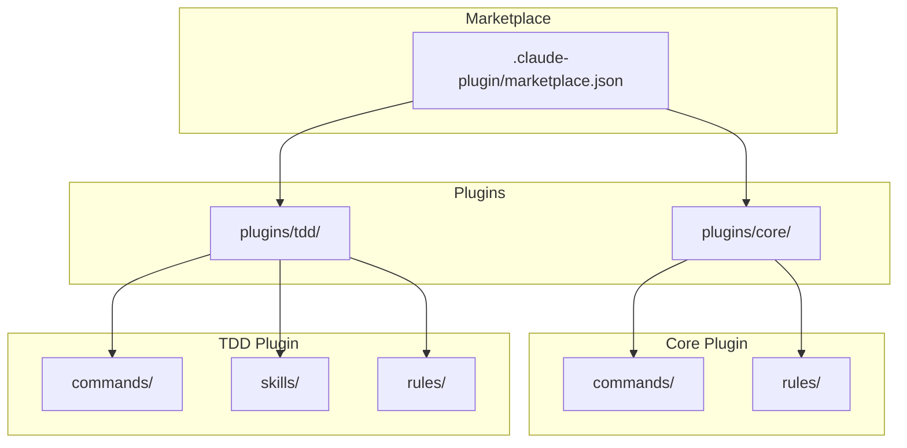
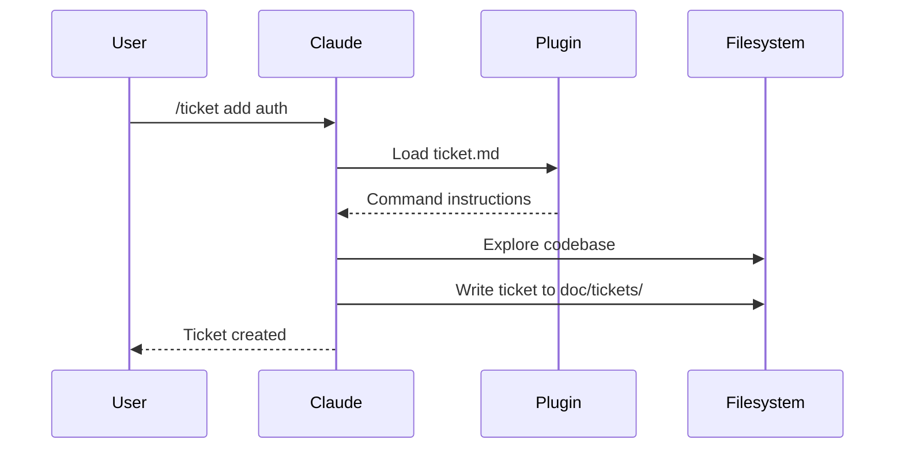

# Architecture

Workaholic is a Claude Code plugin marketplace. It contains no runtime code; plugins are markdown files with JSON metadata that Claude Code interprets as commands, rules, and skills.

## Marketplace Structure



## Directory Layout

```
.claude-plugin/
  marketplace.json       # Marketplace metadata and plugin list

plugins/
  core/
    .claude-plugin/
      plugin.json        # Plugin metadata
    commands/
      branch.md          # /branch command
      commit.md          # /commit command
      pull-request.md    # /pull-request command
    rules/
      general.md
      typescript.md

  tdd/
    .claude-plugin/
      plugin.json        # Plugin metadata
    commands/
      ticket.md          # /ticket command
      drive.md           # /drive command
    skills/
      archive-ticket/
        SKILL.md
        scripts/
          archive.sh     # Shell script for commit workflow
    rules/
      doc-specs.md       # Path-specific documentation standards
```

## Plugin Types

### Commands

Commands are user-invocable via slash syntax (`/commit`, `/ticket`). Each command is a markdown file with YAML frontmatter defining the name and description, followed by instructions that Claude follows when the command is invoked.

### Rules

Rules are always-on guidelines that Claude follows throughout the conversation. They define coding standards, documentation requirements, and best practices.

### Skills

Skills are complex capabilities that may include scripts or multiple files. They are invoked via the Skill tool and provide inline instructions. The TDD plugin includes two skills:

- **archive-ticket**: Shell script that handles the complete commit workflow (archive ticket, update CHANGELOG, commit)

## How Claude Code Loads Plugins

When a user installs the marketplace with `/plugin marketplace add qmu/workaholic`, Claude Code:

1. Reads `.claude-plugin/marketplace.json` to find available plugins
2. For each plugin, reads `plugins/<name>/.claude-plugin/plugin.json`
3. Loads commands, rules, and skills from the plugin directories
4. Makes commands available as slash commands in the conversation

## Data Flow



## Documentation Enforcement

Workaholic enforces comprehensive documentation through the `doc-specs` rule. This path-specific rule auto-loads when working in `doc/specs/` and ensures documentation remains synchronized with code changes.

### How It Works

```mermaid
flowchart TD
    A[/pull-request command] --> B[Consolidate CHANGELOG]
    B --> C[Read archived tickets]
    C --> D[Update doc/specs/]
    D --> E[doc-specs rule auto-loads]
    E --> F[Commit docs]
    F --> G[Create/update PR]
```

The `/pull-request` command updates documentation by:

1. **Reading archived tickets** - Analyzes all tickets from `doc/tickets/archive/<branch-name>/`
2. **Updating `doc/specs/`** - The `doc-specs` rule auto-loads and enforces standards
3. **Committing documentation** - Commits all documentation changes before creating PR

### Critical Requirements

The `doc-specs` rule enforces strict requirements:

- **Document every change** - No exceptions, no judgment calls about what's "worth" documenting
- **Never skip documentation** - "Internal implementation detail" is never a valid reason
- **Always report updates** - Must specify which files were created or modified
- **"No updates needed" is unacceptable** - Every change affects documentation somehow

### Design Philosophy

Documentation is mandatory, not optional. The path-specific rule ensures that documentation standards are automatically enforced whenever working in `doc/specs/`, preventing documentation debt from accumulating.

## Version Management

Versions are tracked in two places:

- **Marketplace version**: `.claude-plugin/marketplace.json` - bumped with `/release`
- **Plugin versions**: `plugins/<name>/.claude-plugin/plugin.json` - updated when plugin changes

Keep these in sync when releasing.
