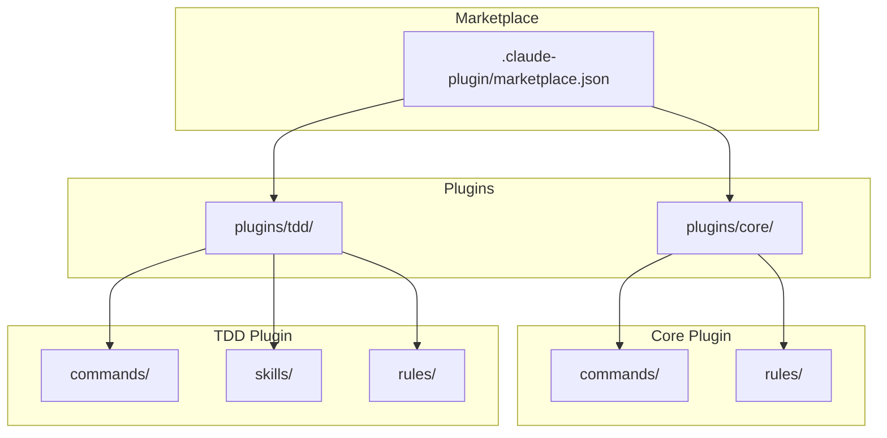
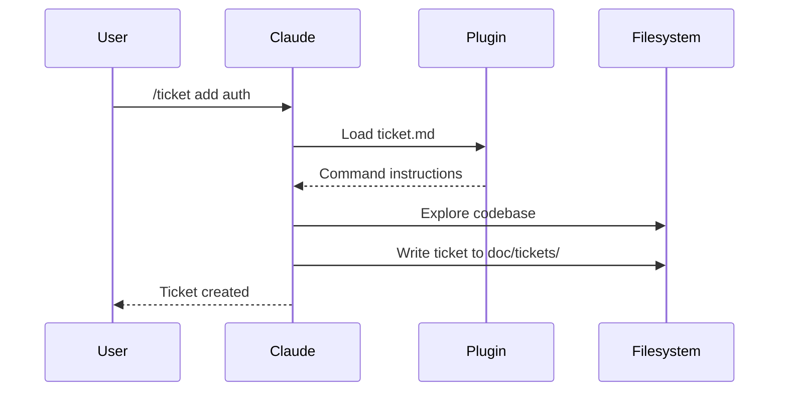

# Architecture

Workaholic is a Claude Code plugin marketplace. It contains no runtime code; plugins are markdown files with JSON metadata that Claude Code interprets as commands, rules, and skills.

## Marketplace Structure



## Directory Layout

```
.claude-plugin/
  marketplace.json       # Marketplace metadata and plugin list

plugins/
  core/
    .claude-plugin/
      plugin.json        # Plugin metadata
    commands/
      branch.md          # /branch command
      commit.md          # /commit command
      pull-request.md    # /pull-request command
    rules/
      general.md
      typescript.md

  tdd/
    .claude-plugin/
      plugin.json        # Plugin metadata
    commands/
      ticket.md          # /ticket command
      drive.md           # /drive command
    skills/
      archive-ticket/
        SKILL.md
        scripts/
          archive.sh     # Shell script for commit workflow
      doc-writer/
        SKILL.md         # Documentation specialist
    rules/
      documentation.md   # Documentation standards
```

## Plugin Types

### Commands

Commands are user-invocable via slash syntax (`/commit`, `/ticket`). Each command is a markdown file with YAML frontmatter defining the name and description, followed by instructions that Claude follows when the command is invoked.

### Rules

Rules are always-on guidelines that Claude follows throughout the conversation. They define coding standards, documentation requirements, and best practices.

### Skills

Skills are complex capabilities that may include scripts or multiple files. They are invoked via the Skill tool and provide inline instructions. The TDD plugin includes two skills:

- **archive-ticket**: Shell script that handles the complete commit workflow (archive ticket, update CHANGELOG, commit)
- **doc-writer**: Documentation specialist that audits and updates documentation. Has access to Read, Glob, Grep, Write, Edit, and Bash tools. The Bash tool enables it to delete outdated documentation files and remove empty directories within `doc/`.

## How Claude Code Loads Plugins

When a user installs the marketplace with `/plugin marketplace add qmu/workaholic`, Claude Code:

1. Reads `.claude-plugin/marketplace.json` to find available plugins
2. For each plugin, reads `plugins/<name>/.claude-plugin/plugin.json`
3. Loads commands, rules, and skills from the plugin directories
4. Makes commands available as slash commands in the conversation

## Data Flow



## Documentation Enforcement

Workaholic enforces comprehensive documentation through the doc-writer skill. This mechanism ensures that documentation remains synchronized with code changes.

### How It Works

```mermaid
flowchart TD
    A[/pull-request command] --> B[Consolidate CHANGELOG]
    B --> C[Invoke doc-writer skill]
    C --> D[Read archived tickets]
    D --> E[Audit documentation]
    E --> F[Update affected docs]
    F --> G[Commit docs]
    G --> H[Create/update PR]
```

The `/pull-request` command invokes the doc-writer skill which:

1. **Reads archived tickets** - Analyzes all tickets from `doc/tickets/archive/<branch-name>/`
2. **Audits documentation** - Checks entire `doc/specs/` structure
3. **Updates affected docs** - Modifies docs based on cumulative changes
4. **Deletes outdated docs** - Uses Bash to remove obsolete files within `doc/`
5. **Creates new docs** - When changes introduce new concepts to document

### Critical Requirements

The doc-writer operates under strict requirements:

- **Document every change** - No exceptions, no judgment calls about what's "worth" documenting
- **Never skip documentation** - "Internal implementation detail" is never a valid reason
- **Always report updates** - Must specify which files were created or modified
- **"No updates needed" is unacceptable** - Every change affects documentation somehow

### Design Philosophy

The doc-writer is an executor, not a gatekeeper. It does not have discretion to decide whether documentation should be updated. This ensures that documentation debt does not accumulate and that all changes are properly documented.

## Version Management

Versions are tracked in two places:

- **Marketplace version**: `.claude-plugin/marketplace.json` - bumped with `/release`
- **Plugin versions**: `plugins/<name>/.claude-plugin/plugin.json` - updated when plugin changes

Keep these in sync when releasing.
