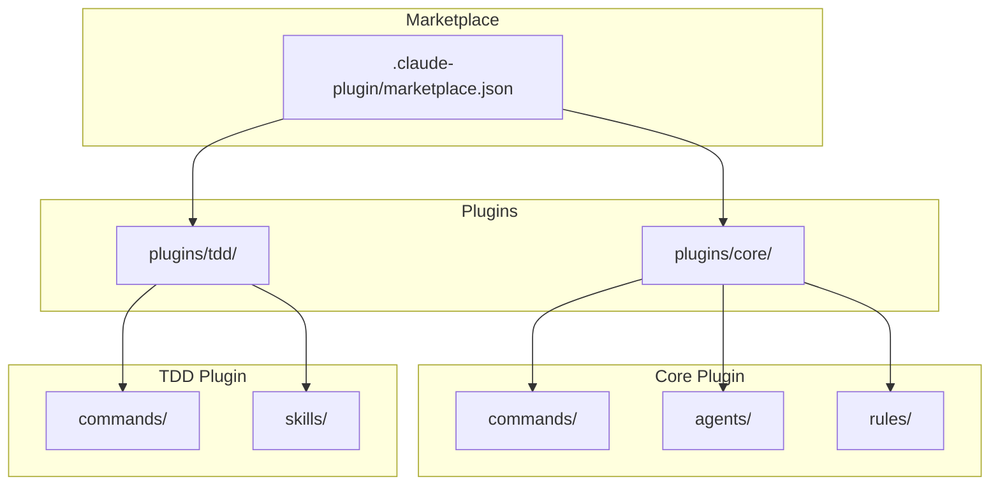
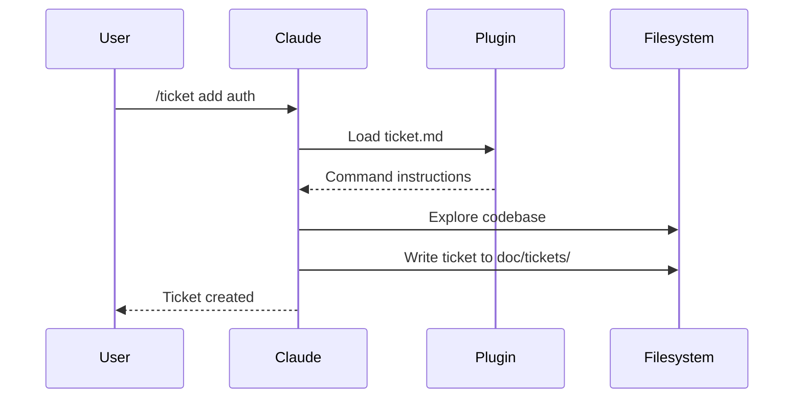

# Architecture

Workaholic is a Claude Code plugin marketplace. It contains no runtime code; plugins are markdown files with JSON metadata that Claude Code interprets as commands, agents, rules, and skills.

## Marketplace Structure



## Directory Layout

```
.claude-plugin/
  marketplace.json       # Marketplace metadata and plugin list

plugins/
  core/
    .claude-plugin/
      plugin.json        # Plugin metadata
    commands/
      branch.md          # /branch command
      commit.md          # /commit command
      pull-request.md    # /pull-request command
    agents/
      discover-project.md
      discover-claude-dir.md
    rules/
      general.md
      typescript.md
      documentation.md

  tdd/
    .claude-plugin/
      plugin.json        # Plugin metadata
    commands/
      ticket.md          # /ticket command
      drive.md           # /drive command
    skills/
      archive-ticket/
        SKILL.md
        scripts/
          archive.sh     # Shell script for commit workflow
```

## Plugin Types

### Commands

Commands are user-invocable via slash syntax (`/commit`, `/ticket`). Each command is a markdown file with YAML frontmatter defining the name and description, followed by instructions that Claude follows when the command is invoked.

### Agents

Agents are subagent types that can be spawned with the Task tool. They specialize in specific tasks like exploring codebases or writing documentation. Agents define which tools they can use and what model to run on.

### Rules

Rules are always-on guidelines that Claude follows throughout the conversation. They define coding standards, documentation requirements, and best practices.

### Skills

Skills are more complex capabilities that may include scripts or multiple files. The `archive-ticket` skill includes a shell script that handles the complete commit workflow.

## How Claude Code Loads Plugins

When a user installs the marketplace with `/plugin marketplace add qmu/workaholic`, Claude Code:

1. Reads `.claude-plugin/marketplace.json` to find available plugins
2. For each plugin, reads `plugins/<name>/.claude-plugin/plugin.json`
3. Loads commands, agents, rules, and skills from the plugin directories
4. Makes commands available as slash commands in the conversation

## Data Flow



## Version Management

Versions are tracked in two places:

- **Marketplace version**: `.claude-plugin/marketplace.json` - bumped with `/release`
- **Plugin versions**: `plugins/<name>/.claude-plugin/plugin.json` - updated when plugin changes

Keep these in sync when releasing.
