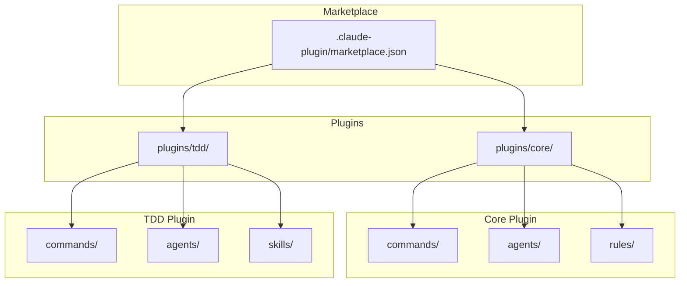
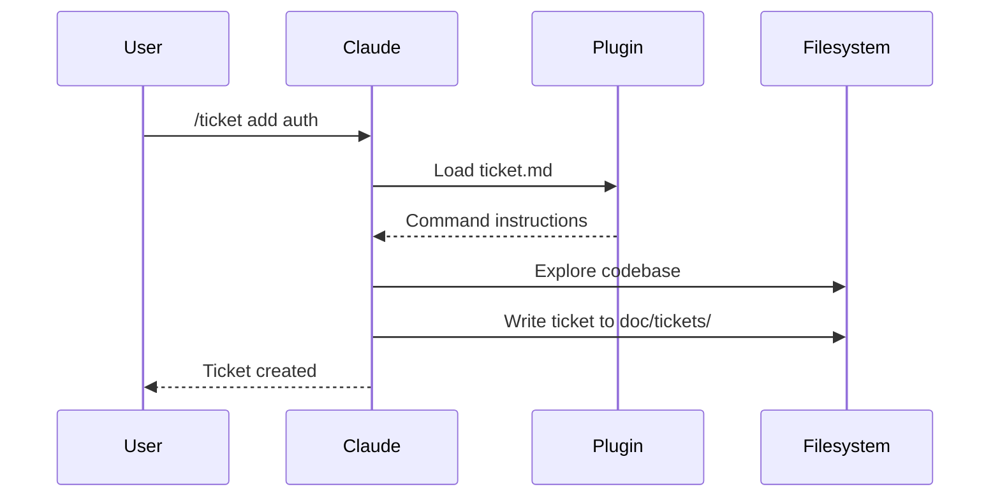

# Architecture

Workaholic is a Claude Code plugin marketplace. It contains no runtime code; plugins are markdown files with JSON metadata that Claude Code interprets as commands, agents, rules, and skills.

## Marketplace Structure



## Directory Layout

```
.claude-plugin/
  marketplace.json       # Marketplace metadata and plugin list

plugins/
  core/
    .claude-plugin/
      plugin.json        # Plugin metadata
    commands/
      branch.md          # /branch command
      commit.md          # /commit command
      pull-request.md    # /pull-request command
    agents/
      discover-project.md
      discover-claude-dir.md
    rules/
      general.md
      typescript.md
      documentation.md

  tdd/
    .claude-plugin/
      plugin.json        # Plugin metadata
    commands/
      ticket.md          # /ticket command
      drive.md           # /drive command
    agents/
      doc-writer.md      # Documentation specialist
    skills/
      archive-ticket/
        SKILL.md
        scripts/
          archive.sh     # Shell script for commit workflow
```

## Plugin Types

### Commands

Commands are user-invocable via slash syntax (`/commit`, `/ticket`). Each command is a markdown file with YAML frontmatter defining the name and description, followed by instructions that Claude follows when the command is invoked.

### Agents

Agents are subagent types that can be spawned with the Task tool. They specialize in specific tasks like exploring codebases or writing documentation. Agents define which tools they can use and what model to run on.

The core plugin provides discovery agents for analyzing projects and Claude Code configurations. The TDD plugin provides the doc-writer agent, which is a critical component that enforces documentation standards. It is automatically invoked during the `/drive` command to audit and update documentation for every change. This agent operates as an executor, not a gatekeeper: it cannot skip documentation updates and must always report which files were created or modified.

### Rules

Rules are always-on guidelines that Claude follows throughout the conversation. They define coding standards, documentation requirements, and best practices.

### Skills

Skills are more complex capabilities that may include scripts or multiple files. The `archive-ticket` skill includes a shell script that handles the complete commit workflow.

## How Claude Code Loads Plugins

When a user installs the marketplace with `/plugin marketplace add qmu/workaholic`, Claude Code:

1. Reads `.claude-plugin/marketplace.json` to find available plugins
2. For each plugin, reads `plugins/<name>/.claude-plugin/plugin.json`
3. Loads commands, agents, rules, and skills from the plugin directories
4. Makes commands available as slash commands in the conversation

## Data Flow



## Documentation Enforcement

Workaholic enforces comprehensive documentation through the doc-writer agent. This mechanism ensures that documentation remains synchronized with code changes.

### How It Works

```mermaid
flowchart TD
    A[/drive command] --> B[Implement ticket]
    B --> C[Invoke doc-writer agent]
    C --> D[Audit documentation]
    D --> E[Update affected docs]
    E --> F[Report changes]
    F --> G{User approval}
    G -->|Approve| H[Commit with docs]
    G -->|Revise| B
```

The `/drive` command step 2.3 mandates documentation updates. The doc-writer agent is spawned with `subagent_type: tdd:doc-writer` and must:

1. **Audit entire documentation structure** - not just files related to the current ticket
2. **Delete outdated or invalid documentation** - remove docs that no longer reflect reality
3. **Reorganize if needed** - ensure documentation structure matches actual project
4. **Update relevant docs** - modify existing docs affected by the ticket's changes
5. **Create new docs if needed** - when the change introduces something that needs documenting

### Critical Requirements

The doc-writer operates under strict requirements:

- **Document every change** - No exceptions, no judgment calls about what's "worth" documenting
- **Never skip documentation** - "Internal implementation detail" is never a valid reason to skip
- **Always report updates** - Must specify which files were created or modified
- **"No updates needed" is unacceptable** - Every change affects documentation somehow

These requirements are embedded in both the doc-writer agent definition and the `/drive` command. The drive command will reject a "no updates needed" response and re-run the doc-writer agent.

### Design Philosophy

The doc-writer is an executor, not a gatekeeper. It does not have discretion to decide whether documentation should be updated. This ensures that documentation debt does not accumulate and that all changes are properly documented at the time they are made.

## Version Management

Versions are tracked in two places:

- **Marketplace version**: `.claude-plugin/marketplace.json` - bumped with `/release`
- **Plugin versions**: `plugins/<name>/.claude-plugin/plugin.json` - updated when plugin changes

Keep these in sync when releasing.
