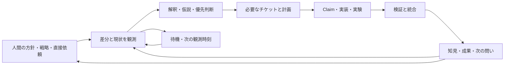

# Workaholic のエージェンティックループ再設計案

2026-09-08。調査基準: `a41522ab3` / v1.0.331。今回の直接依頼と、追加された実行・トークン効率の要件に対する設計案です。現行の実行規約を上書きする文書ではなく、これから変更する内容、互換性、実装単位、検証条件を定めます。

**実装担当へ:** 最初に後半の [H0・開始と読み方](#handoff-start)、[H1・固定する判断](#handoff-decisions)、[H2・内部契約](#handoff-contracts) を読み、その後は担当する [H3・ファイル別実装手順](#implementation-map) と対応する検証だけを開いてください。後半は2026-09-08の追加依頼に基づく具体的な引き継ぎです。前半の候補・未確定事項を後半で確定した場合、実装先には後半の決定を採用します。

## 目指す状態

**人間は方針を育て、AI はその方針から問いを立て、開発で得た知見から次の問いを見つける。** Workaholic の中心を、この循環に置きます。チケット数、PR 数、稼働時間、自己修復の件数を開発の成果とは扱いません。

人間が Slack に「使い手が自分で選択できる状態を広げたい」と書いた場合、AI は利用体験、業務上の価値、設計、運用などの観点から解釈し、現状の証拠を集め、有望な仮説を選び、小さな変更または実験で確かめます。結果は「何が変わったか」「何が分かったか」「次に何を確かめるか」にまとめます。方針が有効な間、人間が次の細かい作業を投稿しなくても続けられます。

同じことをリポジトリ内で直接依頼した場合も、同じ計画・実行処理へ渡します。既存の `/work`、`/ticket`、`/mission`、`/drive`、`/implement`、`/story`、`/ship` と対応するスキルは残します。Claude Code と Codex のどちらからでも開始・継続でき、実装や判断記録を別製品へ引き継げることを必須条件にします。

## 調査から分かったこと

ソースの対象は `plugins/workaholic/` の全 Markdown です。配布物を別の正本とは数えません。基準コミットの機械的な棚卸しは [監査インベントリ](/agentic-loop-audit.json) に保存しています。本文の確認範囲は末尾に記録します。

| 対象 | ファイル数 | UTF-8 バイト数 |
| --- | ---: | ---: |
| authored plugin Markdown 全体 | 169 | 2,423,901 |
| うちスキル・参照・ポリシー | 139 | 2,184,590 |
| うちコマンド | 22 | 130,134 |
| うちルール | 6 | 91,174 |
| `CLAUDE.md` | 1 | 232,939 |
| portable workflows の Markdown | 29 | 682,746 |

プラグインにはさらに 322 本の shell script があります。これは実際に毎回読み込まれる量でもトークン数でもありません。利用経路ごとの読込量は別に測定します。

### 文章の肥大化は責務の分散から生じている

`CLAUDE.md` は「現行仕様だけを書く」と述べながら、障害の経緯と対策が長い段落に残っています。`drive/SKILL.md` は約120KB、`moderate` 配下の Markdown は約350KBです。長い一行が多く、行数制限だけでは負担を捉えられません。

単純に `reference/` へ分けるだけでは解決しません。例えば [story 本体](https://github.com/qmu/workaholic/blob/a41522ab3/plugins/workaholic/skills/story/SKILL.md#L47) と [orchestration 参照](https://github.com/qmu/workaholic/blob/a41522ab3/plugins/workaholic/skills/story/reference/orchestration.md#L13) は、バージョン更新の省略条件が異なります。参照には退役した `concerns/` と直接の `git commit` も残っています。一つの判断を複数の文章で保守していることが原因です。

### 正しい修復も、別の場所では古い規則と競合している

| 現在の記述・機構 | 再設計で扱う問題 |
| --- | --- |
| `notify/SKILL.md` の connector 優先 | 今回の QFS 優先と異なる。接続先と送信者を維持する transport 契約に置き換える |
| `propose` の `only_the_loop_spoke` | 人間の発言がないだけで、継続中の戦略に沿った探索も止まる |
| `check-deps/SKILL.md` の `src` / `call_src` | 古い呼出方法と修復後の規約が同じ文書に残る |
| `notify` の moderation 投稿条件と `moderate` 本体 | 「変更があれば投稿」と「質問がある時だけ投稿」が競合する |
| `moderate` の手順数 | description・本文・参照と実際の `run.sh` の33手順が一致しない |
| 固定 `.publish` / `publish-main` | 同一リポジトリの複数セッションに対する排他がなく、open と close で未公開 commit の扱いも異なる |
| `plugins/workaholic/README.md` | 旧 `Core` 名とインストール例が残る |
| `story/reference/release-readiness.md` | 互換性を懸念として扱わない旧方針が残り、今回の要件に反する |
| `standup` / `catch` の本文と参照 | 読取専用という入口の約束と、投稿・migration の指示が食い違う |

固定 publish tree の競合はコードから確認したリスクで、今回競合を発生させた実測ではありません。実装前に隔離した fixture で再現します。

### 既に使える仕組みは残す

現在の `work` は、同じセッション内で待機できる環境、同じ会話に戻る scheduler、外部 Codex supervisor を機能に応じて選びます。この設計を基礎にします。前景ループを外部プロセスに一律置換することはしません。

チケットを作業単位とする構造、PR 単位の claim、worktree の隔離、検証待ちの明示、ミッションのチケット一括生成、既存 artifact reader、commit/merge の専用 writer も引き継ぎます。全面的に別のシステムを書いて載せ替える案は採用しません。

## 設計上の決定

1. **判断の正本を一つにする。** 規約は目的と判断基準、スキルは実行時の短い契約、スクリプトは決定的な観測・作用を担当します。過去の理由は設計記録や既存の履歴へ置きます。
2. **ループと手動を同じ処理へ接続する。** 異なるのは入力元、既に与えられた権限、対話の可否、通知先、継続実行の有無です。
3. **エージェントと通信を独立して選べるようにする。** Claude/Codex の選択が Slack の workspace の選択を決めない設計にします。
4. **人間の沈黙を停止条件にしない。** 戦略の範囲、得られた証拠、残る不確実性、重複、利用量で探索を判断します。
5. **待機・差分確認に推論を使いすぎない。** AI の時間とトークンを課題設定、実装、検証、解釈へ配分します。
6. **既存データを読み続ける。** 内部整理と利用リポジトリの移行を分離し、旧形式を読む責任を互換層へ集めます。

これは既存ポリシーの `multiple-ai-use`、`vendor-neutrality`、`explanations-on-demand`、`objective-documentation` と整合します。企業ポリシーの写しをこのリポジトリの都合で改変することはしません。例えば `commit-change-history` の squash に関する記述と、現在の squash 運用の差は明記しておき、今回の内部整理でマージ方法を勝手に変更しません。

## 共通の循環



この六つの段階を、新しい六つの常駐エージェントにはしません。各段階は責務であり、必要な時だけ実行します。小さい修正なら一つのセッションがまとめて進め、独立した大きい調査や実装だけを並行 worker に渡します。

`/propose` は問いと仮説、`/specificate` は作業可能な計画、`/drive` と `/implement` は実行、`/story` と `/ship` は報告・統合の既存入口として同じ段階を呼びます。`/moderate` はこの循環の保守を支えますが、新しい開発をすべて保守課題に変換する役にはしません。

### 自律性の条件

新しい取り組みは、元の人間の方針または有効な戦略へ追跡できるようにします。AI 自身が得た観測は証拠として使えますが、新しい権限や戦略そのものを捏造する根拠にはできません。

由来は入口をまたいで保持します。GitHub issue を登録したアカウントや Slack の中継 bot を、意見を述べた本人と同一視しません。既存の `subject`・`source`・`author` の違いを保ち、再取り込みで機械の提案を人間の指示へ変換しない契約を設けます。

次の仮説には、関連する戦略、現時点の証拠、確かめたいこと、最小の行動、成功・中止の条件を含めます。毎回固定数の観点や提案を出させず、深める・広げる・縮めるという観点は候補を考える時の補助として使います。

同じ問題を別名にしただけの提案、根拠が増えていない自己反復、既存 claim と重複する作業は進めません。一方、前回の実装で得た新しい証拠から別の仮説へ進むことは許容します。境界を超える提案は人間に判断を委ね、他の進められる作業は継続します。

戦略の期限・所有者・明示された停止は尊重します。期限を勝手に延長せず、予算や権限の不足はその作業の状態として記録します。全体停止と一件の保留を混同しません。

キューが空になったことや、関連 PR が merge されたことを戦略の達成とは見なしません。現在の `quiescent` / `arrived` 判定も見直し、戦略の Aim に対する証拠、宣言された stage と探索範囲から次の行動を判断します。観察段階なら必要な観察を続け、未達の方針には次の仮説を立てます。戦略の状態変更を人間の宣言なしに代筆することとは区別します。

### 成果と学習

検証結果には、観測した事実と解釈を分けて残します。「成功した変更」と「有益な否定結果」は両方扱えます。ただし、実装完了と実環境の検証完了を同じ成功状態にはしません。

既存の story、チケットの検証記録、feedback の insight を使って知見を残します。新しい永続 artifact をすぐ増やすことはせず、既存形式では表現できないことが実装時に確認された場合だけ追加を検討します。

## 内部構成

| 層 | 主な責務 | 正本となる場所 |
| --- | --- | --- |
| 入口 | 既存名、引数、スコープ、開始地点 | `commands/` と既存 `skills/*/SKILL.md` |
| ループ制御 | 次の期限、進行中の仕事、利用量、停止・再開 | 小さい内部 `runtime` スキルと scripts |
| ドメイン処理 | 計画、claim、検証、統合、結果の記録 | 既存 `gather` / `branching` / `drive` 等の責務別 scripts |
| 実行アダプター | 待機、worker 起動、通知受信、状態取得 | runtime 配下の Claude / Codex 用 adapter |
| 通信アダプター | 接続先解決、差分取得、thread 読取、投稿確認 | 内部 `transport` スキルと QFS / connector adapter |
| 判断の参照 | 方針本文、契約の理由、過去の障害 | policy 全文、既存履歴、必要時だけ読む reference |

`runtime` を何でも入る巨大スキルにしません。Git の所有権判断は claim reader、配送判断は transport、戦略の解釈は planner に残します。スクリプト間で共通化するのは具体的な型と処理であり、新しい汎用 workflow 言語や必須の中央サービスは導入しません。

既存の POSIX shell / jq を土台にし、shell は外部呼出しとプロセス管理、構造化したデータ処理は一箇所の reader に集約します。Node は現在の build 用途を維持し、利用リポジトリへ新しいランタイム依存を追加する前提にはしません。

### 観測・判断・作用を分ける

一回の観測で作る snapshot に、repo/base/HEAD、設定と policy の fingerprint、入力の識別子、対象 artifact、claim と worker、検証済みの結果をまとめます。planner、executor、reporter が同じ snapshot を再利用します。

状態は一つの巨大な status 列挙にしません。少なくとも所有権、実装進捗、検証、統合、配送を独立して持ち、そこから次にできる行為を一度だけ導出します。例として「実装は完了、実環境の検証待ち、PR は存在、Slack 通知は未送達」をそのまま表現します。

既存の strategy attribution は feedback refs からの推定で、排他的でも完全でもありません。snapshot に入れても証明へ格上げせず、帰属の根拠と不明を保持します。plan の結果も、単独 ticket、共通成果の mission、複数の独立 ticket、strategy の変更案、記録のみを明示し、文章の手順番号から writer の動作を推測させません。

snapshot は観測時点の証拠であり、操作の許可証ではありません。claim、merge、publish、外部送信の直前には必要な現状態と権限を再確認します。外部障害は `unavailable`、読取不明は `unknown` として保持し、空の結果や成功へ変換しません。

保留には制約の観測、根拠、再評価条件を持たせます。環境、権限の可用性、対象ファイル、検証宣言が変わった時に再評価し、変化のない高コスト probe を毎 tick 繰り返しません。資格情報の値そのものは fingerprint やログに含めません。

検証証拠は対象 HEAD と設定に結び付けます。検証後の version bump や conflict resolution で HEAD が変わった場合、変更に必要な検証を新しい HEAD へ適用してから merge します。プロセスが存在すること、仕事を受けられること、実際に成果が進んでいることも別々に報告します。

## 常駐、tmux、エージェントの選択

tmux の各ペインでは、利用者が選んだ Claude Code または Codex から従来通り work スキルを起動します。tmux は表示とプロセス保持の手段です。チケットの所有権、workspace の選択、重複処理の防止をペイン番号だけには依存させません。

起動時に repo、agent instance、設定された通信先、継続実行方式、既存ループの有無を解決します。単に製品名で分岐せず、そのセッションが持つ次の機能を確認します。

設定の優先順位は、明示された起動指示、ペインごとの環境設定、任意のリポジトリ共通設定、既存設定、既定値の順にします。既存の `.claude/settings.json` 等から読む値は互換 reader に集めます。新しい設定ファイルを全利用者へ必須にせず、解決された宛先と周期を起動時に表示します。追加依頼により、共通設定の保存形式は後半H1の任意 `workaholic.config.json` に確定しました。

| 実行環境の能力 | 起動方法 | 維持する条件 |
| --- | --- | --- |
| 同じ会話で中断可能な待機、入力受信、worker の完了受信ができる | 現在のセッションを親にする | 直接質問へ応答し、停止指示まで継続する |
| 同じ会話へ再入場できる scheduler が使える | その scheduler から共通 tick を呼ぶ | schedule の寿命・再入場先を確認する |
| CLI と永続的なローカルプロセスが使える | 既存 supervisor の互換入口から起動する | 起動元チャットへ返信できるとは扱わない |
| いずれも成立しない | 一回の処理と機能不足の報告 | 常駐できたと報告しない |

Claude のスケジュールはセッション依存で、処理中は予定時刻通りに実行されるとは限りません。利用可能な方式と寿命をその環境で確認します。[Claude Code の公式説明](https://code.claude.com/docs/en/scheduled-tasks)

Codex CLI の非対話実行は JSONL と schema 付き最終結果を扱えます。これは worker の境界に使えますが、現在のチャットの connector、対話、schedule を新規 CLI プロセスが継承する証拠にはなりません。[Codex の公式説明](https://learn.chatgpt.com/docs/non-interactive-mode)

### 寿命、停止、復旧

ループ状態には開始時刻、次の期限、最終完了、稼働中 worker、停止要求、plugin/config の版を持たせます。明示された一分間隔などは保持し、質問への応答やコンテキスト圧縮で周期の基準を失いません。期限超過は遅延として報告し、過去の tick を大量に再生しません。

長い実装 worker の完了を待って親の監視を止めず、同じ仕事を再投入しません。停止時は新規投入を止め、進行中の仕事を終了・引継ぎ・継続のどれにするか、既存の指示と実行状態に基づいて明示します。

ローカルの操作状態は Git 管理の知識と分け、H1で確定した `git rev-parse --git-common-dir` 配下の Workaholic 専用領域に置きます。worktree 間で共有でき、既存の閉じた `.workaholic/` レイアウトへ新しいログ領域を増やしません。書込権限と可搬性は fixture で確認し、既存 `.codex-loop` の status と再開は互換 reader で残します。

worker や inbox の lease には所有者と世代を持たせます。lease を引き継いだ後に旧 worker が完了しても、新しい所有者の状態を上書きできないようにします。同一ホストの排他と、Git 上の fleet claim は別の責任です。別ホストにも一度きりの受信・投稿を保証する場合は共有の条件付き書込が必要であり、ローカルファイルだけで保証したとは扱いません。

## QFS 優先の通信

宛先は channel 名だけでなく、**接続 mount、実際の workspace ID、channel ID、必要なら thread の root timestamp、送信者の識別**で扱います。QFS の workspace パス部分を書き換えることと、別アカウントに接続することを混同しません。

起動時に QFS の binary と接続を検出し、`connect --list`、`describe`、必要な installed view/map を確認します。固定 `/slack`、固定 workspace、public channel 一覧だけに依存しません。この環境では QFS 0.0.130 と二つの Slack mount、および `thread_ts` を送る reply map を読取確認しました。これは別 workspace への実送達を確認した結果ではありません。

1. 設定された宛先について、必要な read/reply 能力が確認できる QFS を優先します。
2. QFS が使えない場合、セッションの Slack plugin/connector が同じ workspace と channel に到達できることを確認して利用します。
3. 同じ宛先に到達できない場合は、その経路の機能不足として記録します。別 workspace や別アカウントへ無言で切り替えません。

読み取りと投稿、channel と thread を別々に能力判定します。reply map の有無を `INSERT` 表示だけで推定せず、実際に `thread_ts` を転送することを確認します。投稿は許可された用途・宛先・送信者で行い、QFS の preview と commit の仕組みを使います。

### 差分読取と重複の扱い

channel ごとの cursor と、監視中 thread の更新位置を保持します。channel の新しい親メッセージだけでは古い thread の新しい返信を捕捉できないため、未完了 thread と指定された監視 thread を別に確認します。pagination が終わる前に high-water mark を進めません。

再接続時は小さい重複窓を含めて再取得し、workspace/channel/message ID で重複排除します。編集・削除・古い thread の更新は transport の提供能力に合わせ、イベント取得または定期的な整合確認で扱います。利用できないイベントを検出できるとは約束しません。

取得した未処理入力を回復可能な inbox に記録してから cursor を進めます。取得済みと処理済みを分けることで、計画や worker が失敗しても入力を失いません。再構築可能な cache と、未処理入力・外部送信の結果を保持する操作記録は、保存と削除の方針も分けます。

既存 `/fb` の GitHub 障害時も「ローカル保存済み、計画処理には未受理」として保持し、経路復旧時に担当が再取り込みします。既存 issue/record の識別子で重複を照合し、保存成功だけで実行義務を消しません。未送達通知も claim branch や worktree の削除で消えない寿命にします。

送信は、予定、送信中、送信確認済み、結果不明を区別します。送信後にタイムアウトした場合は、別 transport ですぐ再送せず、宛先を読んで確認します。provider が冪等性を保証しない場合の完全な exactly-once は約束せず、安定した識別子と照合によって重複を抑えます。

通知の識別子には事象の発生単位も含めます。同じ問題が解消した後に再発した場合を、過去と同じ digest だからと永久に抑制しません。「回答を受信」「記録」「必要な作業を登録」「送達」を別の完了として持ち、途中のクラッシュから残りを進めます。

session の connector を shell script から直接呼べるとは仮定しません。その場合、script は構造化した通信要求を返し、親エージェントが connector を呼んで正規化した結果を渡します。既存の relay で守っている境界を一般化します。

## トークンと実行効率

最適化対象は「必要な推論一回あたりの質」を下げることではなく、「同じ資料・同じ状態・同じ報告を繰り返し処理する回数」です。

| 負担 | 変更案 | 検証する値 |
| --- | --- | --- |
| 起動ごとの巨大な規約読込 | 短い入口と共通契約、必要時だけ policy/reference を読む | 実際に読み込んだ bytes と利用可能な token usage |
| 毎 tick の全 survey | 共有 snapshot、入力 fingerprint、変更対象だけ再計算 | reader 起動数、API 呼出数、経過時間 |
| Slack の毎回の広域検索 | channel cursor、thread 更新位置、重複窓 | 取得メッセージ数、見逃し、重複、応答遅延 |
| 固定された三者調査・report 用 worker | 独立して有益な仕事だけ委任 | spawn 数、親子の重複 context、成果までの時間 |
| story・PR・release の再作文 | 一回の実行結果から各表示を生成 | report の生成回数、矛盾、管理 commit/PR 数 |
| 毎回すべての maintenance | 変更イベント、期限、対象範囲で必要な check を選ぶ | idle tick の処理量、保守仕事の滞留 |

現在の `claimable-units.sh` には、warm な `plan-units` が68〜73秒かかった記録があります。これは過去の測定です。また、`codex-loop.sh` は新規 coordinator に約61KBの work/tick 指示を読ませる構成です。これらを今回の改善率や一週間の利用量へ外挿しません。

### 待機と探索を別々に調整する

QFS を CLI から読める環境では、idle の差分確認と待機を決定的な処理にし、変化も期限到来もない間の AI worker 起動をゼロにできる経路を作ります。connector しかない環境では取得にエージェントの tool 呼出しが必要なので、同じゼロを保証しません。

明示された固定間隔はそのまま尊重します。自動調整を利用する場合は、会話中の短い間隔、静かな時の長い間隔、エラー時の backoff を分けます。深夜という理由だけで人間が指定した周期を上書きしません。次の期限は、監視・探索・保守・再試行それぞれのうち最も早いものです。Slack が静かでも、有効な戦略の探索は予定できます。

worker に渡す context は、目的、対象と版、必要な証拠、既決事項、実行境界、完了条件、続きを読める参照に絞ります。履歴は消さず参照可能にし、コンテキスト圧縮後も未完了の義務と新しいユーザー指示を回復します。

利用量は provider が報告する input/cached input/output 等を区別して記録し、取得できない場合は unknown にします。cached input を無料ともゼロとも扱いません。料金や契約上の週次上限を token 数から推定しません。

### 初期の性能受入れ目標

数値は実装を評価するための暫定目標であり、改善済みという主張ではありません。

- 主要な起動 context の bytes を同じ経路の基準値から70%以上削減する。必要な契約が欠ける圧縮は不合格。
- QFS の idle fixture では AI worker 起動ゼロ、全 backlog survey ゼロ、成功した差分取得一回あたりの返却量を bounded にする。
- 同一 snapshot 内では同じ広域 survey を二度実行しない。変更時だけ対象の再計算をする。
- 同じ依頼、同じ完成物、同じ検証水準で旧経路と比較し、取得できる usage、壁時計時間、API 数、spawn 数を併記する。
- 通常の投稿検出は設定した poll 間隔に provider/実行遅延を加えた範囲で評価し、実測値を報告する。定時実行の厳密保証とはしない。

## 手動オペレーション

直接依頼からも、方針と受入れ条件を一回整理し、関連するソース・履歴・policy を一回調査します。必要なチケットをまとめて作り、その context を実装へ渡します。すでに答えられている内容を、mission → ticket → drive の各段階で質問し直しません。

ミッションは共通の成果・受入れ条件を持つ複数チケットをまとめる必要がある時に作り、一件の変更は単独チケットで扱います。チケット間の依存関係も表現します。手動入力をいったん Slack へ投稿して GitHub issue として再取り込みする往復は作りません。外部入力も直接入力も共通 planner に渡します。

既存の publication 経路は互換の入口として維持します。今回のような連続した直接依頼では、計画と実装を同じ実行 context で扱えるようにします。ただし、公開済み backlog の claim と計画の承認条件を飛び越えず、既存の merge policy を別の意味に読み替えません。

実装中の結果を一回構造化して記録し、story、PR body、release note はそれを材料にします。小さい変更に固定数の文章や独立 worker を要求しません。PR の内容と実際の差分、未解決の懸念、検証証拠は引き続き必要です。

並行 author ごとに publication transaction を分け、未公開 commit・dirty file・所有者を保存します。生成 index の競合は同じ生成器で解消し、人間の手書き領域を保持します。未所有・未コミットの変更を上書きしません。許可された実装範囲の意味的な競合はエージェントが解決・検証し、競合があるという理由だけで人間へ返しません。

## 互換性と移行

互換性は名称だけではなく、引数、結果、保存されたデータ、実行環境を含めて固定します。

| 表面 | 維持するもの |
| --- | --- |
| コマンド・スキル | 既存名、代表的な入力、bare invocation、`/report` 等の既存 alias |
| work | 指定周期、起動元での応答、重複起動防止、停止と再開、既存 status 入口 |
| scripts | 外部から利用される path、引数、exit code、JSON と terminal token。内部実装へ delegate する wrapper を残す |
| `.workaholic/` | feedback、strategy、mission、ticket、story、deployment と既存 schema/reader |
| Git | claim 所有権、進行中の worktree、未merge PR、手元の変更の保護 |
| 配布 | Claude source plugin、Codex source manifest、portable workflows、policy bundle |
| 検証 | 人間の実測が必要な handoff、既存の過去記録、実装と検証の区別 |

新しい reader は旧形式も読めるようにして先に配布します。その後に writer を切り替え、旧入口を wrapper にし、最後に重複した内部だけを除きます。layout を変える時は既存 `converge-layout.sh` に冪等な migration を登録します。履歴の一括書換えや archive の再解釈はしません。

一つの生きたループが途中で別版へ変わらないよう、実行中の plugin 版を固定します。更新は tick/worker の安全な境界で引き継ぎます。rollback は新しい writer を止め、互換 reader を残したまま旧 executor へ戻す方式を基本にします。新状態を旧版が直接読めるとは仮定せず、未送達・結果不明の投稿や未完了 claim を含む downgrade fixture で確認します。

Codex 向けを Claude 用の文章置換だけで成立させない設計に変えます。共通契約と adapter の差分を明示し、配布 manifest から必要な assets/reference/scripts を列挙します。portable workflows の単独 skill 利用も残し、その用途で必要な依存コピーと、全 plugin における正本の重複を区別します。

## 実装順序

先に互換契約と失敗シナリオを固定し、一つの実動経路を通してから文章を減らします。先に全文を短くして安全条件を失う順序は採用しません。以下は実装候補の PR 単位で、まだ todo queue に投入したチケットではありません。

| 単位 | PR 単位 | 主な対象 | 完了条件 |
| --- | --- | --- | --- |
| 1 | 要件・互換契約と基準測定 | 全スキル、commands、rules、fixture | 全規約を preserve / replace / history / obsolete に対応付け、既存 consumer と利用量の基準を固定する |
| 2 | 共通 snapshot と状態の reader | gather、drive survey、claim reader | 読取を一回に集約し、unknown・handoff・配送失敗を別状態として旧出力へ変換できる |
| 3 | QFS / connector の共通通信 | notify、workaholify、relay、新 transport | 二つの宛先を混ぜず、QFS 無し・thread 能力不足・送信結果不明を正しく扱う |
| 4 | runtime と Claude/Codex adapter | work、loops、codex-loop、routine templates | 同じ会話の継続、長い worker、途中質問、周期維持、停止・再開を両環境で確認する |
| 5 | 差分処理と実行予算 | runtime、Slack/Git reader、moderate | idle の不要な AI 起動と全探索を除き、探索を止めずに性能目標を測定する |
| 6 | 戦略から学習を継続する planner | propose、specificate、feedback、strategy | 人間の沈黙後も証拠ある次の仮説へ進み、根拠のない自己反復は止める |
| 7 | 手動入口と publication の共通化 | ticket、mission、drive、branching | 既回答と調査を再利用し、並行 publish と未公開状態を安全に回復できる |
| 8 | 結果からの報告と保守の整理 | story、ship、catch、standup、moderate | 一つの検証結果から各成果物を作り、保守は対象と期限に応じて実行する |
| 9 | 規範・配布・ドキュメントの再構成 | SKILL/reference、CLAUDE、README、build、CI | 現行判断の正本を一つにし、Claude/Codex/portable consumer で同じ契約が成立する |

具体的な依存関係と一人で実装する順番は [H3の先行条件表](#implementation-map) に統一します。4で複数セッションの publication を有効にする前に、7の排他・隔離部分を先行実装し、5の保守最適化より前に8のregistryを導入します。それまでは既存 publication への作用を直列化します。9 の削除・最終集約は各実動経路の検証後に行い、正本の明確化は各 PR と同時に進めます。固定人数の並列実行は要求しません。

ミッション化する場合は、(a) 共通の実行・通信基盤、(b) 自律的な学習と効率、(c) 手動運用・報告・配布の整理、という成果ごとのまとまりを使います。ミッションの本文にこの設計全体を複写せず、具体的な受入れ条件を持つ複数チケットを一括生成します。

### 各チケットの共通 Quality Gate

- 変更する旧規約、その理由、残す不変条件、対応する回帰シナリオを明示する。
- 変更範囲に必要なテストを先に決め、両エージェントで読む同じ contract fixture を使う。
- 実物の証拠が必要な項目を mock 成功で完了扱いしない。環境不足は名前付きの handoff にする。
- scripts/manifests の変更では build、verify、metadata、既存 smoke、layout、関係する loop drill を実行し、生成物を同時更新する。
- ticket → claim/worktree → 実装・検証 → story/PR → merge/release の追跡を残す。マージとデプロイの権限は実際の依頼・設定に従い、今回の設計書だけで新たな無人操作権限を与えない。

## 検証シナリオ

| シナリオ | 必須の観測 |
| --- | --- |
| 直接依頼と Slack 入力が同じ変更を要求 | 同じ権限・対話条件なら同じ受入れ条件と状態遷移、不要な再質問や二重登録がない |
| 二つの tmux ペインが異なる workspace を担当 | read/reply と送信者が各宛先に一致する |
| QFS 不在、片方の経路が利用不能 | 同じ宛先の connector fallback、到達不能の明示、他の仕事の継続 |
| 古い thread に新しい返信、pagination、再接続 | cursor を失わず未処理だけを扱う |
| Slack が受理した直後に通信断 | 結果不明を照合し、安易な二重投稿をしない |
| GitHub 障害時に入力を保存、その後復旧 | 未受理入力を回収し、issue と record を二重生成しない |
| 二つの worker が同じ仕事を発見 | claim/lease の勝者だけが作用し、古い完了通知が上書きしない |
| 実装中の質問、10分超の worker、context 圧縮 | 親が応答し、指定周期と進行中の役割を保持する |
| 実装済みで CI 待ち、その後 CI が完了 | story や実装を再実行せず統合を完了できる |
| ミッションの一部が検証待ち、後から環境が変化 | 進められるチケットは進め、条件が変わった保留だけを再評価する |
| プロセス停止、再起動、plugin 更新 | 未完了 claim、未送達結果、実行版を回復する |
| 人間が静かでキューも空の、未達の有効な戦略 | 新しい証拠を伴う探索が進み、同じ提案の量産は止まる |
| 手動の複数チケットと二つの publication | 既回答を再利用し、別人の編集・未公開 commit を保持する |
| 旧 consumer、進行中 claim、古い artifact | 名前・引数・reader が互換で rollback できる |
| idle、単発修正、探索を含む同一 workload | token usage、API 数、遅延、spawn、管理作業量を比較できる |

fixture は pure contract、adapter、consumer migration、実環境 drill に分けます。既存39,000行超の smoke suite は意味のある回帰を維持しつつ責務別に整理します。文章の特定フレーズだけを固定するテストは、生成契約の整合性と実際の結果を検査するテストへ置き換えます。

## 今回の調査・検証記録

- ソース基準は `a41522ab3`。全169 Markdown のパス・サイズ・SHA-256・見出しを機械的に取得。
- ローカル CLI: Codex 0.153.4、Claude Code 2.1.263、QFS 0.0.130、tmux 3.5a。存在と表示機能の確認であり、全経路の実動確認ではない。
- `verify.mjs` 成功。portable skill の参照、policy index、OKF の整合性を確認。
- `validate-metadata.mjs` 成功。Codex manifest とバージョン整合を確認。
- `layout-doctor.sh` は conforming。過去の trip と重複 mission 等の advisory が存在するが、今回履歴を変更しない。
- active strategy 一件を確認。todo queue は存在しない。active ディレクトリに残る二つの mission は archived copy を持つ過去の achieved 記録で、今回の設計を実装済みとは扱わない。
- `CODEX-HANDOFF.md` の完了追記を採用。前景ループの過去検証を今回の新しい実測として再利用しない。
- ソースツリー内の全169 Markdown を本文まで確認。完全に一致する重複段落だけは一回の読解を共有。対象はスキル配下139、commands22、rules6、README1、生成 policy index1。root CLAUDE/README、関連する戦略・feedback・mission も本文を確認。既存 docs7本は構造と関連部分の確認であり、全文精読の対象には数えない。322 scripts の全コードレビューは未実施で、主要実行経路とテスト・配布処理を重点確認した。
- 再設計案を手動フローの全文監査と照合し、publication の先行排他、CI 待ちからの再開、snapshot 失効、切り戻しの条件を修正した。
- ドキュメントの VitePress build が成功。インベントリの全169 SHA-256 とサイズが現ソースに一致し、公開する監査 JSON は `docs/public/` に配置した。プラグインの挙動を変えていないため、runtime の全 smoke/drill や実送信テストは今回の検証結果に含めない。

実装の削除判断は、インベントリの一覧だけでは行いません。個別規約から新しい責務と回帰シナリオへの対応表を PR 単位1で完成させ、各変更の実証を伴って段階的に移行します。

<a id="handoff-start"></a>

## H0. 実装担当への引き継ぎ — 開始と読み方

### この時点で完了していること、していないこと

完了しているのは、全ソース Markdown のレビュー、主要スクリプトの追加調査、この設計書、`docs/public/agentic-loop-audit.json`、ドキュメントの navigation と build です。**後半に「新設」と記したプログラム、schema、テストは v1.0.334 の実装対象として追加されました。実装結果と未確認境界は `agentic-loop-migration.md` に記録します。** スクリプト所見は、別途「再現済み」と書かない限り静的分析です。

引き継ぎ時は `main`、基準 HEAD は `a41522ab3`。設計資料は未コミットです。`CODEX-HANDOFF.md` は前の作業に関する利用者側の未追跡ファイルであり、今回の変更へ混ぜたり書き換えたりしません。既存の前景ループのミッションは完了済みです。その古い未完了メモを読んで再開しないでください。

後続セッションは開始時に `git status --short --branch`、`git worktree list`、`git log -5 --oneline` を確認します。HEAD が変わっていれば、本書に挙げた対象の差分を確認してから進めます。監査 JSON は基準時点の証拠なので、差分を隠すために再生成しません。

### 一回の担当範囲

担当は H3 の一つの単位、必要ならその明記された先行部分です。一度に全9単位を編集しません。新しいモデルへこの全文を毎 tick 渡すこともありません。初回に全体の境界を理解し、作業中は担当節、関係する既存コード、fixture、必要な policy だけを読みます。

この文書に書いた「決定済み」を毎チケットで再質問しません。未確認の外部機能は H5 の probe で確かめ、未対応なら指定された縮退を実装します。ユーザーが選んだモデル・reasoning effort を維持し、旧スキル中の固定 `model: "opus"` 等を理由に別の高コストモデルへ変更しません。並列調査は独立した成果がある場合だけ使います。

### Workaholic の手順への接続

後続セッションで実装を依頼されたら、既存の mission/create-ticket の writer と schema を使い、H3 の単位からチケットを一括作成します。各チケットは `Key Files`、`Implementation Steps`、`Policies`、`Quality Gate`、実際の `depends_on` を持ちます。本書の説明を全チケットへ複写せず、担当節を参照します。

計画の公開は既存の publish tree 手順、実装は `drive/scripts/claim.sh` が返した worktree、コミットは `commit/scripts/commit.sh`、報告は story、統合は ship/drive の既存入口を使います。publication の修正が完成するまで、この再設計自身の計画公開は一件ずつ行います。`merge_policy` と操作権限は実際の依頼・設定から引き継ぎ、未決の場合だけ一度解決します。`review` を一般的な「人間のPRレビュー必須」と解釈し直さないでください。既存では両値とも無人mergeに至る経路があります。

今回作成した資料は本依頼で所有が明確な変更です。将来その資料をコミットする際もファイルを明示し、他者の未追跡ファイルを一括 stage しません。設計書を渡されたことだけを、Slackへの実投稿、常設プロセスの起動、merge/deploy の新たな許可とは扱いません。実装依頼で既に許可された行為は重ねて確認しません。

<a id="handoff-decisions"></a>

## H1. 実装時に再解釈しない決定

| ID | 決定 |
| --- | --- |
| D01 | 公開コマンド22本、既存 skill 名、二つの plugin ID `workaholic` / `workflows` を維持する。`/report` は `/story` の既存 alias として動く |
| D02 | 共通契約は agent-neutral。native tools を使う手順だけ adapter reference に隔離する。shell から MCP を呼べるふりをしない |
| D03 | consumer の新 runtime は POSIX shell + 既存 jq。Node は build/test 用。新しい mandatory Node/Python daemon、DB server、汎用 workflow DSL は入れない |
| D04 | 能力のあるセッションでは同じ会話を親として維持する。Codex という名前だけで外部時計を選ばない。別プロセスは同じチャットの代替にならない |
| D05 | QFS を操作ごとに優先し、同じ workspace/channel に到達する native connector へ fallback。既存 token transport は設定済みの場合の互換経路として残し、新規 token 設定を要求しない |
| D06 | `subject` は意見の原著者、`source` は入口、GitHub/Slack の投稿者は運搬者になり得る。実行者と分ける。人間の方針への追跡と、機械の観測である事実を両方残す |
| D07 | `only_the_loop_spoke` と、キューが空だから `arrived` とする起案停止を撤去する。無根拠な自己反復は止め、戦略に追跡できる新しい仮説は許可する |
| D08 | mission 自体は複数チケットの容器。小さな仮説を試すために人工的な二枚目を作らない。proposal は単独 ticket も許可し、mission publication の既存2-ticket floorは維持する |
| D09 | Git の知識とローカル操作状態を分ける。runtime log を main へコミットする旧指示は撤去する。outbox の寿命を branch/worktree の寿命へ結び付けない |
| D10 | provider の応答不明、読取失敗、空結果を区別する。unknown を全操作共通の proceed/refuse に変換しない。操作別の決定は H2/H3 の表に従う |
| D11 | CI待ちは実装やcatch-upの状態と独立した配送待ち。HEAD を変える作業を終え、確認した HEAD を指定して merge する。HTTP成功だけでmerge済みとしない |
| D12 | 本書で明記した修復以外の既存 JSON key、exit code、stderr/stdout、TSV位置を保持する。形式の互換性を、既知の誤動作を残す理由にはしない |
| D13 | mutation と migration は writer の責任。summary、status、catch 等の読取入口で migration、state初期化、commit を起こさない |
| D14 | 利用量節約は再読・再計算・待機に適用する。必要な探索や検証の省略、成功の捏造、権限制御の解除によって数字を改善しない |

新 runtime の欠けた依存は起動前に具体名で返します。既存の依存不足時の read-only status まで壊さないよう legacy reader を残します。jq を導入するために複数言語の代替実装を増やすことはしません。

### 設定と状態の置き場所を確定する

任意の repo 設定を **`workaholic.config.json`** に統一します。ここはユーザーが使うリポジトリのルートです。今回の plugin repo に利用者向けの実 workspace 設定を作る指示ではありません。ファイルなしは通常の互換経路です。`WORKAHOLIC_PROFILE` でペインごとの profile を選び、省略時は `default` とします。

```json
{
  "schema_version": 1,
  "profiles": {
    "default": {
      "polling": {"mode": "fixed", "interval_seconds": 300},
      "target": {
        "workspace_id": "T_EXAMPLE",
        "channel_id": "C_EXAMPLE",
        "qfs": {"mount": "/slack-example", "workspace_segment": "example"},
        "allowed_sender_ids": []
      }
    }
  }
}
```

例のIDを実データとして使ってはいけません。`target` は省略可能で、その場合は既存 channel 設定と live discovery を使います。`allowed_sender_ids: []` は「誰でもよい」ではなく、明示的な sender 制約が未設定という意味です。初回選択時に既存権限の範囲内の送信者を binding に記録します。fallback が異なる送信者になる場合は、設定済みの許可またはユーザーの既存指示を照合し、無言で切り替えません。

優先順位は **構造化した明示入力 → 実プロセス環境 → 選択profile → legacy `.claude/settings.json` のenv → 既定値**。実プロセス環境に既に値がある場合、旧settingsを再注入して上書きしません。未指定と明示false/0は区別します。JSONを `source` / `eval` せず、許可した既存キーと新profileだけを値として読みます。空白・改行・引用符を壊す `for ... in $(...)` を使いません。設定に credential の値を置きません。

内部保存先は **`<absolute git-common-dir>/workaholic/runtime/v1/`** とします。`git-common-dir` は Git で解決し、`.git` がファイルである linked worktree も扱います。論理上の区分は `bindings/`、`instances/`、`publications/`、`snapshots/`。これらは `.workaholic/` の知識領域を増やすものではありません。

binding は repo + workspace ID + channel ID + 選択したidentity policy で識別します。native session / tmux pane の instance は別の識別子です。同じ binding を二つのinstanceが担当する場合、inbox/outbox の作用は共通leaseで調整し、workerはclaimで分けます。tmux pane ID や model 名を永続の宛先キーにしません。legacy channel-onlyキーを読んだ時は、その保存元のbindingが一意な場合のみ対応付け、曖昧な履歴を別workspaceへ移しません。

<a id="handoff-contracts"></a>

## H2. 新しい内部契約と実装境界

以下のファイル名・signature は**新設予定の仕様**です。まだ実行しません。ここでは `skills/` はすべて `plugins/workaholic/skills/` を表します。新しいコードは命令本文から読み取った任意のshell commandを実行せず、下記の有限な操作だけを扱います。

### ファイルの責任と依存方向

| 新設する正本 | signature / 責任 |
| --- | --- |
| `runtime/SKILL.md` | 起動時の小さい共通契約と各script/referenceへの入口。過去障害の説明を入れない |
| `runtime/scripts/read-config.sh` | `--root REPO [--input FILE]`。解決済み設定と由来をJSONで返す。保存・環境変更なし |
| `runtime/scripts/read-capabilities.sh` | `--input FILE`。親が測定した能力からnative/scheduler/supervisor/onceを選ぶ。shellからMCP有無を推定しない |
| `runtime/scripts/state.sh` | `read\|create\|update\|transition --scope binding\|instance\|publication\|snapshot --id ID [--record RECORD] [--expected-revision N --input FILE]`。ローカル状態の唯一のwriter。作成・更新条件は下記 |
| `gather/scripts/read-snapshot.sh` | `--input FILE [--previous FILE]`。既存readerの下位producerを一回ずつ呼び、共通snapshotを返す |
| `runtime/scripts/plan-turn.sh` | `--input FILE`。時刻・snapshot・状態から必要な観測、役割、待機期限を純粋に導出する |
| `runtime/scripts/context-packet.sh` | `--snapshot FILE --role ROLE [--unit ID]`。担当に必要な証拠・既決事項・参照・完了条件を小さく返す |
| `runtime/scripts/dispatch.sh` | `--request FILE`。排他とreceiptを確定してからCLI childを起動。native childは親が起動してreceiptを返す |
| `runtime/scripts/adapters/codex.sh` / `claude.sh` | `--request FILE`。各CLIの引数・出力を共通worker契約へ変換。model/permissionはユーザーの選択を維持 |
| `runtime/reference/codex.md` / `claude-code.md` | 同じ会話の待機・中断・child一覧・完了受信・圧縮からの復旧に必要な短いharness手順 |
| `transport/SKILL.md` | QFS優先、操作別能力、宛先・送信者、結果確認の契約 |
| `transport/scripts/resolve-target.sh` | `--request FILE`。QFS/connectorで同じ宛先を確認しbinding候補を返す。投稿しない |
| `transport/scripts/perform.sh` | `--request FILE`。既知のoperationをQFS/tokenへ渡すか `needs_parent` を返す |
| `transport/scripts/adapters/qfs.sh` / `slack-token.sh` | `--request FILE`。CLI/APIの応答を正規化。raw provider body は診断用であり共通stateの型にしない |
| `transport/scripts/accept-observation.sh` | `--request FILE --result FILE`。親のconnector結果のrequest ID・宛先・operationを検査する |
| `transport/scripts/relay-v1.sh` | 既存relayの変換だけ。v1へ新しい意味を隠して追加しない |

domain reader → snapshot → plan-turn → dispatch/transport →結果の保存、という依存にします。**snapshot → legacy facade → snapshot の循環を作りません。** `claims_scan`、owner、mission relation等の正本を別名で再実装せず、下位producerを抽出して共有します。

新しいscripts間の契約は `runtime/scripts/schemas/*.schema.json`、transport固有契約は `transport/scripts/schemas/*.schema.json` に置きます。v1の request/result/snapshot/state/worker-receipt と transport request/result の7種類から始めます。schema ファイルは設計・fixture・build検証に使い、consumerにNodeのschema validatorを要求しません。ランタイムは責任を持つ境界でjqにより必要な型と有限の値を検査します。追加する検査には、妥当なJSONでも意味が不正なfixtureを付けます。

### 共通の request/result

共通requestに必須なのは `protocol`、`request_id`、`operation`、`repo_root`、`instance_id`、`input`。protocolは `workaholic.runtime/v1` または `workaholic.transport/v1`、operationごとにinputを閉じたschemaにします。初回の `discover` / `resolve-target` はbindingを作るための読取なので `binding_id` を不要とし、候補mount/accountと宛先制約を渡します。確定したbindingを保存してから投稿操作を許可します。それ以外の通信operationは `binding_id` と実際の対象の一致が必須です。ローカルの設定読取にはbindingは不要です。未実装operationや未知のprotocolへ作用しません。

共通resultは `protocol`、`request_id`、`status`、`reason`、`data`。`status` は `ok | needs_parent | deferred | error`、成功理由は空文字、その他は機械判定できるreasonです。**このstatusは呼出しの状態で、仕事の完了状態ではありません。** workerの `pending` が正しく読めた結果は `status:ok` でも `work_outcome:pending` のままです。

新しい内部scriptは、正常に型付き結果を返した場合にexit 0、入力/usage不正に2、script内部の異常に1とし、stdoutはJSON一件だけにします。旧wrapperのexit・stderr・文言はH4の互換表どおりに投影します。schemaに不正な入力を「成功した空結果」にしません。

CLIの `--request FILE` は上記の完全なrequestを受け取ります。`--input FILE` のpure readerは目的別inputだけを受け取り、request ID等は入口で生成します。`read-config` は設定のoverride object、`read-capabilities` は観測済み能力とその証拠、`read-snapshot` は `repo_root/now/config/identity`、`plan-turn` は `now/snapshot/state` が入力です。それらの型はruntime request schemaの `$defs` に置きます。新scriptのstdoutは共通result envelope、保存するsnapshotや `--snapshot` の入力はその `data` だけです。envelopeとpayloadを混在させず、受け渡しの抽出をfixtureで固定します。既存readerにはこのenvelopeを強制しません。

capability入力はC1–C4それぞれを `true/false/null` と観測根拠で持ち、別に選択CLIの利用可否と永続ローカルprocess可否を持ちます。`true` の証拠がある組合せだけを使い、native（C1+C2+C3）→same-chat scheduler（C4）→CLI supervisor→onceの順に選択します。nullをfalseの確証やtrueに置き換えず、不明な機能は起動報告へ残します。mode名は `native | scheduler | supervisor | once` に統一します。

request IDは再試行中に変えません。外部作用のIDはbinding・元event ID・operation・occurrence・内容版の正規化した組から決定的に生成し、同じeventを別instanceが発見しても同じoutboxを参照します。PIDや現在時刻だけで再試行を別作用にしません。本文が同じでも別occurrenceなら別IDです。日時、ID、パスをモデルに推測させずscriptで生成します。数値にしてよいのはカウンタやepoch秒等だけです。Slack `ts` / `thread_ts` は常に文字列で、浮動小数点演算をしません。unknownは `null` とreasonで持ち、配列 `[]` や数値0とは区別します。旧readerの `readable` 省略は明示的に互換変換し、`false` を消す jq の `.readable // true` は使いません。

### snapshot の必須情報

| 区分 | 必須情報・制約 |
| --- | --- |
| 基準 | `snapshot_id`, `observed_at`, repo/common-dir, HEAD/base SHA, identity, config/policy fingerprint |
| 鮮度 | `local_fingerprint`, remote読取時刻と成功/失敗、対象ごとの失効理由。HEAD一致だけでdirty treeも同一としない |
| 作業 | raw claim観測、正規化したticket/mission/strategy、検証待ち、未統合、未送達。各readerのunknownを保持 |
| 通信 | 新規入力ID、既知threadの変更、pagination残り、読み取れなかった対象。全thread本文は通常packetへ含めない |
| 根拠 | 各判断の元ファイル/ID/版。strategy attributionのlossy属性を残す |

fingerprintは関連するtracked差分・index・未追跡artifactの内容も区別します。全ソース本文を毎tickモデルへ渡す必要はありません。remote状態はローカルHEADのhashでは失効できないため期限も持ちます。token/credentialの値をhash材料や出力へ入れません。

`plan-turn.sh` は入力の `now` を使い、内部でdate/networkを呼びません。結果は `actions`、`next_due`、`reasons`。actionは `observe_input | plan_work | dispatch_worker | reconcile_result | report | wait | stop`。stopは新規dispatchを禁止して終了/引継ぎ状態を保存する指示であり、tmux sessionや他ownerのprocessをkillする指示ではありません。文章の意味判断が必要なら `plan_work` と対象・証拠を返し、scriptが創造的な仮説やチケットの関連性を点数で決定しません。

優先順位は、停止要求の反映、完了・結果不明の照合、人間の新規入力、既存の進められる作業、期限に達した探索・保守、待機です。探索と保守に `next_due` を持たせ、入力の多さだけで永続的に飢餓状態にしません。既存の `WORKAHOLIC_PROPOSE_MAX` やmachine-loadによる並列制約はadapterで引き継ぎます。

### 状態更新、lease、クラッシュ

stateの共通項は `schema_version:1`、`revision`、`owner`、`generation`、`updated_at`、型付き `data`。`create` は排他内で不存在を確認し、revision/generationを1で作ります。既存recordを上書きしません。`update` と `transition` は `--expected-revision` を必須とし、成功時にrevisionを1増やします。通常updateでowner/generationを差し替えません。競合は型付き `deferred/revision_conflict` とし、読み直してから再計画します。読取はディレクトリ初期化も行いません。

`--record` の既定値は `meta`。binding scopeは `inbox/ID` と `outbox/ID`、instance scopeは `worker/ID` と `delivery/ID` も扱います。保存先は `<scope複数形>/<id>/<record>.json` です。IDはscriptが生成したpath-safe文字だけを認め、絶対path、`..`、任意のslashを拒否します。schema検証もscope/recordの組合せで閉じます。各inbox/outboxを別recordにして、毎tick全履歴を一つのJSONへ再書込しません。snapshotも同writerで保存しますが、再構築可能なcacheとして扱います。cursor更新は必要なinbox recordがすべて保存された後に行い、途中crashは再取得とID重複排除で回復します。

leaseの `transition` は入力JSONの `event` を有限にします。`acquire` はowner不在の場合、`renew/release` は現owner/generation一致の場合、`takeover` は期限切れと旧ownerの終了証拠がある場合だけ許可します。acquire/takeoverでgenerationを1増やし、外部作用が進行していたrecordはunknownとして引き継ぎます。release後の再取得でも旧generationを再利用しません。各scopeのmetaがleaseの正本で、配下recordの更新もその現owner/generationを短期lock内で検査します。人間が明示的に引継ぎを指示した場合も、その指示と旧作用の照合義務を残します。死活不明なownerをTTLだけで終了扱いしません。create・競合・release後の取得・takeover・古い完了の拒否をP2でfixture化します。

排他の取得、旧状態検査、同ディレクトリの一時ファイルへの書込、JSON検査、atomic rename、解放を一つのwriterにします。network呼出しやLLM実行中は短期のファイル更新lockを保持しません。業務状態の遷移も各recordのvalidatorが旧値と新値を照合し、outboxのunknownを単なるupdateでconfirmedへ飛ばしません。

flock がある時もない時も排他します。flockなしはatomic `mkdir` 等を共通helper内に閉じ込め、check→create の二段階へ戻しません。ownerには実行instance、process/bootの識別とnonceを持たせ、PIDやmtimeだけで他者のlockを削除しません。native parentにはCLI workerのPIDを捏造せず、harness receiptを使います。所有者の死活が不明なら新しい副作用を重ねず、読取と他の仕事を続けます。

leaseの期限切れは「先の外部送信がなかった」証拠ではありません。送信中に所有者が失われた場合、新しい所有者は `unknown` の照合から再開します。古いgenerationの完了は診断に残しても現状態を上書きしません。atomic renameはプロセスクラッシュへの耐性として検証し、電源断に対するfsync保証まで実装なしに主張しません。不正/新しいschemaのstateは保全して読取不能を報告します。

### inbox / outbox / worker を混ぜない

| 記録 | 状態と更新規則 |
| --- | --- |
| inbox | `captured → accepted → completed`。受信記録を保存してからcursor更新。途中で登録が失敗したらcapturedに残す。受理拒否は理由付きの別結果 |
| outbox | `planned → sending → confirmed`。応答不明は `unknown`、明確な拒否は `refused`。unknownは照合せず再送しない |
| worker | dispatch receipt、role/unit/worktree/child ID、開始・最終観測、`executed`、元の `work_outcome`、連続失敗数、次回retry条件 |
| delivery | implementation/catch-upとは別に `not_ready | waiting_checks | ready | merging | merged | unknown | refused`。CI完了後にこの段階だけ再開可能 |

receiptはfork/native spawnの前に予約し、開始後に実際のchild識別子を補います。spawn失敗は予約済み未開始として回復します。legacy `worker-result.schema.json` の4項目は変更せず、新しいreceiptの `result` にそのまま保持します。`executed:false`、`pending`、通知だけ成功した結果を実装成功に変換しません。

連続失敗数は一件のtyped resultごとに更新します。`ok` の実行でreset、`failed/blocked` のretry対象失敗で加算、正常な `pending` は失敗扱いしません。保留はその再試行条件で扱います。既存の最大回数設定を読み、到達時も成功にせずcooldown/条件変化待ちを記録します。

### transport の操作と親への往復

operationは `discover | read_channel_delta | read_thread | search_exact | post_root | post_reply | add_reaction | reconcile_send`。read成功のdataは `messages`、`next_cursor`、`has_more`、対象workspace/channelと観測時刻を含みます。send成功は実際のworkspace/channel/ts/thread_ts/senderと確認方法を含めます。send intentやpreviewを成功として返しません。

connectorが必要なら `needs_parent` と `request_id/operation/target/arguments` を返します。親は対応するtoolを実行し、`accept-observation.sh`へ同じrequestと結果を渡します。検索結果を受け取ってから次のthread読取/返信を決めます。**未知の検索結果を想定して、検索・返信を一個の最終envelopeへ先に詰めません。** 既存relay v1はreadの結果をACKへ戻せないので、新しい往復は別protocolにします。

QFSは実際にdescribeしたpath/mapだけを使い、本文の引用処理をadapterの一箇所にします。shellの `eval`、動的SQLへの未escape文字列の挿入、`$()`やbacktickを含む本文のshell評価をしません。Unicode、single quote、改行、backtick、`$()`、`;` を送信fixtureに入れます。runtimeからQFS registryを勝手に変更しません。必要なmapがなければそのoperationだけfallbackします。

pagination途中、古いthreadの新reply、通信断復旧は別fixtureです。providerのcursorが使えない場合は重複窓と既知threadを走査します。QFSの `where` がAPIへpushdownされるかはH5で確認し、単に結果が少ないだけではAPI費用削減として計上しません。

<a id="implementation-map"></a>

## H3. ファイル別の実装手順

前半の9単位を以下で具体化します。P番号は責務の番号で、数字だけを実装順として使いません。**一人で順に実装する場合は P1 → P2 → P3 → P7a → P4 → P6 → P7b → P8 → P5 → P9** とします。P7は下表の二枚へ分けます。

| 担当単位 | 先行条件 | 切り出す範囲 |
| --- | --- | --- |
| P1 | なし | 互換fixtureとnested配布 |
| P2 | P1 | state/config/snapshot/純粋な判定 |
| P3 | P2 | transportとoutbox |
| P7a | P2 | P7のpublication・claim手順、旧入口の互換化。手動planner接続を含めない |
| P4 | P3、P7a | runtime/adapter。並行公開の排他を実装済みにする |
| P6 | P4 | normalize-inputとplanner |
| P7b | P6、P7a | P7最後の手動入力・調査共有・再質問除去 |
| P8 | P4、P7a | delivery/report/保守registry。省略実行の最適化を先に入れない |
| P5 | P4、P6、P8 | 差分/cadence/利用量。存在する保守registryへtriggerを接続 |
| P9 | 上記すべて | 重複撤去、全consumerと移行の最終確認 |

P3とP7aなど独立した単位は並行可能ですが必須ではありません。P2のschema/storeを使うP7aの排他が未完成なら、P4は複数instanceの公開作用を有効にしません。各段階で正本の規約更新を同時に行い、古い矛盾した実行指示を最後まで放置しません。

### P1. 契約の固定と、配布の下準備

**既存を変更する場所:** `scripts/build-plugins/build.mjs` の `computeClosure/buildTarget/publicizeSkillMd/assembleWorkflowsPlugin`、`scripts/build-plugins/verify.mjs`、`scripts/build-plugins/script-ref-patterns.mjs`、`scripts/test-workflow-scripts.mjs`。documentの判定表は新設 `docs/agentic-loop-contracts.md` に置きます。

1. H4の旧CLI、JSON、stderr/exit、claims TSVをfixture化する。意味を変える修復はH4のchange分類に分ける。基準のエラーをgoldenから消して隠さない。
2. buildのfile walkerをrecursiveにする。現状はnested `scripts/lib` 依存がclosureに入らず、nested referenceのrewriteも漏れる。新設moduleより先にnested依存のfixtureを失敗させてから直す。
3. 新設 `scripts/build-plugins/skill-dependencies.json` は追加の明示的skill依存を保持する。closureは既存参照検出とのunionとして計算し、参照先が実在することをverifyする。既存skillの依存を初回に一斉手書きしない。新runtime/transportの依存と、proseでは表現できない依存だけ明示する。
4. 既存の二つの参照形式を維持する。nested libraryが別skillを必要とする時はroot wrapperから解決済みpathを渡す。nested位置から`${SCRIPT_DIR}/../../...`をコピーして階層を誤らない。別形式が必要ならbuild/verify共通patternsとfixtureを同時変更する。
5. 生成物の全削除→再生成によるorphan除去、source `workaholic` とgenerated `workflows`、単独portable skillをすべて検証する。新runtimeを理由にfull loopをportableのdefault targetへ無理に追加しない。

**完了:** nested helper/reference/schemaが実際のconsumer fixtureから読める。sourceのscript pathが実行でき、generated側に未解決のplugin-root pathがない。baselineで読むべきJSON keyが固定されている。単なるファイル存在テストだけで終えない。

### P2. snapshot、state、純粋な次行動判定

**既存:** `skills/drive/scripts/lib/claims.sh`、`list-claims.sh`、`plan-units.sh`、`skills/mission/scripts/progress.sh`、`queue-size.sh`、`next-acceptance.sh`、`skills/strategy/scripts/list.sh`、`mission-strategy.sh`、`skills/loops/scripts/claimable-units.sh`。

**新設:** H2のruntime共通schema/store/config、`gather/scripts/read-snapshot.sh`、`runtime/scripts/plan-turn.sh`、`context-packet.sh`。

1. `claims_scan`の外部TSV列順を維持して、fetchとrefs/rowsの観測producerを抽出する。古いlist/planは下位producerの結果を射影するfacadeにする。
2. mission/ticketの列挙を一回にしてprogress/queue/nextを集計する。ownershipとrelationの意味は既存の `owners.sh` / mission readerを使い、並行した独自frontmatter parserを作らない。
3. strategy/readのcomma-separated配列、`readable`省略等を境界で正規化する。元のreader出力は変えない。
4. snapshotの適合性を検査して `claimable-units.sh --survey FILE --recovery FILE` へ渡す。直前にsurveyがあるのにそのscript内で再取得しない。
5. state writerのrevision/generation/atomicityを先に試験し、それを使ってplan-turnを導入する。plan-turnのtestsは固定nowと入力stateを使い、実時間sleepをしない。
6. readerのネットワーク失敗と空queue、同じHEADで変わったdirty内容、他ownerのclaim、部分handoffを別々のfixtureにする。

**完了:** 同一snapshotから三つのconsumerを呼んでも広域scanは一回。変更時に対象だけ失効。legacy planの `current/surveyed_sha/base_sha/placeholder_identity/owner_unresolved/resurveyed/undelivered/backlog_all_excluded` を保持。unknownが0件にならない。

### P3. QFSとconnectorを共通transportへ接続

**既存:** `skills/notify/SKILL.md` と `reference/notifications.md`、`skills/specificate/scripts/notify-slack.sh`、`skills/work/scripts/relay-contract.sh`、`skills/workaholify/scripts/check-slack-channel.sh`、routine commandsの通知部分。

**新設:** H2のtransport一式。通知の日本語や既存message shapeの所有者は引き続きnotifyであり、transportへ混ぜない。

1. 新request/resultとfake QFS/connector/token fixturesを作る。同名channelを持つ二workspaceを必ず含める。
2. `resolve-target`でmount/accountとworkspace/channelの関係を確認する。public一覧のmissだけで不存在としない。thread mapが `thread_ts` を転送することを確認する。
3. `perform`のread→parent observation→次のdecisionを通す。read成功をdelivery ACKで代用しない。
4. send前にoutboxへ同じrequest IDを保存し、preview→commit→応答/読戻し確認を実装する。timeoutではunknownへ遷移してreconcileする。
5. `notify-slack.sh`を新結果から `{notified,reason}` を返すwrapperへ接続する。実際のts等はoutboxへ残す。既存tokenが無い環境に新credentialを要求しない。
6. 旧relay v1は既存validationとACK意味を保持する。v1のchannel-only targetが曖昧なら不明として返し、別workspaceへ推測配送しない。
7. `check-slack-channel.sh`の固定 `/slack/qmu/...` を除き、新resolverへ接続する。probeは送信しない。

**完了:** QFS成功、QFS不在、operation不足、connector不可、sender不一致、投稿受理後timeout、旧relayがすべて名前付きの正しい結果になる。旧thread replyがrootへ落ちない。

### P4. 二つのエージェントと常駐方式

**既存:** `skills/work/{SKILL.md,reference/other-agents.md,reference/codex-slack-relay.md,scripts/codex-loop.sh,scripts/worker-result.schema.json}`、repo `scripts/codex-loop.sh`、`skills/loops/{SKILL.md,reference/tick-record.md}`、`commands/work.md`、`commands/infinite-development.md`、`skills/workaholify/routines/*.md`。

**新設:** H2のcapability/dispatch/CLI adapters/native references。旧script名はwrapperとして残す。

1. nativeのC1–C4能力選択を短い共通定義へ移し、loopsの古い製品名分岐を置き換える。schemaの能力は親の実tool観測から渡す。
2. 現supervisorの `run_tick` をplan-turnへ接続する。idleなら待機だけ行い、新しいCodexを起動しない。CLIから直接読めないconnector経路でidleゼロLLMを主張しない。
3. legacy `--dispatch` のfork前claimを維持し、直接 `--worker` とsupervisorも同じatomic排他を使う。flockなしを必須fixtureにする。
4. `worker_outcome`の `pending→ok` 変換を撤去する。`executed`とoutcomeを記録し、連続失敗をJSON状態で数える。log JSONの行数をgrepで数えない。
5. `--interval`は正整数のみ。0、負数、欠けた引数、文字列を起動前に拒否する。`--dry-run`はcommand/target/計画を表示するだけでstate/lock/dirを作らない。
6. legacy `.codex-loop/` は読取adapterとstatus射影を残す。新stateへ移行する時だけ所有権を確認して明示的に取込む。古いflockと新leaseを同時にauthorityにしない。
7. nativeの親は同じ会話で中断可能に待機し、途中質問へ答えて続ける。compaction後はreceipt、last completed、next_due、未処理入力を再照合してからdispatchする。停止までfinalを返して親を終了させない。

固定周期の次境界は `anchor + (floor((now-anchor)/interval)+1)*interval`。clock巻戻り等でnowがanchorより前ならanchor以降の最初の有効境界へ補正する。質問への応答でanchorを取り直さない。遅れた過去tickは一回にまとめ、追いつくために連続spawnしない。nativeの待機は割込可能で、観測/通信はtimeout付きにする。

CLI adapterはローカルhelpとfixtureでflagsを確かめる。今回の環境ではCodexに `exec --json --output-schema`、Claudeに `--print --output-format json --json-schema` が存在した。これは別環境への保証ではない。packetはstdin等で渡し、結果JSONを検証する。新たなpermission bypass flagやmodel/effortの強制は追加しない。

**完了:** 両native環境とCLI adapterの契約fixture、周期を超えるworker、途中質問、再起動、PID再利用、二重spawn、停止後dispatch禁止を確認。UI上の実際の割込と自動報告はH5のlive証拠で別に判定する。

### P5. 差分取得、待機、利用量

**既存:** `skills/loops/scripts/claimable-units.sh`、`read-machine-load.sh`、`read-runner-advance.sh`、`tick-progress.sh`、`skills/propose/scripts/list-swept-slack-refs.sh`、`skills/moderate/scripts/run.sh`、`step-*.sh`、P2/P3/P4の新処理。

1. channelとopen threadのcursorをbinding stateへ接続する。capturedの保存前にcursorを進めない。再接続はbounded overlapで再取得する。
2. GitHub上の直近issue全走査によるSlack重複判定は、通常時inboxを使い、初回/復旧の照合へ限定する。キャッシュ消失で副作用を重ねない。
3. moderationの全33stepをそのまま再実装せず、P8のstep registryに「どの入力変更/期限で必要か」を付ける。同じattribution/claim結果を共有する。
4. pollingは既定fixed300秒、明示周期最優先。adaptiveは設定した場合のみ。初期profileの推奨値は会話中30秒・idle300秒・上限900秒とし、いずれも変更可能な設定値。夜間自動変更はv1で導入しない。
5. providerエラーにはretry-afterまたはbounded exponential backoffを適用する。正常な人間への応答周期とエラーretryを混同しない。探索・保守のdue時刻はpoll間隔とは別に持つ。
6. requestごとにwall time、reader/API/worker回数、読取bytesを記録する。provider usageがある時だけinput/cached/outputを記録し、不明はnull。モデルの推測でtoken値を埋めない。

保存量もboundedにする。再構築可能なsnapshotは現在と直前を保持し、診断ログはサイズ上限とrotationを持たせる。inbox/outbox/receiptの未完了・unknownをTTLだけで削除しない。完了recordを削減する場合は、既存知識/外部IDで再照合できるcompactな重複判定記録を残し、長い本文だけを先に除く。P5で再起動・重複窓・削減後の再取得fixtureを通してから有効にする。

**完了:** fake clockを100回のpoll境界へ進め、入力変更なし・探索/保守の期限前・snapshot再利用可能なケースでLLM起動0、全backlog scan0、cursor保持を確認する。別ケースでremote TTL失効、探索/保守期限、retry-afterを跨ぎ、必要な観測・仕事が各一回起動する。固定nowの反復はplan-turnの純粋性試験として別に行う。比較は同じ入力・同じ検証水準で行い、API pushdown有無も併記する。

### P6. 戦略から仮説を続けるplanner

**既存:** `skills/propose/{SKILL.md,reference/loop.md}`、`scripts/survey-strategies.sh`、`open-proposal.sh`、`file-inbound-ask.sh`、`skills/specificate/{SKILL.md,reference/workflow.md}`、`scripts/list-inbound-issues.sh`、`scaffold-proposed-ticket.sh`、`scaffold-draft.sh`、`check-carry-floor.sh`、`skills/feedback/{SKILL.md,reference/schema.md}`、`scripts/ask-origin.sh`、`skills/strategy/SKILL.md` と関連reader、`rules/workaholic.md`。

**新設:** `skills/specificate/scripts/normalize-input.sh --request FILE` と `validate-plan.sh --input FILE`。仮説の本文を生成するのはLLM、機械的な検査だけがscriptの責任。

1. 元inputのsubject・source・authorizing directionと、transport actorを分けてnormalizeする。明示された原著者情報、検証できたtransportの原著者情報、unknownの順。本文ヘッダーの `person` だけを認証や操作許可の証拠にしない。
2. `list-inbound-issues.sh`の既定一ページ20件をglobally oldest-firstと呼ばない。server sortまたはpagination/continuationを実装し、boundedな処理でも後続のaskが到達可能にする。
3. survey-strategiesの観測をsnapshotで共有する。`only_the_loop_spoke`はprose側、`arrived`は機械gate側なので両方を直す。active/owner/deadline/feedback lineage/open-proposal/WIPの制約は残す。観察stageには観察作業を許可し、開発へのstage変更を代筆しない。
4. planを `record_only | ticket | tickets | mission | strategy_change` に区別する。`validate-plan.sh` はこの5形式をclosed enumとして検査する。strategy_changeは既存publication authorityを通す。既存machine proposalをhumanに偽装してbarを抜けない。`branching/scripts/lib/publication-refusal.sh` の `strategy_touching`、`ruling_touching` の優先順位と判定入力（status/path/feedback変更のTSV）を共有し、auto設定を権限の迂回に使わない。
5. `open-proposal.sh` の既存5見出しを維持しつつ、proposalのTicketsは一項目から有効にする。specificateが一項目ならloose ticket、共通成果の複数項目ならmission、独立項目なら複数loose ticketsとして適用する。mission writerの2-ticket floorは変更しない。
6. owner/形式/既存mission/refs/carryを先に決定し、検証済みplanからwriterを呼ぶ。loose writerを必要回数呼び、上記にない形式をproseで後付けしない。
7. hypothesisはstrategy、証拠refs、期待する学び、最小行動、成功/中止条件を持つ。同一戦略・同一仮説・証拠が増えていない案は重ねない。新しい証拠を持つ次の仮説へ進める。
8. GitHub障害時のローカルfeedback fallbackをcaptured/未受理として回復対象にする。既存immutable recordは書き換えず、supersedesとinput IDで重複を照合する。

**完了:** botが運ぶ人間の指示、戦略に基づくmachine proposal、unknown legacy、複数loose tickets、20件超inbox、mission完了後の次仮説、同じ仮説の反復停止をfixtureで確認。特定の文章を出せるだけでは創造的探索の実動確認とはしない。

### P7. 手動経路、publication、claim

**既存:** `skills/branching/scripts/open-publish-tree.sh`、`publish-tree-pr.sh`、`publish-tree-commit.sh`、`close-publish-tree.sh`、`check-worktrees.sh`、`survey-worktrees.sh`、`lib/ensure-git-excludes.sh`、`skills/drive/scripts/claim.sh`、`claim-arbitrate.sh`、`skills/create-ticket/`、`skills/mission/`、`commands/{ticket,mission,drive,implement}.md`。

**新設:** `skills/branching/scripts/lib/publication-context.sh` と `publication.sh open|status|commit|publish|close --transaction ID`。commit/publishへの本文とファイル一覧はrequest fileで渡す。P2 state writerを共有する。

publicationの手順:

1. P2 storeにtransaction ID、owner/generation、base、開始SHA、path、local/remote branchを先に記録する。新規pathはmain checkout配下 `.worktrees/publication-<id>`。local branchは既存 `work-YYYYMMDD-HHMMSS` 形式を副作用なしで生成し、transaction pathへ `git worktree add` する。同秒衝突は既存refを変えず名前の再選択として扱う。既存 `branching/scripts/create.sh` はcheckoutも変更するためmainで呼ばない。claim commitを持たないpublicationとして区別する。
2. 旧4入口は `WORKAHOLIC_PUBLICATION_ID` があればそのtransactionへdelegateし、なければlegacy `.publish` / `publish-main` を排他付きで扱う。旧path/branchを予告なく変えない。旧openの戻り値を読むcallerは新transactionへ順次移行する。
3. 既存transactionのopenはresumeでありresetではない。dirty、clean未公開commit、push済み、PR未作成を分ける。cleanというだけで `checkout -B` しない。
4. commitは既存commit.shへ明示したファイルだけ渡す。`committed_sha`を保存してからpush。push/PR再試行では同じSHAとremote branchを使い、新commitを要求しない。
5. 既知のPR番号があれば直接読む。POST結果不明で番号がなければ同じhead/baseのopen・merged・closedを照合する。mergedは統合済みとして回復し、closed-unmergedは保留として無断再作成・reopenしない。必要な検索が成功し、全状態で不存在が確認できた時だけ新規POSTする。lookup失敗や不完全なpagingはunknownであり0件ではない。transaction固有IDをPRに載せる場合も既存closing keyword等を保持する。
6. closeはowner/generation、dirty、対象SHAの公開証拠を再確認し、そのtransactionのworktree/refだけを片付ける。未公開commitは保存する。
7. worktree survey/cleanupは固定 `.publish` 比較からtransaction manifestも認識するよう変更する。別のsource checkoutをpublicationと誤認しない。

claimの手順:

1. snapshotで候補選択、artifact集合を安定順にして既存arbiterを取得する。
2. **arbiter保持中にfetch/claim overlapを再確認する。** Aの公開後にBが古いsurveyのままlockを取得する競合を防ぐ。
3. `claim-arbitrate.sh` に取得refとobject SHAを含むreceiptを返す内部経路を加える。release・部分取得のunwind・reapは観測SHAをexpected値にするcompare-and-deleteへ変更する。現行のreleaseは所有者を証明しない無条件削除なので、そのまま呼ばない。旧引数と返却形はwrapperで保ち、呼出元が所有するreceiptへ照合する。receiptがない場合に現在のremote SHAを読むだけでは所有証拠にならず、削除しない。その場合は既存の不成功形に理由を載せ、freshなclaim観測と既存age条件を満たすreap経路へ渡す。取得直後からcleanup trapを設け、worktree作成失敗でも自分のreceiptが示すlockだけを解放する。古いcleanupが新ownerのrefを削除しないfixtureを付ける。
4. claimを作成・pushして存在を確認し、livenessを初期化する。push済みでlivenessだけ失敗した場合は、公開済みclaimの回復状態を返す。

arbiterを使えない環境の既存 `unavailable` 経路を、成功した排他と報告しない。同じcommon-dirではローカルleaseで直列化する。別ホストまで含めた排他はremoteの条件付き操作が成立した範囲だけ保証し、既存の縮退経路・重複検出/回復は残す。今回のtmux複数ペイン検証と、別ホストの保証を混同しない。

手動入力はnormalize-inputへ直接渡し、同じdiscoveryと既回答をplan/実装へ引き継ぐ。固定三worker、毎ticketのmerge-policy再質問、同じ依頼のissue往復を外す。`/ticket`単独は従来通り計画のみ、`/drive`は対象実装、`/mission`は複数チケットの管理という入口の意味を残す。

**完了:** 二つのpublication、push失敗再開、clean未公開commit、lookup未知、arbiter取得順の競合、手動複数チケットが実際のthrowaway repoで通る。このpublication部分がP4の並行公開有効化より先。

### P8. 統合、報告、maintenance

**既存:** `skills/drive/scripts/catch-up-claim.sh`、`retry-undelivered.sh`、`branch-checks.sh`、`read-base-checks.sh`、`effective-policy.sh`、`skills/ship/scripts/merge-pr.sh`、`skills/branching/scripts/{publish-tree-pr,settle-stranded-publication}.sh`、`skills/story/scripts/{create-or-update,record-merge-outcome,record-unposted-line}.sh`、story/ship/catch/standup/review-sections/write-release-noteの本文と参照、`skills/moderate/scripts/run.sh` と各step。

**新設:** `skills/drive/scripts/deliver-unit.sh UNIT`、`skills/gather/scripts/merge-pull.sh --request FILE`、`skills/story/scripts/replace-section.sh FILE HEADING BODY_FILE`、`skills/moderate/scripts/steps.json`。

統合の手順は固定する:

1. 現owner、PR、verification handoff、操作権限を読む。
2. 必要なcatch-up/content conflict修復、version調整、generated outputs、story更新を終える。普通の意味的な競合はエージェントが解決・検証する。
3. push後のPR headを取得し、unit worktreeのHEADが同じSHAであることを確認する。そのworktreeで `skills/release-scan/scripts/scan-branch-safety.sh <base-ref>` を実行し、結果を対象HEADに結び付ける。scanの引数はbaseなのでPR head SHAを渡さない。`branch-checks.sh <PR番号>` の返却headも同じSHAか確認する。不一致なら新しい観測からやり直す。
4. pendingなら `waiting_checks` を保存する。次tickで `already_current` でもdelivery候補から消さない。
5. method/bodyは既存 `skills/gather/scripts/merge-method.sh` / `merge-commit-body.sh` を使い、REST mergeに確認済み `sha` を渡す。head不一致は新しい観測から再開する。[GitHub REST のsha照合](https://docs.github.com/en/rest/pulls/pulls#merge-a-pull-request)
6. `merged:true` とmerge SHA、またはPR再読によるmerge済み証拠を確認してから成功とする。timeoutやconnectorの曖昧な結果ではcleanupしない。expected-headを指定できないconnectorは、同じ保護を保証できる別手段がない限り自動mergeに使わず、その作用をdeferredにする。
7. 統合後も未送達outboxを保持し、通知とclaim cleanupを独立して回復する。

checksのunknown方針をここで明示して変更する。`checks_red/pending`は拒否、transport/auth/parse/truncated等の読取不能はそのmergeをdeferred、成功したAPI読取の `no_checks` は既存互換の非green pass、明示された `WORKAHOLIC_MERGE_CHECK_GATE=0` は既存の無効化としてreasonを残す。**すべてのunknownをgreenにしない。** `no_checks`が「検証済み」を意味しないことは報告へ残す。新しいrequired-suite検出を推測で追加せず、必要な検証はticketのQuality Gateでも追跡する。

報告と保守:

1. section writerは同レベルの次見出しまでだけを置換する。Merge OutcomeとUnposted Lineが相互に末尾を消す実装を修正し、双方を交互に更新するfixtureを作る。
2. 結果recordからstory/PR/releaseを生成し、同一title/bodyならPATCHしない。PR lookupのunknownを不存在へ変換しない。
3. release-noteの固定「Section 4」、retired ticket `commit_hash`、直接git commitの旧手順を、既存のsection/commit readerへ接続する。
4. `steps.json`に現在の33stepのID、script、依存snapshot、trigger/周期、reader/writerを列挙し、run/ドキュメントの数はそこから導出する。最初は旧順序を保ち、差分skipのfixtureが通ったstepだけP5へ接続する。
5. 質問受信→記録→issue登録→送達を別状態にする。障害の再発にはoccurrence IDを使う。notifyの最新形だけを正本にして、retired started/standup等の再導入を防ぐ。

**完了:** catch-up→pending→次tick green→mergeが再実装なしで通る。checks後のhead変更でmergeが拒否される。記録sectionが相互保存され、merged branchが消えても通知を回収できる。

### P9. 規範・配布・文書・テストの仕上げ

**既存:** `CLAUDE.md`、root/plugin README、全 `skills/*/SKILL.md` とreference、`rules/*.md`、`hooks/hooks.json` とvalidators、P1のbuild、`docs/*runbook.md`、`.github/workflows/{validate-plugins,loop-drills,outputs-freshness}.yml`、manifest/versionファイル。

1. 各実行判断にownerを一つだけ付ける。H4の既知矛盾を新契約へ置換し、dated rationaleは既存history/必要なreferenceへ移す。短くするために欠けた規約を放置しない。
2. commandは入力、担当skill、対話/通知の範囲だけにする。必要な自己完結fragmentは単一sourceからbuildで組み立て、手で同じ段落を四箇所へ貼らない。
3. hookは共通validatorを呼ぶadapterにし、Codexではそのhookが動かなくてもwriter自身のfloor検査が成立するようにする。
4. 文言存在だけのobsolete testは、同じ失敗を検出する新fixtureへ置換する。意味のある既存回帰は残す。大規模suiteの分割は移したcaseの一覧と件数を照合し、テスト削除による高速化にしない。
5. source/full plugin/generated/manual standalone skillで検証する。outputsはbuildだけで更新し、versionのsource三箇所を合わせてから再生成する。
6. runtime指示のbytesだけでなく実際の選択経路のcontextを比較する。historyを別fileに移して毎回その全文を読む設計では削減完了としない。

**完了:** 互換fixture、全smoke、hermetic drills、metadata/build/freshnessとdocs buildが通る。CLAUDE/README/各commandに撤去済み挙動が現行として残らない。実環境未確認の項目を明示した移行報告がある。

<a id="handoff-compatibility"></a>

## H4. 互換性と既知不具合の対応表

### 形式として維持するもの

| 入口 | 固定する既存契約 |
| --- | --- |
| repo `scripts/codex-loop.sh` | 全引数をplugin-owned launcherへ転送する |
| workのcodex-loop | `--interval/--once/--dry-run/--status/--json/--relay/--ack/--log/--dispatch/--worker/--claimed`。statusは起動も書込もせずCodex CLI不要 |
| status JSON | `log_dir, supervisor, tick, workers, reports` と各既存key。status exit0=読めた、4=tick recordなし、5=読取不能。実際のfixtureを正本として固定 |
| worker result | `executed,outcome,reason,report`、追加key禁止、outcomeの4値を維持 |
| relay v1 | `envelope FILE`、`acknowledgement ENVELOPE ACK`、`reconcile ENVELOPE [ACK]`。新read結果は別protocol |
| notify-slack | `[--thread-ts TS] TEXT` → `{notified,reason}` |
| claimable-units | `[--survey FILE|-] [--recovery FILE|-]`、unreadableはnull counts |
| publication旧4入口 | open `ok/path/branch/base/sha`、publish `ok/sha/branch/pr_url/base` と既存追加key、close `removed/branch_deleted/path`。既存exit/stderrもfixtureで固定 |
| claims | `claims_scan`のTSV列の位置・列数、`claim.sh mission/batch/resume` と既存JSON/refusal |
| strategy | `read.sh SLUG [ROOT]` のcomma-separated所有者/refs、旧readerの返却形 |
| proposal | `survey-strategies.sh [window] [root] [--open-proposals FILE]`、`open-proposal.sh --strategy ... --move depth|breadth|contraction --title ... BODY_FILE` |
| feedback/carry | `create.sh --subject ... TITLE KIND SOURCE [supersedes]`と本文stdin、carry-floor失敗のexit1/stderr JSON |
| story PR writer | legacy `PR created: URL` / `PR updated: URL` と既存失敗形はwrapperで維持し、内部はtyped JSON |

### 挙動を修復するもの — 同じ変更でテストも置き換える

| ID | 現状の発生箇所 | 実装後の結果 | 担当 |
| --- | --- | --- | --- |
| B01 | buildのnested依存・reference走査漏れ | nested assetを含むconsumerが実行できる | P1 |
| B02 | publicationのclean未公開commit reset、新commitなし再試行拒否 | 同じtransaction/SHA/branchで再開する | P7 |
| B03 | PR lookup失敗→空→新規POST | unknownを保持し、成功0件の場合だけ作成 | P7/P8 |
| B04 | claim scan後arbiter取得までの競合、所有証拠なしのref削除 | arbiter保持中の再fetch/overlap判定、receipt SHAによる条件付き解放 | P7a |
| B05 | catch-upのpending無視、already_currentでdelivery消失 | waiting_checksを独立に再開 | P8 |
| B06 | merge呼出にexpected SHAなし、HTTP成功だけをmerge成功扱い | SHA照合とmerged証拠、unknownの照合 | P8 |
| B07 | Merge Outcome/Unposted Lineが相互に末尾削除 | section境界だけを更新 | P8 |
| B08 | worker pending→ok、失敗JSONの行数をretry回数に使用 | 元outcomeとtyped counterを保存 | P4 |
| B09 | supervisor no-flock排他なし、直接workerでcheck→write | 共通atomic排他、fork前receipt | P4 |
| B10 | interval0受理後ゼロ除算、dry-runでstate作成 | 起動前入力検査、pure dry-run | P4 |
| B11 | settings env値の空白分割 | literal JSON値のallowlisted merge | P2/P4 |
| B12 | issue authorでsubjectをpersonへ上書き | 原著者・運搬者・実行者の分離 | P6 |
| B13 | 20件一ページをoldest-firstと表記 | bounded paging/continuationで全入力到達可能 | P6 |
| B14 | 人間の沈黙・quiescent/arrivedで起案停止 | 戦略・stage・証拠・WIPから継続判断 | P6 |
| B15 | proposalの2-ticket floorが小さい実験を阻害 | 単独ticket proposal許可、mission floor維持 | P6 |
| B16 | 通知失敗をmerged branch削除後に誰も保持しない | branch独立outboxを照合・再送 | P3/P8 |
| B17 | 回答済み→登録前crashでcapture対象外 | captured/accepted/送達を独立回復 | P5/P8 |
| B18 | 同じdigestの再発を永久抑制 | occurrenceごとに一回、未解決中は重複抑制 | P8 |
| B19 | read-before-postをexactly-onceと断言 | leaseとunknown照合、保証範囲を明示 | P3 |
| B20 | obsolete prose:ログmain commit、単純refactorを非互換でも懸念外とする指示等 | 正本の現行契約だけが実行対象 | 各P/P9 |

H4は既知の修復リストであり、全scriptの検証済み宣言ではありません。実装中に別の不具合が見つかったら原因と再現を記録し、現在単位の成立に必要な範囲だけを直します。本書にない大きな方式変更を「低reasoningだから決められない」と仮定で進めません。

<a id="handoff-verification"></a>

## H5. 検証の実行方法と未確認の境界

### 開発中の短い検証

既存smoke runnerは第1引数の文字列に一致するlabelを実行します。**一致0件でも成功するため、終了コードだけでなく実行名・passed件数が正であることを確認します。** 例は既存の入口です。

```sh
node scripts/test-workflow-scripts.mjs "Codex"
node scripts/test-workflow-scripts.mjs "branching publish"
node scripts/test-workflow-scripts.mjs "drive claim protocol"
node scripts/test-workflow-scripts.mjs "drive/plan-units.sh"
node scripts/test-workflow-scripts.mjs "catch-up-claim"
node scripts/test-workflow-scripts.mjs "record-merge-outcome"
node scripts/test-workflow-scripts.mjs "create-or-update.sh"
```

新たなpure/runtime/transport/consumer fixtureは **`scripts/tests/agentic-loop/*.test.mjs`** に責務別で置き、Node標準test runnerから実行します。新しいtest frameworkを追加しません。このディレクトリはまだ存在せず、作成後の実行コマンドは `node --test scripts/tests/agentic-loop/*.test.mjs` です。CI `validate-plugins.yml` に同じコマンドを追加して、ローカル専用の検証にしません。

fixtureのcommon helperはthrowaway repo、fake gh/qfs/CLI、固定clock、読取/作用の呼出回数を用意します。ambient `WORKAHOLIC_*` をclearし、GitHub/Slackの実credentialへfallbackしないfakeを使います。networkへ到達しようとしたfixtureは失敗させます。壊した実装でtestが落ちることも一度確認します。新しいtestは形だけの自己模倣でなくH4の観測可能な失敗を検出します。

既存のprose pinで同時変更が必要なのは `testAskOriginReader`、`testSelfAuthoredRefusalIsStated`、`testWhatMayOriginateAMission`、`testOnlyTheLoopSpokeBrake`、`testProposeJudgementRefusals`、proposal floor、carry/publication authority、Codex結果/relay/clock関連です。名前が変わっていたら `rg` でcallerを確認し、古い方針を通すために新実装へ逆戻りしません。

### 単位完成時の共通確認

```sh
node scripts/build-plugins/build.mjs
node scripts/build-plugins/verify.mjs
node scripts/build-plugins/validate-metadata.mjs
node scripts/test-workflow-scripts.mjs
bash plugins/workaholic/hooks/layout-doctor.sh .
sh scripts/e2e/loop-drill.sh verify-all --kind hermetic
npm --prefix docs run docs:build
git diff --check
```

新testsがある場合は上記にNode標準runnerを加えます。必要な範囲のdrillは `verify-codex-clock`、`verify-return-path`、`verify-runner-advance`、`verify-claim-race`、`verify-catch-up`、`verify-delivery-retry`、`verify-stranded-publication`、`verify-act-effect`。実際のdispatcherと `verify-all --list` で分類を確認してから使います。`seed/reset` は実際の外部状態を変更するためhermetic検証へ混ぜません。新drillはdispatcherと `docs/loop-drill-runbook.md` のregisterを同時更新します。

full buildは必ず引数なしで実行します。target付きbuildはscratchだけでoutputsを更新しません。生成物を含むコミット後に再度full buildし、`git diff --exit-code -- outputs/ plugins/workaholic/hooks/policy-index.md` でfreshnessを確かめます。変更した生成物をまだ記録していない時のdiffを不整合と誤判定しません。チェックを通すためにoutputsを手で直しません。

既存version sourceは `.claude-plugin/marketplace.json` のroot/plugins各version、`plugins/workaholic/.claude-plugin/plugin.json`、`plugins/workaholic/.codex-plugin/plugin.json`。generatedのversionはbuildへ任せます。baseが進んだ後のbumpでHEADが変わったら、そのHEADへ必要な検証を適用します。

### mockでは埋められない確認

| 未確認の境界 | 最小の実測 | 不成立時の実装上の扱い |
| --- | --- | --- |
| QFS接続と真のworkspace/sender | 選択mountで実metadataを確認。必要なmapをdescribe/registryから読む | 不足operationは同じ宛先のconnectorへ。registryを書き換えて成功に見せない |
| QFSの増分pushdown | 同じchannelへの小さいqueryについて実adapter/API request量を比較 | 出力bytes削減とAPI削減を別々に報告 |
| 投稿/返信の送達 | 許可されたテスト宛先に送信し、戻ったts/thread_ts/senderを読戻す | `unverified`を残し、mockを実送達として数えない |
| native前景ループ | 両環境で指定周期、二回以上の自動報告、10分超worker、途中質問、重複dispatchなし、停止を記録 | 欠けた能力/証拠をnamed handoff。外部CLI成功で代用しない |
| 再起動/切戻し | 新stateで未完了claim/unknown送信を作り、互換reader＋旧executorで復旧 | 旧版が読めない状態を書いたまま「rollback可」としない |
| 一回完了後の次探索 | 一つのmission完了後、新しい人間の投稿なしで戦略に沿う別仮説へ進む | 報告文だけで学習成立とせず、次の計画/実験の証拠を残す |

ここに必要な実環境・人間の途中入力がない時は、独立して完成できる実装を先に終え、残りを具体的に記録します。検証待ちを消すために受入れ条件を弱めたり、過去のPR #993の証拠を新実装の結果と呼んだりしません。

<a id="handoff-finish"></a>

## H6. 各担当の終了・次担当への渡し方

各単位の終了時に、チケット/PRへ次の情報を短く残します。

1. P番号と完了した小範囲、変更した既存pathと新設path、まだwrapperだけの入口。
2. 通過したH4のB番号とfixture、実行したcheck名・件数・対象HEAD。未実施を成功欄へ入れない。
3. 旧形式からの変換、新stateを誰が書くか、rollbackで使うreader、未完了transaction/claim/outboxの場所。
4. 前提が変わった場合だけ再評価する事項と、その具体的な条件。
5. 次に実装するP番号、前提が成立したこと、残る実環境の検証。

作業状態の報告に本書全文を再添付しません。実装は英語のticket/story/PR、ユーザーへの説明は日本語という既存の区別を維持します。成果はコード量やチケット数ではなく、通った観測可能な動作と得られた知見で報告します。

**次の担当が最初に実装するのはP1です。** 正本/互換fixtureとnested配布を成立させ、P2のstate/snapshotへ進みます。いきなり全SKILLを短くする、旧scriptを削除する、新しい常駐loopを実環境で起動する、という順には進みません。
