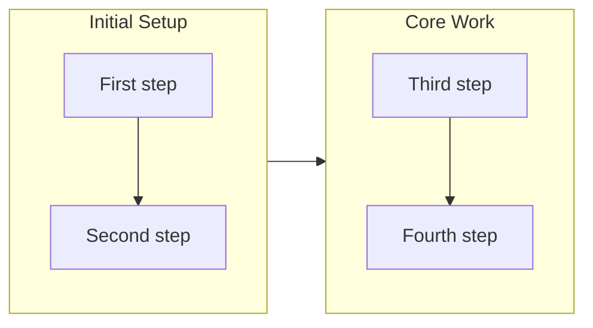

# Report

Guidelines for generating branch stories, creating pull requests, and assessing release readiness.

## Agent Compatibility

This skill works on any Agent-Skills-compatible agent. The two Claude-Code mechanisms used below are **enhancements, not requirements**:

- **Parallel fan-out** — where a step spawns parallel workers to run parts concurrently (the deferred-concern judge, the overview/section-review/release-readiness workers, the PR and release-note writers), that is the Claude Code optimization. On other agents, perform those parts **sequentially** in the same session; the inputs and outputs are identical.
- **User interaction** — where a step uses the agent's selection prompt, use the agent's native way of presenting a multiple-choice question (or ask in plain chat). The decision points are mandatory; only the prompt mechanism varies. Prefix each interactive prompt's (the agent's selection prompt) `question` body with `[<project label>]` — run `bash gather/scripts/project-label.sh` once and reuse its `project` value — so a developer with several sessions open across tmux panes can see which repository is asking; leave the `header` as the decision/topic label.

## Run Workflow

Context-aware report orchestration. Auto-detects whether the caller is in a drive or trip workflow and routes accordingly.

### Policy Lens (read first)

Before assessing the branch, load the project's engineering policies as your judging lens: `planning`, `design`, `implementation`, and `operation`. On Claude Code these arrive automatically (this skill preloads them via its `skills:` frontmatter and the `/report` command's `policy-lens.sh` hook injects the reminder); on other agents, open each index skill yourself. Read those indexes, and open the specific policy hard copies they link (`policies/<slug>.md`) when a concern or change maps to one.

These policies are the lens for the report's judgments: when judging deferred concerns, reviewing the story sections, and assessing release readiness, evaluate the branch's **planning** (business/market/legal grounding), **design** (interaction and behavior), **implementation** (code structure and correctness — `directory-structure` and `coding-standards` always apply to code work), and **operation** (delivery, runtime, and recovery) against the relevant policy's Goal (目標), Responsibility (責務), and Practices (実践). Cite the specific policy when a concern or readiness verdict rests on one.

### Step 0: Workspace Guard

```bash
bash branching/scripts/check-workspace.sh
```

Parse the JSON output. If `clean` is `true`, proceed silently to Step 1.

If `clean` is `false`, display the `summary` to the user and ask via the agent's selection prompt with selectable options:
- **"Ignore and proceed"** - Continue with the report workflow. The unrelated changes will remain in the workspace after the command completes.
- **"Stop"** - Halt the command so you can handle the changes first.

If the user selects "Stop", end the command immediately.

### Step 1: Detect Context

```bash
bash branching/scripts/detect-context.sh
```

Parse the JSON output. Route to the appropriate workflow based on `context`.

### Step 2: Route by Context

#### Work Context (`context: "work"`)

Route by `mode` from detect-context output:

##### Drive Mode (`mode: "drive"`)

1. **Bump version** following CLAUDE.md Version Management section (patch increment). **Skip if a "Bump version" commit already exists in the current branch** (check with `bash branching/scripts/check-version-bump.sh`; if `already_bumped` is `true`, skip this step).
2. **Run the Write Story orchestration** (`## Write Story → ### Orchestration`, Phases 0–5) directly in this command (main-agent) context. The command itself spawns the leaf parallel workers — there is no intermediate story-writer subagent.
3. **Display story content**: Read the story file at `.workaholic/stories/<branch-name>.md` and output the entire Markdown content so the developer can review inline.
4. **Display PR URL** captured from Phase 5 (mandatory).

##### Trip Mode (`mode: "trip"`)

A trip now decomposes its design into tickets and drives them (trip-protocol Decomposition gate + Per-Ticket Drive Loop), so its archived tickets populate the story's Changes section exactly like a drive — no special-casing needed. The only trip addition is the **rationale link** (step 3): the design artifacts under `.workaholic/trips/<trip-name>/` are the *why* behind those tickets.

1. **Bump version** following CLAUDE.md Version Management section (patch increment). **Skip if a "Bump version" commit already exists in the current branch** (check with `bash branching/scripts/check-version-bump.sh`; if `already_bumped` is `true`, skip this step).
2. **Run the Write Story orchestration** (`## Write Story → ### Orchestration`, Phases 0–5) directly in this command (main-agent) context. The command itself spawns the leaf parallel workers — there is no intermediate story-writer subagent.
3. **Link the trip rationale**: if a `.workaholic/trips/<trip-name>/` directory exists for this branch, add a short note to the story's section 9 (Notes) linking the trip's design artifacts (`.workaholic/trips/<trip-name>/designs/`) as the rationale behind the ticket-based Changes, so a reviewer can trace each ticket's **Trip Origin** back to the design that justified it. Do not duplicate the design into the story — link it.
4. **Display story content**: Read the story file at `.workaholic/stories/<branch-name>.md` and output the entire Markdown content so the developer can review inline.
5. **Display PR URL** captured from Phase 5 (mandatory).

##### Hybrid Mode (`mode: "hybrid"`)

Both trip artifacts and drive-style tickets exist on this branch. Drive Mode and Trip Mode run the identical Write Story orchestration, so follow Drive Mode. The orchestration captures the full narrative including any trip origin.

#### Worktree Context (`context: "worktree"`)

Not on a work branch, but worktrees exist.

1. Run `bash branching/scripts/list-worktrees.sh`
2. Filter to worktrees where `has_pr` is `false` (unreported work)
3. If no unreported worktrees found: inform the user "No unreported worktrees found." and stop.
4. If exactly one unreported worktree: ask the user "Found worktree '<name>'. Generate report?" using the agent's selection prompt. If confirmed, use it.
5. If multiple unreported worktrees: list them and ask the user which one to report on using the agent's selection prompt.
6. Once selected, all subsequent git operations must run from within the worktree directory.
7. Re-run context detection from within the worktree and follow the appropriate mode workflow.

#### Unknown Context (`context: "unknown"`)

Ask the user: "Could not determine development context from branch '<branch>'. Are you working on a drive or trip?" using the agent's selection prompt with options "Drive" and "Trip". Route accordingly.

## Write Story

Generate a branch story that serves as the single source of truth for PR content.

### Orchestration

Generate the story file, then create the PR. The `/report` command (main agent) runs this orchestration directly: it executes the bash/Read/Write steps inline and spawns each leaf worker as a parallel worker Task whose prompt preloads a `core` skill and runs one section. There is no intermediate subagent — the command does all fan-out, so the fan-out stays one level deep (a subagent cannot spawn further subagents).

#### Phase 0: Gather Context

Gather all context by running `bash gather/scripts/git-context.sh`. Returns: branch, base_branch, repo_url, archived_tickets, git_log.

#### Phase 1: Judge Active Deferred Concerns

Run before the parallel agent batch so the verdicts flow into section-reviewer's input. Skip silently if `.workaholic/concerns/` is empty or absent.

1. **Spawn a deferred-concern judge** as parallel worker in a single Task call. The prompt instructs it to preload `report`, follow the `### Judge Deferred Concerns` section with the given branch name and base branch, and return `{verdicts: [...], compounds: [...]}` (compounds are candidate A+B combinations — see that section).
2. **Apply verdicts**: Write the judge's returned JSON to `/tmp/deferred-concern-verdicts.json`. `apply-deferred-concern-verdicts.sh` accepts both the full `{"verdicts": [...]}` object (the judge's natural output) and a bare `[...]` array, so either form works — prefer writing the object verbatim. Then run:

   ```bash
   cat /tmp/deferred-concern-verdicts.json | bash report/scripts/apply-deferred-concern-verdicts.sh
   ```

   Files marked `resolved` have `status:` flipped to `resolved`, `resolved_by_pr` / `resolved_by_commit` recorded, and are then moved to `.workaholic/concerns/archive/`. Files marked `still_active` stay in `.workaholic/concerns/`.

#### Phase 1b: Triage Concerns (keep the set fresh)

The corpus never re-clones (identity-keyed update-in-place; Phase 1's `list-active` already ran the collapsing migration), but it can still grow *many* real concerns, and two minor ones can combine into a bigger risk. Run a triage decision point **when either trigger fires**, else skip silently:

- **Count trigger** — the number of `still_active` concerns after Phase 1 exceeds a threshold (default **20**).
- **Compound trigger** — the judge returned a non-empty `compounds` list.

The triage is **judge-proposes / developer-decides**, and every decision leaves an auditable trail. The command (main agent) issues the choice via the agent's selection prompt (each question body prefixed `[<project label>]`) — a leaf subagent must not. Present the developer these buckets and apply each through the idempotent mutators (never hand-edit concern files):

- **Combine A+B → compound** (from a `compounds` proposal the developer confirms/edits the severity and title of):

  ```bash
  bash report/scripts/merge-concerns.sh \
    --severity <confirmed> --title "<compound title>" <new-compound-id> <member-id> <member-id>...
  ```

  Creates the compound (or updates an existing target), escalates severity to the confirmed value, and archives each member as `status: superseded, superseded_by: <compound-id>`.
- **Merge duplicates** — same command, folding near-duplicate ids into one target id.
- **Close** a won't-fix or resolved concern:

  ```bash
  bash report/scripts/close-concern.sh <concern-id> <resolved|accepted> "<reason>"
  ```

  `resolved` = fixed / no longer applies; `accepted` = a deliberate, documented won't-fix. Moves it to `archive/` with the reason.
- **Keep as-is** — no action.

After applying, the still-active set reflected in the story's section 6 is the curated, fresh set. Both mutators git-stage their changes, so they ride the Phase 4 story commit. The threshold is a policy knob — never auto-merge without the developer's confirmation; the A+B severity call is the developer's.

#### Phase 2: Spawn Story Generation Workers

Spawn 3 parallel worker leaf subagents in parallel (single message with 3 Task calls). Each prompt names the skill to preload, the section to run, the inputs, and the expected return schema:

- **release-readiness**: preload `report`, run `## Assess Release Readiness`, return the releasability JSON. Pass archived tickets list and branch name.
- **overview-writer**: preload `report`, run `### Overview Generation`, return the overview JSON. Pass branch name and base branch.
- **section-reviewer**: preload `review-sections`, run it, return the sections 4-7 JSON (Outcome, Historical Analysis, Concerns, Successful Development Patterns). Pass branch name, archived tickets list, the deferred concern verdicts file path `/tmp/deferred-concern-verdicts.json`, **and the collected commit bodies** (`collect-commits.sh` output). The section-reviewer prepends `still_active` verdicts to section 6, then folds in any `Concerns:` keys from the commit bodies (§6) and `Insights:` keys (§7) so a concern or pattern recorded in a commit is not lost when a ticket is sparse or absent.

Wait for all 3 to complete. Track which succeeded and which failed.

#### Phase 3: Write Story File

1. **Gather Source Data**: Read archived tickets using Glob pattern `.workaholic/tickets/archive/<branch-name>/*.md`. Extract frontmatter (`category`, **`mission`**) and content (Overview, Final Report). Record each ticket's **filename** (basename) — this is the `tickets:` relation — and its `mission:` value — the source of the story's `mission:` (see Story Frontmatter for the inheritance rule).

   **Take each ticket's commit hash from git, never from frontmatter:**

   ```bash
   bash report/scripts/ticket-commits.sh <branch-name>
   ```

   It returns `[{"ticket": "<basename>.md", "commit": "<short-hash>"}]` — the commit that *added* each archived ticket, which is the commit that implemented it. Use those hashes for section 3's links. **Never read a ticket's `commit_hash` frontmatter**: a commit cannot carry its own hash, so the old archive script stamped a pre-amend hash that ends up orphaned and never pushed — tickets archived before that fix still carry those dead values, and every link built from one 404s. Git is the single source of truth (`archive.sh` no longer writes the field). A ticket whose `commit` comes back empty is not committed yet — surface that rather than dropping the ticket.
2. **Write Story**: Follow the Story Content Structure section below; write the `mission:` and `tickets:` relations into the frontmatter per the **Story Frontmatter** section.
3. **Update Index**: Add entry to `.workaholic/stories/index.md` (see Updating Stories Index).

#### Phase 4: Commit and Push Story

1. **Roll the related mission** (only if the story frontmatter carries a non-empty `mission:`; skip this whole step otherwise). Update that mission through the shared, idempotent mutators — never hand-edit `mission.md`:
   - `bash mission/scripts/append-changelog.sh <mission-slug> "story reported" <branch-name>.md` — records that this branch's story advanced the mission.
   - for **each** ticket filename in the story's `tickets:` list: `bash mission/scripts/tick-acceptance.sh <mission-slug> <ticket-filename>` — reconciles the mission's acceptance checklist for the tickets this story covers. Drive's `archive.sh` already ticks per ticket; this idempotent catch-up covers tickets archived outside the mission-aware path (e.g. a trip).
   Resolved deferred concerns judged in Phase 1 already recorded their `concern resolved (unstuck)` line via `apply-deferred-concern-verdicts.sh`, so nothing extra is needed for those here.
2. **Refresh the OKF bundle indexes** (stages them): `bash okf/scripts/refresh-index.sh` — keeps the `.workaholic/` hierarchy's `index.md` files in sync with the story and concern files this flow just wrote.
3. **Stage story, resolved deferred concerns, and any mission updates**: `git add .workaholic/stories/ .workaholic/concerns/ .workaholic/missions/`
4. **Commit**: `git commit -m "Add branch story for <branch-name>"` (the same commit captures any deferred concern archive moves from Phase 1, the mission changelog/acceptance updates, and the refreshed indexes, keeping audit history coherent)
5. **Push branch**: `git push -u origin <branch-name>`

#### Phase 5: Create PR

1. **Create PR**: spawn parallel worker preloading `report` and running `## Create PR`. It reads the story file, derives the title, and runs the `gh` CLI operations. Capture the `PR created/updated: <URL>` line from its response.

Capture the PR URL for final output.

**Note**: Release notes are no longer generated here. `write-release-note` now runs at **ship time** in the `ship` Ship Flow (before merge, committed to the branch), so each ship/release produces its own note and multiple releases per branch are possible.

#### Report Output Schema

Once orchestration completes, the report is described by:

```json
{
  "story_file": ".workaholic/stories/<branch-name>.md",
  "pr_url": "<PR-URL>",
  "workers": {
    "overview_writer": { "status": "success" | "failed", "error": "..." },
    "section_reviewer": { "status": "success" | "failed", "error": "..." },
    "release_readiness": { "status": "success" | "failed", "error": "..." },
    "pr_creator": { "status": "success" | "failed", "error": "..." }
  }
}
```

### Worker Output Mapping

Story sections are populated from the parallel leaf subagents' outputs (each is a parallel workers running the named role):

| Worker role | Sections | Fields |
| ----------- | -------- | ------ |
| overview-writer | 1, 2, 3 (journey preamble) | `overview`, `highlights[]`, `motivation`, `journey.mermaid`, `journey.summary` |
| section-reviewer | 4, 5, 6, 7 | `outcome`, `historical_analysis`, `concerns`, `development_patterns` |
| release-readiness | 8 | `verdict`, `concerns[]`, `instructions.pre_release[]`, `instructions.post_release[]` |

Section 3 (Changes) comes from archived tickets, prefaced by journey content from the overview-writer role. Section 9 (Notes) is optional context.

### Judge Deferred Concerns

Run by the Phase 1 deferred-concern judge (a parallel workers that preloads this skill). Inputs: branch name and base branch (usually `main`).

1. List active deferred concerns:

   ```bash
   bash report/scripts/list-active-deferred-concerns.sh
   ```

   This first runs the living identity migration (`migrate-concern-identity.sh`, best-effort, idempotent): it back-fills each concern's `concern_id`/`first_seen`/`last_seen` and collapses any legacy `carried-from` clone chains into one fresh file per concern, so the judge sees a deduplicated set. Each entry carries `concern_id` (the stable identity), `first_seen`/`last_seen`, `severity`, and provenance. If the JSON output is `[]`, return `{"verdicts": []}` and stop.

2. For each deferred concern in the list, judge whether the work that landed on the current branch (since the deferred concern's `origin_commit`) has resolved it.

   Available evidence:

   - `git log --oneline <origin_commit>..HEAD` to see commits that landed after the deferred concern was filed
   - `git diff <origin_commit>..HEAD -- <file mentioned in body>` to inspect changes to referenced files
   - Reading files mentioned in the deferred concern body (paths in backticks, paths after `in`)
   - Searching commit subjects for keywords from the deferred concern body (`git log --oneline --grep='<keyword>' <origin_commit>..HEAD`)

   Heuristics for **resolved**:

   - The file referenced in the body has been deleted, renamed, or refactored such that the concern no longer applies.
   - A commit subject or body explicitly mentions fixing the concern.
   - The behavior described as a risk no longer exists in the current code.

   Heuristics for **still_active**:

   - No evidence of remediation since `origin_commit`.
   - The body describes a general suggestion (e.g., "consider parameterizing") without a clear trigger condition.
   - The file still exists and still contains the pattern flagged.

   When in doubt, prefer `still_active` — false positives (marking resolved when it isn't) lose institutional memory; false negatives (keeping active when it's done) merely re-surface in the next story.

#### Efficiency: Handling Large Corpora

The corpus can grow large (a backfill from N historical stories produces O(N × items-per-story) items). To stay within reasonable tool-use budgets:

1. **Group items by `origin_branch` first.** Items from the same branch tend to reference the same files — cluster them so you can inspect each file once per cluster, not once per item.
2. **Within a cluster, deduplicate by referenced file path.** Many bullets reference the same file from different angles; one `cat` plus one `git log -- <path>` is enough evidence for every bullet that points at that path.
3. **Use `git log --oneline <origin_commit>..HEAD` once per cluster**, not per item — the commit list is the same for every bullet that shares an origin commit.
4. **Batch the verdicts.** Emit verdicts incrementally if helpful, but the final response must be one combined `{verdicts: [...]}` JSON object.
5. **First-run backfill caveat.** When the corpus is populated all at once by `backfill-deferred-concerns.sh`, expect a high proportion of `resolved` verdicts — the items predate the codebase's current structure significantly. This is normal; still-active items remain in `.workaholic/concerns/` as passive notes for future judging.

Return a JSON object with the verdicts array **and** a `compounds` array of candidate combinations:

```json
{
  "verdicts": [
    {
      "path": ".workaholic/concerns/42-foo.md",
      "verdict": "resolved",
      "resolved_by_pr": 47,
      "resolved_by_commit": "abc1234",
      "rationale": "Commit abc1234 removed the inline shell logic this concern flagged."
    },
    {
      "path": ".workaholic/concerns/42-bar.md",
      "verdict": "still_active",
      "rationale": "No commits modified the area this deferred concern targets."
    }
  ],
  "compounds": [
    {
      "members": ["auth-token-logged-plaintext", "verbose-error-leaks-stack"],
      "suggested_severity": "urgent",
      "suggested_title": "Plaintext token logging + verbose errors together expose credentials",
      "rationale": "Individually low, but a logged token plus a stack-trace endpoint is a credential-exfiltration path."
    }
  ]
}
```

Include `resolved_by_pr` and `resolved_by_commit` only for `resolved` verdicts. **Compounds** are the judge's *proposals only* — where two or more `still_active` concerns interact so their combined risk exceeds the parts (A + B = a bigger risk); each names its `members` (by `concern_id`), a `suggested_severity` (usually escalated), a `suggested_title`, and the `rationale`. Emit `"compounds": []` when none apply; **prefer few, high-confidence proposals** over speculative ones. The orchestrator feeds `verdicts` to `apply-deferred-concern-verdicts.sh` (Phase 1) and to the section-reviewer, and surfaces `compounds` in the Phase 1b triage where the developer confirms or edits each before `merge-concerns.sh` applies it — the judge never merges anything itself.

### Overview Generation

Generate the four fields consumed by sections 1, 2, and 3 (`overview`, `highlights`, `motivation`, `journey`) by analyzing commit history for the branch. The overview-writer role (a parallel workers) runs this generation in parallel with the release-readiness and section-reviewer roles.

#### Collect Commits

Run the bundled script to collect commit information:

```bash
bash report/scripts/collect-commits.sh [base-branch]
```

Default base branch is `main`. The `body` field carries the full structured commit message
(`Why:` / `Changes:` / `Concerns:` / `Insights:` / `Verify:`). Read those keys: `Why` informs
the Motivation, `Changes` the highlights/journey. (Historically this script dropped the body;
it now emits it, so the structured commit content actually reaches this role.) The `category`
field is parsed from the commit's `Category:` git trailer (`Added`/`Changed`/`Removed`, or empty) —
a log-native grouping key that survives even if the ticket is pruned.

##### Output Format (JSON)

```json
{
  "commits": [
    {
      "hash": "abc1234",
      "subject": "Add feature X",
      "body": "Detailed description of the change...",
      "timestamp": "2026-01-15T10:30:00+09:00",
      "category": "Added"
    }
  ],
  "count": 15,
  "base_branch": "main"
}
```

#### Content Structure

Generate JSON with four components:

##### 1. Overview

A 2-3 sentence summary capturing the branch essence: main goal, approach taken, what was achieved. Past tense; synthesize from commit subjects.

##### 2. Highlights

Array of 3-5 meaningful changes: extracted from commit subjects, related commits grouped into single highlights, focused on user-visible or architecturally significant changes, ordered by importance not chronology.

##### 3. Motivation

A paragraph synthesizing the "why": what problem or opportunity started this work, why this approach was chosen, what constraints shaped it. Narrative prose, not a list.

##### 4. Journey

Two parts:
- **mermaid**: A flowchart showing work progression
- **summary**: 50-100 word summary of development journey

##### Flowchart Guidelines



- Use `flowchart LR` for horizontal timeline
- Use `direction TB` inside each subgraph for vertical flow
- Group by theme: each subgraph is one concern area
- Connect subgraphs in timeline order
- Maximum 3-5 subgraphs per diagram

#### Overview Output Format

Return JSON:

```json
{
  "overview": "2-3 sentence summary capturing the branch essence",
  "highlights": [
    "First meaningful change",
    "Second meaningful change",
    "Third meaningful change"
  ],
  "motivation": "Paragraph synthesizing the 'why' from commit context",
  "journey": {
    "mermaid": "flowchart LR\n  subgraph Phase1[Initial Work]\n    direction TB\n    a1[Step 1] --> a2[Step 2]\n  end\n  ...",
    "summary": "50-100 word summary of the development journey"
  }
}
```

### Story Content Structure

The story content (this IS the PR description):

```markdown
## 1. Overview

[Content from overview-writer `overview` field: 2-3 sentence summary capturing the branch essence.]

**Highlights:**

1. [From overview-writer `highlights[0]}]
2. [From overview-writer `highlights[1]`]
3. [From overview-writer `highlights[2]`]

## 2. Motivation

[Content from overview-writer `motivation` field: paragraph synthesizing the "why" from commit context.]

## 3. Changes

[Content from overview-writer `journey.mermaid` for the flowchart and `journey.summary` for the prose below it.]

```mermaid
[Content from overview-writer `journey.mermaid`]
```

[Content from overview-writer `journey.summary`]

**Flowchart Guidelines:**
- Use `flowchart LR` for horizontal timeline (subgraphs arranged left-to-right)
- Use `direction TB` inside each subgraph for vertical item flow
- Group by theme: each subgraph represents one concern or decision area
- Connect subgraphs in timeline order to show work progression
- Use descriptive node labels: `id[Description]` syntax
- Maximum 3-5 subgraphs per diagram

One subsection per ticket, in chronological order:

### 3-1. <Ticket title> ([hash](<repo-url>/commit/<hash>))

<1-3 sentence summary of what this ticket changed and why. Focus on the intent and scope of the change rather than enumerating individual files.>

### 3-2. <Next ticket title> ([hash](<repo-url>/commit/<hash>))

<1-3 sentence summary of what this ticket changed and why.>

### ...

**Changes Guidelines:**
- One subsection per ticket (not grouped by theme)
- **CRITICAL**: Commit hash MUST be a clickable GitHub link, not plain text
  - Wrong: `(abc1234)` or `(<hash>)`
  - Correct: `([abc1234](<repo-url>/commit/abc1234))`
- Format: `### 3-N. <Title> ([hash](<repo-url>/commit/<hash>))`
- **Summarize the change** in 1-3 sentences per ticket -- describe what was done and why, not individual files
- Focus on intent, scope, and impact rather than enumerating every modified file
- Chronological order matches ticket creation time

## 4. Outcome

[Summarize what was accomplished. Reference key tickets for details.]

## 5. Historical Analysis

[Context from related past work. What similar problems were solved before? What patterns emerge from the Related History sections of tickets? If no related tickets exist, write "No related historical context."]

## 6. Concerns

[Risks, trade-offs, limitations, and forward-looking suggestions discovered during implementation. Each concern is one insight framed as a title, a description of the problem, and how to fix it. This structure is parsed verbatim by `extract-deferred-concerns.sh` on `/ship`, so follow it exactly.]

**Format** (one `###` block per concern, or "None"):

```markdown
### <Concise title>

- **Severity:** moderate
- **Description:** <what the problem/risk is> (see [hash](<repo-url>/commit/<hash>) in path/to/file.ext)
- **How to Fix:** <the concrete fix or improvement>
```

**Example**:

```markdown
### Inline shell invocations in drive

- **Severity:** moderate
- **Description:** `drive` still calls `ls -1` inline, violating the Shell Script Principle (see [7eab801](<repo-url>/commit/7eab801) in `plugins/workaholic/skills/drive/SKILL.md`)
- **How to Fix:** Extract the inline invocations into dedicated navigator scripts under the drive skill's `scripts/` directory
```

**Guidelines**:
- **Severity** is a label, not a number: `urgent` (act now), `moderate` (should fix), or `low` (nice-to-have). Default `moderate`.
- Reference the commit hash from section 3 and the file path where readers should investigate, inside the Description.
- Keep Description and How to Fix to one paragraph each.
- Deferred concerns (from `still_active` verdicts) are prepended here as `###` blocks, with their title prefixed `(carried from PR #N)` and their original severity preserved.
- Write "None" if nothing to report.

## 7. Successful Development Patterns

[Effective patterns discovered during this branch's development that are worth preserving as institutional knowledge.]

**Format**: Bullet list with pattern description and context.

**Example**:
- Consolidating 12 skill directories into 4 cohesive units improved navigability without losing behavioral content -- naming skills after their consuming commands creates a discoverable one-to-one mapping
- Running three discovery agents in parallel (history, source, ticket) before writing specs ensures comprehensive context without sequential bottlenecks
- Extracting shell logic into skill scripts rather than inline conditionals prevented exit code 127 failures from path resolution issues

**Guidelines**:
- Focus on patterns that worked well, not problems encountered (those belong in Concerns)
- Each pattern should be specific enough to be actionable in future branches
- Include the reasoning ("why it worked") not just the action ("what was done")
- Extract from ticket Considerations (positive observations), Final Reports (what went well), and Implementation Steps (approaches that proved effective)
- Categories to consider: architectural decisions, testing strategies, refactoring approaches, collaboration patterns, tooling choices
- Write "None" if no noteworthy patterns emerged

## 8. Release Preparation

**Verdict**: [Ready for release / Needs attention before release]

### 8-1. Concerns

- [List any concerns from release-readiness analysis]
- Or "None - changes are safe for release"

### 8-2. Pre-release Instructions

- [Steps to take before running /release]
- Or "None - standard release process applies"

### 8-3. Post-release Instructions

- [Steps to take after release]
- Or "None - no special post-release actions needed"
```

**Release-readiness input:**

The release-readiness JSON is produced by the release-readiness role — a parallel workers the command spawns in parallel during Phase 2. The JSON contains:

```json
{
  "releasable": true/false,
  "verdict": "Ready for release" / "Needs attention before release",
  "concerns": [],
  "instructions": {
    "pre_release": [],
    "post_release": []
  }
}
```

Format this JSON into section 8.

```markdown
## 9. Notes

Additional context for reviewers or future reference.
```

### Story Frontmatter

Create `.workaholic/stories/<branch-name>.md` with YAML frontmatter:

```yaml
---
type: Story
branch: <branch-name>
tickets_completed: <count of tickets>
mission: <slug>                     # optional — the mission this branch advances (empty when none)
tickets: [<ticket-a.md>, <ticket-b.md>]   # the archived ticket filenames this story covers (report→tickets relation)
---
```

The `type` key is what makes the story readable as an [Open Knowledge Format](https://github.com/GoogleCloudPlatform/knowledge-catalog/tree/main/okf) concept document (OKF requires a parseable frontmatter block with a non-empty `type`; all other keys ride along as producer extensions). Keep it first and never omit it.

**Machine-readable relations** (both derived in Phase 3, from the archived tickets):

- `tickets:` — the list of archived ticket **filenames** this story covers (basenames of `.workaholic/tickets/archive/<branch>/*.md`). A story already narrates its tickets in prose (section 3); this records the association in frontmatter so a mission can roll them up mechanically (the report→tickets relation). Write `[]` if the branch archived no tickets.
- `mission:` — the mission `slug` this branch advances, **inherited from the archived tickets' `mission:` field**: if the covered tickets share a single non-empty mission slug, use it; if none carry one, leave it empty; if they disagree (more than one distinct slug), ask the developer which mission the story belongs to (or none) via the agent's selection prompt. This is the machine-readable relation `/ship` propagates into any deferred concern extracted from this story.

### Writing Guidelines

- Write in third person ("The developer discovered..." not "I discovered...")
- Connect tickets into a narrative arc, not a list
- Highlight decision points and trade-offs
- Keep Motivation/Journey/Outcome concise (Journey: 50-100 words)
- Changes section: one entry per ticket, brief descriptions
- Historical Analysis/Concerns can be "None" if empty

### Updating Stories Index

Update `.workaholic/stories/index.md` to include the new story:

- Add entry: `* [<branch-name>.md](<branch-name>.md) - Brief description of the branch work`

`index.md` is the [Open Knowledge Format](https://github.com/GoogleCloudPlatform/knowledge-catalog/tree/main/okf) reserved index filename, so OKF readers recognize the story list as the directory's navigation index. Keep it in OKF index form: **no frontmatter**, a heading, and one `* [link](target) - description` entry per story. If the directory still carries its story list in a legacy `README.md`, migrate the entries into `index.md` in the same commit; a README may stay as a prose document describing the directory, but then it needs frontmatter with a non-empty `type` like every other non-reserved markdown file.

## Create PR

Create or update a GitHub pull request using the story file as PR content.

### Derive PR Title

Extract the first item from the Summary section of the story file:

```markdown
## 1. Summary

1. First meaningful change
```

Use that first item as the title. If multiple items exist, append "etc" (e.g., "Add dark mode toggle etc").

### Create or Update PR

Run the bundled script:

```bash
bash report/scripts/create-or-update.sh <branch-name> "<title>"
```

#### What the Script Does

1. Strips YAML frontmatter via `strip-frontmatter.sh` from `.workaholic/stories/<branch-name>.md`
2. Writes clean content to `/tmp/pr-body.md`
3. Checks if PR exists for the branch
4. Creates new PR or updates existing one
5. Outputs the result in required format

### Strip Frontmatter Script

A reusable script for removing YAML frontmatter from any markdown file:

```bash
bash report/scripts/strip-frontmatter.sh <file>
```

Outputs clean markdown body to stdout. Handles files with frontmatter, without frontmatter (pass-through), and empty files. Only strips frontmatter starting on line 1 -- content `---` separators elsewhere are preserved.

### PR Output Format

Exactly one line:

```
PR created: <URL>
```

or

```
PR updated: <URL>
```

This output format is required by the story command.

## Assess Release Readiness

Analyze a branch to determine if it's ready for release.

### Analysis Tasks

1. **Run the branch-safety scan** (objective — the same engine `/ship` blocks on): this supersedes eyeballing the diff for secrets. `/report` cannot merge, so it **warns loudly** rather than blocking:

   ```bash
   bash release-scan/scripts/scan-branch-safety.sh
   ```

   If `verdict` is `block`, list every finding (category, `file:line`, rule — the secret value is redacted) in the release-readiness output and force `releasable: false`, so the assessment cannot report "ready" over a real finding. A `secret` finding especially means the branch must not ship until it is removed. If `verdict` is `pass`, note the scan is clean.

2. **Review code changes**: Check `git diff main..HEAD` for:
   - Incomplete work (TODO, FIXME, XXX comments in new code)
   - Runtime errors or obvious bugs

3. **Check for blocking issues**:
   - Tests failing (if tests exist)
   - Type errors (if type checking exists)
   - Missing files referenced in code

4. **Assess documentation drift**: run

   ```bash
   bash report/scripts/doc-drift.sh "<base_branch>"
   ```

   passing the resolved `base_branch` from `git-context.sh`. It returns drift
   **facts** (not verdicts): which structural files changed presence — skills,
   commands, agents, hooks added/removed/renamed, plus top-level `scripts/` —
   and whether the index/meta docs that enumerate them (`CLAUDE.md`, `README.md`,
   `docs/` when present) were touched in the same range. For each `candidate`,
   **judge** against the diff and the doc's actual content whether that meta/doc
   file (`CLAUDE.md`, `README.md`, an affected `SKILL.md`, or `docs/`) genuinely
   should have been updated and was not — exactly like the deferred-concern judge. A
   candidate is a hint, not a verdict; dismiss it when the doc legitimately did
   not need the change. Confirmed drift becomes (a) a release-readiness
   `concerns[]` entry plus a `pre_release` instruction (the Section 8 ship gate),
   and (b) a durable Section 6 Concern via `review-sections`, so it
   carries over on `/ship` if not fixed first. **Exclude** `outputs/` staleness
   and version/manifest drift — the Outputs Freshness CI and `validate-metadata.mjs`
   own those domains; the script already omits them.

5. **Identify actionable items** (not theoretical concerns):
   - Documentation that needs updating (including confirmed doc drift from step 3)
   - Version numbers to bump
   - Files to stage/commit before release

### What NOT to Flag

- "Breaking changes" for command renames - users adapt
- API changes in a plugin - plugins are configuration, not APIs
- Internal refactoring - doesn't affect users
- Theoretical upgrade concerns - users pull fresh versions
- Doc drift the existing guards already own: `outputs/` staleness (Outputs Freshness CI) and version-number mismatches across manifests (`validate-metadata.mjs`)
- A `doc-drift.sh` candidate that, on inspection, is not real: a plain content edit (the script flags only presence changes, but the judge still confirms), or a doc that legitimately did not need updating

### Release Readiness Output Format

Return JSON:

```json
{
  "releasable": true,
  "verdict": "Ready for release",
  "concerns": [],
  "instructions": {
    "pre_release": [],
    "post_release": []
  }
}
```

Or if issues found:

```json
{
  "releasable": false,
  "verdict": "Needs attention before release",
  "concerns": [
    "Found TODO comment in src/foo.ts",
    "Tests failing in commands/drive.md"
  ],
  "instructions": {
    "pre_release": ["Fix failing tests", "Remove TODO comments"],
    "post_release": []
  }
}
```

### Release Readiness Guidelines

- Focus on issues that actually block releases
- Provide actionable instructions, not theoretical warnings
- "Breaking change" is rarely a real concern for plugins
- Empty concerns array is the happy path, not a failure
- If it doesn't require action, don't flag it
